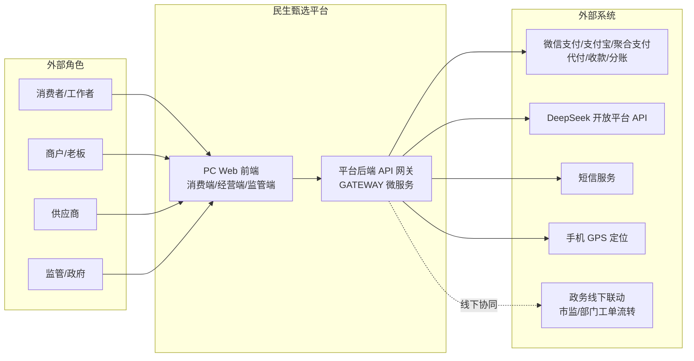

# 01 · 系统上下文图

> 来源:概要设计说明书 §2.2 · 民生甄选平台与外部角色/外部系统的关系
> 查看:Typora 打开本文件即可渲染;源码可粘贴 [mermaid.live](https://mermaid.live) 校验

> 说明:四类外部角色经 PC Web 访问平台;平台经网关(GATEWAY 微服务,M1 后期独立部署)对接外部系统(支付通道 / DeepSeek / 短信 / GPS);政务联动为线下协同(石监码/12345 不可接,自建替代)。
