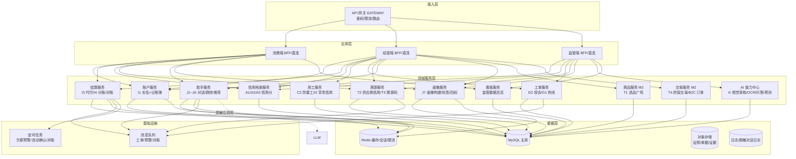

# 02 · 逻辑架构（分层）

> 来源:概要设计说明书 §2.3 · 接入层/应用层/领域服务层/数据层/基础设施分层
> 查看:Typora 打开本文件即可渲染;源码可粘贴 [mermaid.live](https://mermaid.live) 校验

> 说明:应用层各端经网关（GATEWAY 微服务，M1 后期独立部署）访问全部领域服务,图中为代表性连线;完整依赖见概要设计 §2.4 模块与服务映射表。
