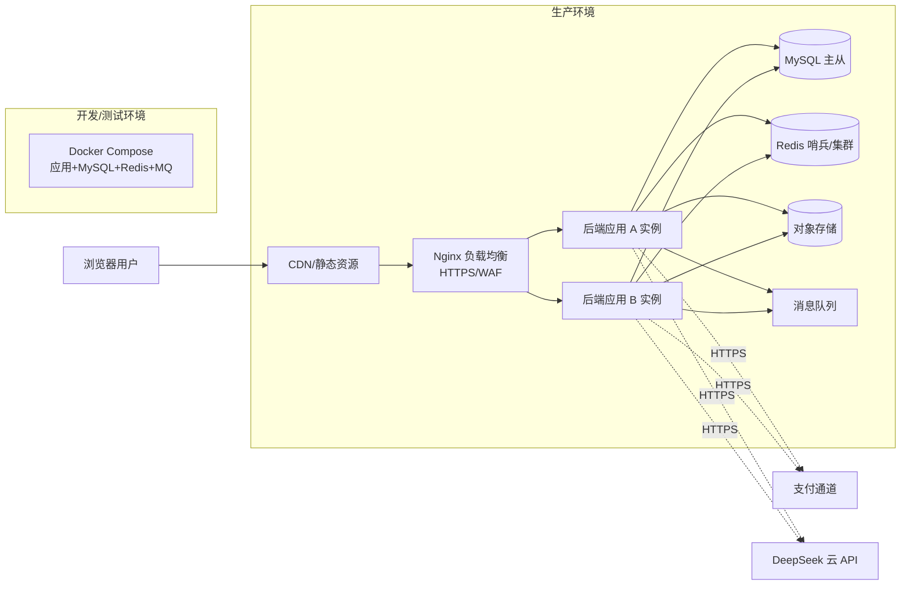

# 03 · 部署架构

> 来源:概要设计说明书 §2.5 · 生产环境(双实例)与开发/测试环境
> 查看:Typora 打开本文件即可渲染;源码可粘贴 [mermaid.live](https://mermaid.live) 校验

> 说明:生产双实例起步;开发/测试用 Docker Compose 一键起;CI/CD 复用 `agent-sdlc-standard/templates`(GitHub Actions);敏感接口(支付回调、大模型)走服务端调用,前端不直连。
