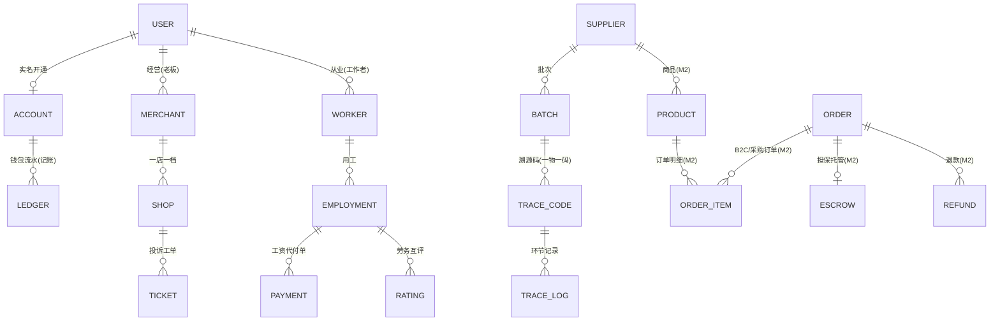

# 04 · 核心实体关系（ER 简图）

> 来源:概要设计说明书 §4.2 · 核心 14 实体;M2 交易实体以 (M2) 标注
> 查看:Typora 打开本文件即可渲染;源码可粘贴 [mermaid.live](https://mermaid.live) 校验

```mermaid
erDiagram
    USER ||--o| ACCOUNT : "实名开通"
    ACCOUNT ||--o{ LEDGER : "钱包流水(记账)"
    USER ||--o{ MERCHANT : "经营(老板)"
    USER ||--o{ WORKER : "从业(工作者)"
    MERCHANT ||--o{ SHOP : "一店一档"
    SHOP ||--o{ TICKET : "投诉工单"
    WORKER ||--o{ EMPLOYMENT : "用工"
    EMPLOYMENT ||--o{ PAYMENT : "工资代付单"
    EMPLOYMENT ||--o{ RATING : "劳务互评"
    SUPPLIER ||--o{ PRODUCT : "商品(M2)"
    SUPPLIER ||--o{ BATCH : "批次"
    BATCH ||--o{ TRACE_CODE : "溯源码(一物一码)"
    TRACE_CODE ||--o{ TRACE_LOG : "环节记录"
    PRODUCT ||--o{ ORDER_ITEM : "订单明细(M2)"
    ORDER ||--o{ ORDER_ITEM : "B2C/采购订单(M2)"
    ORDER ||--o| ESCROW : "担保托管(M2)"
    ORDER ||--o{ REFUND : "退款(M2)"
```

> 说明:概念级关系,字段级见《数据库设计》(待产出);`ACCOUNT` 为纯记账簿,不存真实资金。
