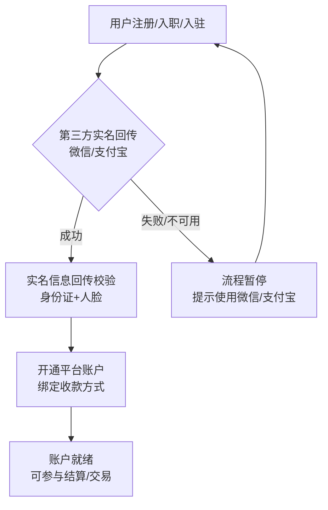

# 05 · 实名认证流程（I1）

> 来源:概要设计说明书 §5.1 · 硬依赖:第三方实名(微信/支付宝回传)
> 查看:Typora 打开本文件即可渲染;源码可粘贴 [mermaid.live](https://mermaid.live) 校验

```mermaid
graph TD
    A[用户注册/入职/入驻] --> B{第三方实名回传<br/>微信/支付宝}
    B -- 成功 --> C[实名信息回传校验<br/>身份证+人脸]
    C --> D[开通平台账户<br/>绑定收款方式]
    D --> E[账户就绪<br/>可参与结算/交易]
    B -- 失败/不可用 --> F[流程暂停<br/>提示使用微信/支付宝]
    F --> A
```

> 红线:不接受人工证件核验降级;实名失败即暂停注册/入职/入驻流程。状态:未实名 → 实名中 → 已实名 / 暂停。
