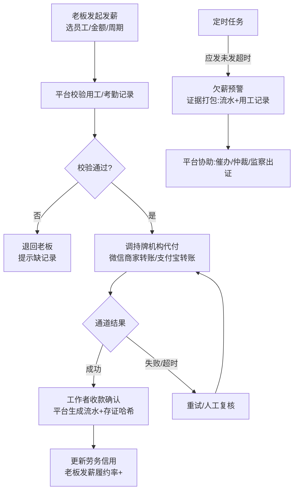

# 06 · 工资保障代付流程（I3）

> 来源:概要设计说明书 §5.2 · 模式丙:代付留痕 + 欠薪预警 + 证据出证
> 查看:Typora 打开本文件即可渲染;源码可粘贴 [mermaid.live](https://mermaid.live) 校验

> 关键设计:平台**只记账不碰钱**——资金由持牌机构从老板绑定对公/法人账户划转;流水号 + 通道交易号 + 时间戳 + 哈希,即证据链。状态:待校验 → 代付中 → 已到账(完成)/ 预警。
