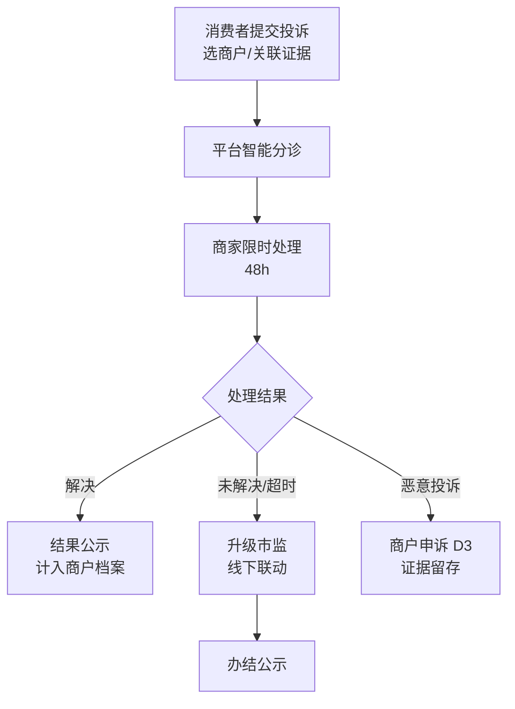

# 07 · 投诉直达流程（D2）

> 来源:概要设计说明书 §5.3 · 复用 G1 工单内核
> 查看:Typora 打开本文件即可渲染;源码可粘贴 [mermaid.live](https://mermaid.live) 校验

```mermaid
graph TD
    A[消费者提交投诉<br/>选商户/关联证据] --> B[平台智能分诊]
    B --> C[商家限时处理<br/>48h]
    C --> D{处理结果}
    D -- 解决 --> E[结果公示<br/>计入商户档案]
    D -- 未解决/超时 --> F[升级市监<br/>线下联动]
    F --> G[办结公示]
    D -- 恶意投诉 --> H[商户申诉 D3<br/>证据留存]
```

> 状态:已提交 → 处理中 → 已解决 / 已升级 → 已办结(公示);超时自动升级。全程进度可见。
