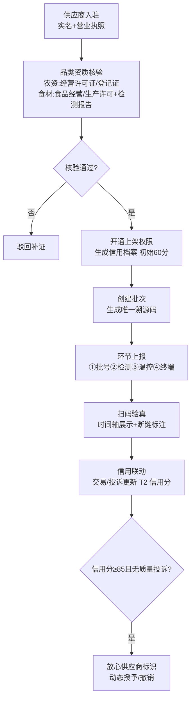

# 08 · 供应商入驻与溯源流程（T2/T3）

> 来源:概要设计说明书 §5.4 · 品类资质核验 + 一物一码溯源 + 供应商信用
> 查看:Typora 打开本文件即可渲染;源码可粘贴 [mermaid.live](https://mermaid.live) 校验

> 状态机:商品 草稿→待审核→已上架⇄下架(异常强制下架);溯源链路 ①批号→②检测→③温控→④终端(任一缺失=断链);供应商榜单 正常⇄警告(60~40)⇄黑榜(<40,降权/禁新单)。
