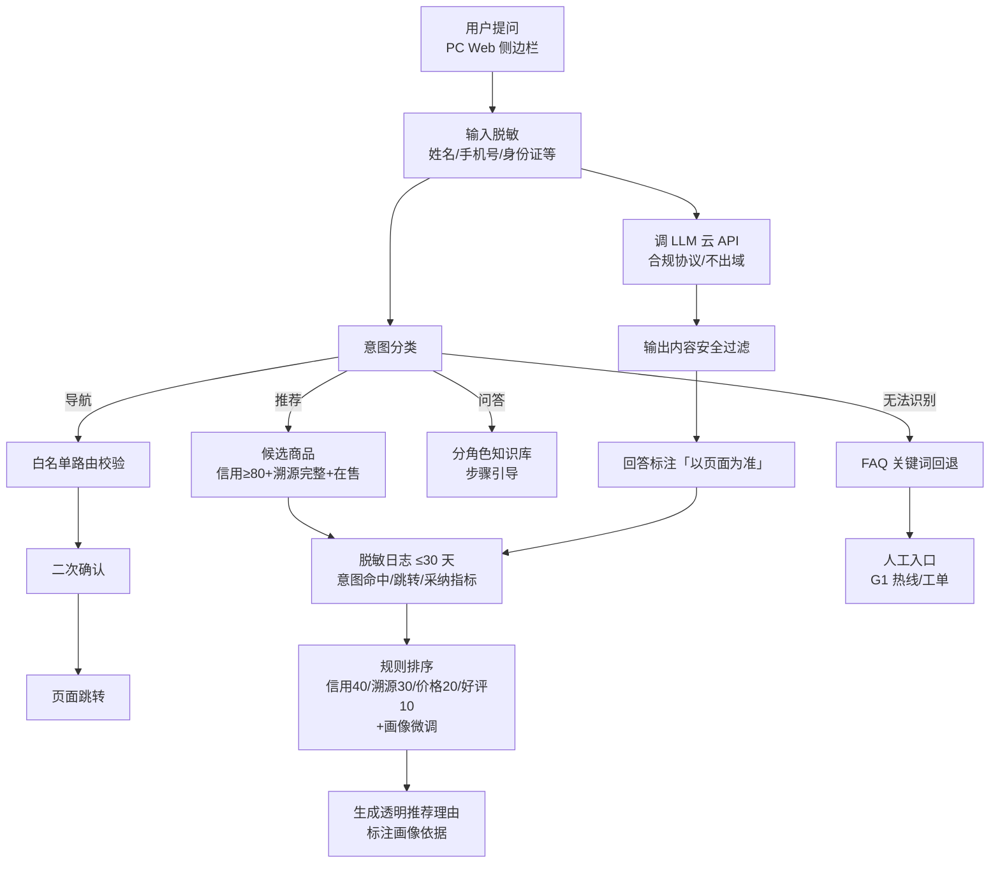

# 09 · 智能助手对话流程（J）

> 来源:概要设计说明书 §5.5 · 脱敏 → 意图分类 → 白名单跳转 / 规则推荐 / FAQ / 兜底
> 查看:Typora 打开本文件即可渲染;源码可粘贴 [mermaid.live](https://mermaid.live) 校验

> 会话:上下文 30 分钟 TTL 自动清空,不留跨会话记忆;兜底:无法识别 → FAQ → 人工入口(G1),不纯 AI 硬答;合规:脱敏前置、不出域、内容安全、非竞价推荐、理由透明。
> 画像(J7):推荐在规则排序上叠加画像权重(职业/年龄/价格敏感度/偏好),理由标注画像依据;**价格不因画像差异化(不杀熟)**;用户可关闭/删除画像(四权,见 12 画像流程)。
