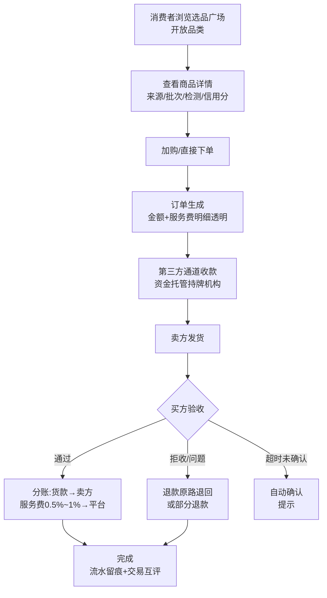

# 10 · B2C 购买流程（M2 交付 · 设计先行）

> 来源:概要设计说明书 §5.7 · 消费者直接购买链路
> 查看:Typora 打开本文件即可渲染;源码可粘贴 [mermaid.live](https://mermaid.live) 校验

> 状态:待付款 → 已付款(托管) → 已发货 → 待验收 → 已完成;分支:拒收 → 退款中 → 已完成。合规:买家资金直付持牌通道,平台不碰货款(不二清)。
