# 14 · 功能结构图（全平台）

> 来源:概要设计说明书 §1.2 范围 / §2.4 模块与服务映射 / §11.4 三端×模块映射矩阵;里程碑标注对齐 §1.2 范围表
> 查看:Typora 打开本文件即可渲染;源码可粘贴 [mermaid.live](https://mermaid.live) 校验

```mermaid
graph LR
    ROOT["城市民生综合服务平台<br/>功能结构全景<br/>三端:消费端 / 经营端 / 监管端"]

    subgraph MI["I · 账户与结算（ACC / SETTLE）"]
        direction TB
        I1["I1 实名认证<br/>微信/支付宝回传 · 红线不降级"]
        IW["平台账户<br/>记账簿 · 钱包流水（只记账不碰钱）"]
        I2["I2 劳务信用<br/>双向互评 → 劳务信用分"]
        I3["I3 工资保障代付<br/>代付留痕 · 欠薪预警 · 证据出证"]
        I4["I4 分账结算 (M2)<br/>分账放款 · 退款 · 每日对账"]
        I5["I5 零工劳务结算 (M2)<br/>零工结算"]
    end

    subgraph MA["A · 档案与信用（CRED）"]
        direction TB
        A1["A1 一店一档<br/>证照核验 · 价格公示基础版 · 未成年人禁入承诺"]
        A2["A2 一人一档<br/>履历授权可见"]
        A3["A3 信用分<br/>红黑榜 · 放心供应商联动"]
        A4["A4 监管预警双向推送 (M2)<br/>资质临期/年检 · 违规入场预警"]
    end

    subgraph MC["C · 用工保障（EMP）"]
        direction TB
        C2["C2 防童工<br/>入职年龄核验 · 用工/考勤记录"]
    end

    subgraph MD["D · 投诉（TICKET）"]
        direction TB
        D2["D2 投诉直达<br/>≤3 步提交 · 含未成年人违规进入举报"]
    end

    subgraph MG["G · 政民互动（TICKET）"]
        direction TB
        G1["G1 群众热线<br/>基础版 · 复用工单内核"]
    end

    subgraph MT["T · 溯源与透明交易（TRACE / PROD / TRADE）"]
        direction TB
        T2["T2 供应商资质核验<br/>入驻审核 · 品类资质门槛"]
        T3["T3 溯源二维码<br/>一物一码 · 扫码验真 · 断链预警"]
        T1["T1 选品广场 (M2)<br/>商品上架/审核 · 检索 · 资质关联"]
        T4["T4 担保交易撮合 (M2)<br/>B2C/B2B 双链路 · 托管 · 分账"]
    end

    subgraph MJ["J · 智能助手（ASSIST · Python）"]
        direction TB
        J1["J1~J6 对话服务<br/>意图分类 · 白名单跳转 · 规则推荐 · FAQ · 内容安全 · 脱敏"]
        J7["J7 个人画像（PROFILE）<br/>画像构建 · 标签计算 · 四权管理<br/>M1 基础 / M2 完整"]
    end

    subgraph MK["K · AI 能力中心（AICORE · Python）"]
        direction TB
        K6["K6 AI 网关底座<br/>DeepSeek 文本 · 视觉云 API · OCR 路由"]
        K2["K2 证照 OCR<br/>证照录入 ≤1 分钟"]
        K1["K1 视觉合规审核 (M2)<br/>AI 标记 · 人工复核 · 置信度分级"]
        K3["K3 图像问答 (M2)"]
        K4["K4 风险预测 (M3)"]
        K5["K5 后厨异常识别 (M3)"]
    end

    subgraph MX["平台支撑（贯穿 M1）"]
        direction TB
        DASH["DASH 监管看板<br/>三端数据总览 · 预警列表"]
        PUB["费率/抽成公开公示页<br/>AC-M1.10 · 口径透明 · 调整前告知"]
        EV["存证与审计<br/>时间戳 + SHA-256 哈希 · 可出证"]
        ASYNC["消息与定时任务<br/>MQ 削峰 · JOB 扫描 · 每日对账"]
    end

    subgraph ZZ["占位模块（仅边界 · M2~M3）"]
        direction TB
        F5["F5 费率/抽成公开 (M2 设计先行)<br/>货运抽成公示"]
        B2["B2 后厨直播"]
        B3["B3 抽检公示"]
        C3["C3 履历核验"]
        D1["D1 预付卡"]
        D3["D3 差评申诉"]
        E1["E 社区<br/>含 E3 招工求职"]
        F1["F 物流货运<br/>运单 · 发单/接单"]
        G2["G2 论坛"]
        G3["G3 限时办结"]
        H1["H 民生监督"]
        T5["T5 反向闭环"]
        EDU["EDU 教育培训专项<br/>机构档案 · 教师资质 · 一课一消"]
    end

    ROOT --> I1
    ROOT --> IW
    ROOT --> I2
    ROOT --> I3
    ROOT -.-> I4
    ROOT -.-> I5
    ROOT --> A1
    ROOT --> A2
    ROOT --> A3
    ROOT -.-> A4
    ROOT --> C2
    ROOT --> D2
    ROOT --> G1
    ROOT --> T2
    ROOT --> T3
    ROOT -.-> T1
    ROOT -.-> T4
    ROOT --> J1
    ROOT --> J7
    ROOT --> K6
    ROOT --> K2
    ROOT -.-> K1
    ROOT -.-> K3
    ROOT -.-> K4
    ROOT -.-> K5
    ROOT --> DASH
    ROOT --> PUB
    ROOT --> EV
    ROOT --> ASYNC
    ROOT -.-> F5
    ROOT -.-> B2
    ROOT -.-> B3
    ROOT -.-> C3
    ROOT -.-> D1
    ROOT -.-> D3
    ROOT -.-> E1
    ROOT -.-> F1
    ROOT -.-> G2
    ROOT -.-> G3
    ROOT -.-> H1
    ROOT -.-> T5
    ROOT -.-> EDU

    classDef m2 stroke:#c77f00,stroke-dasharray:6 4,color:#7a4d00
    classDef m3 stroke:#8a8a8a,stroke-dasharray:2 3,color:#666666
    class I4,I5,A4,T1,T4,K1,K3,F5 m2
    class B2,B3,C3,D1,D3,E1,F1,G2,G3,H1,T5,EDU,K4,K5 m3
```

> **图例**:实线边框 + 实线连线 = **M1 本期交付**;琥珀色虚线 = **M2**(设计先行 / M2 交付);灰色点线 = **M2~M3 占位**(仅边界)。
>
> **说明**:
> - 每个框 = 一个模块(第二层),框内为并列功能点(第三层);服务映射见概要设计 §2.4 模块与服务映射表。
> - 里程碑标注对齐 §1.2 范围表:M1 交付 → 设计先行(M2)→ 占位(M2~M3)。
> - 三端(消费端/经营端/监管端)的功能分布见 §11.4 三端×模块映射矩阵,本图以模块为主线,不重复三端拆分。
> - **J 智能助手（ASSIST）与 K AI 能力中心（AICORE）为独立 Python 服务**（2026-09-03 拍板,方案 A:Python 3.12 + FastAPI + LangChain 编排）;**J7 画像 PROFILE 业务留 Java**;其余服务为 Java 模块化单体。
> - **三小/摊贩「流动经营者登记」**:M1 明确不做,P3 预留扩展位(未画入本图)。
