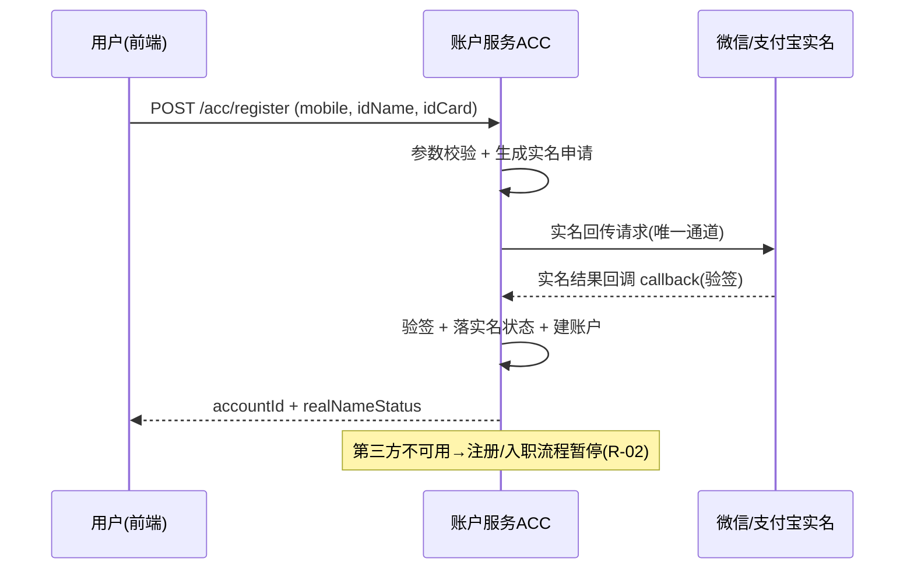
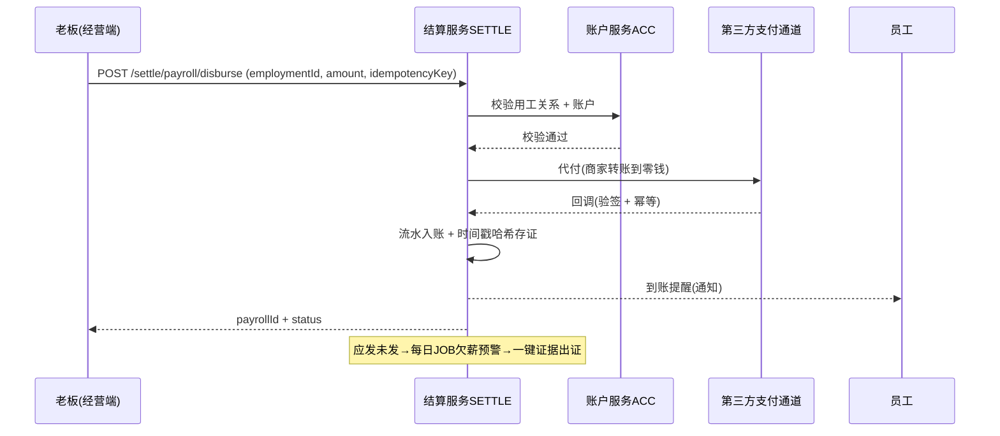
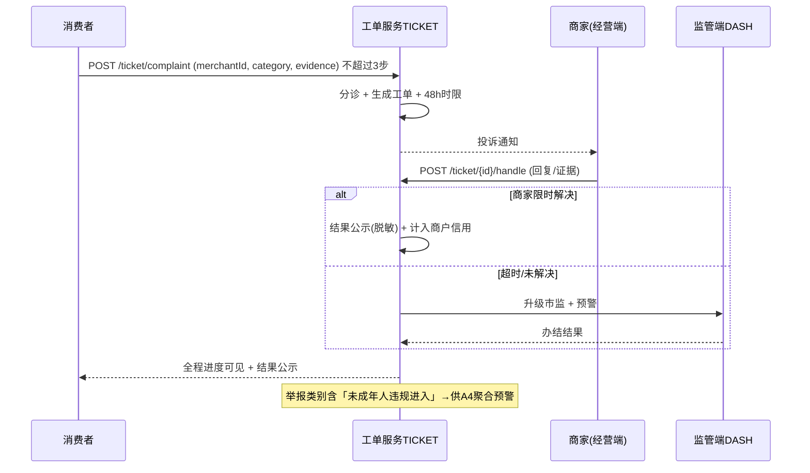
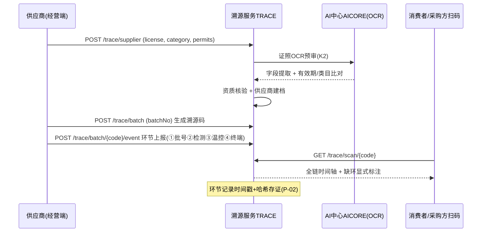
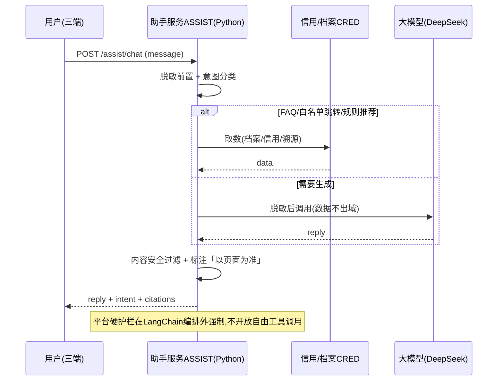
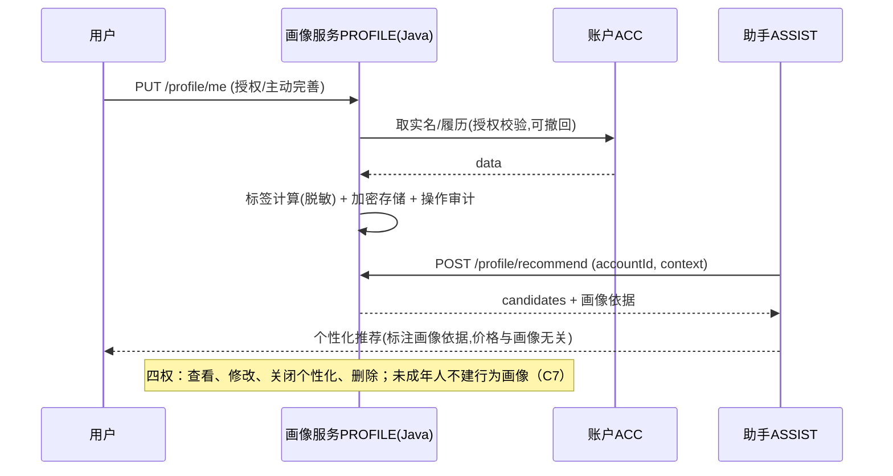
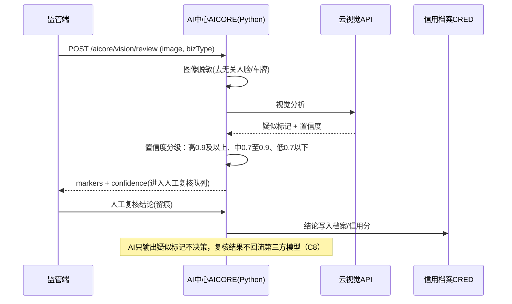
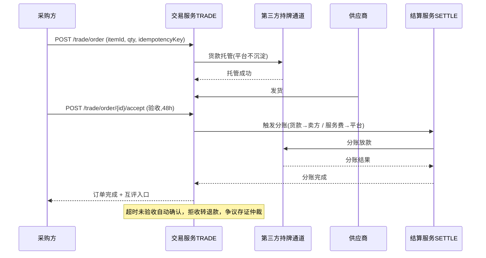

# 核心时序图（独立交付物）

> 归属：`docs/design/产品设计说明书` §5 核心流程的**时序图配套**，独立于文档正文交付。
> 图均用 Mermaid `sequenceDiagram`；参与者为 §2.4 已定稿的 13 模块（ACC/SETTLE/CRED/EMP/TICKET/TRACE/PROD/TRADE/DASH/CIVIC/PROFILE/ASSIST/AICORE）＋ 外部通道/前端。
> 覆盖：M1 全量核心流程 + M2 关键流程（交易/AI 视觉审核）。

---

## 1. 实名认证（I1，硬依赖第三方实名）

## 2. 工资保障代付（I3，第三方通道代付留痕）

## 3. 投诉直达 + 进度可见（D2，复用 G1 工单内核）

## 4. 供应商入驻与溯源（T2/T3，含 K2 证照 OCR）

## 5. 智能助手对话（J，脱敏 → 意图 → 动作）

## 6. 画像构建与个性化推荐（J7，四权 + 不杀熟）

## 7. AI 视觉合规审核（K1，M2，AI 只标记不决策）

## 8. B2B 选品采购撮合（T4，M2，担保托管分账）

---

*时序图结束 · 与 §5 流程图、§6.4 接口清单、§4.5 表结构一一对应。*
