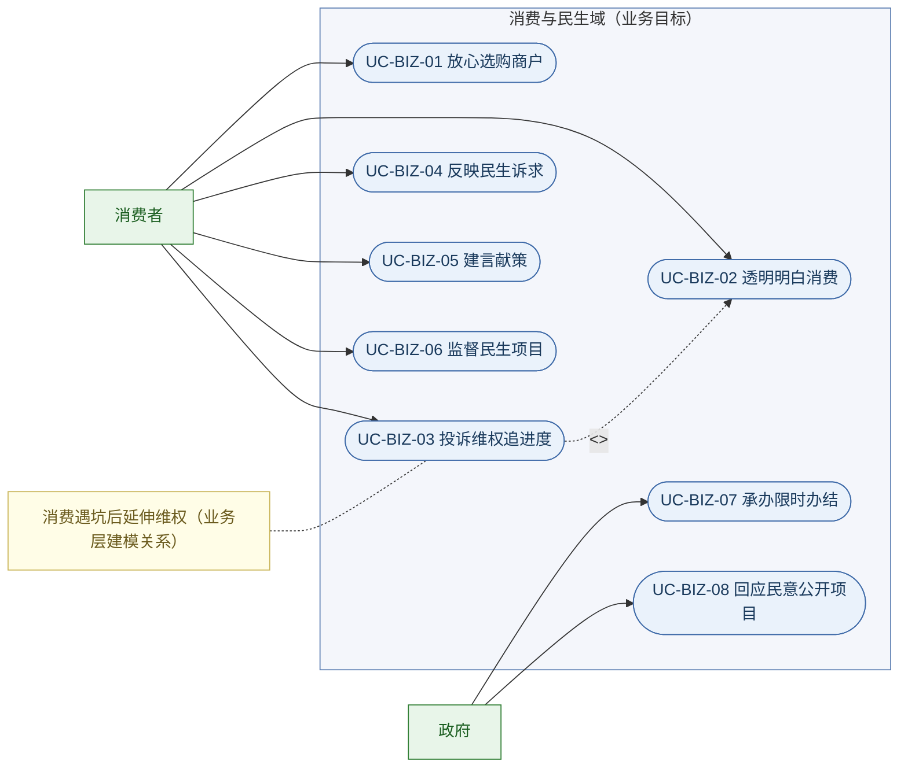

# 民生甄选 · 业务用例图 · 消费与民生域

> 层：L1 业务用例 · UC-BIZ-01 ~ UC-BIZ-08 · 原图 `01-业务用例图/01-消费与民生域.puml`

```mermaid
flowchart LR
    %% 民生甄选 · 业务用例图 · 消费与民生域（UC-BIZ-01 ~ UC-BIZ-08）
    classDef actor fill:#E8F5E9,stroke:#2E7D32,color:#1B5E20;
    classDef uc fill:#EAF2FB,stroke:#3E6AA8,color:#1A3A5C;
    classDef note fill:#FFFDE7,stroke:#C9B458,color:#6B5B1E;

    CONSUMER["消费者"]:::actor
    GOV["政府"]:::actor

    subgraph BIZ["消费与民生域（业务目标）"]
        B01(["UC-BIZ-01 放心选购商户"]):::uc
        B02(["UC-BIZ-02 透明明白消费"]):::uc
        B03(["UC-BIZ-03 投诉维权追进度"]):::uc
        B04(["UC-BIZ-04 反映民生诉求"]):::uc
        B05(["UC-BIZ-05 建言献策"]):::uc
        B06(["UC-BIZ-06 监督民生项目"]):::uc
        B07(["UC-BIZ-07 承办限时办结"]):::uc
        B08(["UC-BIZ-08 回应民意公开项目"]):::uc
    end

    CONSUMER --> B01
    CONSUMER --> B02
    CONSUMER --> B03
    CONSUMER --> B04
    CONSUMER --> B05
    CONSUMER --> B06
    GOV --> B07
    GOV --> B08

    B03 -.->|<<extend>>| B02
    NOTE1["消费遇坑后延伸维权（业务层建模关系）"]:::note
    NOTE1 -.- B03

    style BIZ fill:#F4F6FB,stroke:#5B7DB1
```
