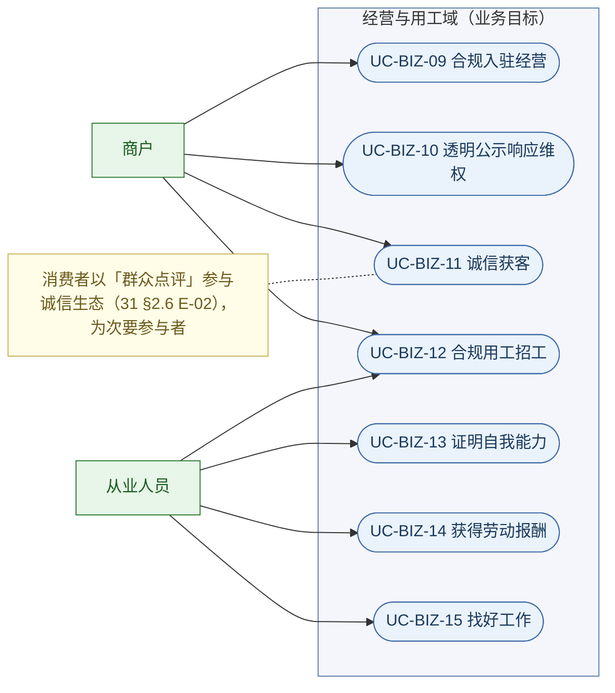

# 民生甄选 · 业务用例图 · 经营与用工域

> 层：L1 业务用例 · UC-BIZ-09 ~ UC-BIZ-15 · 原图 `01-业务用例图/02-经营与用工域.puml`

```mermaid
flowchart LR
    %% 民生甄选 · 业务用例图 · 经营与用工域（UC-BIZ-09 ~ UC-BIZ-15）
    classDef actor fill:#E8F5E9,stroke:#2E7D32,color:#1B5E20;
    classDef uc fill:#EAF2FB,stroke:#3E6AA8,color:#1A3A5C;
    classDef note fill:#FFFDE7,stroke:#C9B458,color:#6B5B1E;

    MERCHANT["商户"]:::actor
    WORKER["从业人员"]:::actor

    subgraph BIZ["经营与用工域（业务目标）"]
        B09(["UC-BIZ-09 合规入驻经营"]):::uc
        B10(["UC-BIZ-10 透明公示响应维权"]):::uc
        B11(["UC-BIZ-11 诚信获客"]):::uc
        B12(["UC-BIZ-12 合规用工招工"]):::uc
        B13(["UC-BIZ-13 证明自我能力"]):::uc
        B14(["UC-BIZ-14 获得劳动报酬"]):::uc
        B15(["UC-BIZ-15 找好工作"]):::uc
    end

    MERCHANT --> B09
    MERCHANT --> B10
    MERCHANT --> B11
    MERCHANT --> B12
    WORKER --> B12
    WORKER --> B13
    WORKER --> B14
    WORKER --> B15

    NOTE1["消费者以「群众点评」参与诚信生态（31 §2.6 E-02），为次要参与者"]:::note
    NOTE1 -.- B11

    style BIZ fill:#F4F6FB,stroke:#5B7DB1
```
