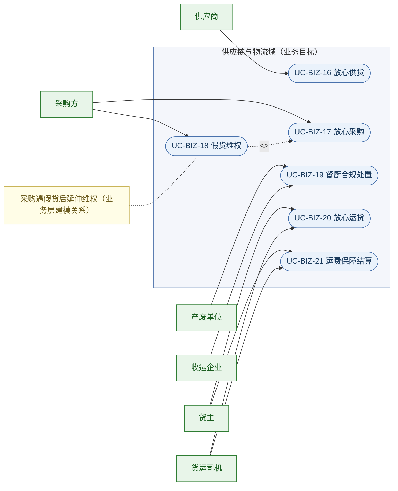

# 民生甄选 · 业务用例图 · 供应链与物流域

> 层：L1 业务用例 · UC-BIZ-16 ~ UC-BIZ-21 · 原图 `01-业务用例图/03-供应链与物流域.puml`

```mermaid
flowchart LR
    %% 民生甄选 · 业务用例图 · 供应链与物流域（UC-BIZ-16 ~ UC-BIZ-21）
    classDef actor fill:#E8F5E9,stroke:#2E7D32,color:#1B5E20;
    classDef uc fill:#EAF2FB,stroke:#3E6AA8,color:#1A3A5C;
    classDef note fill:#FFFDE7,stroke:#C9B458,color:#6B5B1E;

    SUPPLIER["供应商"]:::actor
    BUYER["采购方"]:::actor
    WASTEUNIT["产废单位"]:::actor
    COLLECTOR["收运企业"]:::actor
    SHIPPER["货主"]:::actor
    DRIVER["货运司机"]:::actor

    subgraph BIZ["供应链与物流域（业务目标）"]
        B16(["UC-BIZ-16 放心供货"]):::uc
        B17(["UC-BIZ-17 放心采购"]):::uc
        B18(["UC-BIZ-18 假货维权"]):::uc
        B19(["UC-BIZ-19 餐厨合规处置"]):::uc
        B20(["UC-BIZ-20 放心运货"]):::uc
        B21(["UC-BIZ-21 运费保障结算"]):::uc
    end

    SUPPLIER --> B16
    BUYER --> B17
    BUYER --> B18
    WASTEUNIT --> B19
    COLLECTOR --> B19
    SHIPPER --> B20
    SHIPPER --> B21
    DRIVER --> B20
    DRIVER --> B21

    B18 -.->|<<extend>>| B17
    NOTE1["采购遇假货后延伸维权（业务层建模关系）"]:::note
    NOTE1 -.- B18

    style BIZ fill:#F4F6FB,stroke:#5B7DB1
```
