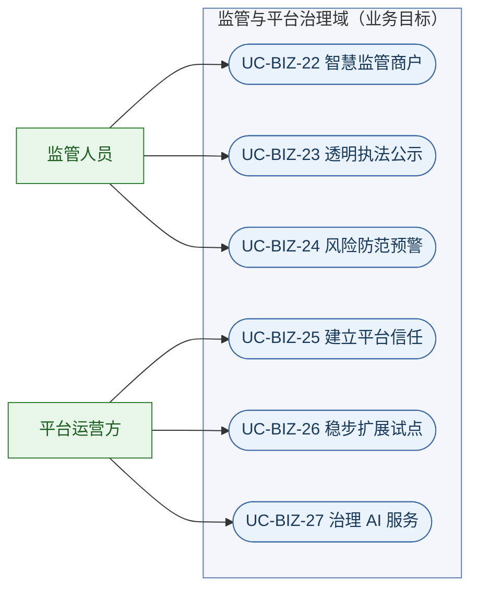

# 民生甄选 · 业务用例图 · 监管与平台治理域

> 层：L1 业务用例 · UC-BIZ-22 ~ UC-BIZ-27 · 原图 `01-业务用例图/04-监管与平台治理域.puml`

```mermaid
flowchart LR
    %% 民生甄选 · 业务用例图 · 监管与平台治理域（UC-BIZ-22 ~ UC-BIZ-27）
    classDef actor fill:#E8F5E9,stroke:#2E7D32,color:#1B5E20;
    classDef uc fill:#EAF2FB,stroke:#3E6AA8,color:#1A3A5C;
    classDef note fill:#FFFDE7,stroke:#C9B458,color:#6B5B1E;

    REGU["监管人员"]:::actor
    OPER["平台运营方"]:::actor

    subgraph BIZ["监管与平台治理域（业务目标）"]
        B22(["UC-BIZ-22 智慧监管商户"]):::uc
        B23(["UC-BIZ-23 透明执法公示"]):::uc
        B24(["UC-BIZ-24 风险防范预警"]):::uc
        B25(["UC-BIZ-25 建立平台信任"]):::uc
        B26(["UC-BIZ-26 稳步扩展试点"]):::uc
        B27(["UC-BIZ-27 治理 AI 服务"]):::uc
    end

    REGU --> B22
    REGU --> B23
    REGU --> B24
    OPER --> B25
    OPER --> B26
    OPER --> B27

    style BIZ fill:#F4F6FB,stroke:#5B7DB1
```
