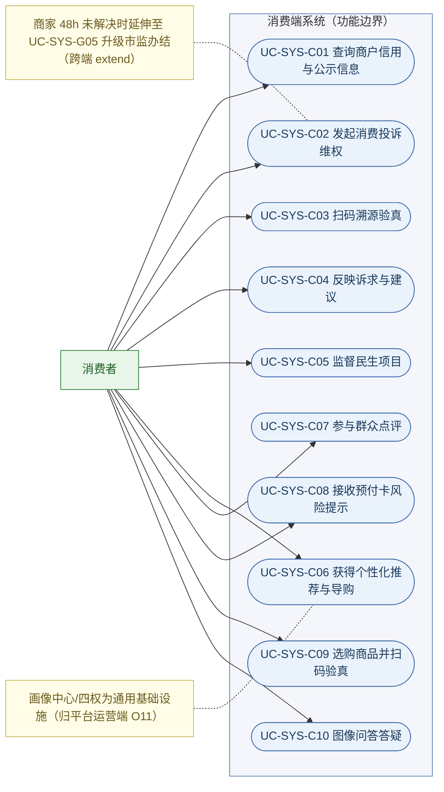

# 民生甄选 · 系统用例图 · 消费端

> 层：L2 系统用例 · UC-SYS-C01 ~ C10 · 原图 `02-系统用例图/01-消费端.puml`

```mermaid
flowchart LR
    %% 民生甄选 · 系统用例图 · 消费端（UC-SYS-C01 ~ C10）
    classDef actor fill:#E8F5E9,stroke:#2E7D32,color:#1B5E20;
    classDef uc fill:#EAF2FB,stroke:#3E6AA8,color:#1A3A5C;
    classDef note fill:#FFFDE7,stroke:#C9B458,color:#6B5B1E;

    CONSUMER["消费者"]:::actor

    subgraph SYS["消费端系统（功能边界）"]
        C01(["UC-SYS-C01 查询商户信用与公示信息"]):::uc
        C02(["UC-SYS-C02 发起消费投诉维权"]):::uc
        C03(["UC-SYS-C03 扫码溯源验真"]):::uc
        C04(["UC-SYS-C04 反映诉求与建议"]):::uc
        C05(["UC-SYS-C05 监督民生项目"]):::uc
        C06(["UC-SYS-C06 获得个性化推荐与导购"]):::uc
        C07(["UC-SYS-C07 参与群众点评"]):::uc
        C08(["UC-SYS-C08 接收预付卡风险提示"]):::uc
        C09(["UC-SYS-C09 选购商品并扫码验真"]):::uc
        C10(["UC-SYS-C10 图像问答答疑"]):::uc
    end

    CONSUMER --> C01
    CONSUMER --> C02
    CONSUMER --> C03
    CONSUMER --> C04
    CONSUMER --> C05
    CONSUMER --> C06
    CONSUMER --> C07
    CONSUMER --> C08
    CONSUMER --> C09
    CONSUMER --> C10

    NOTE1["商家 48h 未解决时延伸至 UC-SYS-G05 升级市监办结（跨端 extend）"]:::note
    NOTE1 -.- C02
    NOTE2["画像中心/四权为通用基础设施（归平台运营端 O11）"]:::note
    NOTE2 -.- C06

    style SYS fill:#F4F6FB,stroke:#5B7DB1
```
