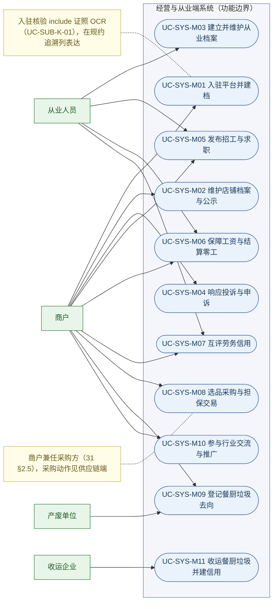

# 民生甄选 · 系统用例图 · 经营与从业端

> 层：L2 系统用例 · UC-SYS-M01 ~ M11 · 原图 `02-系统用例图/02-经营与从业端.puml`

```mermaid
flowchart LR
    %% 民生甄选 · 系统用例图 · 经营与从业端（UC-SYS-M01 ~ M11）
    classDef actor fill:#E8F5E9,stroke:#2E7D32,color:#1B5E20;
    classDef uc fill:#EAF2FB,stroke:#3E6AA8,color:#1A3A5C;
    classDef note fill:#FFFDE7,stroke:#C9B458,color:#6B5B1E;

    MERCHANT["商户"]:::actor
    WORKER["从业人员"]:::actor
    WASTEUNIT["产废单位"]:::actor
    COLLECTOR["收运企业"]:::actor

    subgraph SYS["经营与从业端系统（功能边界）"]
        M01(["UC-SYS-M01 入驻平台并建档"]):::uc
        M02(["UC-SYS-M02 维护店铺档案与公示"]):::uc
        M03(["UC-SYS-M03 建立并维护从业档案"]):::uc
        M04(["UC-SYS-M04 响应投诉与申诉"]):::uc
        M05(["UC-SYS-M05 发布招工与求职"]):::uc
        M06(["UC-SYS-M06 保障工资与结算零工"]):::uc
        M07(["UC-SYS-M07 互评劳务信用"]):::uc
        M08(["UC-SYS-M08 选品采购与担保交易"]):::uc
        M09(["UC-SYS-M09 登记餐厨垃圾去向"]):::uc
        M10(["UC-SYS-M10 参与行业交流与推广"]):::uc
        M11(["UC-SYS-M11 收运餐厨垃圾并建信用"]):::uc
    end

    MERCHANT --> M01
    MERCHANT --> M02
    MERCHANT --> M04
    MERCHANT --> M05
    MERCHANT --> M06
    MERCHANT --> M07
    MERCHANT --> M08
    MERCHANT --> M09
    MERCHANT --> M10
    WORKER --> M03
    WORKER --> M05
    WORKER --> M06
    WORKER --> M07
    WASTEUNIT --> M09
    COLLECTOR --> M11

    NOTE1["入驻核验 include 证照 OCR（UC-SUB-K-01），在规约追溯列表达"]:::note
    NOTE1 -.- M01
    NOTE2["商户兼任采购方（31 §2.5），采购动作见供应链端"]:::note
    NOTE2 -.- M08

    style SYS fill:#F4F6FB,stroke:#5B7DB1
```
