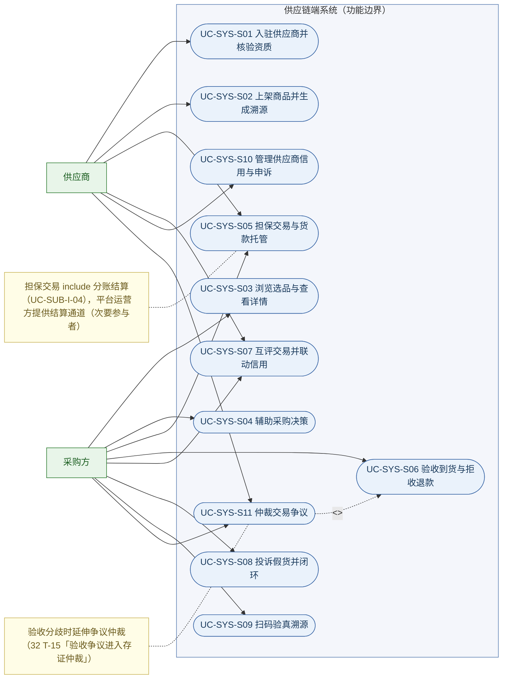

# 民生甄选 · 系统用例图 · 供应链端

> 层：L2 系统用例 · UC-SYS-S01 ~ S11 · 原图 `02-系统用例图/03-供应链端.puml`

```mermaid
flowchart LR
    %% 民生甄选 · 系统用例图 · 供应链端（UC-SYS-S01 ~ S11）
    classDef actor fill:#E8F5E9,stroke:#2E7D32,color:#1B5E20;
    classDef uc fill:#EAF2FB,stroke:#3E6AA8,color:#1A3A5C;
    classDef note fill:#FFFDE7,stroke:#C9B458,color:#6B5B1E;

    SUPPLIER["供应商"]:::actor
    BUYER["采购方"]:::actor

    subgraph SYS["供应链端系统（功能边界）"]
        S01(["UC-SYS-S01 入驻供应商并核验资质"]):::uc
        S02(["UC-SYS-S02 上架商品并生成溯源"]):::uc
        S03(["UC-SYS-S03 浏览选品与查看详情"]):::uc
        S04(["UC-SYS-S04 辅助采购决策"]):::uc
        S05(["UC-SYS-S05 担保交易与货款托管"]):::uc
        S06(["UC-SYS-S06 验收到货与拒收退款"]):::uc
        S07(["UC-SYS-S07 互评交易并联动信用"]):::uc
        S08(["UC-SYS-S08 投诉假货并闭环"]):::uc
        S09(["UC-SYS-S09 扫码验真溯源"]):::uc
        S10(["UC-SYS-S10 管理供应商信用与申诉"]):::uc
        S11(["UC-SYS-S11 仲裁交易争议"]):::uc
    end

    SUPPLIER --> S01
    SUPPLIER --> S02
    SUPPLIER --> S05
    SUPPLIER --> S07
    SUPPLIER --> S10
    SUPPLIER --> S11
    BUYER --> S03
    BUYER --> S04
    BUYER --> S05
    BUYER --> S06
    BUYER --> S07
    BUYER --> S08
    BUYER --> S09
    BUYER --> S11

    S11 -.->|<<extend>>| S06
    NOTE1["验收分歧时延伸争议仲裁（32 T-15「验收争议进入存证仲裁」）"]:::note
    NOTE1 -.- S11
    NOTE2["担保交易 include 分账结算（UC-SUB-I-04），平台运营方提供结算通道（次要参与者）"]:::note
    NOTE2 -.- S05

    style SYS fill:#F4F6FB,stroke:#5B7DB1
```
