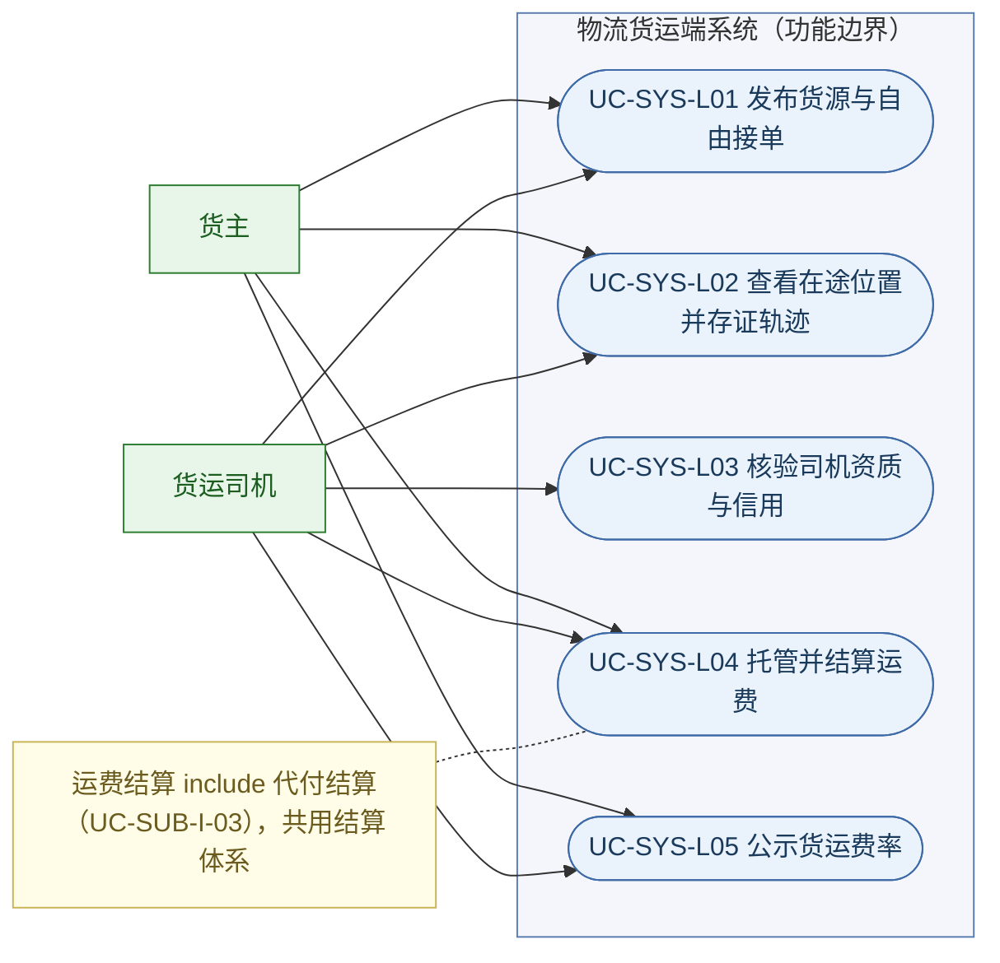

# 民生甄选 · 系统用例图 · 物流货运端

> 层：L2 系统用例 · UC-SYS-L01 ~ L05 · 原图 `02-系统用例图/04-物流货运端.puml`

```mermaid
flowchart LR
    %% 民生甄选 · 系统用例图 · 物流货运端（UC-SYS-L01 ~ L05）
    classDef actor fill:#E8F5E9,stroke:#2E7D32,color:#1B5E20;
    classDef uc fill:#EAF2FB,stroke:#3E6AA8,color:#1A3A5C;
    classDef note fill:#FFFDE7,stroke:#C9B458,color:#6B5B1E;

    SHIPPER["货主"]:::actor
    DRIVER["货运司机"]:::actor

    subgraph SYS["物流货运端系统（功能边界）"]
        L01(["UC-SYS-L01 发布货源与自由接单"]):::uc
        L02(["UC-SYS-L02 查看在途位置并存证轨迹"]):::uc
        L03(["UC-SYS-L03 核验司机资质与信用"]):::uc
        L04(["UC-SYS-L04 托管并结算运费"]):::uc
        L05(["UC-SYS-L05 公示货运费率"]):::uc
    end

    SHIPPER --> L01
    SHIPPER --> L02
    SHIPPER --> L04
    SHIPPER --> L05
    DRIVER --> L01
    DRIVER --> L02
    DRIVER --> L03
    DRIVER --> L04
    DRIVER --> L05

    NOTE1["运费结算 include 代付结算（UC-SUB-I-03），共用结算体系"]:::note
    NOTE1 -.- L04

    style SYS fill:#F4F6FB,stroke:#5B7DB1
```
