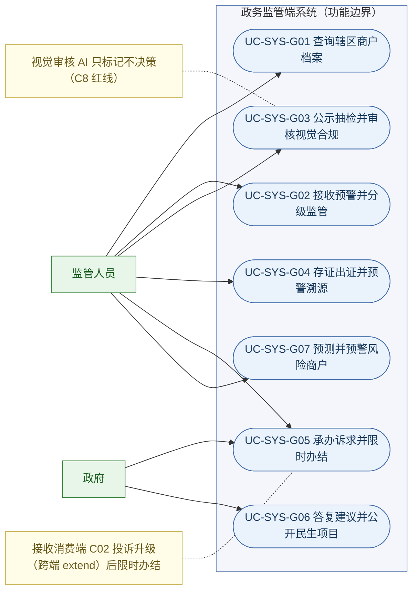

# 民生甄选 · 系统用例图 · 政务监管端

> 层：L2 系统用例 · UC-SYS-G01 ~ G07 · 原图 `02-系统用例图/05-政务监管端.puml`

```mermaid
flowchart LR
    %% 民生甄选 · 系统用例图 · 政务监管端（UC-SYS-G01 ~ G07）
    classDef actor fill:#E8F5E9,stroke:#2E7D32,color:#1B5E20;
    classDef uc fill:#EAF2FB,stroke:#3E6AA8,color:#1A3A5C;
    classDef note fill:#FFFDE7,stroke:#C9B458,color:#6B5B1E;

    REGU["监管人员"]:::actor
    GOV["政府"]:::actor

    subgraph SYS["政务监管端系统（功能边界）"]
        G01(["UC-SYS-G01 查询辖区商户档案"]):::uc
        G02(["UC-SYS-G02 接收预警并分级监管"]):::uc
        G03(["UC-SYS-G03 公示抽检并审核视觉合规"]):::uc
        G04(["UC-SYS-G04 存证出证并预警溯源"]):::uc
        G05(["UC-SYS-G05 承办诉求并限时办结"]):::uc
        G06(["UC-SYS-G06 答复建议并公开民生项目"]):::uc
        G07(["UC-SYS-G07 预测并预警风险商户"]):::uc
    end

    REGU --> G01
    REGU --> G02
    REGU --> G03
    REGU --> G04
    REGU --> G05
    REGU --> G07
    GOV --> G05
    GOV --> G06

    NOTE1["接收消费端 C02 投诉升级（跨端 extend）后限时办结"]:::note
    NOTE1 -.- G05
    NOTE2["视觉审核 AI 只标记不决策（C8 红线）"]:::note
    NOTE2 -.- G03

    style SYS fill:#F4F6FB,stroke:#5B7DB1
```
