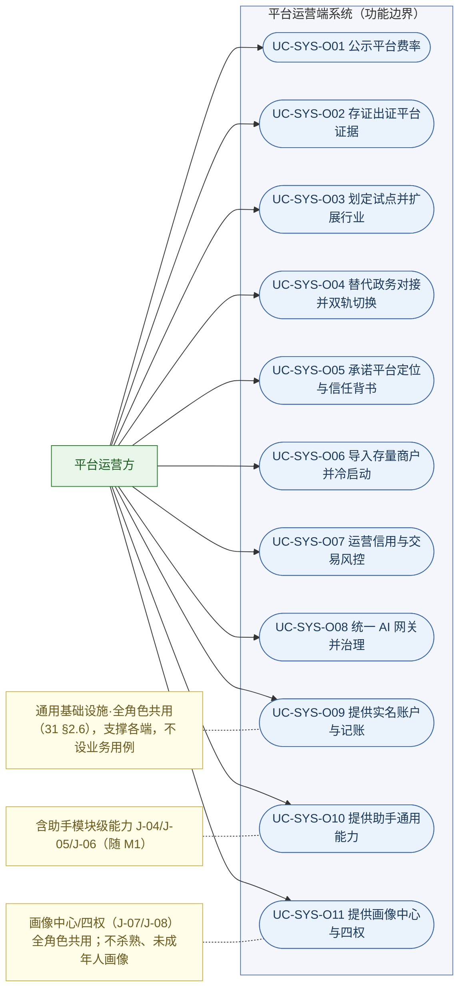

# 民生甄选 · 系统用例图 · 平台运营端

> 层：L2 系统用例 · UC-SYS-O01 ~ O11 · 原图 `02-系统用例图/06-平台运营端.puml`

```mermaid
flowchart LR
    %% 民生甄选 · 系统用例图 · 平台运营端（UC-SYS-O01 ~ O11）
    classDef actor fill:#E8F5E9,stroke:#2E7D32,color:#1B5E20;
    classDef uc fill:#EAF2FB,stroke:#3E6AA8,color:#1A3A5C;
    classDef note fill:#FFFDE7,stroke:#C9B458,color:#6B5B1E;

    OPER["平台运营方"]:::actor

    subgraph SYS["平台运营端系统（功能边界）"]
        O01(["UC-SYS-O01 公示平台费率"]):::uc
        O02(["UC-SYS-O02 存证出证平台证据"]):::uc
        O03(["UC-SYS-O03 划定试点并扩展行业"]):::uc
        O04(["UC-SYS-O04 替代政务对接并双轨切换"]):::uc
        O05(["UC-SYS-O05 承诺平台定位与信任背书"]):::uc
        O06(["UC-SYS-O06 导入存量商户并冷启动"]):::uc
        O07(["UC-SYS-O07 运营信用与交易风控"]):::uc
        O08(["UC-SYS-O08 统一 AI 网关并治理"]):::uc
        O09(["UC-SYS-O09 提供实名账户与记账"]):::uc
        O10(["UC-SYS-O10 提供助手通用能力"]):::uc
        O11(["UC-SYS-O11 提供画像中心与四权"]):::uc
    end

    OPER --> O01
    OPER --> O02
    OPER --> O03
    OPER --> O04
    OPER --> O05
    OPER --> O06
    OPER --> O07
    OPER --> O08
    OPER --> O09
    OPER --> O10
    OPER --> O11

    NOTE1["通用基础设施·全角色共用（31 §2.6），支撑各端，不设业务用例"]:::note
    NOTE1 -.- O09
    NOTE2["含助手模块级能力 J-04/J-05/J-06（随 M1）"]:::note
    NOTE2 -.- O10
    NOTE3["画像中心/四权（J-07/J-08）全角色共用；不杀熟、未成年人画像"]:::note
    NOTE3 -.- O11

    style SYS fill:#F4F6FB,stroke:#5B7DB1
```
