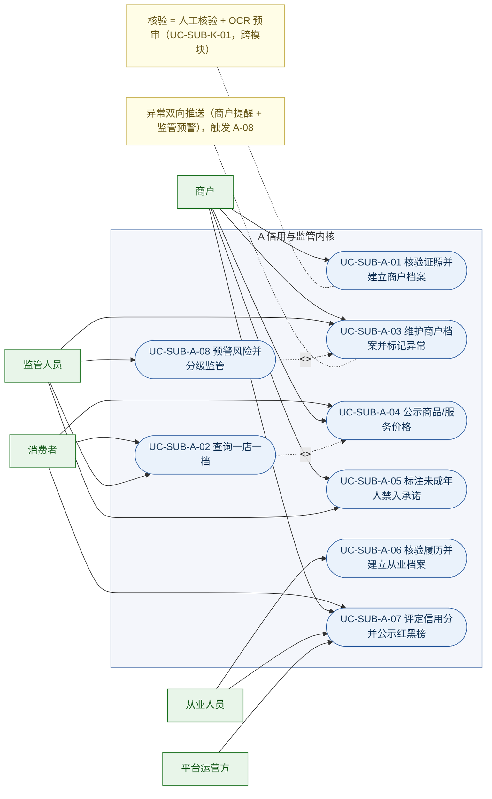

# 民生甄选 · 子系统用例图 · A 信用与监管内核

> 层：L3 子系统用例 · UC-SUB-A-01 ~ A-08 · 原图 `03-子系统用例图/A-信用与监管.puml`

```mermaid
flowchart LR
    %% 民生甄选 · 子系统用例图 · A 信用与监管内核（UC-SUB-A-01 ~ A-08）
    classDef actor fill:#E8F5E9,stroke:#2E7D32,color:#1B5E20;
    classDef uc fill:#EAF2FB,stroke:#3E6AA8,color:#1A3A5C;
    classDef note fill:#FFFDE7,stroke:#C9B458,color:#6B5B1E;

    CONSUMER["消费者"]:::actor
    MERCHANT["商户"]:::actor
    WORKER["从业人员"]:::actor
    REGU["监管人员"]:::actor
    OPER["平台运营方"]:::actor

    subgraph SUB["A 信用与监管内核"]
        A01(["UC-SUB-A-01 核验证照并建立商户档案"]):::uc
        A02(["UC-SUB-A-02 查询一店一档"]):::uc
        A03(["UC-SUB-A-03 维护商户档案并标记异常"]):::uc
        A04(["UC-SUB-A-04 公示商品/服务价格"]):::uc
        A05(["UC-SUB-A-05 标注未成年人禁入承诺"]):::uc
        A06(["UC-SUB-A-06 核验履历并建立从业档案"]):::uc
        A07(["UC-SUB-A-07 评定信用分并公示红黑榜"]):::uc
        A08(["UC-SUB-A-08 预警风险并分级监管"]):::uc
    end

    CONSUMER --> A02
    CONSUMER --> A04
    CONSUMER --> A07
    MERCHANT --> A01
    MERCHANT --> A03
    MERCHANT --> A04
    MERCHANT --> A05
    MERCHANT --> A07
    WORKER --> A06
    WORKER --> A07
    REGU --> A02
    REGU --> A03
    REGU --> A05
    REGU --> A08
    OPER --> A07

    A02 -.->|<<include>>| A04
    A08 -.->|<<extend>>| A03
    NOTE1["核验 = 人工核验 + OCR 预审（UC-SUB-K-01，跨模块）"]:::note
    NOTE1 -.- A01
    NOTE2["异常双向推送（商户提醒 + 监管预警），触发 A-08"]:::note
    NOTE2 -.- A03

    style SUB fill:#F4F6FB,stroke:#5B7DB1
```
