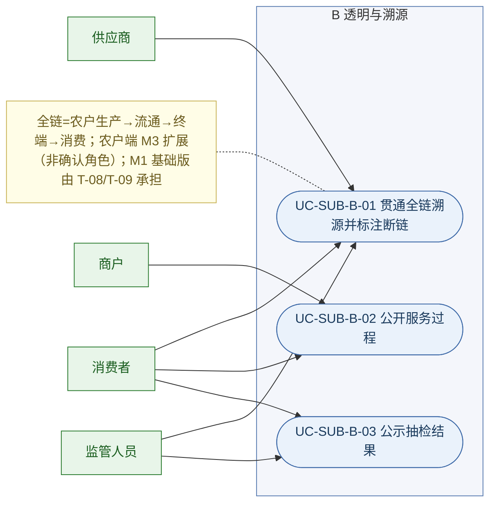

# 民生甄选 · 子系统用例图 · B 透明与溯源

> 层：L3 子系统用例 · UC-SUB-B-01 ~ B-03 · 原图 `03-子系统用例图/B-透明与溯源.puml`

```mermaid
flowchart LR
    %% 民生甄选 · 子系统用例图 · B 透明与溯源（UC-SUB-B-01 ~ B-03）
    classDef actor fill:#E8F5E9,stroke:#2E7D32,color:#1B5E20;
    classDef uc fill:#EAF2FB,stroke:#3E6AA8,color:#1A3A5C;
    classDef note fill:#FFFDE7,stroke:#C9B458,color:#6B5B1E;

    SUPPLIER["供应商"]:::actor
    MERCHANT["商户"]:::actor
    CONSUMER["消费者"]:::actor
    REGU["监管人员"]:::actor

    subgraph SUB["B 透明与溯源"]
        B01(["UC-SUB-B-01 贯通全链溯源并标注断链"]):::uc
        B02(["UC-SUB-B-02 公开服务过程"]):::uc
        B03(["UC-SUB-B-03 公示抽检结果"]):::uc
    end

    SUPPLIER --> B01
    MERCHANT --> B02
    CONSUMER --> B01
    CONSUMER --> B02
    CONSUMER --> B03
    REGU --> B01
    REGU --> B03

    NOTE1["全链=农户生产→流通→终端→消费；农户端 M3 扩展（非确认角色）；M1 基础版由 T-08/T-09 承担"]:::note
    NOTE1 -.- B01

    style SUB fill:#F4F6FB,stroke:#5B7DB1
```
