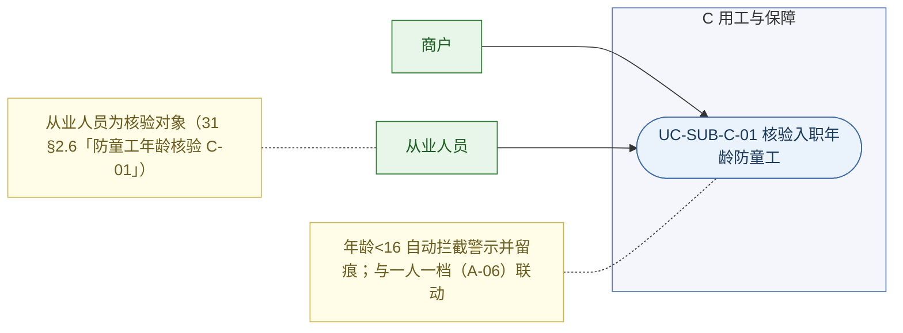

# 民生甄选 · 子系统用例图 · C 用工与保障

> 层：L3 子系统用例 · UC-SUB-C-01 · 原图 `03-子系统用例图/C-用工与保障.puml`

```mermaid
flowchart LR
    %% 民生甄选 · 子系统用例图 · C 用工与保障（UC-SUB-C-01）
    classDef actor fill:#E8F5E9,stroke:#2E7D32,color:#1B5E20;
    classDef uc fill:#EAF2FB,stroke:#3E6AA8,color:#1A3A5C;
    classDef note fill:#FFFDE7,stroke:#C9B458,color:#6B5B1E;

    MERCHANT["商户"]:::actor
    WORKER["从业人员"]:::actor

    subgraph SUB["C 用工与保障"]
        C01(["UC-SUB-C-01 核验入职年龄防童工"]):::uc
    end

    MERCHANT --> C01
    WORKER --> C01

    NOTE1["年龄<16 自动拦截警示并留痕；与一人一档（A-06）联动"]:::note
    NOTE1 -.- C01
    NOTE2["从业人员为核验对象（31 §2.6「防童工年龄核验 C-01」）"]:::note
    NOTE2 -.- WORKER

    style SUB fill:#F4F6FB,stroke:#5B7DB1
```
