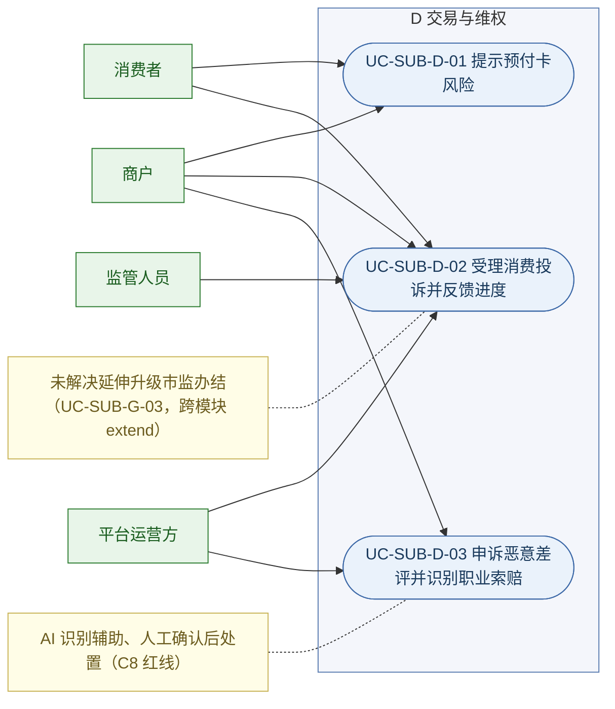

# 民生甄选 · 子系统用例图 · D 交易与维权

> 层：L3 子系统用例 · UC-SUB-D-01 ~ D-03 · 原图 `03-子系统用例图/D-交易与维权.puml`

```mermaid
flowchart LR
    %% 民生甄选 · 子系统用例图 · D 交易与维权（UC-SUB-D-01 ~ D-03）
    classDef actor fill:#E8F5E9,stroke:#2E7D32,color:#1B5E20;
    classDef uc fill:#EAF2FB,stroke:#3E6AA8,color:#1A3A5C;
    classDef note fill:#FFFDE7,stroke:#C9B458,color:#6B5B1E;

    CONSUMER["消费者"]:::actor
    MERCHANT["商户"]:::actor
    REGU["监管人员"]:::actor
    OPER["平台运营方"]:::actor

    subgraph SUB["D 交易与维权"]
        D01(["UC-SUB-D-01 提示预付卡风险"]):::uc
        D02(["UC-SUB-D-02 受理消费投诉并反馈进度"]):::uc
        D03(["UC-SUB-D-03 申诉恶意差评并识别职业索赔"]):::uc
    end

    CONSUMER --> D01
    CONSUMER --> D02
    MERCHANT --> D01
    MERCHANT --> D02
    MERCHANT --> D03
    REGU --> D02
    OPER --> D02
    OPER --> D03

    NOTE1["未解决延伸升级市监办结（UC-SUB-G-03，跨模块 extend）"]:::note
    NOTE1 -.- D02
    NOTE2["AI 识别辅助、人工确认后处置（C8 红线）"]:::note
    NOTE2 -.- D03

    style SUB fill:#F4F6FB,stroke:#5B7DB1
```
