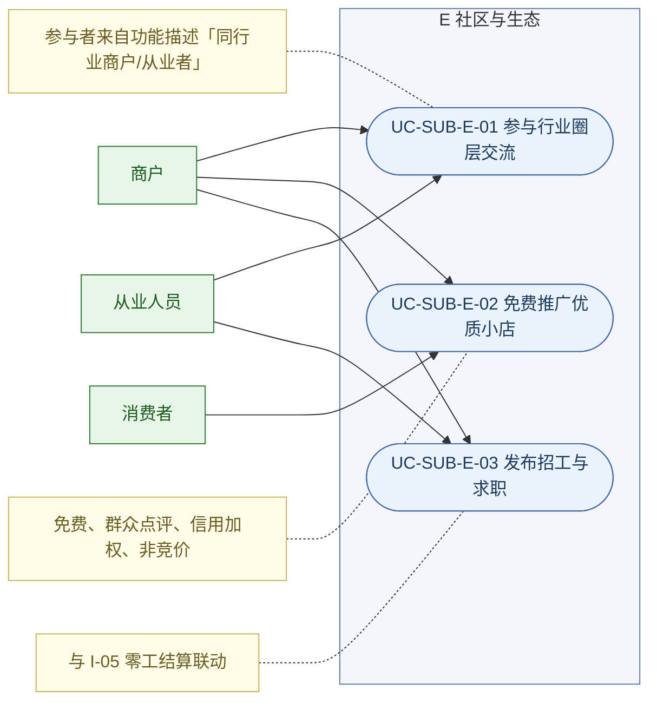

# 民生甄选 · 子系统用例图 · E 社区与生态

> 层：L3 子系统用例 · UC-SUB-E-01 ~ E-03 · 原图 `03-子系统用例图/E-社区与生态.puml`

```mermaid
flowchart LR
    %% 民生甄选 · 子系统用例图 · E 社区与生态（UC-SUB-E-01 ~ E-03）
    classDef actor fill:#E8F5E9,stroke:#2E7D32,color:#1B5E20;
    classDef uc fill:#EAF2FB,stroke:#3E6AA8,color:#1A3A5C;
    classDef note fill:#FFFDE7,stroke:#C9B458,color:#6B5B1E;

    MERCHANT["商户"]:::actor
    WORKER["从业人员"]:::actor
    CONSUMER["消费者"]:::actor

    subgraph SUB["E 社区与生态"]
        E01(["UC-SUB-E-01 参与行业圈层交流"]):::uc
        E02(["UC-SUB-E-02 免费推广优质小店"]):::uc
        E03(["UC-SUB-E-03 发布招工与求职"]):::uc
    end

    MERCHANT --> E01
    MERCHANT --> E02
    MERCHANT --> E03
    WORKER --> E01
    WORKER --> E03
    CONSUMER --> E02

    NOTE1["参与者来自功能描述「同行业商户/从业者」"]:::note
    NOTE1 -.- E01
    NOTE2["免费、群众点评、信用加权、非竞价"]:::note
    NOTE2 -.- E02
    NOTE3["与 I-05 零工结算联动"]:::note
    NOTE3 -.- E03

    style SUB fill:#F4F6FB,stroke:#5B7DB1
```
