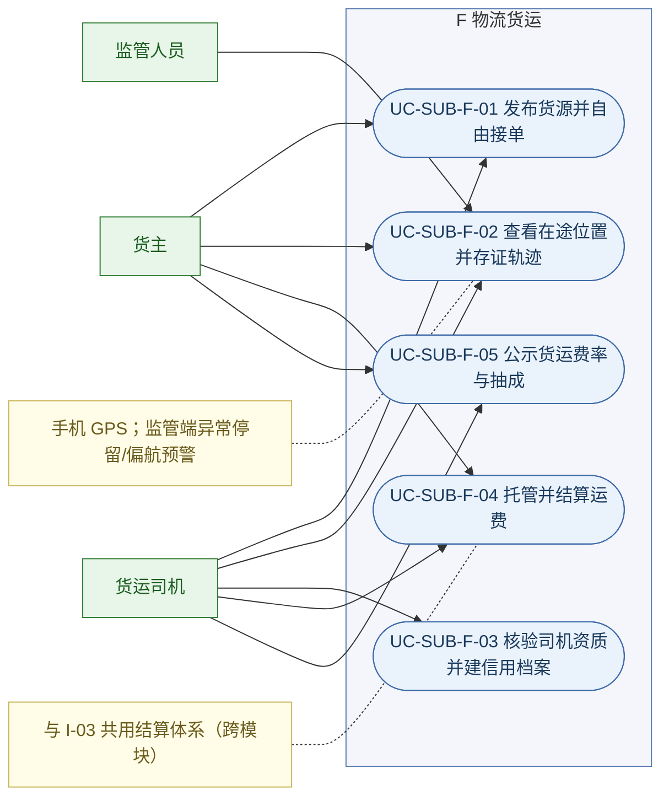

# 民生甄选 · 子系统用例图 · F 物流货运

> 层：L3 子系统用例 · UC-SUB-F-01 ~ F-05 · 原图 `03-子系统用例图/F-物流货运.puml`

```mermaid
flowchart LR
    %% 民生甄选 · 子系统用例图 · F 物流货运（UC-SUB-F-01 ~ F-05）
    classDef actor fill:#E8F5E9,stroke:#2E7D32,color:#1B5E20;
    classDef uc fill:#EAF2FB,stroke:#3E6AA8,color:#1A3A5C;
    classDef note fill:#FFFDE7,stroke:#C9B458,color:#6B5B1E;

    SHIPPER["货主"]:::actor
    DRIVER["货运司机"]:::actor
    REGU["监管人员"]:::actor

    subgraph SUB["F 物流货运"]
        F01(["UC-SUB-F-01 发布货源并自由接单"]):::uc
        F02(["UC-SUB-F-02 查看在途位置并存证轨迹"]):::uc
        F03(["UC-SUB-F-03 核验司机资质并建信用档案"]):::uc
        F04(["UC-SUB-F-04 托管并结算运费"]):::uc
        F05(["UC-SUB-F-05 公示货运费率与抽成"]):::uc
    end

    SHIPPER --> F01
    SHIPPER --> F02
    SHIPPER --> F04
    SHIPPER --> F05
    DRIVER --> F01
    DRIVER --> F02
    DRIVER --> F03
    DRIVER --> F04
    DRIVER --> F05
    REGU --> F02

    NOTE1["手机 GPS；监管端异常停留/偏航预警"]:::note
    NOTE1 -.- F02
    NOTE2["与 I-03 共用结算体系（跨模块）"]:::note
    NOTE2 -.- F04

    style SUB fill:#F4F6FB,stroke:#5B7DB1
```
