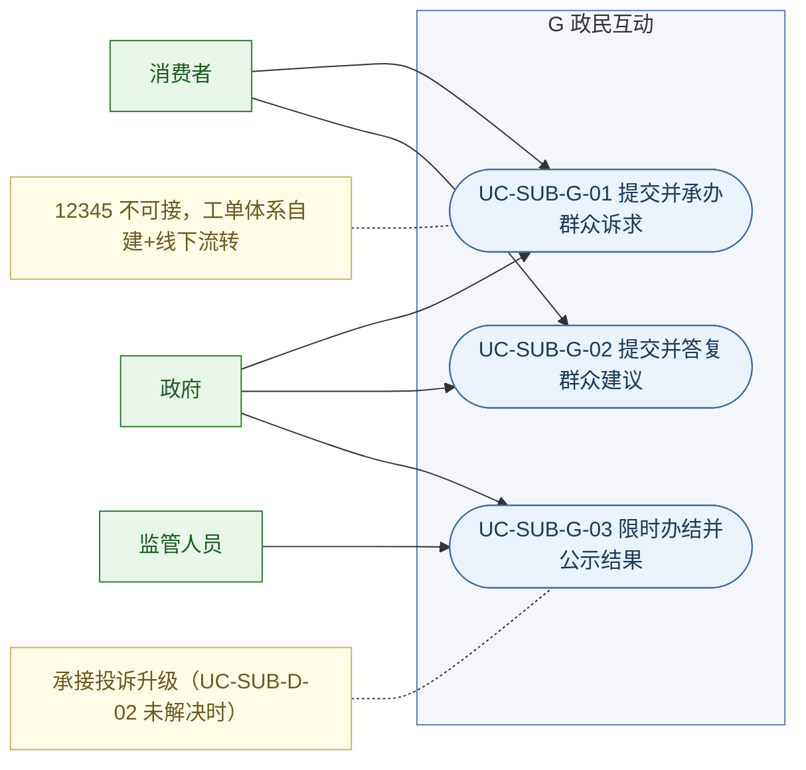

# 民生甄选 · 子系统用例图 · G 政民互动

> 层：L3 子系统用例 · UC-SUB-G-01 ~ G-03 · 原图 `03-子系统用例图/G-政民互动.puml`

```mermaid
flowchart LR
    %% 民生甄选 · 子系统用例图 · G 政民互动（UC-SUB-G-01 ~ G-03）
    classDef actor fill:#E8F5E9,stroke:#2E7D32,color:#1B5E20;
    classDef uc fill:#EAF2FB,stroke:#3E6AA8,color:#1A3A5C;
    classDef note fill:#FFFDE7,stroke:#C9B458,color:#6B5B1E;

    CONSUMER["消费者"]:::actor
    GOV["政府"]:::actor
    REGU["监管人员"]:::actor

    subgraph SUB["G 政民互动"]
        G01(["UC-SUB-G-01 提交并承办群众诉求"]):::uc
        G02(["UC-SUB-G-02 提交并答复群众建议"]):::uc
        G03(["UC-SUB-G-03 限时办结并公示结果"]):::uc
    end

    CONSUMER --> G01
    CONSUMER --> G02
    GOV --> G01
    GOV --> G02
    GOV --> G03
    REGU --> G03

    NOTE1["12345 不可接，工单体系自建+线下流转"]:::note
    NOTE1 -.- G01
    NOTE2["承接投诉升级（UC-SUB-D-02 未解决时）"]:::note
    NOTE2 -.- G03

    style SUB fill:#F4F6FB,stroke:#5B7DB1
```
