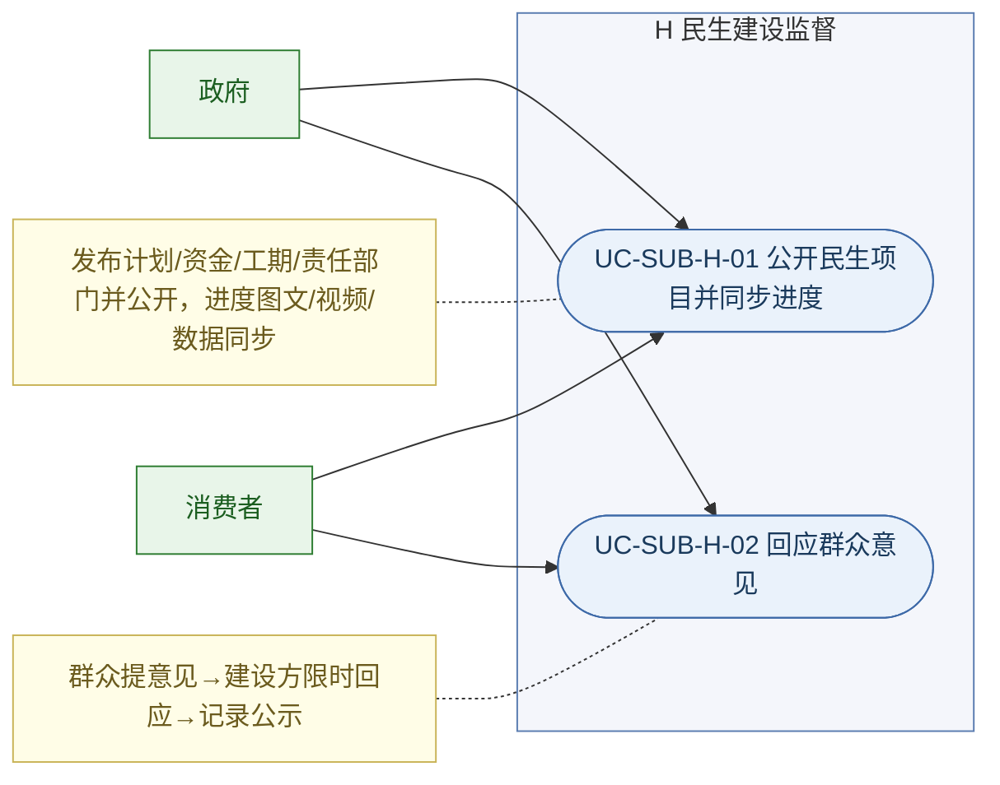

# 民生甄选 · 子系统用例图 · H 民生建设监督

> 层：L3 子系统用例 · UC-SUB-H-01 ~ H-02 · 原图 `03-子系统用例图/H-民生建设监督.puml`

```mermaid
flowchart LR
    %% 民生甄选 · 子系统用例图 · H 民生建设监督（UC-SUB-H-01 ~ H-02）
    classDef actor fill:#E8F5E9,stroke:#2E7D32,color:#1B5E20;
    classDef uc fill:#EAF2FB,stroke:#3E6AA8,color:#1A3A5C;
    classDef note fill:#FFFDE7,stroke:#C9B458,color:#6B5B1E;

    GOV["政府"]:::actor
    CONSUMER["消费者"]:::actor

    subgraph SUB["H 民生建设监督"]
        H01(["UC-SUB-H-01 公开民生项目并同步进度"]):::uc
        H02(["UC-SUB-H-02 回应群众意见"]):::uc
    end

    GOV --> H01
    GOV --> H02
    CONSUMER --> H01
    CONSUMER --> H02

    NOTE1["发布计划/资金/工期/责任部门并公开，进度图文/视频/数据同步"]:::note
    NOTE1 -.- H01
    NOTE2["群众提意见→建设方限时回应→记录公示"]:::note
    NOTE2 -.- H02

    style SUB fill:#F4F6FB,stroke:#5B7DB1
```
