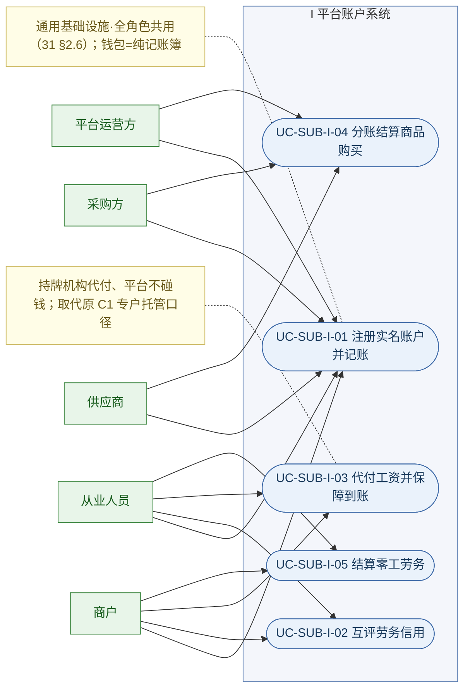

# 民生甄选 · 子系统用例图 · I 平台账户系统

> 层：L3 子系统用例 · UC-SUB-I-01 ~ I-05 · 原图 `03-子系统用例图/I-平台账户系统.puml`

```mermaid
flowchart LR
    %% 民生甄选 · 子系统用例图 · I 平台账户系统（UC-SUB-I-01 ~ I-05）
    classDef actor fill:#E8F5E9,stroke:#2E7D32,color:#1B5E20;
    classDef uc fill:#EAF2FB,stroke:#3E6AA8,color:#1A3A5C;
    classDef note fill:#FFFDE7,stroke:#C9B458,color:#6B5B1E;

    MERCHANT["商户"]:::actor
    WORKER["从业人员"]:::actor
    SUPPLIER["供应商"]:::actor
    BUYER["采购方"]:::actor
    OPER["平台运营方"]:::actor

    subgraph SUB["I 平台账户系统"]
        I01(["UC-SUB-I-01 注册实名账户并记账"]):::uc
        I02(["UC-SUB-I-02 互评劳务信用"]):::uc
        I03(["UC-SUB-I-03 代付工资并保障到账"]):::uc
        I04(["UC-SUB-I-04 分账结算商品购买"]):::uc
        I05(["UC-SUB-I-05 结算零工劳务"]):::uc
    end

    MERCHANT --> I01
    MERCHANT --> I02
    MERCHANT --> I03
    MERCHANT --> I05
    WORKER --> I01
    WORKER --> I02
    WORKER --> I03
    WORKER --> I05
    SUPPLIER --> I01
    SUPPLIER --> I04
    BUYER --> I01
    BUYER --> I04
    OPER --> I01
    OPER --> I04

    NOTE1["通用基础设施·全角色共用（31 §2.6）；钱包=纯记账簿"]:::note
    NOTE1 -.- I01
    NOTE2["持牌机构代付、平台不碰钱；取代原 C1 专户托管口径"]:::note
    NOTE2 -.- I03

    style SUB fill:#F4F6FB,stroke:#5B7DB1
```
