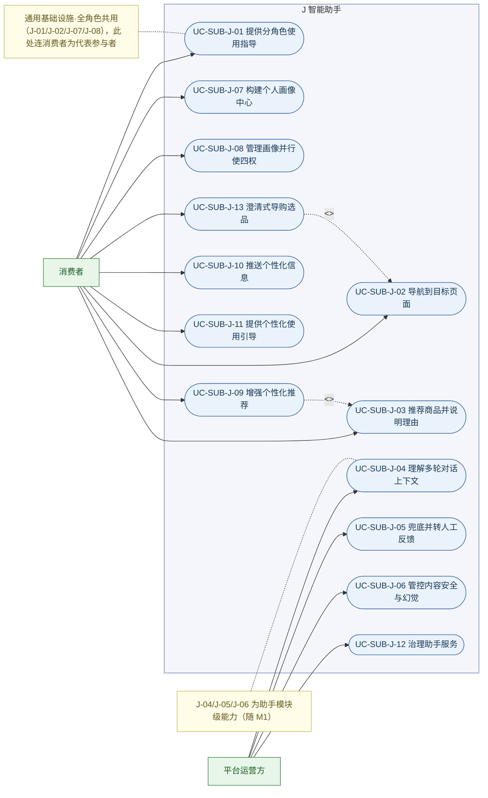

# 民生甄选 · 子系统用例图 · J 智能助手

> 层：L3 子系统用例 · UC-SUB-J-01 ~ J-13 · 原图 `03-子系统用例图/J-智能助手.puml`

```mermaid
flowchart LR
    %% 民生甄选 · 子系统用例图 · J 智能助手（UC-SUB-J-01 ~ J-13）
    classDef actor fill:#E8F5E9,stroke:#2E7D32,color:#1B5E20;
    classDef uc fill:#EAF2FB,stroke:#3E6AA8,color:#1A3A5C;
    classDef note fill:#FFFDE7,stroke:#C9B458,color:#6B5B1E;

    CONSUMER["消费者"]:::actor
    OPER["平台运营方"]:::actor

    subgraph SUB["J 智能助手"]
        J01(["UC-SUB-J-01 提供分角色使用指导"]):::uc
        J02(["UC-SUB-J-02 导航到目标页面"]):::uc
        J03(["UC-SUB-J-03 推荐商品并说明理由"]):::uc
        J04(["UC-SUB-J-04 理解多轮对话上下文"]):::uc
        J05(["UC-SUB-J-05 兜底并转人工反馈"]):::uc
        J06(["UC-SUB-J-06 管控内容安全与幻觉"]):::uc
        J07(["UC-SUB-J-07 构建个人画像中心"]):::uc
        J08(["UC-SUB-J-08 管理画像并行使四权"]):::uc
        J09(["UC-SUB-J-09 增强个性化推荐"]):::uc
        J10(["UC-SUB-J-10 推送个性化信息"]):::uc
        J11(["UC-SUB-J-11 提供个性化使用引导"]):::uc
        J12(["UC-SUB-J-12 治理助手服务"]):::uc
        J13(["UC-SUB-J-13 澄清式导购选品"]):::uc
    end

    CONSUMER --> J01
    CONSUMER --> J02
    CONSUMER --> J03
    CONSUMER --> J07
    CONSUMER --> J08
    CONSUMER --> J09
    CONSUMER --> J10
    CONSUMER --> J11
    CONSUMER --> J13
    OPER --> J04
    OPER --> J05
    OPER --> J06
    OPER --> J12

    J09 -.->|<<include>>| J03
    J13 -.->|<<include>>| J02
    NOTE1["通用基础设施·全角色共用（J-01/J-02/J-07/J-08），此处连消费者为代表参与者"]:::note
    NOTE1 -.- J01
    NOTE2["J-04/J-05/J-06 为助手模块级能力（随 M1）"]:::note
    NOTE2 -.- J04

    style SUB fill:#F4F6FB,stroke:#5B7DB1
```
