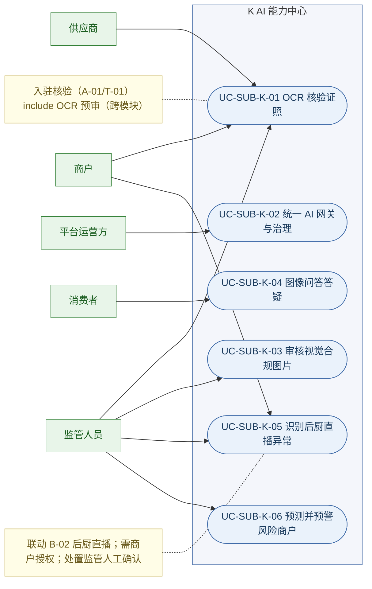

# 民生甄选 · 子系统用例图 · K AI 能力中心

> 层：L3 子系统用例 · UC-SUB-K-01 ~ K-06 · 原图 `03-子系统用例图/K-AI能力中心.puml`

```mermaid
flowchart LR
    %% 民生甄选 · 子系统用例图 · K AI 能力中心（UC-SUB-K-01 ~ K-06）
    classDef actor fill:#E8F5E9,stroke:#2E7D32,color:#1B5E20;
    classDef uc fill:#EAF2FB,stroke:#3E6AA8,color:#1A3A5C;
    classDef note fill:#FFFDE7,stroke:#C9B458,color:#6B5B1E;

    MERCHANT["商户"]:::actor
    SUPPLIER["供应商"]:::actor
    REGU["监管人员"]:::actor
    CONSUMER["消费者"]:::actor
    OPER["平台运营方"]:::actor

    subgraph SUB["K AI 能力中心"]
        K01(["UC-SUB-K-01 OCR 核验证照"]):::uc
        K02(["UC-SUB-K-02 统一 AI 网关与治理"]):::uc
        K03(["UC-SUB-K-03 审核视觉合规图片"]):::uc
        K04(["UC-SUB-K-04 图像问答答疑"]):::uc
        K05(["UC-SUB-K-05 识别后厨直播异常"]):::uc
        K06(["UC-SUB-K-06 预测并预警风险商户"]):::uc
    end

    MERCHANT --> K01
    MERCHANT --> K05
    SUPPLIER --> K01
    REGU --> K01
    REGU --> K03
    REGU --> K05
    REGU --> K06
    CONSUMER --> K04
    OPER --> K02

    NOTE1["入驻核验（A-01/T-01）include OCR 预审（跨模块）"]:::note
    NOTE1 -.- K01
    NOTE2["联动 B-02 后厨直播；需商户授权；处置监管人工确认"]:::note
    NOTE2 -.- K05

    style SUB fill:#F4F6FB,stroke:#5B7DB1
```
