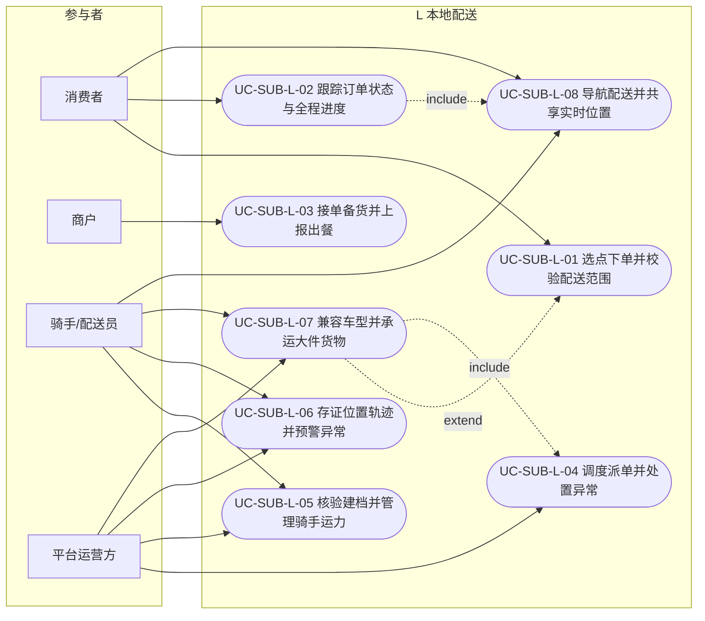

# L 本地配送 · 子系统用例图（Mermaid）

> 与 `../03-子系统用例图/L-本地配送.puml` 同源；规约见 `L-本地配送-规约.md`。

> 说明：L-07 车型兼容——E_BIKE 电动车（常规小件）/ CAR 汽车（大件货物），派单/接单按车型匹配；L-08 骑手端双导航（导航到商铺/导航到配送地点，按车型唤起地图开放平台）+ 位置心跳 → 买家配送中可见、送达即切断（R-03 授权可见级）。
