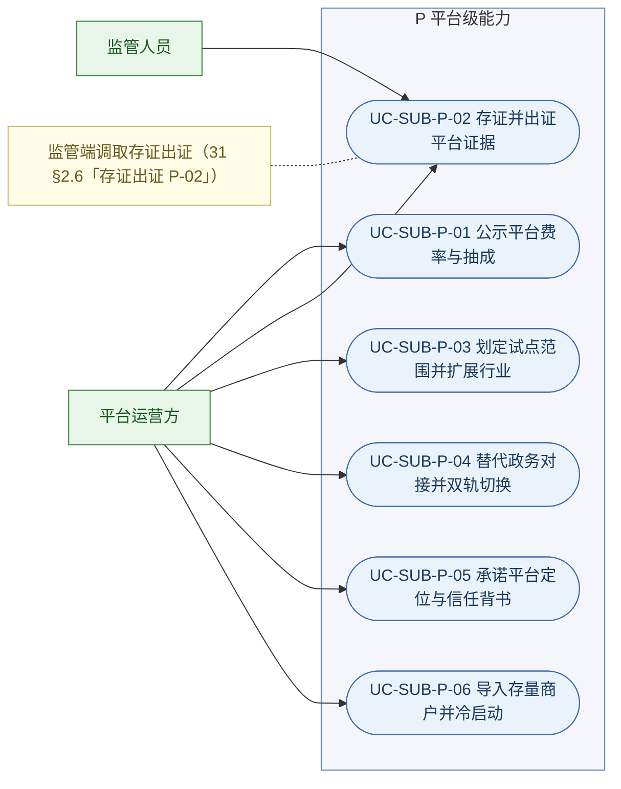

# 民生甄选 · 子系统用例图 · P 平台级能力

> 层：L3 子系统用例 · UC-SUB-P-01 ~ P-06 · 原图 `03-子系统用例图/P-平台级能力.puml`

```mermaid
flowchart LR
    %% 民生甄选 · 子系统用例图 · P 平台级能力（UC-SUB-P-01 ~ P-06）
    classDef actor fill:#E8F5E9,stroke:#2E7D32,color:#1B5E20;
    classDef uc fill:#EAF2FB,stroke:#3E6AA8,color:#1A3A5C;
    classDef note fill:#FFFDE7,stroke:#C9B458,color:#6B5B1E;

    OPER["平台运营方"]:::actor
    REGU["监管人员"]:::actor

    subgraph SUB["P 平台级能力"]
        P01(["UC-SUB-P-01 公示平台费率与抽成"]):::uc
        P02(["UC-SUB-P-02 存证并出证平台证据"]):::uc
        P03(["UC-SUB-P-03 划定试点范围并扩展行业"]):::uc
        P04(["UC-SUB-P-04 替代政务对接并双轨切换"]):::uc
        P05(["UC-SUB-P-05 承诺平台定位与信任背书"]):::uc
        P06(["UC-SUB-P-06 导入存量商户并冷启动"]):::uc
    end

    OPER --> P01
    OPER --> P02
    OPER --> P03
    OPER --> P04
    OPER --> P05
    OPER --> P06
    REGU --> P02

    NOTE1["监管端调取存证出证（31 §2.6「存证出证 P-02」）"]:::note
    NOTE1 -.- P02

    style SUB fill:#F4F6FB,stroke:#5B7DB1
```
