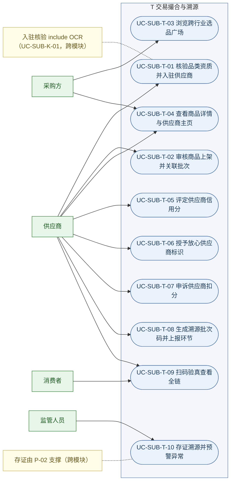

# 民生甄选 · 子系统用例图 · T 交易撮合与溯源

> 层：L3 子系统用例 · UC-SUB-T-01 ~ T-10 · 原图 `03-子系统用例图/T-交易撮合与溯源.puml`

```mermaid
flowchart LR
    %% 民生甄选 · 子系统用例图 · T 交易撮合与溯源（UC-SUB-T-01 ~ T-10）
    classDef actor fill:#E8F5E9,stroke:#2E7D32,color:#1B5E20;
    classDef uc fill:#EAF2FB,stroke:#3E6AA8,color:#1A3A5C;
    classDef note fill:#FFFDE7,stroke:#C9B458,color:#6B5B1E;

    SUPPLIER["供应商"]:::actor
    BUYER["采购方"]:::actor
    CONSUMER["消费者"]:::actor
    REGU["监管人员"]:::actor

    subgraph SUB["T 交易撮合与溯源"]
        T01(["UC-SUB-T-01 核验品类资质并入驻供应商"]):::uc
        T02(["UC-SUB-T-02 审核商品上架并关联批次"]):::uc
        T03(["UC-SUB-T-03 浏览跨行业选品广场"]):::uc
        T04(["UC-SUB-T-04 查看商品详情与供应商主页"]):::uc
        T05(["UC-SUB-T-05 评定供应商信用分"]):::uc
        T06(["UC-SUB-T-06 授予放心供应商标识"]):::uc
        T07(["UC-SUB-T-07 申诉供应商扣分"]):::uc
        T08(["UC-SUB-T-08 生成溯源批次码并上报环节"]):::uc
        T09(["UC-SUB-T-09 扫码验真查看全链"]):::uc
        T10(["UC-SUB-T-10 存证溯源并预警异常"]):::uc
    end

    SUPPLIER --> T01
    SUPPLIER --> T02
    SUPPLIER --> T04
    SUPPLIER --> T05
    SUPPLIER --> T06
    SUPPLIER --> T07
    SUPPLIER --> T08
    SUPPLIER --> T09
    BUYER --> T03
    BUYER --> T04
    CONSUMER --> T09
    REGU --> T10

    NOTE1["入驻核验 include OCR（UC-SUB-K-01，跨模块）"]:::note
    NOTE1 -.- T01
    NOTE2["存证由 P-02 支撑（跨模块）"]:::note
    NOTE2 -.- T10

    style SUB fill:#F4F6FB,stroke:#5B7DB1
```
