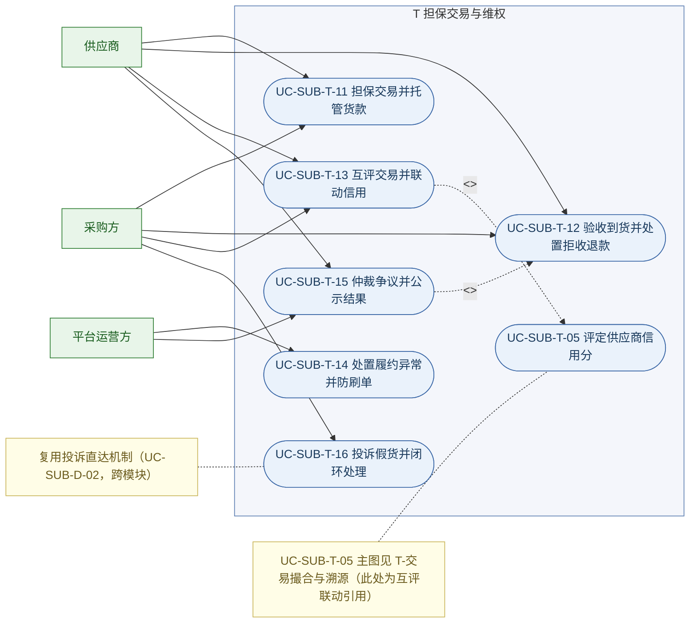

# 民生甄选 · 子系统用例图 · T 担保交易与维权

> 层：L3 子系统用例 · UC-SUB-T-11 ~ T-16（引用 T-05）· 原图 `03-子系统用例图/T-担保交易与维权.puml`

```mermaid
flowchart LR
    %% 民生甄选 · 子系统用例图 · T 担保交易与维权（UC-SUB-T-11 ~ T-16，引用 T-05）
    classDef actor fill:#E8F5E9,stroke:#2E7D32,color:#1B5E20;
    classDef uc fill:#EAF2FB,stroke:#3E6AA8,color:#1A3A5C;
    classDef note fill:#FFFDE7,stroke:#C9B458,color:#6B5B1E;

    SUPPLIER["供应商"]:::actor
    BUYER["采购方"]:::actor
    OPER["平台运营方"]:::actor

    subgraph SUB["T 担保交易与维权"]
        T11(["UC-SUB-T-11 担保交易并托管货款"]):::uc
        T12(["UC-SUB-T-12 验收到货并处置拒收退款"]):::uc
        T13(["UC-SUB-T-13 互评交易并联动信用"]):::uc
        T14(["UC-SUB-T-14 处置履约异常并防刷单"]):::uc
        T15(["UC-SUB-T-15 仲裁争议并公示结果"]):::uc
        T16(["UC-SUB-T-16 投诉假货并闭环处理"]):::uc
        T05(["UC-SUB-T-05 评定供应商信用分"]):::uc
    end

    SUPPLIER --> T11
    SUPPLIER --> T12
    SUPPLIER --> T13
    SUPPLIER --> T15
    BUYER --> T11
    BUYER --> T12
    BUYER --> T13
    BUYER --> T16
    OPER --> T14
    OPER --> T15

    T13 -.->|<<include>>| T05
    T15 -.->|<<extend>>| T12
    NOTE1["UC-SUB-T-05 主图见 T-交易撮合与溯源（此处为互评联动引用）"]:::note
    NOTE1 -.- T05
    NOTE2["复用投诉直达机制（UC-SUB-D-02，跨模块）"]:::note
    NOTE2 -.- T16

    style SUB fill:#F4F6FB,stroke:#5B7DB1
```
