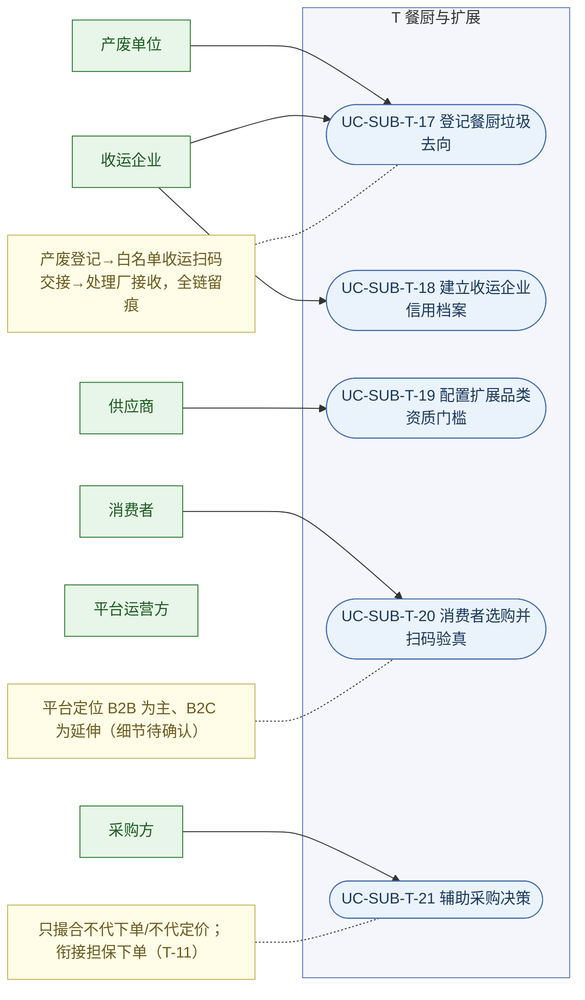

# 民生甄选 · 子系统用例图 · T 餐厨与扩展

> 层：L3 子系统用例 · UC-SUB-T-17 ~ T-21 · 原图 `03-子系统用例图/T-餐厨与扩展.puml`

```mermaid
flowchart LR
    %% 民生甄选 · 子系统用例图 · T 餐厨与扩展（UC-SUB-T-17 ~ T-21）
    classDef actor fill:#E8F5E9,stroke:#2E7D32,color:#1B5E20;
    classDef uc fill:#EAF2FB,stroke:#3E6AA8,color:#1A3A5C;
    classDef note fill:#FFFDE7,stroke:#C9B458,color:#6B5B1E;

    WASTEUNIT["产废单位"]:::actor
    COLLECTOR["收运企业"]:::actor
    SUPPLIER["供应商"]:::actor
    BUYER["采购方"]:::actor
    CONSUMER["消费者"]:::actor
    OPER["平台运营方"]:::actor

    subgraph SUB["T 餐厨与扩展"]
        T17(["UC-SUB-T-17 登记餐厨垃圾去向"]):::uc
        T18(["UC-SUB-T-18 建立收运企业信用档案"]):::uc
        T19(["UC-SUB-T-19 配置扩展品类资质门槛"]):::uc
        T20(["UC-SUB-T-20 消费者选购并扫码验真"]):::uc
        T21(["UC-SUB-T-21 辅助采购决策"]):::uc
    end

    WASTEUNIT --> T17
    COLLECTOR --> T17
    COLLECTOR --> T18
    SUPPLIER --> T19
    CONSUMER --> T20
    BUYER --> T21

    NOTE1["产废登记→白名单收运扫码交接→处理厂接收，全链留痕"]:::note
    NOTE1 -.- T17
    NOTE2["平台定位 B2B 为主、B2C 为延伸（细节待确认）"]:::note
    NOTE2 -.- T20
    NOTE3["只撮合不代下单/不代定价；衔接担保下单（T-11）"]:::note
    NOTE3 -.- T21

    style SUB fill:#F4F6FB,stroke:#5B7DB1
```
