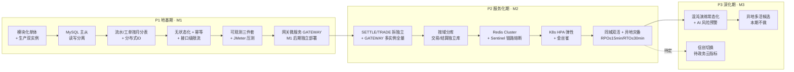

# 高并发架构演进设计（详设）

> 版本：v1.0（基线）· 2026-09-11 · 状态：✅ 评审通过定档
> 定位：本文档是《产品设计文档（概要设计）》**§8 非功能设计**的**详设补充**，不重复 §8 已写的概述（量化基线、逐链路瓶颈表、可用性/可扩展性总纲），专注补齐 §8 里标注【待评审 / 建议初值】的**执行级细节**，并产出一张**把零散演进点串起来的路线图**。
> 口径：市级生产级（覆盖 ≥840 万），对齐《非功能需求-信息安全与可靠性专项》v1.0 §5 与 AC-NFR 系列。
> 变更 v0.2（2026-09-10）：§2.3 新增「时钟回拨三档预案 + 统一 ID 组件契约」——L1 退避等待 → L2 自动切号段兜底（DB 自增不依赖时钟）→ L3 拒绝发号；Prometheus 指标 + Alertmanager 分级告警；`infra-idgen` 组件全写库微服务 MUST 复用。
> 变更 v0.3（2026-09-10）：服务自有库原则落地（方案 A）——AICORE 独立库 `aicore`（M1 起，存 AI 任务/审核数据，§2.2/ADR-7），权威数据事件同步单一来源；§3.1 增 `aicore.conclusion` 回写队列；§8 增 TBD-11。
> 变更 v0.4（2026-09-10）：新增 §7「API 网关详设」（M1 内嵌 Filter+Nginx → M2 Spring Cloud Gateway 演进；职责边界/路由/鉴权链/限流/灰度/超时/高可用）；原 §7 ADR/§8 待评审/§9 验收顺延为 §8/§9/§10；§9 增 TBD-12。
> 变更 v0.5（2026-09-11）：**网关层拆分为独立微服务 GATEWAY（方案 B）**——独立部署时点由 M2 提前到 **M1 后期**（M1 初期内嵌 Filter + Nginx 过渡、独立部署后 Filter 降级为故障兜底）；§1.2/§1.3/§1.4 路线图同步、§4.1 网关级限流行改口径、§7 详设改口径、新增 ADR-8、§10 验收「网关就绪」改 M1 后期；服务基线见 `services/gateway/docs/README.md`、PDD §5.16。
> 变更 v0.6（2026-09-11）：**骑手端与实时位置共享（L-07/L-08，PDD v1.15）**——§3.1 队列拓扑增 `delivery.track`（骑手位置心跳 → 轨迹异步入存证链）；§9 增 TBD-13（位置心跳/实时查看容量初值）；骑手位置心跳走 HTTP + Redis（短 TTL），买家实时查看走 SSE + 短轮询兜底，容量口径见 §3.4。
> 变更 v1.0（2026-09-11）：**评审通过定档（基线）**——§9 TBD-1~13 与 §4.4 阈值初值全部评审通过（带 ★ 项压测/试运行标定）；§5.3 扩容阈值接受；§6 优化点 10 项优先级划分接受；裁决清单见 `docs/待评审事项汇总.md` 定档记录。
> 阅读顺序：先读 §1 路线图建立全局观，再按需读 §2~§5 各层详设，最后读 §6 差距与优化、§7 API 网关详设、§9 待评审项。

---

## 1. 演进路线图（总览）

### 1.1 演进总原则

1. **先单体后拆分**：M1 以「模块化单体 + 生产双实例」起步，M2 才把 SETTLE/TRADE 拆独立部署；但 **M1 就用硬边界约束代码**，让 M2 拆分是「切部署单元」而非「重构」。
2. **先读写分离后分片**：MySQL 主从读写分离（M1）→ 按月分表（M1 起，流水/工单/交易）→ 按域分库（M2）。
3. **容量触发式演进**：每阶段有明确的容量触发阈值，达到才升级，避免一次性超配（对齐专项 §10「840 万容量设计过度/不足」风险）。
4. **高并发地基 M1 全就位**：分表、分布式 ID、无状态化、幂等、限流、可观测这些「拆不动、补不起」的地基，**M1 启动即做**，不因试点流量小而后置。

### 1.2 阶段总览表

| 阶段 | 里程碑 | 架构形态 | 容量目标（支撑） | 新增组件/机制 | 触发条件（升级信号） |
|---|---|---|---|---|---|
| **P1 地基期** | M1（第 3~6 月） | 模块化单体 + 生产双实例 + MySQL 主从 + Redis 哨兵 + RabbitMQ + OSS + **网关微服务 GATEWAY（M1 后期独立部署）** | 试点峰值：注册 1~10 万、并发在线 ≤1 万、读 ≤5 千 QPS、写 ≤1 千 TPS；**压测分层验证规划峰值的 1.5x** | 流水/工单按月分表、分布式 ID、无状态化、幂等键、接口级 Redis+Lua 限流、Sentinel 接入、SkyWalking traceId+探针、Loki/Prometheus 可观测、JMeter、Nginx 灰度分流、GATEWAY 独立部署（M1 后期） | 注册用户突破 10 万 / 并发在线逼近 1 万 / 单表行数逼近分片阈值 |
| **P2 服务化期** | M2（第 7~12 月） | SETTLE/TRADE 拆独立部署 + K8s + 分库 + 同城双活 + 异地灾备 | **市级规划峰值：并发在线 ≥10 万、读 ≥15 万 QPS、写 ≥5 万 TPS，压测 1.5~3x** | GATEWAY 多实例全量 + Nacos 热更新、Sentinel 链路级熔断全量、K8s HPA、Redis Cluster、按域分库（交易/结算独立库）、ES 检索、金丝雀发布 | 交易/结算域写吞吐成为瓶颈 / 单库 CPU>70% 持续 / 上线购买链路 |
| **P3 深化期** | M3（第 13~18 月） | 全链深化 + 异地多活候选（本期不做） | 覆盖 75% 滚动达产；突发流量（政企联动/监管集中检查）韧性 | 混沌演练常态化、AI 风险预警、信创切换（待政务云指标明确） | 年度等保复测 + 渗透、覆盖规模滚动 |

### 1.3 演进路线图（Mermaid）

### 1.4 每阶段落地清单

**P1 地基期（M1）**——把「高并发地基」一次性打牢：
- 代码硬边界：见 §6.1 优化点①（模块化单体的物理边界约束）。
- 数据：`wallet_flow`/`ticket` 按月分表（§2.2）；分布式 ID 雪花/号段（§2.3，含时钟回拨三档预案与 `infra-idgen` 统一组件）；读写分离；AICORE 独立库 `aicore`（Python 服务自有数据，§2.2）。
- 缓存：本地 Caffeine + Redis 两级，热点档案防击穿/穿透（§2.4）。
- 无状态：会话外置 Redis（JWT + 可吊销）、OSS 全量、定时任务分布式锁、资金接口幂等键（复用概要 §8.3.1）。
- 限流：接口级 Redis+Lua 令牌桶起步（复用概要 §7.4 对话限流同机制）；Sentinel 引入只做观察、不承载熔断。
- 可观测：traceId 规范（HTTP X-Request-Id + MQ header 透传）+ SkyWalking agent；Loki/Prometheus 接入。
- 网关：**独立微服务 GATEWAY（M1 后期独立部署，双实例）**——M1 初期由应用内嵌统一 Filter（鉴权/JWT/限流/OpenAPI 收敛）+ Nginx（HTTPS 终结/静态资源/灰度分流）过渡，独立部署后 Filter 降级为故障兜底（详设见 §7，服务基线 `services/gateway/docs/README.md`）。
- 压测：JMeter 分场景集（§5.2），**试点峰值 3x + 规划峰值 1.5x 分层验证**。

**P2 服务化期（M2）**：
- 拆分顺序：**SETTLE（写吞吐/独立伸缩最急）→ TRADE（M2 购买链路）**，与概要 §8.3.2 一致。
- 网关：GATEWAY 多实例全量 + Nacos 热更新（路由/灰度配置）。
- 分库：交易/结算独立库，其余域共享主库（§2.2）。
- 弹性：K8s + HPA（CPU/内存/QPS 指标，最小/最大实例护栏）。
- 容灾：同城双活 + 异地灾备落地 + 真实切换演练（对齐概要 §8.2.2）。

**P3 深化期（M3）**：韧性工程常态化（混沌演练）、AI 风险预警上线、异地多活列为候选（本期不做，理由见概要 §8.2.2）。

---

## 2. 数据层详设（分库分表 + 多级缓存 + 读写分离）

> 这是高并发最易崩的一层，也是返工成本最高的一层，故独立成节、优先细化。

### 2.1 分片总体策略与分片键选型

| 原则 | 决策 |
|---|---|
| **主键 ID 与分片键解耦** | 主键用**雪花 ID（全局唯一、趋势递增）**；**分片用业务键**（`account_id` / `merchant_id` / `batch_no`）或**时间（按月）**。**严禁把雪花 ID 直接当 hash 分片键**——雪花 ID 低 12 位是毫秒内自增序列，按 hash 取模会打散热点、破坏时序局部性。 |
| 分片键选择标准 | ① 查询主键（90% 查询走它）② 写入均匀（避免单分片热点）③ 与业务聚合边界一致（如流水按 `account_id`，工单按 `merchant_id`）。 |
| 时间分表 + 业务分片的组合 | 只增流水类（钱包流水/代付/交易/工单流水）**按月分表**（时间分片，天然冷热分离）；**档案/商户/人员等主数据不分区**（行数有限 + 强一致更新）。 |
| 跨分片查询约束 | **禁止跨分片 JOIN、跨分片聚合、跨分片事务**；需要跨分片的（如对账汇总）走**异步聚合 / 从库 / ES**，不进 OLTP 主库。 |
| 路由层 | M1 用 MyBatis-Plus 自定义分表插件（拦截按月路由）+ 统一 `ShardingKey` 注解；M2 分库后评估引入 **ShardingSphere-Proxy**（中间件模式，业务零改造），或先自研轻量路由（避免过早重组件）。 |

### 2.2 分表方案（按域）

| 域 / 表 | 分片方式 | 分片键 | 归档策略 | 里程碑 |
|---|---|---|---|---|
| ACC `wallet_flow` | 按月分表（已定） | `account_id` + `created_at` | >12 月热转冷 OSS，保留热表 12 个月 | M1 起 |
| SETTLE 代付流水 `payroll` | 按月分表 | `employment_id`/`account_id` | 同上 | M1 起 |
| TICKET `ticket` / `ticket_flow` | 按月分表 | `merchant_id` + `created_at` | 工单随处置闭案，>18 月归档 | M1 起 |
| TRADE `order`/`escrow`（M2） | 按月分表 + 按买家 `buyer_id` hash 二级 | `buyer_id` + `created_at` | 同钱包流水 | M2 |
| SETTLE 分账流水 `split_record`（M2，C07 已迁 ⑨ 结算域） | 按月分表 | `order_id` + `created_at` | 同钱包流水 | M2 |
| TRACE `trace_event` | 按月分表 | `batch_id` + `created_at` | 溯源存证只增不改，长期冷备 | M1 起 |
| PROFILE `behavior_event` | 按月分表（脱敏，可 ES） | `account_id` + `event_type` | 脱敏后入 ES/归档 | M1 起 |
| AICORE `ai_task` / `ocr_result` | 按月分表（已定） | `account_id` + `created_at` | 同钱包流水 | M1 起 |
| AICORE `vision_review` / `kitchen_anomaly` 等 | 暂不分片（阈值触发再分，TBD-11） | `merchant_id` + `created_at`（预留） | 归档后审计检索 | M2 起 |
| 主数据（account/merchant/person/supplier/profile） | **不分片** | — | 不归档 | 全程 |

> 分片阈值（建议初值，压测/数据增长标定）：**单表 > 2000 万行 或 > 20GB 触发再分**；按月分表天然可控，冷数据到点即归档，避免单表膨胀到亿级。
> 分库补充（2026-09-10，方案 A）：**服务自有库原则**——每个微服务持有自己的数据、独立数据库；共享权威数据只读引用 + 事件同步，权威单一来源。Python 服务不共享主站库：AICORE 自建独立库 `aicore`（M1 起），ASSIST 仍不落业务库（会话/日志 ≤30 天）；Java 侧 13 域沿用「M2 按域分库（交易/结算独立库）」既有路线（ADR-7）。

### 2.3 分布式 ID 方案

| 决策点 | 选定 | 理由 |
|---|---|---|
| 方案 | **雪花 ID（Snowflake）+ 号段（Leaf-segment）双轨** | 雪花：流水/工单/交易全局唯一、趋势递增、含时间戳便于按月分表路由；号段：需要「连续、可读」的场景（如工单编号 `TKT-YYYYMMDD-XXXX`）用号段表 `id_allocator`。 |
| 部署形态 | M1 单体期**应用内嵌雪花生成器**（workerId 从配置/Redis 分配，防双实例冲突）；M2 拆服务后收敛为 **ID 服务（号段批量取号 + 雪花）** | 避免跨机房 DB 自增冲突（对齐概要 §8.2.2 灾备前置条件）。 |
| workerId 分配 | 从 Redis `INCR` 分配 + 实例重启复用（租约），防 workerId 撞车导致 ID 重复 | 双实例 + 未来多活的前置正确性。 |
| 时钟回拨 | **三档分级预案**：L1 轻微回拨（≤W）退避等待 → L2 超预算/大幅回拨**自动切号段模式兜底**（`id_allocator` 表 DB 自增，不依赖时钟）→ L3 号段不可用**拒绝发号**；全档 Prometheus 指标 + Alertmanager 分级告警（§2.3.1~§2.3.4） | 资金流水 ID 唯一性红线；号段兜底让回拨期间「唯一性不断供、发号不中断」。 |

#### 2.3.1 时钟回拨三档应对预案（备选方案）

> 目标：时钟回拨期间**ID 唯一性红线不破、发号服务不中断、问题可发现并告警**。所有写库微服务经统一组件 `infra-idgen` 获得该能力（§2.3.2），**禁止各服务自研雪花实现**。

**检测机制**：① 每次发号与 `lastTimestamp` 比较，当前时间 < 上次发号时间即判定回拨，记录回拨幅度；② NTP 侧独立监控服务器时钟偏移（§2.3.4），事前预警。

| 档位 | 触发条件（建议初值） | 行为（备选方案） | 业务影响与兜底 | 恢复 |
|---|---|---|---|---|
| **L1 轻微回拨** | 回拨幅度 ≤ 容忍窗口 W（默认 5s） | **退避等待**：自旋/短暂 sleep 等时钟追平后继续发号，等待预算 ≤ W | 发号时延瞬时增加，业务无失败 | 时钟追平即自动恢复 |
| **L2 中度回拨** | 回拨 > W，或等待超预算仍不回正 | **自动切换号段模式兜底**：按 `biz_tag` 从 `id_allocator` 表批量取号（DB 自增号段，不依赖本地时钟），雪花模式挂起 | 号段 ID 不含时间戳；**分表路由一律以业务字段 `created_at` 为准，禁止依赖 ID 内嵌时间戳**（防御性设计，本已强制），业务无感 | NTP 修复且回拨恢复探测通过后**自动切回雪花** |
| **L3 严重故障** | 号段取号连续失败 / `id_allocator` 不可用 | **拒绝发号 + 快速失败**（fail-fast）：写库请求立即报错，资金链路暂停并公告 | 读链路不受影响；写请求以幂等键 + 状态机兜底（§3.2），恢复后重试不重复 | 号段恢复后自动恢复发号 |

**配套要点**：
- **不重不跳**：L2 切换与 L3 拒绝期间，未发出的号不补发、不回绕；号段轨与雪花轨按 `biz_tag` 隔离取号区间，双轨并存不冲突（号段轨本身不含时间戳，无回拨概念）。
- **重试安全**：发号失败/拒绝时业务请求携带 `Idempotency-Key`（资金链路强制，§3.2），恢复后重试幂等。
- **演练**：混沌演练增「时钟回拨演练」场景（M1 压测期手工演练一次，P3 常态化）。

#### 2.3.2 统一 ID 组件契约（每微服务复用）

> 复用原则：**一份实现、全服务共用**——各写库微服务不得自研雪花/号段逻辑（对齐 §6 优化点① 硬边界红线）。

| 项 | 契约 |
|---|---|
| 组件 | `infra-idgen`（M1 模块化单体共享模块；M2 ID 服务复用同一内核 + 远程取号协议，业务侧接口不变） |
| 适用范围 | 全部写库 Java 域：ACC / SETTLE / TRADE / TRACE / TICKET / PROFILE / CRED / EMP / PROD / DASH / CIVIC / DELIVERY |
| 边界 | ASSIST / AICORE（Python）不直连主库写、不参与雪花域；其任务 ID 用 UUID 或由 Java 侧 `infra-idgen` 下发 |
| 接口 | `IdGenerator.nextId()`（雪花，自动降级）/ `nextId(bizTag)`（号段）/ `getMode()`（观测当前轨） |
| workerId | Redis `INCR` 分配 + 租约续期（保留 §2.3 基线），撞车 → 拒绝发号 + P0 告警 |
| 配置（Nacos 统一命名，可热更新） | `idgen.rollback-tolerance-ms`=5000、`idgen.wait-budget-ms`、`idgen.segment.fallback-enabled`=true、`idgen.segment.step`=1000、`idgen.reject-on-double-failure`=true、`idgen.worker-id` |
| 指标 | 统一前缀 `idgen_`（§2.3.3），组件内置埋点，禁止各服务自定义命名 |

#### 2.3.3 监控与告警（提醒）

> 载体：Prometheus + Alertmanager（对齐 §1.2 可观测选型），指标由 `infra-idgen` 内置埋点输出。

| 指标 | 含义 | 告警触发（建议初值） |
|---|---|---|
| `idgen_clock_rollback_total` | 回拨事件计数 | >0 → P2 |
| `idgen_clock_rollback_seconds` | 回拨幅度（gauge） | >5s → P1 |
| `idgen_wait_timeout_total` | L1 退避超预算次数 | >0 → P2 |
| `idgen_mode` | 当前发号轨：0=雪花 1=号段 | =1 持续 >5min → P1 |
| `idgen_segment_left` | 号段余量 | <20% → P2 |
| `idgen_reject_total` | 拒绝发号次数 | >0 → P1；资金链路 → P0 |
| `idgen_workerid_conflict_total` | workerId 撞车次数 | >0 → P0 |
| `chrony_offset_seconds`（NTP） | 服务器时钟偏移 | >100ms 持续 5min → P2（预防） |

**告警分级与渠道**：

| 级别 | 触发 | 渠道 |
|---|---|---|
| P0 紧急 | workerId 撞车 / 资金链路上拒绝发号 | 电话 + 短信值班 |
| P1 重要 | 回拨 >W / 号段模式持续 >5min / 拒绝发号（非资金） | 值班群（钉钉/企微）+ 短信 |
| P2 提示 | 轻微回拨退避超时 / 号段余量告警 / NTP 偏移预警 | 值班群（钉钉/企微） |

- 告警事件同步写**审计日志留痕**（等保三要求）；处置后复盘回拨根因（人工改时间 / VM 迁移 / NTP 故障）并记录。

#### 2.3.4 NTP 时钟治理（预防）

- 全生产节点**强制 chrony**（禁用 ntpd 混用），配置 `makestep 1 3`（跳变 >1s 直接步进修复）+ `maxslewrate` 限制正常调速斜率；
- NTP 服务器 ≥3 台（云厂商 NTP + 内网 NTP 主备），监控 `chrony_offset_seconds`；
- **禁止人工改时间**（`sudo date` 禁用），任何跳变超 5s 自动修复并告警；
- 全节点时区统一（UTC 存储、Asia/Shanghai 展示），部署/演练清单含时间一致性检查。

### 2.4 多级缓存体系

**2.4.1 缓存分层与职责**

| 层 | 载体 | 职责 | TTL（建议初值） |
|---|---|---|---|
| L0 本地缓存 | Caffeine | 热点档案/信用分/溯源快照，读命中不跨进程 | 秒级（3~10s） |
| L1 分布式缓存 | Redis | 跨实例共享缓存 + 会话 + 限流计数 | 业务定（30s~30min） |
| L2 兜底 | 从库 MySQL + 静态快照 | 缓存全miss时的只读兜底 | — |

**2.4.2 缓存三大问题的对策（落地级）**

| 问题 | 场景 | 对策 |
|---|---|---|
| 缓存穿透 | 查不存在的商户/溯源号 | ① 空值缓存（null 存 30s）② 布隆过滤器前置（对 trace_code/merchant_id 建 Bloom，命中才查库） |
| 缓存击穿 | 红黑榜/网红店热点 key 过期瞬间 | ① 热点 key **逻辑过期 + 互斥重建**（单实例拿锁重建，其余读旧值）② 随机 TTL（基础值 ± 抖动） |
| 缓存雪崩 | 大量 key 同时过期 / Redis 宕机 | ① TTL 随机化 ② 多级缓存兜底（本地 Caffeine 先扛）③ Redis 哨兵→Cluster 高可用 ④ 热点 key 副本分散 |
| 缓存一致性 | 信用分/红黑榜/档案更新后缓存脏读 | ① **版本号/CAS**：缓存带 `version`，更新时 version+1 并删除旧值 ② **双删策略**（更新前删 + 延迟删）③ 公示类数据（红黑榜/信用分）走「**版本化快照 + 定时刷新**」而非实时缓存——监管公示强一致、允许分钟级延迟 |

**2.4.3 读多写少的「快照化」优化**（新增，见 §6 优化点②）：档案/信用/溯源/红黑榜这类「写少、读巨、且允许秒级延迟」的公示数据，采用**只读快照模型**——写操作异步生成新版本快照（Redis + OSS 双落），读请求直接命中快照，彻底消除缓存击穿/一致性问题。

### 2.5 读写分离与冷热归档

- **读写分离**：主库写、从库读（读是写 3 倍以上）；读请求经 `@ReadOnly` 注解路由到从库；**从库延迟兜底**——关键资金/工单的「写后立即读」强制走主库（避免主从延迟读到旧状态）。
- **冷热归档**：流水/工单/溯源 >12~18 月热转冷 OSS（Parquet/压缩），查询走归档快照；对账/审计按需回捞。
- **连接池规划**（新增，见 §6 优化点④）：HikariCP 每实例 `20~50` 连接，按「实例数 × 单实例连接 ≤ DB `max_connections` × 70%」反推护栏；Tomcat 工作线程默认 200，按 P95 时延 × QPS 校验；舱壁线程池见 §4.2。

### 2.6 数据层演进步骤（expand-migrate-contract）

每一步都是「扩展 → 迁移 → 收缩」，禁止破坏性 DDL 直上生产（对齐概要 §8.6.1）：
1. **双写**：新表上线，旧表 + 新表双写（幂等）；
2. **回灌**：历史数据按分片键回灌新表，校验一致性；
3. **切读**：读流量切新表，旧表降级为只读；
4. **收缩**：观察稳定后下线旧表。

---

## 3. 异步削峰详设（消息队列）

### 3.1 队列拓扑与划分

| 队列（Exchange/Queue） | 生产方 | 消费方 | 特点 |
|---|---|---|---|
| `settle.pay.callback` | 支付通道回调 | SETTLE | 幂等消费 + 状态机，禁重复入账 |
| `settle.reconcile` | SETTLE | SETTLE(JOB 消费) | 每日对账补差 |
| `ticket.progress` / `ticket.escalate` | TICKET | TICKET + 通知 | 进度推送、超时升级 |
| `trace.event` | TRACE | TRACE | 溯源环节记录 |
| `assist.task` / `aicore.task` | ASSIST/AICORE | ASSIST/AICORE | AI 异步任务（LLM/OCR/视觉），进度回调 |
| `notify.*` | 各域 | 通知服务 | 站内信/短信，失败补偿 |
| `aicore.conclusion` | AICORE | CRED / DASH | 视觉审核结论 / 风险事件回写（权威数据事件同步），幂等消费 + 对账兜底 |
| `delivery.track` | DELIVERY | DELIVERY | **骑手端位置心跳（HTTP → Redis 实时位置）后轨迹点异步写入存证链（L-06/L-08）**——抽稀（Douglas-Peucker）+ 按月分表，哈希链只增不改；幂等消费（心跳去重） |

> 队列划分原则：**按 SLO 分级隔离**——资金（settle）队列与 AI（assist/aicore）队列**物理隔离**，AI 任务积压不得占用资金链路资源（对齐概要 §8.2.4 舱壁）。

### 3.2 幂等设计（资金链路红线）

- **幂等键**：资金接口强制 `Idempotency-Key`（下单/代付/分账），幂等键 = `业务键 + 场景 + 参与者`，落库唯一索引 `uk(idempotency_key)`，重复请求直接返回首次结果（复用概要 §6.2）。
- **消费幂等**：MQ 消费以 `消息业务键`（如 `channel_tx_no`）为唯一约束，已处理的重复消息**查库幂等判断**而非仅靠 MQ ack。
- **状态机兜底**：代付/交易核心对象用状态机（发起 → 处理中 → 成功/失败/超时），**超时自动查单兜底**（JOB 轮询通道查询，而非无限重试）。

### 3.3 重试 / 死信 / 背压策略

| 项 | 策略（建议初值） |
|---|---|
| 重试 | 仅**幂等接口**可重试；指数退避（1s→2s→4s… 上限 5 次）；非幂等操作禁止自动重试，转人工/对账 |
| 死信 DLQ | 重试耗尽进 DLQ，告警 + 人工介入；DLQ 消费者先查幂等再决定补偿/丢弃 |
| 背压 | 消费端限流（并发度 + 预取数）；队列积压超阈值 → 告警 + 暂停非核心生产（降级）而非拖垮 |
| 顺序性 | 需要顺序的（如分账顺序）用**分区键路由到同一队列分区**，不依赖全局顺序 |

### 3.4 核心链路逐条（落地级）

| 链路 | 同步/异步 | 关键机制 |
|---|---|---|
| 工资代付 I3 | **记账同步落库 → 通道异步 + 回调异步入账** | 幂等键 + 状态机 + 超时查单；记账与支付分离（红线）；失败切备选通道 + 幂等重试；每日对账补差 |
| 投诉提交 D2 | 提交同步（先落库回执）→ 证据 OSS 直传 → 图片异步审核 → 超时升级 JOB | 工单按月分表；OSS 服务端签名直传（不占应用带宽）；升级/催办走 JOB+MQ |
| 交易分账 T4（M2） | 下单同步落单 → 担保托管/分账/放款全异步 | 幂等键 + 状态机 + 对账补偿，最终一致 |
| AI 对话/视觉（J/K） | **全异步任务化**（MQ + 进度回调）；对话流式输出 | FAQ 规则库优先命中（高频兜底降时延降成本）；Redis 令牌桶按账号限流；Python 侧 asyncio 并发 + 独立进程隔离 |
| 配送履约与位置共享 L-02/L-08（M2） | **心跳同步写 Redis → 轨迹 MQ 异步入存证链 → 买家 SSE/短轮询查看** | 车型匹配校验（L-07）；位置心跳限频 429（Redis 令牌桶）；轨迹幂等去重 + 抽稀；买家实时位置仅配送中可见、送达即切断（R-03）；SSE 连接经 Nginx + GATEWAY 分层承载（TBD-13） |

---

## 4. 限流 / 熔断 / 降级详设

### 4.1 两级限流

| 层级 | 载体 | 维度 | 机制 |
|---|---|---|---|
| 网关级（入口） | Nginx / M1 初期内嵌 Filter → **M1 后期 GATEWAY（Spring Cloud Gateway）** | IP / 账号 / 接口 | 令牌桶；HTTPS 终结；防 CC/刷单风控 |
| 服务级（业务） | Redis+Lua 令牌桶（M1 起步）→ Sentinel（M2 全量） | 账号 / 商户 / 接口 / 租户 | 令牌桶 + 热点参数限流 + 系统自适应限流（CPU/线程池水位触发） |

> 限流维度优先级：**核心链路（资金/工单）按「账号 + 接口」精细限流，防止单账号刷爆**；AI 链路按「账号 + 次/分钟」强限（成本红线）；读接口按「IP + 接口」宽松限（容忍高 QPS）。

### 4.2 舱壁线程池划分（防雪崩）

| 线程池 | 承载 | 隔离级别 | 说明 |
|---|---|---|---|
| `core-pool` | 账户/档案/信用/溯源（L1/L2 读为主） | 独立 | 核心链路，不与其他共享 |
| `settle-pool` | 代付/分账/对账（资金） | 独立 + 信号量 | 资金链路最高优先级，慢时拒绝而非拖垮他人 |
| `ai-pool` | ASSIST/AICORE 同步调用（AI 侧） | 独立 | Python 服务独立进程，天然隔离；同步调用设超时 |
| `io-pool` | 文件/OSS/第三方 HTTP | 独立 + 信号量 | 第三方调用统一超时/重试/熔断 |
| `mq-consumer` | 各队列消费者 | 按队列隔离 | 资金队列与 AI 队列分消费者线程池 |

> 舱壁核心：**非核心故障不得拖垮核心**（对齐概要 §8.2.4）。统一超时分级：连接超时 / 读超时 / 写超时按依赖分（第三方支付 < AI < 短信）。

### 4.3 降级开关清单（落地级）

| 依赖 | 降级行为 | 恢复信号 | 开关载体 |
|---|---|---|---|
| LLM/助手 | 回退 FAQ 规则库 + 人工入口 | LLM 健康检查恢复 | 配置中心开关 |
| 视觉/OCR | 任务进人工复核队列原样流转 | 云视觉 API 恢复 | 配置中心开关 |
| 支付/代付通道 | 切备选通道 + 幂等重试；全不可用暂停资金操作并公告 | 通道可用 | 配置中心开关 + 通道健康探测 |
| 推荐/画像 | 回退通用规则排序 | 画像服务恢复 | 配置中心开关 |
| ES 检索（M2） | 回退 MySQL 近似检索 | ES 恢复 | 配置中心开关 |
| 实名 | **不可降级**：暂停相关流程并明示（红线） | 第三方实名恢复 | — |

### 4.4 阈值建议初值（✅ 2026-09-11 已评审定档；★ = 压测/试运行标定回填实测值）

| 项 | 建议初值 | 标定方式 |
|---|---|---|
| 接口级限流 | 读 1000 req/s/账号、写 100 req/s/账号、AI 对话 10 次/分/账号 ★ | 压测 + 试运行 |
| 熔断阈值 | 错误率 >50% 或慢调用 >阈值 连续触发 → 熔断；半开探测间隔 10s ★ | 压测 |
| 超时分级 | 第三方支付 3s / AI 5s / 短信 2s / 内部服务 1s ★ | 依赖 SLO |
| 重试 | 幂等接口 ≤5 次指数退避；非幂等 0 次 ★ | 评审 |
| 连接池 | HikariCP 20~50/实例；Tomcat 200 线程/实例 ★ | 压测反推 |
| 队列积压 | 资金队列 >1 万 告警、>5 万 暂停非核心生产 ★ | 运行标定 |

---

## 5. 容量模型与压测方案

### 5.1 分场景容量拆解（把「15 万读 QPS」落到每层）

| 场景 | 估算 QPS/TPS | 缓存命中率目标 | DB 实际承受 | 关键假设 |
|---|---|---|---|---|
| 档案/信用/溯源热读 | 12 万 QPS | **≥95%**（快照+缓存） | ≤6 千 QPS（从库） | 热点 20% 档案承担 80% 流量 |
| 溯源扫码验真 | 2 万 QPS | ≥98%（批次号路由 + 快照） | ≤400 QPS | 读多写少，只读副本 |
| 价格/公示/看板读 | 1 万 QPS | ≥90% | ≤1 千 QPS | 版本化快照 + 定时刷新 |
| 投诉提交（写） | 1 万 TPS | — | 主库 ≤1 万 TPS | 按月分表 + 异步图片审核 |
| 代付/交易（写） | 1 万 TPS | — | 主库 ≤1 万 TPS + MQ 削峰 | 记账同步 + 通道异步 |
| 助手对话（AI） | 5 千 并发任务 | FAQ 命中 ≥60% | 异步任务队列 | LLM 限流 + 规则兜底 |

> **结论**：15 万读 QPS 里 **≥90% 必须被缓存/快照/只读副本吸收**，MySQL 主从实际只承受 ≤1~2 万 QPS；若缓存命中率跌破 90%，需立即扩容缓存层而非数据库——这是容量模型的**第一杠杆**（见 §6 优化点⑤）。

### 5.2 压测场景集（JMeter，第三方 mock + 真实双轨）

1. 登录/实名回填（mock 实名通道）
2. 档案查询/信用分热读（热点 key 压测）
3. 扫码溯源验真（批次号集中扫描，模拟监管检查/节假日）
4. 投诉提交（含 OSS 直传 + 图片异步审核）
5. 工资代付 + 通道回调（mock 支付通道，压回调并发）
6. 助手对话（FAQ 命中 + LLM 兜底双轨）
7. 混合场景（读 90% + 写 10% 全链路）

### 5.3 扩容阈值与触发规则

| 信号 | 阈值（建议初值） | 动作 |
|---|---|---|
| 应用 CPU/内存 | >70% 持续 5min | M1 人工扩容 / M2 HPA 自动扩 |
| DB 连接池使用率 | >80% | 增实例 + 读写分离调优 |
| 缓存命中率 | <90% | 扩容 Redis / 优化快照 |
| 队列积压 | 见 §4.4 | 扩消费者 + 背压 |
| 单表行数 | 逼近 2000 万 | 提前归档 + 分片评估 |

---

## 6. 差距分析与优化建议（对概要 §8 的再优化）

> 逐条指出概要 §8 未覆盖或可再优化的点，标 **优先级（P0 必修 / P1 应修 / P2 可选）**与落地里程碑。

| # | 优化点 | 现状/问题 | 建议 | 优先级 |
|---|---|---|---|---|
| ① | **模块化单体的物理边界** | §8.3.2 说 M2 拆 SETTLE/TRADE，但 M1 若代码无硬边界，M2 拆分 = 重构 | M1 起强制：每域独立 package + 独立 DAO + **禁止跨域直接 JOIN/读表** + 跨域走接口/事件；DB 按域 schema 前缀隔离 | **P0**（M1） |
| ② | **公示类数据快照化** | 红黑榜/信用分实时缓存一致性难保证 | 写少读多的公示数据改「版本化快照 + 定时刷新」，消除缓存击穿/一致性问题（§2.4.3） | **P0**（M1） |
| ③ | **主键 ID 与分片键解耦** | §8.3.1 只提「雪花/号段」，未约束分片键 | 明确「主键雪花 ID + 分片业务键/时间」，禁把雪花 ID 直接 hash 分片（§2.1/§2.3） | **P0**（M1） |
| ④ | **连接池/线程池容量规划** | §8 未给具体水位 | 给出 HikariCP/Tomcat/舱壁线程池的初值与反推公式（§2.5/§4.2） | **P1**（M1 压测） |
| ⑤ | **缓存命中率目标量化** | §8.1 只说「多级缓存」，未量化命中率 | 明确读缓存命中率 ≥90~95% 目标，并反推 DB 实际承受 QPS（§5.1） | **P0**（M1） |
| ⑥ | **CDN/边缘静态化边界** | 部署图有 CDN 但未界定哪些页面可静态化 | 溯源公示页/档案公示页/价目表等**只读公示页静态化 + 边缘缓存**，明确缓存时长与失效策略 | **P1**（M1） |
| ⑦ | **MQ 死信/背压/顺序性** | §8 只提「队列积压监控」 | 补 DLQ + 幂等重试 + 分区顺序 + 背压策略（§3.3） | **P1**（M1） |
| ⑧ | **会话态 Redis 容量** | 840 万用户会话若全存 Redis 单分片内存吃紧 | 主用 **JWT 无状态 + Redis 短 TTL 黑名单/可吊销**，减少会话存储；会话量大时切 Cluster（§2.1/§8.3.2） | **P1**（M2） |
| ⑨ | **第三方依赖熔断护栏统一** | §8.2.4 已列降级清单，但护栏落地口径分散 | 统一「第三方调用超时/重试/熔断」中间件层（Sentinel/自研限速器），双语言（Java/Python）共用同一套超时分级（§4.2） | **P1**（M2） |
| ⑩ | **信创切换的兼容层** | §3 已预留 SQL/MQ 兼容层，但未落执行清单 | 明确「标准 SQL 方言收敛 + 统一 MQ 抽象」的编码门禁（禁数据库/中间件方言散落），待政务云指标明确即切换 | **P2**（M3） |

---

## 7. API 网关详设（补充）

> 定位：**网关服务 GATEWAY（独立微服务，第 15 服务）的接入层职责详设**。演进节奏（方案 B，2026-09-11 拍板）：**M1 初期**单体期不设独立网关，由**应用内嵌统一 Filter**（鉴权/JWT/限流/OpenAPI 收敛）+ **Nginx**（HTTPS 终结/静态资源/灰度分流）过渡；**M1 后期 GATEWAY 独立部署（双实例）**，内嵌 Filter 降级为故障兜底；**M2 多实例全量 + Nacos 热更新 + K8s 金丝雀**（PDD §3.1 已拍板选型）。本节把散落在 PDD §3.1/§6.2、高并发 §4.1、部署图 01~03 的网关设计收敛为连贯详设；服务功能基线见 PDD §5.16 与 `services/gateway/docs/README.md`，边界卡见《微服务边界与职责基准》v1.4 §2.15。

### 7.1 职责边界（网关承载 vs 不承载）

| 承载（网关） | 不承载（服务内） |
|---|---|
| 路由转发、统一鉴权（JWT 验签 + Redis 可吊销校验）、接口级限流（IP/账号/接口）、灰度分流、HTTPS 终结、traceId 注入/透传、统一 Envelope 封装 | 业务权限细粒度校验（水平/垂直越权 2002）、资金幂等（Idempotency-Key）、业务状态机、协议聚合（不做 BFF 聚合层） |

### 7.2 路由与域名

- 统一入口 `api.example.com/api/v1/{svc}/…`（对齐 §6.4 约定）；M1 初期：Nginx → 单体应用内 Filter 路由；M1 后期起：Nginx → GATEWAY → 各域实例（Nacos 服务发现 + 灰度配置热更新）。
- 双语言路由：`/assist/*`、`/aicore/*` → Python 服务；其余 → Java 域。**前端不直连 Python 服务**（AI 入口经网关/主站鉴权后转发，PDD §6.2 口径）。
- 服务端间接口（各服务 x-external-interfaces）**不暴露于网关**（仅内网 + 内部 Token）。

### 7.3 鉴权链与安全

① TLS 终止（网关/Nginx）→ ② 云 WAF/高防 → ③ 网关 JWT 验签 + 吊销检查（Redis）+ 限流 → ④ 服务内越权校验（2002）；管理端二次鉴权在服务内；密钥不出网关（KMS 注入）。

### 7.4 限流 / 熔断 / 降级（与 §4 衔接）

- 两级：**网关级**（IP/账号/接口令牌桶，Redis+Lua）→ **服务级**（Sentinel 热点参数/系统自适应，M2 全量）。
- AI 链路按账号强限（10 次/分/账号★）；资金链路保护优先级最高；网关超时/熔断 → 统一 503 + 友好提示；L3 服务允许短暂降级。

### 7.5 灰度发布（与 §8.6 发布分层衔接）

- M1 初期：Nginx 按 header/cookie/IP/百分比分流（功能开关 + 灰度标签）。
- M1 后期：GATEWAY 路由权重分流；M2：K8s 金丝雀（5%~10% 起步，指标劣化自动切回）。

### 7.6 超时 / 错误码 / traceId

- 统一超时分级：内部服务 1s / 第三方支付 3s / AI 5s（§4.4 初值）；网关聚合超时按路由配置。
- 统一 Envelope + 错误码（`_common` 口径）；HTTP X-Request-Id 注入、MQ header 透传（SkyWalking/OTel，与主站一致）。

### 7.7 高可用与运维

- 网关双实例 + Nacos 健康检查自动摘除故障实例；网关无状态（配置 Nacos 热更新）。
- 兜底：GATEWAY 故障 → Nginx 直连单体降级路径（L3 可短暂降级）。
- 指标：每路由 QPS/P95/错误率/限流次数 → Prometheus；告警分级沿用 §2.3.3 P0~P2 渠道。

### 7.8 待标定

网关超时初值 / 限流阈值 / 灰度比例与观察期 / 双语言会话透传细节 → TBD-12。

---

## 8. 关键架构决策记录（ADR 摘要）

| # | 决策 | 结论 | 备选（未选） | 代价 |
|---|---|---|---|---|
| ADR-1 | 演进节奏 | 先单体后拆分，M2 拆 SETTLE/TRADE | 一步微服务化 | 一步微服务 = 过早分布式复杂度，10~20 人团队不可承受 |
| ADR-2 | 分库分表方案 | 时间分表（按月）+ 业务分片，分片键与主键解耦 | 纯 hash 分片 / 全量分区 | 纯 hash 破坏时序局部性，全量分区过度超配 |
| ADR-3 | 缓存架构 | Caffeine + Redis 两级 + 公示数据快照化 | 纯 Redis / 本地缓存为主 | 纯 Redis 有跨进程时延，纯本地有一致性风险 |
| ADR-4 | 分布式 ID | 雪花 + 号段双轨（号段兼作时钟回拨兜底,§2.3.1），M2 收敛为 ID 服务 | 纯 DB 自增 | DB 自增跨机房冲突 + 分片迁移难 |
| ADR-5 | 限流熔断 | 接口级 Redis+Lua 起步 → Sentinel 全量 | Resilience4j | Sentinel 有控制台热更新 + 网关适配，代价多一运维组件 |
| ADR-6 | 容灾节奏 | 同城双活 + 异地灾备，异地多活 M3 候选不做 | 直接异地多活 | 异地多活需双写冲突仲裁，成本高，本期 RPO/RTO 已达标 |
| ADR-7 | Python 服务库策略 | AICORE 独立库 `aicore`（M1 起，存 AI 任务/审核数据）+ ASSIST 不落业务库；权威数据事件同步、单一来源（§2.2） | Python 全不落库 / Python 共享主站库 | 全不落库则工作台查询/留痕弱；共享主站库违反双语言隔离边界 |
| ADR-8 | 网关独立化节奏 | **GATEWAY 独立微服务、M1 后期独立部署**（M1 初期内嵌 Filter + Nginx 过渡、独立部署后 Filter 降级为兜底） | 维持 M2 才上 Spring Cloud Gateway | 提前拆分要求 M1 后期完成无状态化/会话外置等前置（概要 §8.3 已列），换来统一入口早收敛、灰度/限流能力提前；AI 网关底座（K-02）仍属 AICORE、不并入（§7 注） |

---

## 9. 待评审 / 待标定项清单

> 把概要 §8 散落的【待评审 / 建议初值】收敛成一张表，作为设计评审与压测标定的执行清单。**2026-09-11 评审通过定档（v1.0 基线）**：下表全部项初值已评审通过——裁决方式列标注「✅ 已评审」者初值冻结，★ 项压测/试运行标定后回填实测值。

| 编号 | 项 | 初值 | 裁决方式 |
|---|---|---|---|
| TBD-1 | 分片阈值（单表行数/大小） | 2000 万行 / 20GB | ✅ 已评审（2026-09-11）+ 数据增长标定 |
| TBD-2 | 缓存命中率目标 | 读 ≥95% / 公示 ≥98% | ✅ 已评审 + 压测标定 |
| TBD-3 | 限流阈值（读/写/AI 分账号） | §4.4 | ✅ 已评审（初值定，压测 + 试运行） |
| TBD-4 | 熔断阈值（错误率/慢调用） | §4.4 | ✅ 已评审（初值定，压测） |
| TBD-5 | 超时分级（支付/AI/短信/内部） | §4.4 | ✅ 已评审（初值定，依赖 SLO） |
| TBD-6 | 连接池/线程池水位 | §4.4 | ✅ 已评审（初值定，压测反推） |
| TBD-7 | 重试次数与退避 | 幂等 ≤5 次 | ✅ 已评审 |
| TBD-8 | 队列积压告警阈值 | §4.4 | ✅ 已评审（初值定，运行标定） |
| TBD-9 | JWT 时效 / 灰度观察期 / 采样率 | 沿用概要 §8 初值 | ✅ 已评审（初值定，试运行标定） |
| TBD-10 | 回拨容忍窗口 W / 号段步长 | W=5s、step=1000 | ✅ 已评审 + 压测标定 |
| TBD-11 | AICORE vision_review 分片触发阈值 / 结论事件对账周期 | 2000 万行或 20GB / 每日 | ✅ 已评审 + 数据增长标定 |
| TBD-12 | 网关超时初值 / 灰度比例与观察期 | 内部 1s / 5% 起步 | ✅ 已评审 + 压测标定 |
| TBD-13 | 骑手位置心跳频率 / SSE 并发连接 / 实时位置查看 QPS（L-08） | 30s~60s / 万级并发连接（Nginx+网关分层承载）/ 买家查看限频（每 3~5s★） | ✅ 已评审（初值定，M2 配送上线前压测标定） |

---

## 10. 验收度量（对齐 AC-NFR）

| 编号 | 指标 | 标准 | 对应本文档 |
|---|---|---|---|
| AC-NFR-6 | 响应时间 | 读 P95≤2s、写 P95≤3s、API P95≤500ms | §5.1 容量模型反推 |
| AC-NFR-7 | 容量/压测 | 规划峰值 1.5~3x 压测通过 | §5.2 压测场景集 |
| AC-NFR-4 | 可用性 | L1 ≥99.95% | §4 限流熔断降级 |
| AC-NFR-5 | 灾备 | RPO≤15min/RTO≤30min | §1.2 P2 阶段 |
| 新增 | 缓存命中率 | 读 ≥95% | §5.1/§6 优化点⑤ |
| 新增 | 分片就绪 | M1 上线即分表 + 分布式 ID + 无状态 | §1.4 P1 清单 |
| 新增 | 时钟回拨韧性 | 回拨≤W 业务无失败；>W 自动切号段不断供；发号失败拒绝并告警；演练通过 | §2.3 |
| 新增 | 网关就绪 | **M1 后期独立部署前** GATEWAY 路由/鉴权/限流/灰度演练通过（M2 多实例全量前复演） | §7 |

---

*文档结束 · 本文档随概要 §8 与专项 v1.0 同步维护,变更走规格书 §10 变更流程。*
