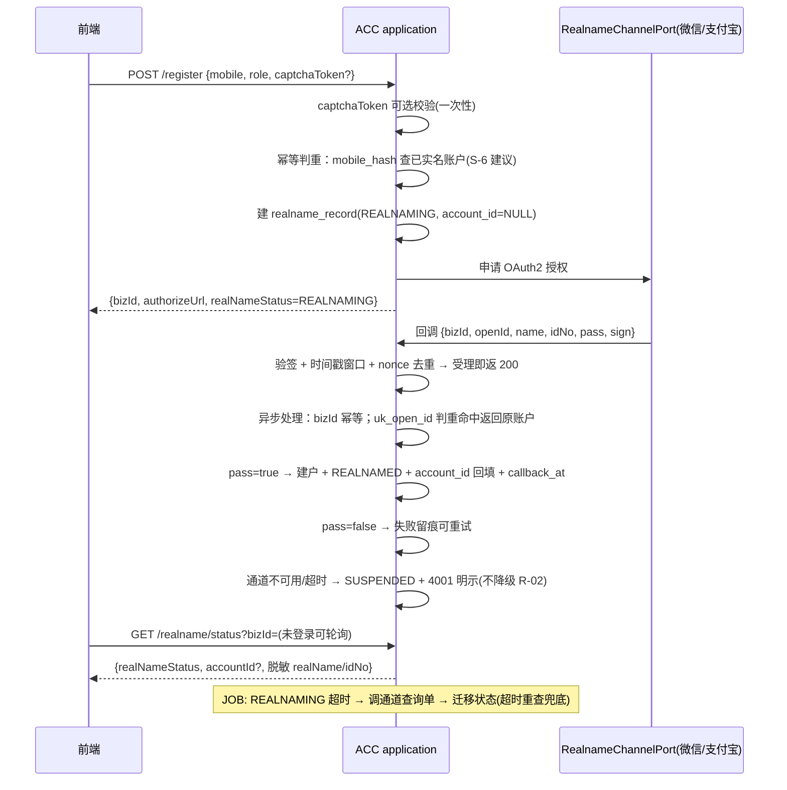
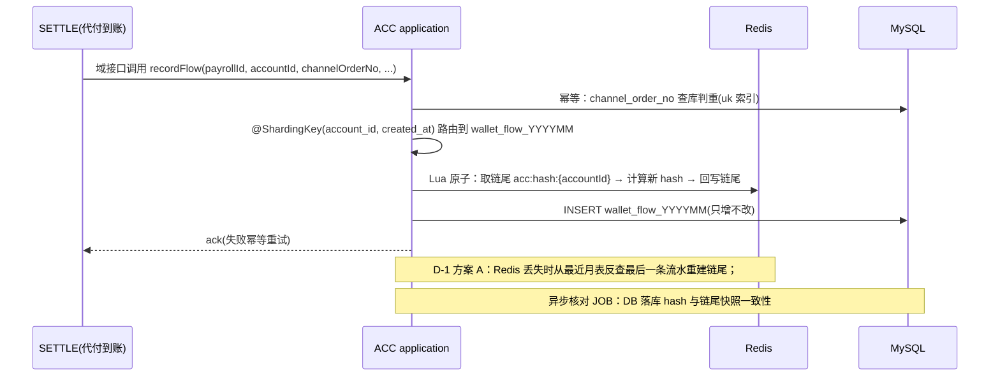

# 账户服务（ACC）实现设计方案

> 版本：v0.1 · 2026-09-12 · 状态：**设计稿（D-1/D-2 已拍板；S-5/S-6/S-7 为建议初值待评审）**
> 定位：ACC 服务级实现设计的唯一来源——把平台定档决策（模块化单体/分表/幂等/限流/安全）落到 ACC 一个服务内的分层、机制与流程，可直接指导编码。
> 依据文档：
> - 《产品设计文档》v1.0（基线）§5.1（ACC 功能设计）/ §5.14.1（I-06）/ §6.4.1（接口清单）/ §8（非功能设计）
> - 《高并发架构演进设计》v1.0（§2 数据层 / §3 幂等 / §4 限流熔断降级）
> - 《微服务边界与职责基准》v1.6 §2.1（ACC 边界卡）
> - `services/acc/docs/er.md` v1.1（数据基线，表结构/索引/枚举硬约束）
> - `services/acc/docs/openapi.yaml` v1.1.0（接口契约唯一可手改源）+ `services/_common/openapi.yaml`（Envelope/错误码/幂等键）
> - `services/acc/docs/README.md`（功能与质量基线：L1 ≥99.95%、红线 R-01/R-02/R-04）
> - 《产品需求文档》v2.3 §5.11（I 组）/ §3.4（红线 R-01~R-16）
> - `openspec/changes/add-m1-core-capabilities/design.md`（平台级设计，本设计不新增架构决策）
> - `services/acc/docs/test-plan.md` v0.1（本设计的验证基线）
> 口径冲突时依次以：openapi.yaml → er.md → PDD §5.1 → PRD §5.11 为准。

---

## 1. 设计输入与约束

| 输入 | 口径 | 对设计的意义 |
|---|---|---|
| 架构形态 | 模块化单体（Java 17 + Spring Boot 3），M1 生产双实例 | ACC 是单体中的一个**域**（独立 package + 独立 DAO），不独立部署；M2 也不独立成库（留共享主库） |
| 数据设计 | `er.md` v1.1：account / realname_record / wallet_flow(按月分表) / wallet_binding / reconcile_task + captcha_challenge(Redis) | 表结构/索引/枚举为硬基线，设计不得偏离 |
| 接口契约 | `openapi.yaml` v1.1.0：16 前端接口 + 1 外部回调 | 控制层直接映射；**流水写入无前端接口 → 内部写入通道（D-2）** |
| 红线 | R-01 纯记账簿不沉淀资金 / R-02 实名唯一口径不降级 / R-04 流水只增不改+哈希链 | 三条红线各有专门机制兜底 |
| NFR | L1 ≥99.95%；API P95≤500ms/P99≤1s；写 P95≤3s；第三方强依赖不计入同步预算 | §4 落地映射逐条对应 |
| 验证基线 | `test-plan.md` v0.1 | 每个机制挂测试用例 ID，可验收 |

---

## 2. 总体架构

### 2.1 架构形态与硬边界

- M1：ACC 以「独立 package + 独立 DAO」存在于模块化单体中；生产双实例、无状态。
- 硬边界：ACC 域只访问 `acc_` schema 前缀表；下游域数据一律走 internal 接口/事件，**禁止跨域直连读表**（对齐高并发 §6 优化点①）；M2 拆分时是「切部署单元」而非重构。
- 通道层可替换（R-01）：第三方实名/支付通道经 Port 接口隔离，Wechat/Alipay 实现可替换。

### 2.2 分层与包结构（DDD-lite）

```
com.msz.acc
+- controller/        16 前端接口：参数校验(1001/1002/1003) + Envelope + 脱敏出口
|   +- captcha/ realname/ wallet/ binding/ funds/ account/
+- application/       用例编排：RegisterFlow / RealnameCallbackFlow / BindFlow /
|                     WalletFlowQueryService / ReconcileFlow / CloseFlow
+- domain/            领域模型与规则（不依赖框架）
|   +- model/         Account / RealnameRecord / WalletFlow / WalletBinding /
|   |                 ReconcileTask / CaptchaChallenge(Redis)
|   +- service/       RealnameStatusMachine(显式转移表) / HashChainService /
|                     MaskingPolicy / IdempotencyRule
+- repository/        MyBatis-Plus Mapper：@ShardingKey 注解、@ReadOnly 从库路由
+- infrastructure/    端口适配层（通道层可替换）
|   +- gateway/       RealnameChannelPort + Wechat/Alipay 实现（OAuth2/验签/回调解析）
|   |                 PaymentChannelPort（绑定户名校验）
|   +- crypto/        AES-256-GCM（KMS 注入）+ 脱敏 + HMAC 指纹（预留检索列）
|   +- idgen/         infra-idgen 客户端（雪花+号段双轨、时钟回拨三档）
|   +- mq/            事件生产/消费（幂等）+ DLQ
|   +- redis/         captcha 挑战、链尾快照（D-1）、Lua 限流
+- job/               超时重查 JOB、对账 JOB（分布式锁防重）
+- internal/          域间内部接口（CRED/EMP/TICKET/TRACE/SETTLE/ASSIST 取数）
```

### 2.3 核心横切机制清单

| 机制 | 实现要点 |
|---|---|
| 实名状态机 | 显式转移表（UNREALNAMED→REALNAMING→REALNAMED/SUSPENDED），非法转移抛业务异常（3007 口径） |
| 幂等三件套 | ① `uk_open_id` 回传幂等 ② `uk_account_channel` 绑定一行复用 ③ 资金类 `Idempotency-Key` 落库唯一索引 `uk(idempotency_key)`，重复返回首次结果（3008） |
| 哈希链 | `hash = SHA-256(prev_hash ‖ 行数据 ‖ 时间戳)`；并发串行化按 **D-1 方案 A（已拍板）**：Redis 每账户链尾快照 + Lua 原子更新 |
| 分表路由 | `ShardingKey(account_id, created_at)` 注解 + MyBatis-Plus 拦截器；查询**强制 account_id 下推**（IDOR 2002 + 分片剪枝双重目的）；跨月逐表分页合并排序；禁止跨分片 JOIN/聚合/事务 |
| 加密脱敏 | L1 字段（mobile/real_name/id_no/payee_*）TypeHandler 层 AES-256-GCM；脱敏在 controller 出口 DTO 序列化统一执行；日志脱敏切面 |
| 验签防重放 | 回调验签（通道 SDK）+ 时间戳窗口 + nonce 去重；受理即返（异步处理） |
| captcha | Redis Hash `captcha:{id}`；答案仅服务端；Lua 原子「校验+消费」一次性；5min TTL；Redis 不可用 → 进程内短 TTL 兜底 |
| 限流 | Redis+Lua 令牌桶：captcha 防爆破（429）；读写分账号限流初值（读 1000 req/s、写 100 req/s） |
| JOB | 超时重查（REALNAMING 超时查通道）、对账核对（异步/从库，不压 OLTP）；Redisson 分布式锁 |
| 库层最小权限 | 应用账号对 `wallet_flow` **无 UPDATE/DELETE**（R-04 库层兜底） |

---

## 3. 功能模块设计

### 3.1 实名注册与回传（L1 核心链路）



要点：
- 第三方**不计入同步预算**：异步回调 + 状态轮询 + 超时重查 JOB（对齐 PDD §8.1.2）。
- register 入参**不含证件号**（R-02：证件号经回调由第三方回传）。
- 状态机转移表：

| 状态 | 说明 | 迁移 |
|---|---|---|
| UNREALNAMED | 初始 | → REALNAMING |
| REALNAMING | 已发起第三方回传 | → REALNAMED / SUSPENDED |
| REALNAMED | 可全功能 | →（长期有效；NFC 增强置 level=ENHANCED） |
| SUSPENDED | 第三方不可用/失败 | → 重试路径 |

- 异常映射：实名未完成 3001；实名不匹配 3002；实名接口失败 4001；重复 open_id 幂等返回原账户。
- I-06 强实名（M2 预留）：NFC 读证 + 人脸活体，仅 `level` 标记 BASE→ENHANCED，基础回传路径不变；人脸模板不出域。

### 3.2 钱包记账（纯记账簿，R-01/R-04）

**写入侧**（无前端接口；D-2 已拍板：M1 域接口调用）：



- **只增不改三层保障**：应用层无 UPDATE/DELETE 方法 → 库层回收写权限 → 哈希链可验篡改（R-04）。
- **查询侧**：本人分页（from/to 命中 1..N 张月表逐表分页合并排序；无日期默认近 12 月热表）；summary 聚合走**从库 + 短 TTL 快照缓存**（S-7 建议），不进 OLTP 主库聚合；export 异步生成 Excel 走 OSS 直传（敏感操作二次鉴权 + MFA）。
- **越权**：查询强制 `account_id` 下推 + 归属校验，越权报 2002。

### 3.3 收款账户绑定

流程：实名校验（未实名 3001 / 不一致 3002）→ `PaymentChannelPort` 通道户名校验（失败/超时 4002 可重试）→ `uk_account_channel` 冲突则复用原行置 BOUND（幂等返回原 bindingId）→ `Idempotency-Key` 重复提交返回首次结果（3008）。解绑置 UNBOUND 不删行；更换 = 先校验后替换，沿用幂等键。

### 3.4 人机验证（G-01 页面码）

下发（缺省 SLIDER，失败可降级 IMAGE；响应**不含 answer**）→ verify 通过发一次性 verifyToken（5min）→ register 回填 captchaToken 后即失效；挑战与 token 均一次性消费（Lua 原子）；接口级限流 429 防爆破；Redis 不可用走内存态短 TTL 兜底。

### 3.5 监管对账与资金审计

reconcile 触发（Idempotency-Key 幂等）→ `reconcile_task` RUNNING → 异步核对平台流水 vs 通道账单（按日期范围，从库）→ diff=0 置 DONE；diff>0 置 DIFF + 3009 提示 + 告警。audit 视图 = 流水 + payerId/payeeId/merchantName/reconcileStatus，监管角色 + 二次鉴权（403）。

### 3.6 账号注销

软关闭：校验无进行中业务（建议：无 REALNAMING 记录）→ `closed_at/close_reason` 留痕，不物理删除；注销后登录/访问被拒；注销为 danger 操作需二次确认。

---

## 4. 非功能需求落地映射

| NFR（定档基线） | ACC 落地机制 | 验证点（test-plan.md） |
|---|---|---|
| API P95≤500ms/P99≤1s、写 P95≤3s | 第三方全异步（回调+轮询+超时重查 JOB）；读写分离；me/实名状态/汇总走 Caffeine+Redis 两级缓存；分表 + `idx_account_created` 索引下推；慢查询门禁；HikariCP 20~50 | PERF-03/04/05 |
| L1 ≥99.95% | 无状态双实例；实名**不可降级**（暂停+明示）；舱壁 core-pool 隔离第三方调用；超时分级（内部 1s/第三方 3s）；幂等重试；Redis 哨兵；captcha 内存态兜底 | RES-01/02、IT-02 |
| 等保三级 + OWASP ASVS L2 | AES-256-GCM + MySQL TDE；脱敏输出；全接口 IDOR（account_id 下推）；回调验签+防重放；防爆破限流；日志脱敏；审计日志独立；密钥 KMS | SEC-01~09 |
| 数据只增不改 + 哈希链（R-04） | 应用层/库层双禁写 + 链式 hash 可验（D-1 链尾快照） | UT-B02/B03、SEC-06、PERF-03 |
| 按月分表 + 冷热归档 | ShardingKey 路由；>12 月热转冷 OSS，查询走归档快照，哈希链跨归档连续 | UT-B05/B06、IT-08、DATA-02 |
| 分布式 ID 韧性 | infra-idgen 复用；时钟回拨三档（L1 退避≤5s/L2 切号段/L3 拒绝发号）+ P0~P2 告警 | UT-F04~07、RES-03 |
| 可观测 | traceId 贯通；指标：实名发起/回调成功率与时延、验证码通过率、流水写入 TPS、分表路由错误数、哈希链验链失败、JOB 执行、限流触发 | test-plan §3.7 |

---

## 5. 内部接口与事件（被下游依赖）

| 消费方 | 内部接口/事件（仅内网 + 内部 Token，网关不暴露） | 说明 |
|---|---|---|
| SETTLE | `recordFlow`（域接口调用，**D-2 已定**） | 代付到账 → ACC 记账；ACC 记账事务自持，SETTLE 不跨域事务，失败幂等重试/补偿 |
| CRED/EMP/TICKET/TRACE/ASSIST | `getRealname(accountId)` / `getAccount(accountId)` | 实名/账户权威单一来源（ACC） |
| 全平台 | 实名事件 `acc.realname.completed`（M2 可选，M1 以接口查询为主） | 下游信用/用工联动预留 |

---

## 6. 关键决策记录（ADR-lite）

| ID | 决策 | 依据 | 状态 |
|---|---|---|---|
| D-1 | **哈希链并发串行化 = 方案 A：Redis 每账户链尾快照** | 不改 er.md 表结构、写吞吐高；`acc:hash:{accountId}` 存链尾，写流水时 Lua 原子「取链尾→算 hash→回写」，DB 落库后异步核对，Redis 丢失时从最近月表反查最后一条流水重建 | ✅ 已拍板（2026-09-12） |
| D-2 | **流水写入通道 = M1 域接口调用**（MQ 事件留 M2） | 符合「记账同步落库→通道异步+回调异步入账」定档口径；M1 避免引入最终一致与 DLQ 复杂度 | ✅ 已拍板（2026-09-12） |
| S-5 | 幂等记录落点：平台公共幂等组件 + 域内表 `acc_idempotency_record`（`uk(idempotency_key)` 唯一索引） | 高并发 §3.2 只定「落库唯一索引」，表未定 | 建议初值（待评审） |
| S-6 | register 幂等键：`mobile_hash`（HMAC-SHA256 指纹列，er §7.1 已预留）+ 回调 `open_id` 双判重 | open_id 在回调阶段才获得，register 阶段需另一判重键 | 建议初值（待评审） |
| S-7 | summary 聚合：从库 + 短 TTL 快照缓存 | 禁止跨分片聚合进 OLTP 主库（er §5.3/高并发 §2.1） | 建议初值（待评审） |
| S-2 | 实名状态机显式转移表 | er §3、PDD §5.1.2 | 设计建议（实现自由度） |

---

## 7. 与测试基线的衔接

本设计每个机制均在 `services/acc/docs/test-plan.md` 挂测试用例：状态机→UT-A01~03；哈希链（D-1）→UT-B01/02 + PERF-03 一致性专项；幂等（D-2/S-5/S-6）→UT-A04/C02/C07 + PERF-02/06；分表→UT-B05/06 + IT-06；captcha→UT-E01~07 + PERF-07；安全→SEC-01~09；韧性→RES-01~05。实现与测试同步落地（G0/G1/G2 门禁）。

---

## 8. 演进预留

- **M2 拆分**：SETTLE 独立部署后，流水写入从域接口调用切为 MQ 事件（契约不变，D-2 预留）；ACC 全程留共享主库。
- **I-06 强实名（M2）**：NFC 读证 + 人脸活体，`level` 标记 ENHANCED，人脸模板不出域（R-03/R-07）。
- **分库**：P2 交易/结算独立库后，ACC 仍在共享主库（`acc_` schema 前缀），无迁移。
- **归档**：wallet_flow >12 月热转冷 OSS（Parquet/压缩），哈希链跨归档连续（DATA-02 演练）。
- **表结构演进**：任何变更走 expand-migrate-contract（双写→回灌→切读→收缩），禁止破坏性 DDL 直上生产。

---

*文档结束 · 与 `services/acc/docs/er.md`、`services/acc/docs/openapi.yaml`（唯一可手改源）、`services/acc/docs/test-plan.md` 同步维护；口径冲突以 §0 声明顺序为准。*
