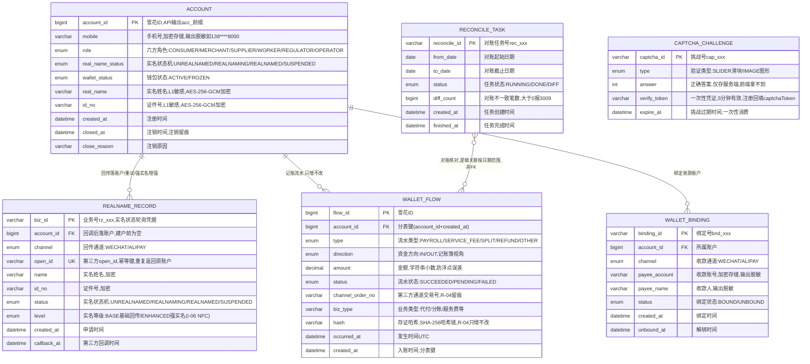

# 账户服务（ACC）数据库设计说明书

> 内容：**ER 图 + 分库分表方案 + 数据字典 + 表设计说明书**（§1 图 / §2 实体清单 / §3 设计约定 / §4 关系说明 / §5 分库分表 / §6 数据字典 / §7 表设计说明书）。
> 依据文档：`docs/design/产品设计文档.md` v1.12（§5.1 / §6.4.1 / §8.3.1）、`docs/design/微服务边界与职责基准.md`（§2.1 / §4.5）、
> `docs/design/高并发架构演进设计.md` v0.2（§2.1~§2.6）、`services/acc/docs/openapi.yaml` v1.1.0（**唯一可手改源**）。
> 数据域归属：① 身份域（`account`、`wallet_flow`）。口径与 openapi.yaml 冲突时以 openapi.yaml 为准。
> 版本：v1.1 · 2026-09-10（v1.0 ER 图定稿；v1.1 合并分库分表方案 / 数据字典 / 表设计说明书）。

## 1. ER 图（Mermaid）

## 2. 实体清单

| 实体（表名） | 存储介质 | 说明 |
|---|---|---|
| `account` | MySQL 主库（主数据，不分片） | 平台账户：六方角色 + 实名/钱包状态，全平台可信身份底座 |
| `realname_record` | MySQL | 实名业务单：回传/重试/NFC 增强留痕，承载实名状态机 |
| `wallet_flow` | MySQL **按月分表** | 纯记账簿流水：只增不改，通道交易号 + 存证哈希链 |
| `wallet_binding` | MySQL | 收款账户绑定（持牌通道），供 SETTLE 代付/分账收款 |
| `reconcile_task` | MySQL | 监管端资金对账任务（R-11），平台流水 vs 通道账单 |
| `captcha_challenge` | Redis（内存态兜底） | 人机验证挑战（G-01），一次性消费，**不入库** |

## 3. 关键设计约定

- **R-01 只记账不碰钱**：ACC 不设资金余额字段，`wallet_flow` 是纯记账簿，钱包汇总由流水聚合计算。
- **R-02 实名唯一口径**：证件号仅由微信/支付宝回传，平台不收集证件照片；`realname_record.open_id` 为幂等键，重复回传返回原账户；第三方不可用按红线暂停注册并明示，不静默降级。
- **R-04 流水只增不改**：`channel_order_no` + `hash`（SHA-256 哈希链）+ 时间戳即证据链，可出证（P-02）。
- **加密与脱敏**：`real_name` / `id_no` 等 L1 高敏感字段 AES-256-GCM 加密存储、脱敏输出（如 138****8000）；如未来需按手机号检索，预留 HMAC 指纹辅助列 + 唯一索引（接口不暴露）。
- **分表**：`wallet_flow` 按月分表，分片键 `account_id + created_at`；>12 月热转冷 OSS，保留热表 12 个月；主数据（account 等）不分片（详见 §5）。
- **分库定位**：P1 模块化单体期全平台共享主库 + `acc_` schema 前缀隔离；P2 交易/结算独立库后 ACC 仍留共享主库（详见 §5.1）。
- **幂等**：实名（重复 `open_id`）与绑定（同账号同通道）幂等返回原记录；资金类接口走 `Idempotency-Key`。
- **状态机**：实名 `UNREALNAMED → REALNAMING → REALNAMED / SUSPENDED`；NFC 增强（I-06）在 `level` 上标记 BASE/ENHANCED，基础回传路径不变。
- **监管审计（R-11）**：`reconcile_task` 对账不一致报 3009；审计视图 `FundsAuditFlow` = 流水 + `payerId/payeeId/merchantName/reconcileStatus(PENDING/RECONCILED/DIFF)`。
- **人机验证（G-01）**：`captcha_challenge` 存 Redis、一次性消费、5 分钟有效，`verify_token` 供注册回填 `captchaToken`。

## 4. 关系说明

| 关系 | 基数 | 说明 |
|---|---|---|
| ACCOUNT — REALNAME_RECORD | 1 : N | 注册发起产生业务单，回调后落账户；重试/强实名增强产生多条 |
| ACCOUNT — WALLET_FLOW | 1 : N | 本人全部记账流水；查询做水平越权（IDOR）校验，越权报 2002 |
| ACCOUNT — WALLET_BINDING | 1 : N | 可绑定微信/支付宝多条；账号与实名不一致拒绝绑定（3002） |
| RECONCILE_TASK — WALLET_FLOW | M : N | 逻辑关联（按日期范围核对），非外键 |
| CAPTCHA_CHALLENGE | 独立 | Redis 实体，经 `verify_token` 与注册/登录流程逻辑关联 |

---

## 5. 分库分表方案

> 平台级策略以《高并发架构演进设计》v0.2 §2.1~§2.6 为准，本节只做「平台策略 → ACC 域」的落地映射。

### 5.1 分库与隔离

| 阶段 | 库形态 | ACC 落位 |
|---|---|---|
| P1 地基期（M1） | 模块化单体共享主库（MySQL 8，主从读写分离） | ACC 表与各域同库，**以 `acc_` schema 前缀隔离**（对齐高并发 §6 优化点① 硬边界：禁跨域直连读表） |
| P2 服务化期（M2） | 交易/结算独立库，其余域共享主库 | **ACC 全程留在共享主库**，不独立成库 |
| 容灾 | 两地三中心：同城双活 + 异地灾备 | RPO≤15min / RTO≤30min（L1，对齐 ACC README §4.2） |

### 5.2 ACC 分片矩阵

| 表 | 分片方式 | 分片键 | 表命名 | 归档策略 | 里程碑 |
|---|---|---|---|---|---|
| `account` | **不分片**（主数据，行数有限 + 强一致更新） | — | `account` | 不归档、不物理删除（注销=软关闭） | M1 |
| `realname_record` | 不分片 | — | `realname_record` | 不归档（审计留痕） | M1 |
| `wallet_flow` | **按月分表（已定）** | `account_id` + `created_at` | `wallet_flow_YYYYMM` | >12 月热转冷 OSS（Parquet/压缩），保留热表 12 个月 | M1 起 |
| `wallet_binding` | 不分片 | — | `wallet_binding` | 不归档（解绑置 UNBOUND 不删行） | M1 |
| `reconcile_task` | 不分片 | — | `reconcile_task` | 按审计要求保留（≥6 个月，WORM/哈希链留痕） | M1 |

> **分片阈值**（平台级建议初值，压测/数据增长标定）：单表 >2000 万行 或 >20GB 触发再分；`wallet_flow` 按月分表天然可控，冷数据到点即归档，避免单表膨胀到亿级。

### 5.3 分表路由规则（wallet_flow）

- **路由层**：M1 用 MyBatis-Plus 自定义分表插件（拦截按月路由）+ 统一 `ShardingKey` 注解；M2 分库后评估 ShardingSphere-Proxy（业务零改造），或先自研轻量路由。
- **写入**：按 `created_at` 月份路由到 `wallet_flow_YYYYMM`，`ShardingKey(account_id, created_at)` 显式声明。
- **本人查询**（GET /acc/wallet/flows）：带 `from/to` → 命中 1..N 张月表，按表分页后合并排序；不带日期 → 默认近 12 个月热表逐表查询；**必须携带 `account_id` 下推**（水平越权校验 + 分片键剪枝）。
- **跨月查询**：禁止 SQL UNION 全表扫描；优先「account_id + 日期范围」索引下推，跨月聚合走异步/从库（§5.5）。
- **禁止跨分片 JOIN / 聚合 / 事务**：对账/审计的跨月汇总不进 OLTP 主库（§5.6）。

### 5.4 分布式 ID 与主键策略

| 表 | 主键 | 生成方式 | 说明 |
|---|---|---|---|
| `account.account_id` | bigint 雪花 ID | 统一组件 `infra-idgen` | API 输出字符串带 `acc_` 前缀（防 JS 大数精度 + 可读） |
| `realname_record.biz_id` | varchar 业务号 | 号段/可读业务号 `rz_` 前缀 | 供前端轮询实名状态 |
| `wallet_flow.flow_id` | bigint 雪花 ID | `infra-idgen` | 含时间戳但**分表路由以业务字段 `created_at` 为准**，不依赖 ID 内嵌时间戳 |
| `wallet_binding.binding_id` | varchar 业务号 | 业务号 `bnd_` 前缀 | 幂等返回/管理操作凭据 |
| `reconcile_task.reconcile_id` | varchar 业务号 | 业务号 `rec_` 前缀 | 对账任务凭据 |

- workerId：Redis `INCR` 分配 + 实例重启复用（租约），撞车 → 拒绝发号 + P0 告警。
- **时钟回拨三档预案**（《高并发架构演进设计》§2.3.1~§2.3.4）：L1 轻微回拨（≤5s）退避等待 → L2 超预算**自动切号段模式兜底**（`id_allocator` 表 DB 自增，不依赖时钟）→ L3 号段不可用**拒绝发号 + 快速失败**；Prometheus 指标 + Alertmanager 分级告警 + NTP 治理。L2 号段兜底期间主键不含时间戳，分表路由仍以 `created_at` 为准，业务无感。

### 5.5 读写分离与冷热归档

- **读写分离**：主库写、从库读（读是写 3 倍以上）；读请求经 `@ReadOnly` 注解路由到从库；关键资金「写后立即读」（如绑定/注销后立即查状态）**强制走主库**，避免主从延迟读到旧状态。
- **冷热归档**：`wallet_flow` >12 月热转冷 OSS（Parquet/压缩），查询走归档快照；对账/审计按需回捞。
- **存证**：流水只增不改 + `hash` 哈希链（R-04），归档前后哈希链不断。

### 5.6 演进步骤（expand-migrate-contract）

> 任何表结构/分表规则变更按「扩展 → 迁移 → 收缩」执行，禁止破坏性 DDL 直上生产（对齐高并发 §2.6）：
> ① **双写**：新表上线，旧表 + 新表双写（幂等）→ ② **回灌**：历史数据按分片键回灌新表，校验一致性 → ③ **切读**：读流量切新表，旧表降级只读 → ④ **收缩**：观察稳定后下线旧表。

### 5.7 待标定项

| 项 | 建议初值 | 裁决方式 |
|---|---|---|
| 分片阈值 | 单表 >2000 万行 / >20GB | 评审 + 数据增长标定 |
| 回拨容忍窗口 W / 号段步长 | W=5s、step=1000 | 评审 + 压测标定（TBD-10） |
| 热表保留月数 | 12 个月 | 评审 |

---

## 6. 数据字典

> 通用约定：引擎 InnoDB；字符集 utf8mb4；时间 `datetime(3)` 毫秒精度、UTC 存储、输出 Asia/Shanghai；金额 `decimal(18,2)` 存储、API 输出字符串小数（防浮点误差）；「密文」= AES-256-GCM 加密存储（L1 敏感）。
> 枚举值与 openapi.yaml `components.schemas` 一一对应。

### 6.1 account（平台账户，不分片）

| 字段 | 类型 | 空 | 键 | 默认 | 说明 |
|---|---|---|---|---|---|
| account_id | bigint UNSIGNED | NO | PK | — | 账户 ID，雪花 ID；API 输出 `acc_` 前缀字符串 |
| mobile | varchar(255) | NO | — | — | 手机号，**密文**；输出脱敏如 138****8000 |
| role | enum('CONSUMER','MERCHANT','SUPPLIER','WORKER','REGULATOR','OPERATOR') | NO | — | — | 六方角色 |
| real_name_status | enum('UNREALNAMED','REALNAMING','REALNAMED','SUSPENDED') | NO | — | UNREALNAMED | 实名状态机：未实名→实名中→已实名/暂停 |
| wallet_status | enum('ACTIVE','FROZEN') | NO | — | ACTIVE | 钱包记账簿状态 |
| real_name | varchar(255) | NO | — | — | 实名姓名，**密文**；输出脱敏如 张\*三 |
| id_no | varchar(255) | NO | — | — | 证件号，**密文**；输出脱敏如 1301\*\*\*\*\*\*\*\*\*\*1234 |
| created_at | datetime(3) | NO | — | CURRENT_TIMESTAMP(3) | 注册时间 |
| closed_at | datetime(3) | YES | — | NULL | 注销时间（注销留痕，软关闭） |
| close_reason | varchar(255) | YES | — | NULL | 注销原因（可选留痕） |

### 6.2 realname_record（实名业务单，不分片）

| 字段 | 类型 | 空 | 键 | 默认 | 说明 |
|---|---|---|---|---|---|
| biz_id | varchar(32) | NO | PK | — | 业务号 `rz_` 前缀，实名状态轮询凭据 |
| account_id | bigint UNSIGNED | YES | FK | NULL | 回调后回填账户 ID；建户前为空 |
| channel | enum('WECHAT','ALIPAY') | NO | — | — | 实名回传通道（唯一口径 R-02） |
| open_id | varchar(64) | NO | UK | — | 第三方 open_id，**幂等键**，重复回传返回原账户 |
| name | varchar(255) | NO | — | — | 实名姓名，**密文**（通道加密传输） |
| id_no | varchar(255) | NO | — | — | 证件号，**密文**（通道加密传输） |
| status | enum('UNREALNAMED','REALNAMING','REALNAMED','SUSPENDED') | NO | — | REALNAMING | 实名状态机 |
| level | enum('BASE','ENHANCED') | NO | — | BASE | 实名等级：BASE 基础回传 / ENHANCED 强实名（I-06 NFC） |
| created_at | datetime(3) | NO | — | CURRENT_TIMESTAMP(3) | 申请时间 |
| callback_at | datetime(3) | YES | — | NULL | 第三方回调时间（异步落库 + 状态机） |

### 6.3 wallet_flow（钱包记账流水，按月分表 wallet_flow_YYYYMM）

| 字段 | 类型 | 空 | 键 | 默认 | 说明 |
|---|---|---|---|---|---|
| flow_id | bigint UNSIGNED | NO | PK | — | 流水 ID，雪花 ID（`infra-idgen`） |
| account_id | bigint UNSIGNED | NO | — | — | 所属账户，**分表键**（与 created_at 组合） |
| type | enum('PAYROLL','SERVICE_FEE','SPLIT','REFUND','OTHER') | NO | — | — | 流水类型 |
| direction | enum('IN','OUT') | NO | — | — | 资金方向（记账簿视角） |
| amount | decimal(18,2) | NO | — | — | 金额，字符串小数防浮点误差；API 输出 string |
| status | enum('SUCCEEDED','PENDING','FAILED') | NO | — | — | 流水状态 |
| channel_order_no | varchar(64) | YES | UK | NULL | 第三方通道交易号（R-04 留痕）；NULL 豁免唯一索引 |
| biz_type | varchar(32) | YES | — | NULL | 业务类型：代付/分账/服务费等 |
| hash | varchar(128) | NO | — | — | 存证哈希：SHA-256(前链 hash + 行数据 + 时间戳)，哈希链 |
| occurred_at | datetime(3) | NO | — | — | 资金发生时间（UTC） |
| created_at | datetime(3) | NO | — | CURRENT_TIMESTAMP(3) | 入账时间，**分表键** |

### 6.4 wallet_binding（收款账户绑定，不分片）

| 字段 | 类型 | 空 | 键 | 默认 | 说明 |
|---|---|---|---|---|---|
| binding_id | varchar(32) | NO | PK | — | 绑定号 `bnd_` 前缀 |
| account_id | bigint UNSIGNED | NO | — | — | 所属账户 |
| channel | enum('WECHAT','ALIPAY') | NO | UK(联合) | — | 收款通道；`uk_account_channel(account_id, channel)` |
| payee_account | varchar(255) | NO | — | — | 收款账号（对公/对私），**密文**；输出脱敏如 6222\*\*\*\*\*\*\*\*890 |
| payee_name | varchar(255) | YES | — | NULL | 收款人户名，**密文**；输出脱敏如 张\*三 |
| status | enum('BOUND','UNBOUND') | NO | — | BOUND | 绑定状态；解绑置 UNBOUND 不删行 |
| created_at | datetime(3) | NO | — | CURRENT_TIMESTAMP(3) | 绑定时间 |
| unbound_at | datetime(3) | YES | — | NULL | 解绑时间 |

### 6.5 reconcile_task（监管端资金对账任务，不分片）

| 字段 | 类型 | 空 | 键 | 默认 | 说明 |
|---|---|---|---|---|---|
| reconcile_id | varchar(32) | NO | PK | — | 对账任务号 `rec_` 前缀 |
| from_date | date | NO | — | — | 对账起始日期（含） |
| to_date | date | NO | — | — | 对账截止日期（含） |
| status | enum('RUNNING','DONE','DIFF') | NO | — | RUNNING | 任务状态 |
| diff_count | bigint UNSIGNED | NO | — | 0 | 对账不一致笔数，>0 报 3009 提示 |
| created_at | datetime(3) | NO | — | CURRENT_TIMESTAMP(3) | 任务创建时间 |
| finished_at | datetime(3) | YES | — | NULL | 任务完成时间 |

### 6.6 captcha_challenge（人机验证挑战，Redis 不入库）

| 字段 | 类型 | 说明 |
|---|---|---|
| key | `captcha:{captcha_id}` | 挑战号 `cap_` 前缀 |
| type | string | SLIDER 滑块 / IMAGE 图形（失败降级） |
| answer | string/int | 正确答案（offsetX 或 code），**仅存服务端**，前端拿不到 |
| verify_token | string | 校验通过后写入的一次性凭证，注册回填 `captchaToken` |
| expire_at | string(ISO8601) | 挑战过期时间 |
| TTL / 消费 | — | 5 分钟有效；**一次性消费**（verify 后即失效，防暴力枚举）；接口级限流（登录爆破限速） |

---

## 7. 表设计说明书

### 7.1 account（平台账户）

- **用途**：平台账户主数据——六方角色 + 实名/钱包状态，全平台可信身份底座（I-01）。
- **主键**：`account_id` bigint 雪花 ID（`infra-idgen`），API 输出 `acc_` 前缀字符串。
- **索引**：PRIMARY KEY(`account_id`)；如需按手机号等值检索，预留 `mobile_hash`（HMAC-SHA256 指纹辅助列，**接口不暴露**）+ 唯一索引。
- **约束**：实名状态机 + 钱包状态机；注销=软关闭（`closed_at`/`close_reason` 留痕），不物理删除。
- **加密/脱敏**：`mobile`/`real_name`/`id_no` AES-256-GCM 加密存储（L1），全接口脱敏输出。
- **生命周期**：不归档、不删除；随账户全生命周期存续。
- **接口映射**：POST /acc/register（建户）、GET /acc/me（读）、POST /acc/account/close（注销留痕）。

### 7.2 realname_record（实名业务单）

- **用途**：实名回传/重试/NFC 增强（I-06）的业务留痕，承载实名状态机与轮询凭据（I-01）。
- **主键**：`biz_id` 业务号（`rz_` 前缀，可读、前端轮询用）。
- **索引**：PRIMARY KEY(`biz_id`)；UNIQUE KEY `uk_open_id`(`open_id`)——**幂等键**，重复回传返回原账户；KEY `idx_account_id`(`account_id`)；KEY `idx_status`(`status`)。
- **约束**：`account_id` 建户前可空、回调后回填（异步落库 + 状态机 + 超时重查 JOB）；第三方不可用按红线置 SUSPENDED 并明示，不静默降级。
- **加密**：`name`/`id_no` 密文（通道加密传输，落库二次加密）。
- **生命周期**：不归档（实名审计留痕，等保三）。
- **接口映射**：POST /acc/register（发起）、POST /acc/realname/callback（外部回调，验签+幂等）、GET /acc/realname/status（轮询）、POST /acc/realname/nfc（强实名增强）。

### 7.3 wallet_flow（钱包记账流水，按月分表）

- **用途**：纯记账簿流水（R-01 不沉淀资金），只增不改、长期留痕、可出证（R-04/P-02）。
- **分表**：`wallet_flow_YYYYMM` 按月分表；分片键 `account_id + created_at`；>12 月热转冷 OSS，保留热表 12 个月（§5.2~§5.5）。
- **主键**：`flow_id` 雪花 ID；分表路由以业务字段 `created_at` 为准，不依赖 ID 内嵌时间戳（号段兜底时依然正确）。
- **索引**：PRIMARY KEY(`flow_id`)；KEY `idx_account_created`(`account_id`, `created_at`)——本人分页查询 + 分片键剪枝；UNIQUE KEY `uk_channel_order_no`(`channel_order_no`)——NULL 豁免（无通道号的平台内记账不参与）。
- **约束**：**只增不改**（应用层禁 UPDATE/DELETE，库层回收写权限）；`hash` 哈希链完整可验；查询做水平越权（IDOR）校验，越权报 2002。
- **生命周期**：热表 12 个月 → 归档 OSS（Parquet/压缩），对账/审计按需回捞，哈希链跨归档连续。
- **接口映射**：GET /acc/wallet/flows（本人分页）、GET /acc/wallet/summary（聚合汇总，无余额字段）、GET /acc/wallet/flows/export（Excel 导出）、GET /acc/funds/audit（监管审计视图）、POST /acc/funds/reconcile（对账核对对象）。

### 7.4 wallet_binding（收款账户绑定）

- **用途**：将本人收款账户绑定到持牌支付通道，供 SETTLE 代付/分账收款使用（I-01）。
- **主键**：`binding_id` 业务号（`bnd_` 前缀）。
- **索引**：PRIMARY KEY(`binding_id`)；UNIQUE KEY `uk_account_channel`(`account_id`, `channel`)——**一行一（账户,通道）生命周期复用**：解绑置 UNBOUND 不删行，重新绑定复用原行置 BOUND（幂等返回原绑定）。
- **约束**：账号与实名不一致拒绝绑定（3002）；通道校验失败/超时（4002）可重试；接口级 `Idempotency-Key` 防重复。
- **加密**：`payee_account`/`payee_name` 密文；输出脱敏。
- **生命周期**：不归档；解绑不物理删除（留痕）。
- **接口映射**：POST /acc/wallet/bind、GET /acc/wallet/bindings、PUT /acc/wallet/bindings/{bindingId}（更换）、DELETE /acc/wallet/bindings/{bindingId}（解绑置 UNBOUND）。

### 7.5 reconcile_task（监管端资金对账任务）

- **用途**：监管端（R-11）触发资金对账，核对平台记账流水与第三方通道账单，不一致报 3009。
- **主键**：`reconcile_id` 业务号（`rec_` 前缀）。
- **索引**：PRIMARY KEY(`reconcile_id`)；KEY `idx_status_created`(`status`, `created_at`)——监管端任务列表。
- **约束**：接口级 `Idempotency-Key`（重复触发返回原任务）；与 `wallet_flow` 为**逻辑关联**（按日期范围核对，非外键）；对账走异步/从库，不进 OLTP 主库聚合。
- **生命周期**：按审计要求保留（≥6 个月，WORM/哈希链留痕）。
- **接口映射**：POST /acc/funds/reconcile（触发）、GET /acc/funds/audit（审计视图 `reconcileStatus`: PENDING/RECONCILED/DIFF）。

### 7.6 captcha_challenge（人机验证挑战，Redis）

- **用途**：登录/注册页人机验证（G-01 防机器人）：默认滑块拼图，失败降级图形验证码；登录爆破限速一体化。
- **结构**：Redis Hash `captcha:{captcha_id}`（§6.6）；内存态兜底（Redis 不可用时进程内缓存短 TTL 兜底）。
- **约束**：答案仅存服务端；挑战**一次性消费**（verify 后失效）；`verify_token` 5 分钟有效，注册回填 `captchaToken` 后同样一次性消费；接口级限流（429）。
- **生命周期**：TTL 5 分钟自动过期；不入 MySQL。
- **接口映射**：GET /acc/captcha（下发挑战）、POST /acc/captcha/verify（校验并下发 verifyToken）。

---

*文档结束 · 与 `services/acc/docs/openapi.yaml`（唯一可手改源）、《高并发架构演进设计》v0.2 §2、《产品设计文档》v1.6 §5.1/§6.4.1 同步维护。*
