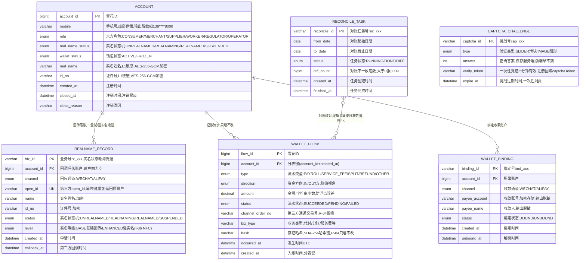

# 账户服务（ACC）ER 图

> 依据文档：`docs/design/产品设计文档.md` v1.4（§5.1 / §6.4.1）、`docs/design/微服务边界与职责基准.md`（§2.1 / §4.5）、
> `docs/design/高并发架构演进设计.md`（§2.2 分表方案）、`services/acc/docs/openapi.yaml` v1.1.0（唯一可手改源）。
> 数据域归属：① 身份域（`account`、`wallet_flow`）。口径与 openapi.yaml 冲突时以 openapi.yaml 为准。

## 1. ER 图（Mermaid）

## 2. 实体清单

| 实体（表名） | 存储介质 | 说明 |
|---|---|---|
| `account` | MySQL 主库（主数据，不分片） | 平台账户：六方角色 + 实名/钱包状态，全平台可信身份底座 |
| `realname_record` | MySQL | 实名业务单：回传/重试/NFC 增强留痕，承载实名状态机 |
| `wallet_flow` | MySQL **按月分表** | 纯记账簿流水：只增不改，通道交易号 + 存证哈希链 |
| `wallet_binding` | MySQL | 收款账户绑定（持牌通道），供 SETTLE 代付/分账收款 |
| `reconcile_task` | MySQL | 监管端资金对账任务（R-11），平台流水 vs 通道账单 |
| `captcha_challenge` | Redis（内存态兜底） | 人机验证挑战（G-01），一次性消费，**不入库** |

## 3. 关键设计约定

- **R-01 只记账不碰钱**：ACC 不设资金余额字段，`wallet_flow` 是纯记账簿，钱包汇总由流水聚合计算。
- **R-02 实名唯一口径**：证件号仅由微信/支付宝回传，平台不收集证件照片；`realname_record.open_id` 为幂等键，重复回传返回原账户；第三方不可用按红线暂停注册并明示，不静默降级。
- **R-04 流水只增不改**：`channel_order_no` + `hash`（SHA-256 哈希链）+ 时间戳即证据链，可出证（P-02）。
- **加密与脱敏**：`real_name` / `id_no` 等 L1 高敏感字段 AES-256-GCM 加密存储、脱敏输出（如 138****8000）。
- **分表**：`wallet_flow` 按月分表，分片键 `account_id + created_at`；>12 月热转冷 OSS，保留热表 12 个月；主数据（account 等）不分片。
- **幂等**：实名（重复 `open_id`）与绑定（同账号同通道）幂等返回原记录；资金类接口走 `Idempotency-Key`。
- **状态机**：实名 `UNREALNAMED → REALNAMING → REALNAMED / SUSPENDED`；NFC 增强（I-06）在 `level` 上标记 BASE/ENHANCED，基础回传路径不变。
- **监管审计（R-11）**：`reconcile_task` 对账不一致报 3009；审计视图 `FundsAuditFlow` = 流水 + `payerId/payeeId/merchantName/reconcileStatus(PENDING/RECONCILED/DIFF)`。
- **人机验证（G-01）**：`captcha_challenge` 存 Redis、一次性消费、5 分钟有效，`verify_token` 供注册回填 `captchaToken`。

## 4. 关系说明

| 关系 | 基数 | 说明 |
|---|---|---|
| ACCOUNT — REALNAME_RECORD | 1 : N | 注册发起产生业务单，回调后落账户；重试/强实名增强产生多条 |
| ACCOUNT — WALLET_FLOW | 1 : N | 本人全部记账流水；查询做水平越权（IDOR）校验，越权报 2002 |
| ACCOUNT — WALLET_BINDING | 1 : N | 可绑定微信/支付宝多条；账号与实名不一致拒绝绑定（3002） |
| RECONCILE_TASK — WALLET_FLOW | M : N | 逻辑关联（按日期范围核对），非外键 |
| CAPTCHA_CHALLENGE | 独立 | Redis 实体，经 `verify_token` 与注册/登录流程逻辑关联 |
