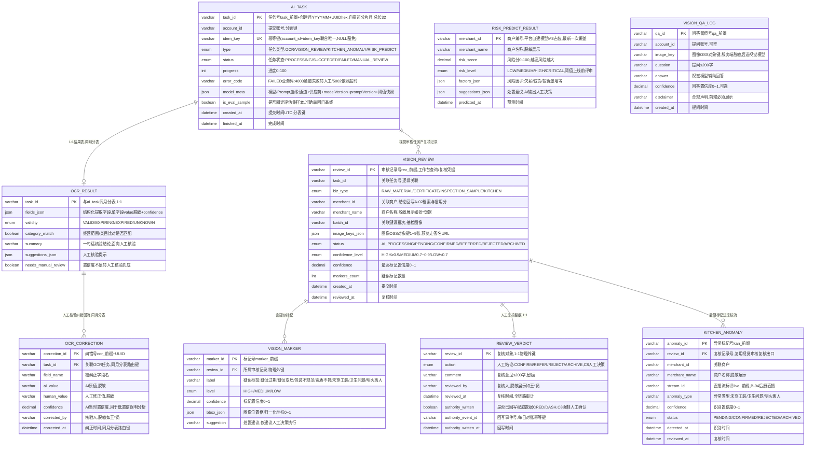

# AI 能力中心服务（AICORE）数据库设计说明书

> 内容：**ER 图 + 分库分表方案 + 数据字典 + 表设计说明书**（§1 图 / §2 实体清单 / §3 设计约定 / §4 关系说明 / §5 分库分表 / §6 数据字典 / §7 表设计说明书）。
> 依据文档：`docs/design/产品设计文档.md` v1.19（§5.12 / §6.4.13 / §8.3.1 / §4.4）、`docs/design/微服务边界与职责基准.md` v2.0（§2.12 / §3 / §4.5 / §4.16-C16）、
> `docs/design/高并发架构演进设计.md` v1.0（§2.1~§2.6、§3 异步削峰、ADR-7）、`services/aicore/docs/openapi.yaml` v1.1.0（**唯一可手改源**）。
> 数据域归属：**独立库 `aicore`**（自建，与主站库隔离，M1 起；服务自有库原则，边界基准 v2.0 §2.12）；权威数据（A-02 档案/信用分、A-08 预警）仍在 CRED/DASH，经内部接口事件回写（不复制权威数据）。
> **技术选型（2026-09-16 定档）**：独立库 `aicore` 维持 **MySQL 8**（与全平台一致，**不引入 PostgreSQL**）；用户习惯与购买影响因素**不由本服务持有**——本服务仅提供 `POST /aicore/habit/summarize` **无状态计算**（只算不存、不建记忆表），权威存储归 PROFILE（`profile_habit` / `profile_habit_factor` / `behavior_daily_agg`，边界基准 v2.0 §2.11/§4.16-C16）；短期会话记忆归 Redis（ASSIST 30 分钟 TTL），与长期习惯分属两条数据线（PDD v1.19 §4.4）。
> 口径：与 openapi.yaml 冲突时以 openapi.yaml 为准。
> 版本：v1.3 · 2026-09-19（v1.0「不落业务库」口径；v1.1 按用户拍板方案 A 改为**独立库 `aicore`**；v1.2 新增 **AI 准确率提升闭环结构**——`ocr_correction`（人工复核纠错回流）、`ai_task.model_meta`（模型/Prompt 血缘）、`review_verdict.authority_written/authority_event_id`（C8 人工确认才可写权威数据 + 事件对账），共 9 表；并登记「习惯权重无状态计算、不落库」边界；**v1.3 将 `ai_task.task_id` 定为 `task_` + 创建月 `YYYYMM` + UUID hex（自描述分片月，总长恒 32）**——修掉「上月提交、次月轮询即 404」，详见 §5.4/§7.1）。

## 1. ER 图（Mermaid）

## 2. 实体清单

| 实体（表名） | 存储介质 | 说明 |
|---|---|---|
| `ai_task`（按月分表 `ai_task_YYYYMM`） | 独立库 `aicore` | 统一异步 AI 任务（K-02），四种任务类型共用任务壳 |
| `ocr_result`（随任务同月分表） | 独立库 `aicore` | 证照 OCR 结构化结果（K-01），仅预审、人工核验兜底 |
| **`ocr_correction`（随任务同月分表）** | 独立库 `aicore` | **人工核验纠错回流（2026-09-16 增）**：字段级 AI 原值 vs 人工修正值，驱动准确率统计与阈值/prompt 调优 |
| `vision_review` | 独立库 `aicore` | 视觉合规审核记录（K-03），人工复核工作台核心 |
| `vision_marker` | 独立库 `aicore` | 疑似问题标记（K-03），AI 只标记不决策 |
| `review_verdict` | 独立库 `aicore` | 人工复核结论留痕（C8），全链路审计 |
| `kitchen_anomaly` | 独立库 `aicore` | 后厨直播异常标记（K-05），复用复核流 |
| `risk_predict_result` | 独立库 `aicore` | 风险商户预测结果（K-06，M3 占位），人工决策执行 |
| `vision_qa_log` | 独立库 `aicore` | 图像问答留痕（K-04），合规声明强制展示 |
| 任务热态镜像 / 限流 | Redis（独立实例） | `task:{task_id}` 进度/结果缓存（TTL 7 天★）、令牌桶按账号限流 |
| `aicore.task` / `aicore.conclusion` | MQ（RabbitMQ） | 任务队列（AICORE 生产+消费）/ 结论事件回写（AICORE → CRED/DASH） |
| 图像对象（imageKey 所指） | OSS（仅存对象键） | 原始图像前端直传，服务端脱敏后送视觉模型 |
| **习惯权重计算通道** | **无状态（非本服务存储）** | `POST /aicore/habit/summarize`（服务端间，内部 Token + 幂等）；**只算不存、不建记忆表**；权威存储归 PROFILE（边界基准 v2.0 §2.11/§4.16-C16） |
| **短期会话上下文** | **Redis（非本服务存储）** | 归 ASSIST 服务，30 分钟 TTL 清空、不留跨会话记忆（R-06）；与长期习惯分属两条数据线 |

## 3. 关键设计约定

- **服务自有库原则（v1.1 拍板）**：每个微服务持有自己的数据、独立数据库；AICORE 独立库 `aicore`（MySQL 8，与主站库隔离，M1 起）；共享权威数据只读引用 + 事件同步，**权威单一来源**——信用分/档案权威在 CRED（边界基准 §3 定稿：其他服务只上报评分事件、不直接写信用分表），预警权威在 DASH；AICORE 经 `aicore.conclusion` 事件回写，不复制权威数据。
- **技术选型与记忆边界（2026-09-16 定档）**：独立库 `aicore` 维持 **MySQL 8**（与全平台一致，**不引入 PostgreSQL**）；用户习惯与购买影响因素**不由本服务持有**——本服务仅提供 `POST /aicore/habit/summarize` **无状态计算**（只算不存、不建记忆表），权威存储归 PROFILE（`profile_habit` / `profile_habit_factor` / `behavior_daily_agg`）；短期会话记忆归 Redis（ASSIST 30 分钟 TTL）。**算法迭代（纯统计 → 平台自建小模型）不触发数据迁移**。
- **模型与 Prompt 血缘（2026-09-16 增）**：每次任务在 `ai_task.model_meta` 记录`通道 + 供应商 + modelVersion + promptVersion + 阈值快照`——满足 PRD §4「可追溯（谁调用/谁复核/**依据什么模型**）」；换模型后历史结论可比、可复盘准确率。
- **准确率提升闭环（2026-09-16 增，R-05 允许范围内）**：`ocr_correction`（人工核验纠错回流）+ `ai_task.is_eval_sample`（固定评估集）+ 复核结论 → ① **阈值调整**（`stat.ai_accuracy_stat` 按 label/置信度分桶）② **prompt/规则优化**（按 `promptVersion` 迭代）③ **评估集回归**（改动前后跑同一集）。**全部在平台内闭环，不回流第三方模型训练**（复核结果只用于平台自调优）。主指标为「**人工复核量 / 总调用量**」，准确率为副指标。
- **C8 强制人工确认（工程化，2026-09-16 增）**：`review_verdict.authority_written` / `authority_event_id` / `authority_written_at` 记录权威数据回写状态——**无人工复核结论不得置位**；回写经 MQ `aicore.conclusion`，`authority_event_id` 为消费幂等键与**每日对账**依据。
- **R-05 / C8 AI 只标记不决策**：任何执法/处罚/公示动作必须人工确认（`review_verdict.action`）；置信度分级 HIGH≥0.9 / MEDIUM 0.7~0.9 / LOW<0.7（2026-09-11 已定档初值，工作台运营期可调）；AI 输出风险建议、人工决策执行；不自动处罚。
- **数据合规**：图像脱敏前置（去人脸/车牌）后才送云视觉；数据不出域；云视觉签数据合规协议、不用于训练；复核结果只用于平台调优、不回流第三方；图像仅存 OSS 对象键，原始图像不落 AICORE 库。
- **敏感数据**：不存原始图像/证件明文；识别值仅存脱敏结果（如 911301\*\*\*\*\*\*\*\*1234）；商户名/复核人脱敏展示（如 张\*饭馆、王\*员）。
- **密钥**：DeepSeek/视觉云密钥经 KMS/环境变量注入，不入库不入日志（PDD §7.2 红线）。
- **幂等**：同 `imageKey`+`docType` 重复提交 OCR 返回原任务号（`ai_task.idem_key` 联合唯一 + `Idempotency-Key`）；服务端间接口（`/aicore/kitchen/anomalies`）内部 Token + 幂等 + 限流；`aicore.conclusion` 消费方按事件号幂等。
- **越权**：任务仅本人（本账号）可查，跨账号报 2002（水平越权）。
- **降级**：云视觉/OCR 不可用 → 任务转人工复核队列原样流转、AI 标记缺席不阻塞（4003 已转人工核验；5002 依赖超时）；模型失败降级 FAQ/人工复核队列。
- **状态机**：任务 `PROCESSING → SUCCEEDED / FAILED / MANUAL_REVIEW`；视觉审核 `AI_PROCESSING → PENDING → CONFIRMED / REFERRED / REJECTED / ARCHIVED`；后厨异常 `PENDING → CONFIRMED / REJECTED / ARCHIVED`。
- **限流**：Redis 令牌桶按账号限流（成本护栏，429）；AI 链路按「账号 + 次/分钟」强限（高并发 §4.1）。
- **审计**：全链路审计（谁提交/谁核/何时/结论）；审计日志 ≥6 个月 WORM/哈希链（平台基线），内容脱敏。

## 4. 关系说明

| 关系 | 基数 | 说明 |
|---|---|---|
| AI_TASK — OCR_RESULT | 1 : 1 | 任务结果按 `type` 区分；OCR 结果落独立表，与任务**同月分表**（避免跨分片 JOIN） |
| OCR_RESULT — OCR_CORRECTION | 1 : N | 人工核验对 OCR 字段的纠正留痕（物理外键 → `ocr_result.task_id`，与任务**同月分表**）；驱动准确率统计与阈值/prompt 调优 |
| AI_TASK → 评估集回归 | 逻辑关联 | `is_eval_sample=true` 的样本构成固定评估集，用于模型/Prompt/阈值改动前后的准确率对比（2026-09-16 增） |
| AI_TASK — VISION_REVIEW | 1 : N | 视觉审核任务产复核记录（`task_id` 逻辑关联） |
| VISION_REVIEW — VISION_MARKER | 1 : N | 一条审核记录含 0..N 个疑似标记（物理外键，同库不分片） |
| VISION_REVIEW — REVIEW_VERDICT | 1 : 0..1 | 人工复核结论留痕（PENDING 前无结论，物理外键） |
| VISION_REVIEW — KITCHEN_ANOMALY | 1 : N | 后厨异常标记进复核流（复用 `verdict` 接口，物理外键） |
| REVIEW_VERDICT → CRED | 逻辑关联 | CONFIRM 后发 `aicore.conclusion` 事件，CRED 幂等消费回写 A-02 档案与信用分（非外键） |
| RISK_PREDICT_RESULT → DASH | 逻辑关联 | 风险事件发 `aicore.conclusion` 事件，DASH 幂等消费聚合 A-08 预警（非外键） |
| KITCHEN_ANOMALY ← 直播流/TRACE | 逻辑关联 | 帧任务经服务端间接口提交（`/aicore/kitchen/anomalies`） |
| VISION_QA_LOG | 独立 | 同步调用留痕，仅审计，不参与任务队列 |
| AICORE ← PROFILE（习惯计算） | 逻辑关联 | PROFILE 调 `POST /aicore/habit/summarize`（服务端间）传入 `behavior_daily_agg` 日聚合，AICORE 返回习惯/因素结论信封；**AICORE 无状态、只算不存**（边界基准 v2.0 §4.16-C16） |
| REVIEW_VERDICT → CRED/DASH（权威回写） | 逻辑关联 | `authority_written=true` 后经 MQ `aicore.conclusion` 回写（`authority_event_id` 为幂等键与对账依据）；**无人工复核结论不得置位**（C8 工程化） |

---

## 5. 分库分表方案

> 平台级策略以《高并发架构演进设计》v1.0 §2.1~§2.6 / §3 / ADR-7 为准，本节做「平台策略 → AICORE 独立库」的落地映射。

### 5.1 分库与隔离

| 阶段 | 平台形态 | AICORE 落位 |
|---|---|---|
| P1 地基期（M1） | 模块化单体共享主库 + 主从 | **独立库 `aicore`**（MySQL 8，自建，与主站库逻辑/物理隔离；服务自有库原则 v1.1 拍板），配独立 Redis 实例 |
| P2 服务化期（M2） | 交易/结算独立库，其余域共享主库 | `aicore` 库持续独立演进（扩容/分表按自身阈值触发）；Java 侧 13 域沿用「按域分库」既有路线 |
| 容灾 | 两地三中心 RPO≤15min / RTO≤30min | `aicore` 库主从 + 备份随平台容灾体系 |

### 5.2 分片矩阵

| 表 | 分片方式 | 分片键 | 表命名 | 归档策略 | 里程碑 |
|---|---|---|---|---|---|
| `ai_task` | **按月分表（已定）** | `account_id` + `created_at` | `ai_task_YYYYMM` | >12 月热转冷 OSS（Parquet/压缩），保留热表 12 个月 | M1 起 |
| `ocr_result` | 随任务**同月分表**（1:1 同分片） | 随 `task_id` 所在月 | `ocr_result_YYYYMM` | 同 `ai_task` | M1 起 |
| **`ocr_correction`** | 随任务**同月分表**（1:N 同分片） | 随 `task_id` 所在月 | `ocr_correction_YYYYMM` | 同 `ai_task`（学习语料长期保留，见 §7.3） | M1 起 |
| `vision_review` | 暂不分片（阈值触发再分，TBD-11） | `merchant_id` + `created_at`（预留） | `vision_review` | ARCHIVED 后转审计检索；审计 ≥6 月 | M2 起 |
| `vision_marker` / `review_verdict` | 不分片（与 vision_review 同库物理外键） | — | 同名 | 随 vision_review | M2 起 |
| `kitchen_anomaly` | 暂不分片（阈值触发再分，TBD-11） | `merchant_id` + `detected_at`（预留） | `kitchen_anomaly` | 同 vision_review | M2 起 |
| `risk_predict_result` | 不分片（最新一次覆盖 + 审计留痕） | — | 同名 | 审计留痕 | M3 占位 |
| `vision_qa_log` | 不分片（审计留痕） | — | 同名 | 审计留痕 ≥6 月 | M2 起 |

> **分片阈值**（平台级建议初值）：单表 >2000 万行 或 >20GB 触发再分；`ai_task` 按月分表天然可控，冷数据到点即归档。

### 5.3 分表路由规则与事件回写

- **路由层**：Python 侧在 ORM（SQLAlchemy）实现与 Java 侧同语义的按月分表路由（`ShardingKey(account_id, created_at)` 约定一致）；查询**必须携带分片键下推**；跨月查询禁全表扫描 UNION，聚合走异步/从库；**禁止跨分片 JOIN / 聚合 / 事务**。
- **结果表同分片**：`ocr_result` 与 `ai_task` 按 `task_id` 同月落同分片，1:1 查询不跨分片。
- **结论事件回写（权威数据同步）**：`review_verdict` 落库（本地事务）后发 MQ `aicore.conclusion` 事件（含 eventId/reviewId/merchantId/verdict）；CRED/DASH 幂等消费（按 eventId 查重，对齐高并发 §3.2）；**每日对账兜底**（AICORE 侧以 `review_verdict.authority_written` + `authority_event_id` vs CRED/DASH 已处理事件比对，TBD-11）——保证「权威单一来源 + 事件同步」最终一致；**`authority_written` 只能由人工复核结论驱动置位**（C8 工程化）。
- **习惯计算（无状态，2026-09-16 增）**：`POST /aicore/habit/summarize` 为**服务端间无状态计算**——入参为 PROFILE 侧 `behavior_daily_agg` 日聚合（**不含对话原文**），出参为习惯/因素结论信封（`hab_`/`fac_` 号 + 权重 + 置信度 + 证据）；**本服务不落库、不建记忆表**，权威存储归 PROFILE；算法迭代不触发数据迁移（边界基准 v2.0 §4.16-C16）。

### 5.4 分布式 ID 与主键策略

| 表 | 主键 | 生成方式 | 说明 |
|---|---|---|---|
| `ai_task.task_id` | varchar(32) 业务号 | **`task_` + `YYYYMM`（创建月）+ UUID hex** | 前端轮询凭据，**自描述分片月**（见下「为什么 task_id 带月份」） |
| `ocr_result.task_id` | varchar(32)（= 任务号） | 由 `ai_task` 带入 | 同月分片路由凭据（月份直接从 `task_id` 得出，无需另查） |
| **`ocr_correction.correction_id`** | varchar(32) 业务号 | `cor_` 前缀 + UUID | 随任务同月分片（`task_id` 路由） |
| `vision_review.review_id` / `vision_marker.marker_id` | varchar(32) 业务号 | `rev_` / `marker_` 前缀 + UUID | 工作台查询/复核凭据 |
| `kitchen_anomaly.anomaly_id` | varchar(32) 业务号 | `kan_` 前缀 + UUID | 复核流凭据 |
| `risk_predict_result.merchant_id` | varchar(32)（引用 CRED 域 ID） | 源服务生成，只读引用 | 不重新发号 |
| `vision_qa_log.qa_id` | varchar(32) 业务号 | `qa_` 前缀 + UUID | 审计留痕凭据 |

- **Python 侧不参与雪花域**（高并发 §2.3.2 边界定稿）：AICORE 主键用业务号 + UUID，不用雪花、无 workerId、**无时钟回拨风险面**；雪花 ID 与时钟回拨三档预案仅适用于写库 Java 域。
- 分表路由一律以业务字段 `created_at`/`task_id` 所在月为准，**不依赖毫秒级内嵌时间戳**（无时钟回拨风险面）。

#### 为什么 `task_id` 带月份（2026-09-19 定档）

**问题**：`ai_task` 按月分表，而轮询接口 `GET /aicore/tasks/{taskId}` 的入参**只有 `task_id`**。
若 `task_id` 不含月份信息，则「本月表查不到」无法区分「任务不存在」与「任务在上月的表里」——
表现为**上月 23:59:59 提交的任务，次月 00:00:01 轮询就 404**。
逐月试探扫描被 §5.3 明令禁止（查询 MUST 携带分片键下推、禁止跨分片）。

**定档口径**：`task_id` = `task_` + `YYYYMM` + `UUID hex`，**总长恒 32**：

| 段 | 长度 | 例 |
|---|---|---|
| `task_` 前缀 | 5 | `task_` |
| 创建月 `YYYYMM` | 6 | `202607` |
| UUID hex（截断） | 21 | `9f2e7c1a3b4d5e6f7a8b9` |
| **合计** | **32** | `task_2026079f2e7c1a3b4d5e6f7a8b9` |

于是 `task_id` **自描述分片月**：轮询、结果表 1:1 查询、纠错表 1:N 查询都只需**一次**
针对该月的查询，**仍然满足「单月一次查询、不跨分片」**，且无需引入任何额外索引或映射表。

**与 L248「不依赖任何内嵌时间戳」的关系（口径澄清，不是推翻）**：本条禁的是
**雪花式毫秒时间戳**——它的风险面是「时钟回拨导致发号重复」与「须引入 workerId」。
而 `YYYYMM` 是**创建时由 `created_at` 冻结进字符串的业务标签**，此后**永不再从时钟推导**：
它不参与发号唯一性（唯一性由 UUID hex 承担），也不随时钟变化。
故两者不是同一类东西，本条**未放开**毫秒时间戳，也**未**让 AICORE 参与雪花域。

**熵的口径**：UUID4 的 hex 截到 **21 位 = 84 位随机性**。按生日界，
84 位在「单表 2000 万行触发再分」（§5.2）的容量下碰撞概率可忽略；
唯一性最终由**数据库主键约束**兜底。截断的取舍理由同 §5.4 原有说明：
截断的风险是"概率极低的主键冲突"，超长的风险是**每一行都写不进去**。

**只改 `task_id` 一类，其余 5 类前缀不变**：只有 `task_id` 需要被拿来定位月表
（它是轮询与结果/纠错表的定位凭据）；`cor_`/`rev_`/`marker_`/`kan_`/`qa_` 各自按自己的业务键访问，
不承担跨月定位职责，加月份只会白占长度、且要连带改它们的宽度账。

### 5.5 读写分离与冷热归档

- **读写分离**：`aicore` 库主库写、从库读；关键「写后立即读」（任务提交后立即轮询、复核后立即查状态）强制走主库，避免主从延迟读到旧状态。
- **冷热归档**：`ai_task`/`ocr_result` >12 月热转冷 OSS（Parquet/压缩），查询走归档快照；对账/审计按需回捞。
- **审计**：复核结论/问答/预测留痕随平台审计体系（WORM/哈希链，≥6 月）。

### 5.6 演进步骤（expand-migrate-contract）

> 表结构/分表规则变更按「扩展 → 迁移 → 收缩」执行，禁止破坏性 DDL 直上生产（对齐高并发 §2.6）：
> ① **双写**：新表上线，旧表 + 新表双写（幂等）→ ② **回灌**：历史数据按分片键回灌新表，校验一致性 → ③ **切读**：读流量切新表，旧表降级只读 → ④ **收缩**：观察稳定后下线旧表。

### 5.7 待标定项
> ✅ 2026-09-11 评审定档:共性项(分片阈值 2000 万行/20GB、回拨窗口 W=5s/step=1000、热表 12 个月)已评审通过;带 ★ 项初值已定、压测/运行标定;本表待决项裁决与遗留见 [docs/待评审事项汇总.md](/docs/待评审事项汇总.md) 顶部「⭐ 定档记录(2026-09-11)」与 §6 数据库待标定项。

| 项 | 建议初值 | 裁决方式 |
|---|---|---|
| 置信度分级阈值 | ✅ 已定（2026-09-11）：HIGH ≥0.9 / MEDIUM 0.7~0.9 / LOW <0.7 | 已定档，工作台运营期可调 |
| 图像留存周期 | ✅ 已定（2026-09-11）：**原图 180 天 / 脱敏缩略图 30 天**（违规证据原图 180 天 / 正常样本脱敏缩略 30 天，合规确认） | 已定档 |
| 任务热态镜像 TTL | 7 天 | 运行标定 |
| vision_review / kitchen_anomaly 分片触发阈值（TBD-11） | 2000 万行或 20GB | 评审 + 数据增长标定 |
| 结论事件对账周期（TBD-11） | 每日 | 评审 |
| 风险等级阈值（riskLevel） | LOW/MEDIUM/HIGH/CRITICAL 分段 | 上线前评审（M3） |
| AI 链路限流 | 10 次/分/账号（高并发 §4.4 初值） | 压测 + 试运行 |
| **固定评估集规模** | ★ 300~500 份（覆盖不同光照/角度/证照类型），人工标注为 ground truth | 运行标定（§7.11） |
| **OCR 字段级准确率上线门槛** | ★ ≥95%（低于则先调 prompt/阈值，不放大范围） | 试运行标定（§7.11） |
| **未标记样本抽样复核比例** | ★ 1%~5%（专找漏检；人工复核无法发现漏报） | 运行标定（§7.11） |
| **闭环停止规则** | ✅ 已定（2026-09-16）：某季度人工复核量降幅 <5% 且评估集准确率提升 <1% → 该层停止、转下一层 | 已定档（§7.11） |

---

## 6. 数据字典

> 通用约定：MySQL 8.0，引擎 InnoDB，字符集 utf8mb4；时间 `datetime(3)` 毫秒精度、UTC 存储、输出 Asia/Shanghai；置信度/风险分用 `decimal(3,2)`/`decimal(5,2)`（API 输出 number）；数组/内嵌对象用 JSON 列；本服务无金额字段；不存原始图像/证件明文（识别值仅存脱敏结果，图像仅存 OSS 对象键）；**枚举值与 openapi.yaml `components.schemas` 一一对应**；带 ★ 的值为建议初值、待标定（§5.7）。

### 6.1 ai_task（统一异步 AI 任务，按月分表 ai_task_YYYYMM）

| 字段 | 类型 | 空 | 键 | 默认 | 说明 |
|---|---|---|---|---|---|
| task_id | varchar(32) | NO | PK | — | 任务号 `task_` 前缀 + 创建月 `YYYYMM` + UUID hex（**自描述分片月**，见 §5.4），轮询 GET /aicore/tasks/{taskId} |
| account_id | varchar(32) | NO | — | — | 提交账号，**分表键**（与 created_at 组合） |
| idem_key | varchar(64) | YES | UK(联合) | NULL | 幂等键；`uk_idem(account_id, idem_key)` NULL 豁免（同月表内唯一） |
| type | enum('OCR','VISION_REVIEW','KITCHEN_ANOMALY','RISK_PREDICT') | NO | — | — | 任务类型（K-02 统一队列） |
| status | enum('PROCESSING','SUCCEEDED','FAILED','MANUAL_REVIEW') | NO | — | PROCESSING | 任务状态机 |
| progress | int UNSIGNED | NO | — | 0 | 进度百分比 0~100 |
| error_code | varchar(16) | YES | — | NULL | FAILED 业务码：4003 通道失败已转人工 / 5002 依赖超时 |
| model_meta | JSON | YES | — | NULL | **模型/Prompt 血缘（2026-09-16 增）**：`{channel, provider, modelVersion, promptVersion, thresholds（high/medium）}`；满足 PRD §4「依据什么模型」可追溯 |
| is_eval_sample | tinyint(1) | NO | — | 0 | **固定评估集样本标记（2026-09-16 增）**：模型/Prompt/阈值改动前后的准确率回归基线 |
| created_at | datetime(3) | NO | — | CURRENT_TIMESTAMP(3) | 提交时间，**分表键** |
| finished_at | datetime(3) | YES | — | NULL | 完成时间（终态时） |

### 6.2 ocr_result（证照 OCR 结果，随任务同月分表 ocr_result_YYYYMM）

| 字段 | 类型 | 空 | 键 | 默认 | 说明 |
|---|---|---|---|---|---|
| task_id | varchar(32) | NO | PK | — | = ai_task.task_id，1:1 同月分片 |
| fields_json | JSON | NO | — | — | 结构化提取字段；OcrField = {fieldName, value(脱敏), confidence(0~1)} |
| validity | enum('VALID','EXPIRING','EXPIRED','UNKNOWN') | NO | — | — | 有效期比对结果 |
| category_match | tinyint(1) | NO | — | 0 | 经营范围/类目比对是否匹配 |
| summary | varchar(255) | NO | — | — | 一句话核验结论（面向人工核验） |
| suggestions_json | JSON | YES | — | NULL | 人工核验提示（如「有效期不足 90 天」） |
| needs_manual_review | tinyint(1) | NO | — | 0 | 识别置信度不足 → 转人工核验兜底（C8） |

### 6.3 ocr_correction（人工核验纠错回流，随任务同月分表 ocr_correction_YYYYMM）★ 2026-09-16 新增

| 字段 | 类型 | 空 | 键 | 默认 | 说明 |
|---|---|---|---|---|---|
| correction_id | varchar(32) | NO | PK | — | 纠错号 `cor_` 前缀 + UUID |
| task_id | varchar(32) | NO | FK | — | 关联 OCR 任务（物理外键 → `ocr_result.task_id`，**同月同分片**路由键） |
| field_name | varchar(64) | NO | — | — | 被纠正字段名（如 licenseNo / validUntil / scope） |
| ai_value | varchar(255) | YES | — | NULL | AI 原值（**脱敏**，如 911301\*\*\*\*\*\*\*\*1234） |
| human_value | varchar(255) | NO | — | — | 人工修正值（**脱敏**，作为该字段的 ground truth） |
| confidence | decimal(3,2) | YES | — | NULL | AI 当时的置信度（用于分析「低置信是否真的错」与阈值调优） |
| corrected_by | varchar(64) | NO | — | — | 核验人（脱敏展示，如 王\*员） |
| corrected_at | datetime(3) | NO | — | CURRENT_TIMESTAMP(3) | 纠正时间（分表路由以 `task_id` 所在月为准） |

> 用途：驱动 ① 字段级准确率统计 ② 置信度阈值调优 ③ prompt/规则优化 ④ 固定评估集回归（`ai_task.is_eval_sample`）；**复核结果只用于平台自调优、不回流第三方模型训练**（R-05）；纠错语料为脱敏后的字段值，不含原始证件图像。

### 6.4 vision_review（视觉合规审核记录，不分片）

| 字段 | 类型 | 空 | 键 | 默认 | 说明 |
|---|---|---|---|---|---|
| review_id | varchar(32) | NO | PK | — | 审核记录号 `rev_` 前缀 + UUID，工作台查询/复核凭据 |
| task_id | varchar(32) | YES | — | NULL | 关联任务号（逻辑关联） |
| biz_type | enum('RAW_MATERIAL','CERTIFICATE','INSPECTION_SAMPLE','KITCHEN') | NO | — | — | 业务类型（KITCHEN 复用 K-05 标记） |
| merchant_id | varchar(32) | YES | — | NULL | 关联商户；结论回写 A-02 档案与信用分 |
| merchant_name | varchar(64) | YES | — | NULL | 商户名称（脱敏展示，如 张\*饭馆） |
| batch_id | varchar(32) | YES | — | NULL | 关联溯源批次（抽检图像） |
| image_keys_json | JSON | NO | — | — | 图像 OSS 对象键（1~9 张），预览走签名 URL |
| status | enum('AI_PROCESSING','PENDING','CONFIRMED','REFERRED','REJECTED','ARCHIVED') | NO | — | AI_PROCESSING | 审核状态机 |
| confidence_level | enum('HIGH','MEDIUM','LOW') | YES | — | NULL | 置信度分级（§5.7 阈值） |
| confidence | decimal(3,2) | YES | — | NULL | 最高标记置信度 0~1 |
| markers_count | int UNSIGNED | NO | — | 0 | 疑似标记数量 |
| created_at | datetime(3) | NO | — | CURRENT_TIMESTAMP(3) | 提交时间 |
| reviewed_at | datetime(3) | YES | — | NULL | 复核时间（已复核时有值） |

### 6.5 vision_marker（疑似问题标记，不分片）

| 字段 | 类型 | 空 | 键 | 默认 | 说明 |
|---|---|---|---|---|---|
| marker_id | varchar(32) | NO | PK | — | 标记号 `marker_` 前缀 + UUID |
| review_id | varchar(32) | NO | FK | — | 所属审核记录（物理外键 → vision_review.review_id） |
| label | varchar(64) | NO | — | — | 疑似标签：疑似过期/疑似变质/包装不规范/资质不符/未穿工装/卫生问题/明火离人 |
| level | enum('HIGH','MEDIUM','LOW') | NO | — | — | 标记置信度分级 |
| confidence | decimal(3,2) | NO | — | — | 标记置信度 0~1 |
| bbox_json | JSON | YES | — | NULL | 图像内位置框 {x,y,width,height}，归一化坐标 0~1，前端框选展示 |
| suggestion | varchar(255) | YES | — | NULL | 处置建议（仅建议，人工决策执行） |

### 6.6 review_verdict（人工复核结论留痕，不分片，1:1）

| 字段 | 类型 | 空 | 键 | 默认 | 说明 |
|---|---|---|---|---|---|
| review_id | varchar(32) | NO | PK | — | 复核对象（物理外键 → vision_review.review_id，1:1） |
| action | enum('CONFIRM','REFER','REJECT','ARCHIVE') | NO | — | — | 人工结论动作（C8：AI 不决策，人工确认后处置） |
| comment | varchar(200) | YES | — | NULL | 复核意见 ≤200 字（CONFIRM/REFER 建议必填），留痕 |
| reviewed_by | varchar(64) | NO | — | — | 复核人（脱敏展示，如 王\*员） |
| reviewed_at | datetime(3) | NO | — | — | 复核时间（全链路审计） |
| authority_written | tinyint(1) | NO | — | 0 | **权威数据回写标记（2026-09-16 增）**：是否已回写 CRED（A-02 档案/信用分）/ DASH（A-08）；**只能由人工复核结论驱动置位**（C8 工程化） |
| authority_event_id | varchar(32) | YES | — | NULL | **回写事件号（2026-09-16 增）**：MQ `aicore.conclusion` 事件号，消费方幂等键 + 每日对账依据 |
| authority_written_at | datetime(3) | YES | — | NULL | **回写时间（2026-09-16 增）** |

### 6.7 kitchen_anomaly（后厨直播异常标记，不分片）

| 字段 | 类型 | 空 | 键 | 默认 | 说明 |
|---|---|---|---|---|---|
| anomaly_id | varchar(32) | NO | PK | — | 异常标记号 `kan_` 前缀 + UUID |
| review_id | varchar(32) | YES | FK | NULL | 复核记录号（物理外键 → vision_review.review_id，复用复核接口） |
| merchant_id | varchar(32) | YES | — | NULL | 关联商户 |
| merchant_name | varchar(64) | YES | — | NULL | 商户名称（脱敏展示） |
| stream_id | varchar(64) | NO | — | — | 直播流标识 `live_` 前缀（B-04 后厨直播） |
| anomaly_type | varchar(64) | NO | — | — | 异常类型：未穿工装/卫生问题/明火离人等 |
| confidence | decimal(3,2) | NO | — | — | 识别置信度 0~1 |
| confidence_level | enum('HIGH','MEDIUM','LOW') | YES | — | NULL | 置信度分级 |
| status | enum('PENDING','CONFIRMED','REJECTED','ARCHIVED') | NO | — | PENDING | 复核状态机 |
| detected_at | datetime(3) | NO | — | — | 识别时间 |
| reviewed_at | datetime(3) | YES | — | NULL | 复核时间 |

### 6.8 risk_predict_result（风险商户预测结果，不分片，M3 占位）

| 字段 | 类型 | 空 | 键 | 默认 | 说明 |
|---|---|---|---|---|---|
| merchant_id | varchar(32) | NO | PK | — | 商户编号（引用 CRED 域 ID，只读引用；最新一次覆盖，历史走审计） |
| merchant_name | varchar(64) | YES | — | NULL | 商户名称（脱敏展示，RiskMerchant.merchantName） |
| risk_score | decimal(5,2) | NO | — | — | 风险分 0~100，越高风险越大 |
| risk_level | enum('LOW','MEDIUM','HIGH','CRITICAL') | NO | — | — | 风险等级（阈值上线前评审） |
| factors_json | JSON | NO | — | — | 风险因子（欠薪：连续 2 期代付超时；假货：投诉激增） |
| suggestions_json | JSON | YES | — | NULL | 处置建议（AI 输出风险建议、人工决策执行） |
| predicted_at | datetime(3) | NO | — | — | 预测时间 |

### 6.9 vision_qa_log（图像问答留痕，不分片）

| 字段 | 类型 | 空 | 键 | 默认 | 说明 |
|---|---|---|---|---|---|
| qa_id | varchar(32) | NO | PK | — | 问答留痕号 `qa_` 前缀 + UUID |
| account_id | varchar(32) | YES | — | NULL | 提问账号 |
| image_key | varchar(255) | NO | — | — | 图像 OSS 对象键（服务端脱敏后送视觉模型） |
| question | varchar(200) | NO | — | — | 提问内容 ≤200 字 |
| answer | varchar(500) | NO | — | — | 视觉模型辅助回答 |
| confidence | decimal(3,2) | YES | — | NULL | 回答置信度 0~1（可选） |
| disclaimer | varchar(255) | NO | — | — | 合规声明（前端必须展示）：仅辅助判断、不作执法/鉴定结论 |
| created_at | datetime(3) | NO | — | CURRENT_TIMESTAMP(3) | 提问时间 |

### 6.10 辅助结构（Redis / MQ / OSS）

| 结构 | 类型 | 说明 |
|---|---|---|
| `task:{task_id}`（Redis Hash） | 热态镜像 | 进度/状态/结果缓存，TTL 7 天★；终态可只读缓存 |
| 令牌桶 key（Redis） | 限流 | 按账号限流（429，成本护栏） |
| `aicore.task`（MQ） | 任务队列 | AICORE 生产 + 消费；异步任务 + 进度回调；与资金队列物理隔离 |
| `aicore.conclusion`（MQ） | 结论事件 | AICORE → CRED/DASH 权威数据回写；事件含 eventId 幂等键 |
| OSS 对象（imageKey） | 图像 | 原始图像前端直传；AICORE 仅存对象键；脱敏后送视觉模型 |

---

## 7. 表设计说明书

### 7.1 ai_task（统一异步 AI 任务，按月分表）

- **用途**：统一任务队列与结果回执（K-02）——OCR/视觉审核/后厨识别/风险预测四类异步任务的公共任务壳。
- **主键（策略）**：`task_id` varchar(32) 业务号（`task_` 前缀 + **创建月 `YYYYMM`** + UUID hex，**自描述分片月**，见 §5.4）；Python 侧不参与雪花域（高并发 §2.3.2 边界），无时钟回拨风险面。
- **索引**：PRIMARY KEY(`task_id`)；KEY `idx_account_created`(`account_id`, `created_at`)——分片键剪枝 + 本人任务列表；UNIQUE KEY `uk_idem`(`account_id`, `idem_key`)——NULL 豁免，同月表内幂等（同 imageKey+docType 返回原任务号）；KEY `idx_status_created`(`status`, `created_at`)；**KEY `idx_eval`(`is_eval_sample`, `type`)**——固定评估集回归取样本（2026-09-16 增）。
- **约束**：状态机 PROCESSING→SUCCEEDED/FAILED/MANUAL_REVIEW；仅本人可查（2002 越权）；按月分表，跨月查询走分表路由、禁跨分片 JOIN。
- **轮询的月份来源（2026-09-19 定档）**：`GET /aicore/tasks/{taskId}` 从 **`task_id` 内解析创建月**（§5.4），
  故「本月表查不到」**不再**混淆「不存在」与「在上月表里」——上月提交的任务下月仍可轮询，
  且仍然**只查该月一张表**（满足 §5.3 的分片键下推、不跨分片）。
  热表 12 个月内的任务因此始终可查；超过 12 个月转冷归档后按 §5.5 的归档快照回捞（M1 未实现，返回 404）。
- **血缘（2026-09-16 增）**：`model_meta` 必须随任务落库（通道/供应商/modelVersion/promptVersion/阈值快照）——满足 PRD §4「依据什么模型」可追溯；换模型后历史结论可比、可复盘准确率。
- **评估集（2026-09-16 增）**：`is_eval_sample=true` 的样本构成**固定回归集**，模型/Prompt/阈值改动前后跑同一集对比，避免「无对照的变好了」。
- **安全**：不存证件/人脸原始数据；result 内容脱敏输出。
- **生命周期**：热表 12 个月 → 归档 OSS（Parquet/压缩）；审计日志 ≥6 月（WORM）。
- **接口映射**：GET /aicore/tasks/{taskId}；生产方为各提交接口（POST /aicore/ocr、POST /aicore/vision/reviews 等）。

### 7.2 ocr_result（证照 OCR 结果，随任务同月分表）

- **用途**：证照自动提取字段、比对有效期/类目（K-01），减少 A-01 人工核验量，仅预审、人工核验兜底。
- **主键（策略）**：`task_id`（= 任务号），与 `ai_task` **同月同分片**，1:1 查询不跨分片。
- **索引**：PRIMARY KEY(`task_id`)；无需附加索引（仅按任务号访问）。
- **约束**：`needs_manual_review` 或通道失败（4003）→ 转人工核验队列，不阻塞入驻流程；图像模糊 → 提示重传。
- **安全**：识别值仅存脱敏结果（如 911301\*\*\*\*\*\*\*\*1234）；仅预审结论。
- **生命周期**：随任务归档；审计留痕。
- **接口映射**：POST /aicore/ocr（提交）、GET /aicore/tasks/{taskId}（取 OcrResult）。

### 7.3 ocr_correction（人工核验纠错回流，随任务同月分表）★ 2026-09-16 新增

- **用途**：**AI 准确率提升闭环的语料层**——人工核验对 OCR 字段的修正按「一行一字段」留痕（AI 原值 vs 人工真值 + 当时置信度），驱动 ① 字段级准确率统计 ② 置信度阈值调优 ③ prompt/规则优化 ④ 固定评估集回归。**复核结果只用于平台自调优、不回流第三方模型训练**（R-05/C8）。
- **分表**：`ocr_correction_YYYYMM` 随 `ocr_result` **同月分表**（同一 `task_id` 落同分片，1:N 查询不跨分片）；学习语料价值长期，**不随任务 12 个月热转冷策略删除**（见「生命周期」）。
- **主键（策略）**：`correction_id` varchar(32) 业务号（`cor_` 前缀 + UUID）；Python 侧不参与雪花域（高并发 §2.3.2 边界）。
- **索引**：PRIMARY KEY(`correction_id`)；KEY `idx_task`(`task_id`)——按任务取纠错明细；KEY `idx_field_corrected`(`field_name`, `corrected_at`)——按字段统计准确率与趋势。
- **约束**：与 `ocr_result` 物理外键（`task_id`）；**只增不改**（纠错留痕不可篡改，保障评估集可信）；`field_name` 必须属于 `ocr_result.fields_json` 的字段集；人工修正值即该字段 ground truth。
- **安全**：`ai_value` / `human_value` 均为**脱敏后**字段值（不存原始证件明文、不存图像）；`corrected_by` 脱敏（如 王\*员）。
- **生命周期**：学习语料**长期保留**（跨月分表随任务分片，冷归档按需回捞）；与任务结果的 12 个月热表策略解耦——归档后仍可作为评估集语料读取；对账/审计按需。
- **接口映射**：由人工核验流程写入（CRED 侧建档人工核验回传 / 监管端核验，走统一任务与核验接口）；统计出口供 `stat.ai_accuracy_stat` 聚合（无前端接口）。

### 7.4 vision_review（视觉合规审核记录，不分片）

- **用途**：图像经脱敏 + 云视觉分析 → 疑似标记 + 置信度分级 → 人工复核留痕（K-03）；结论写入 A-02 档案与信用分（经 CRED）。
- **主键（策略）**：`review_id` varchar(32) 业务号（`rev_` 前缀 + UUID）。
- **索引**：PRIMARY KEY(`review_id`)；KEY `idx_merchant_created`(`merchant_id`, `created_at`)——工作台按商户筛选（分片预留键）；KEY `idx_status_created`(`status`, `created_at`)——工作台列表/待复核队列；KEY `idx_task`(`task_id`)——任务反查。
- **约束**：状态机 AI_PROCESSING→PENDING→CONFIRMED/REFERRED/REJECTED/ARCHIVED；置信度分级阈值（§5.7）；**C8 人工确认后处置，不自动处罚**；复核留痕（谁核/何时/结论）。
- **安全**：商户名脱敏；图像仅 OSS 键；结论不回流第三方。
- **生命周期**：ARCHIVED 后转审计检索；审计 ≥6 月；结论侧权威数据在 CRED。
- **接口映射**：POST /aicore/vision/reviews（提交）、GET /aicore/vision/reviews（工作台列表）、GET /aicore/vision/reviews/{reviewId}（详情含 markers/audit）、POST /aicore/vision/reviews/{reviewId}/verdict（人工复核）。

### 7.5 vision_marker（疑似问题标记，不分片）

- **用途**：疑似问题标记（K-03），AI 只标记不决策。
- **主键（策略）**：`marker_id` varchar(32) 业务号（`marker_` 前缀 + UUID）。
- **索引**：PRIMARY KEY(`marker_id`)；KEY `idx_review`(`review_id`)——按审核记录取标记列表。
- **约束**：物理外键 → `vision_review.review_id`；标记与结论同生命周期；`suggestion` 仅建议。
- **安全**：bbox 归一化坐标不含敏感数据。
- **生命周期**：随 vision_review 归档。
- **接口映射**：GET /aicore/vision/reviews/{reviewId}（详情内嵌 markers）。

### 7.6 review_verdict（人工复核结论留痕，不分片，1:1）

- **用途**：人工复核结论留痕（C8），全链路审计；CONFIRM 触发 `aicore.conclusion` 事件回写 CRED。
- **主键（策略）**：`review_id`（1:1 物理外键 → vision_review）。
- **索引**：PRIMARY KEY(`review_id`)；KEY `idx_reviewed_at`(`reviewed_at`)——审计检索。
- **约束**：每审核记录至多一条结论；`action` 枚举；复核留痕只增不改（审计要求）；**`authority_written` 只能由人工复核结论驱动置位**——无人工结论不得置位（C8 工程化，2026-09-16 增）。
- **权威回写状态（2026-09-16 增）**：`authority_written` / `authority_event_id` / `authority_written_at` 记录 CRED/DASH 权威数据回写状态；CONFIRM 落库（本地事务）后发 MQ `aicore.conclusion`，`authority_event_id` 为消费幂等键与**每日对账**依据（对账差异补发或告警）。
- **安全**：`reviewed_by` 脱敏；结论仅平台内流转。
- **生命周期**：随 vision_review 归档；审计 ≥6 月。
- **接口映射**：POST /aicore/vision/reviews/{reviewId}/verdict（写入 + 触发事件）。

### 7.7 kitchen_anomaly（后厨直播异常标记，不分片）

- **用途**：后厨直播画面级异常标记（未穿工装/卫生/明火离人，K-05），需商户授权（B-04）；标记进复核流、处置人工确认。
- **主键（策略）**：`anomaly_id` varchar(32) 业务号（`kan_` 前缀 + UUID）；帧任务来自直播流/TRACE（服务端间接口）。
- **索引**：PRIMARY KEY(`anomaly_id`)；KEY `idx_stream_detected`(`stream_id`, `detected_at`)——按直播流查标记；KEY `idx_status`(`status`, `detected_at`)——待复核列表；KEY `idx_review`(`review_id`)。
- **约束**：状态机 PENDING→CONFIRMED/REJECTED/ARCHIVED；复用 `verdict` 接口复核；服务端间鉴权（内部 Token）+ 幂等 + 限流。
- **安全**：商户名脱敏；帧图像仅 OSS 键、脱敏后送视觉。
- **生命周期**：同复核流；审计 ≥6 月。
- **接口映射**：POST /aicore/kitchen/anomalies（服务端间提交，x-external-interfaces）、GET /aicore/kitchen/anomalies（列表）、POST /aicore/vision/reviews/{reviewId}/verdict（复核复用）。

### 7.8 risk_predict_result（风险预测预警，不分片，M3 占位）

- **用途**：基于信用/交易/抽检/投诉数据预测风险商户（K-06，平台自建模型、数据不出域），联动 A-08 预警；AI 输出风险建议、人工决策执行。
- **主键（策略）**：`merchant_id`（引用 CRED 域 ID，只读引用不重新发号）；最新一次覆盖，历史走审计留痕。
- **索引**：PRIMARY KEY(`merchant_id`)；KEY `idx_predicted`(`predicted_at`)——按预测时间审计检索。
- **约束**：riskLevel 阈值上线前评审；结论仅建议，人工决策（C8）；`aicore.conclusion` 事件上报 DASH。
- **安全**：数据不出域；商户名脱敏。
- **生命周期**：最新一次热态 + 审计留痕；M3 交付。
- **接口映射**：GET /aicore/risk/merchants（列表）、POST /aicore/risk/predict（单商户预测）、批量风险扫描（服务端间，x-external-interfaces）。

### 7.9 vision_qa_log（图像问答留痕，不分片）

- **用途**：拍照提问由视觉模型辅助回答（K-04），仅辅助判断、不作执法/鉴定结论；同步调用留痕。
- **主键（策略）**：`qa_id` varchar(32) 业务号（`qa_` 前缀 + UUID）。
- **索引**：PRIMARY KEY(`qa_id`)；KEY `idx_account_created`(`account_id`, `created_at`)——按账号审计检索。
- **约束**：`disclaimer` 前端必须展示；question ≤200 字；限流（AI 链路按账号强限）。
- **安全**：图像服务端脱敏后送视觉模型；不落原始图像。
- **生命周期**：审计留痕 ≥6 月。
- **接口映射**：POST /aicore/qa。

### 7.10 结论事件回写设计（跨服务，权威数据同步）

- **通道**：MQ `aicore.conclusion`（高并发 §3.1 定稿），AICORE 生产 → CRED/DASH 幂等消费。
- **事件体**：`{eventId, type(REVIEW_CONFIRM/RISK_ALERT), reviewId/anomalyId, merchantId, verdict/riskLevel, reviewedBy, occurredAt}`；`eventId` 为消费幂等键（高并发 §3.2 口径）。
- **可靠性**：`review_verdict` 本地事务落库成功后发事件（事务提交后发送）；消费方按 `eventId` 查重、已处理不重放；失败指数退避重试 → DLQ + 告警（高并发 §3.3）。
- **对账兜底**：每日对账（TBD-11）——AICORE 侧以 `review_verdict.authority_written` + `authority_event_id`（**已回写待确认清单**）vs CRED/DASH 已处理事件比对，差异补发或告警；保证「权威单一来源 + 事件同步」最终一致。
- **红线**：AICORE **不直接写** CRED `credit_score` / DASH `alert` 表（边界基准 §3 定稿：其他服务只上报评分事件）；**无人工复核结论不得回写**（C8 工程化）。

### 7.11 准确率提升闭环设计（跨表，2026-09-16 增）

> 本节为「人工复核结果 → 再学习」的落地映射（**五级阶梯：阈值调整 / prompt 优化 / 少样本案例库 / 平台自建小模型 / 第三方微调**），**全部在平台内闭环**。

- **数据基础（本库内）**：`ocr_correction`（字段级真值）+ `ai_task.is_eval_sample`（固定评估集）+ `review_verdict`（人工判定）+ `ai_task.model_meta`（模型/Prompt 版本）。
- **三层闭环（按成本递增）**：
  1. **阈值调整（L1）**：按 label / 置信度分桶统计准确率 → 移动 HIGH/MEDIUM/LOW 分界（`er.md` §3 已定档初值 0.9/0.7）；留痕「谁在何时因什么数据调了阈值」。
  2. **Prompt / 规则优化（L2）**：按字段错误归类（`idx_field_corrected`）→ 改 prompt / 加校验规则 → 以 `promptVersion` 版本化。
  3. **评估集回归（贯穿）**：任何改动前后跑 `is_eval_sample=true` 的固定集，**无对照不上线**。
- **不做（红线）**：**第三方模型微调（L5）**——`29-AI能力中心需求.md §4` 与本文档 §3 均定档「复核结果只用于平台自建评估集调优阈值，**不回流第三方模型训练**」；若有微调诉求须先走产品级红线变更评审。
- **指标口径（避免「无对照的变好了」）**：主指标 = **人工复核量 / 总调用量**（降人工是本服务的立身之本）；副指标 = 字段级/标记级准确率；**辅助校验 = AI 与人工一致率**（异常升高需排查复核质量）。
- **已知盲区（必须监控）**：人工复核只能发现「AI 标记错了」，**发现不了「AI 漏了什么」**——故需定期从未被标记的样本中随机抽样复核（建议 1%~5%），专找漏检；否则将系统性高估准确率。
- **停止规则（避免永远在优化）**：当某季度**人工复核量降幅 <5%** 且**评估集准确率提升 <1%** 时，该层投入停止、转下一层。

---

*文档结束 · 与 `services/aicore/docs/openapi.yaml`（唯一可手改源，v1.1.0）、《高并发架构演进设计》v1.0 §2/§3、《产品设计文档》v1.19 §5.12/§6.4.13/§4.4、《微服务边界与职责基准》v2.0 §2.12/§3/§4.16-C16 同步维护。*
