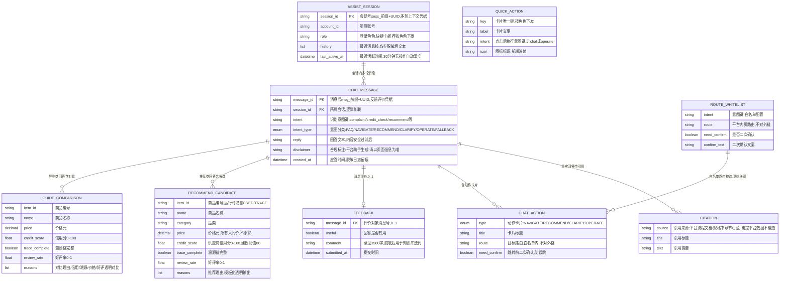

# 助手服务（ASSIST）数据库设计说明书

> 内容：**ER 图 + 存储落位方案 + 数据字典 + 结构设计说明书**（§1 图 / §2 实体清单 / §3 设计约定 / §4 关系说明 / §5 存储落位方案 / §6 数据字典 / §7 结构设计说明书）。
> 依据文档：`docs/design/产品设计文档.md` v1.0（基线）（§5.7 / §6.4.12 / §8.3.1）、`docs/design/微服务边界与职责基准.md` v1.6（§2.7 / §4.5）、
> `docs/design/高并发架构演进设计.md` v1.0（§2.1~§2.6、§3 异步削峰、ADR-7）、`services/assist/docs/openapi.yaml` v1.0.0（**唯一可手改源**）。
> 数据域归属：**不落业务库**（边界基准 v1.6 §2.7 定稿口径——脱敏日志 ≤30 天；会话 30 分钟 TTL 清空、不留跨会话记忆）；权威数据（信用分/档案/溯源/画像）经内部接口只读取数，不复制。
> 口径：与 openapi.yaml 冲突时以 openapi.yaml 为准。
> 版本：v1.0 · 2026-09-10（首版：七章齐全，遵边界基准 v1.6「ASSIST 不落业务库」口径；存储拓扑 = Redis + MQ + 脱敏审计日志 + Nacos 配置）。

## 1. ER 图（Mermaid）

## 2. 实体清单

| 实体（结构） | 存储介质 | 说明 |
|---|---|---|
| `assist_session` | Redis（独立实例） | 会话上下文：多轮指代，**30 分钟 TTL 自动清空、不留跨会话记忆** |
| `chat_message` | 脱敏审计日志（≤30 天） | 对话应答留痕：意图/回答/引用/动作，**不沉淀用户原文** |
| `citation` | 内嵌 `chat_message` | 引用来源（平台流程文档/规格书/页面，绑定平台数据不编造） |
| `chat_action` | 内嵌 `chat_message` | 结构化动作卡片（跳转/推荐/导购/一键代做） |
| `recommend_candidate` | 运行时对象（取数自 CRED/TRACE/PROFILE） | 对话内商品推荐候选（信用 40% + 溯源 30% + 价格 20% + 好评 10%） |
| `guide_comparison` | 运行时对象 | 澄清式导购 ≤5 个带理由对比 |
| `feedback` | 脱敏审计日志（≤30 天） | 回答有用性评价（脱敏后用于知识库迭代） |
| `route_whitelist` | Nacos 配置中心 | 意图→页面白名单路由（仅平台内页，不对外链） |
| `quick_action` | Nacos 配置中心 | 快捷操作卡（按登录角色下发，角色不可用不下发） |
| FAQ 规则库 | Nacos 配置 + 文档 | 分角色知识库；高频兜底命中优先（降时延降成本） |

> **不落业务库**（边界基准 v1.6 §2.7 定稿）：以上结构均不建 MySQL 表；对话数据 R-06 红线——脱敏前置、数据不出域、不沉淀原文、日志 ≤30 天自动清理；权威数据（信用分/档案/溯源/画像）经内部接口只读取数。

## 3. 关键设计约定

- **不落业务库（定稿口径）**：ASSIST 不建 MySQL 表（边界基准 v1.6 §2.7）；会话/日志在 Redis 与脱敏审计日志，权威数据只读引用、不复制（服务自有库原则下 ASSIST 的例外口径，ADR-7）。
- **R-06 对话数据合规**：脱敏前置（正则 + 实体识别）后才送 LLM；数据不出域；**不沉淀原文**（用户输入原文不落日志，仅脱敏后文本用于审计）；对话日志 ≤30 天脱敏自动清理；内容安全过滤（AC-C6）；未成年人场景额外敏感词与年龄限制。
- **R-05 / C8 AI 只标记不决策**：**不开放 LangChain 自由工具/函数调用**；平台硬护栏（脱敏前置 → 白名单路由 → FAQ 规则 → 内容安全 → 非竞价 → 审计日志）在编排之外强制执行。
- **非竞价、不杀熟**：推荐规则排序固定（信用 40% + 溯源 30% + 价格 20% + 好评 10%）并输出透明理由；无付费置顶；同一商品对所有人同价；排序不因画像差异化（J-09 授权画像权重叠加除外）。
- **白名单路由**：意图→页面跳转仅平台内页白名单，不对外链；跳转前二次确认（防误跳）；越权页面 2002 拦截；一键代做仅白名单安全操作（`autoExecute`），非白名单仅步骤卡引导。
- **幻觉管控**：答案绑定平台流程与文档、不编造；事实类回答带引用（citation）；前端必须展示「平台助手生成，请以页面信息为准」。
- **降级**：LLM 不可用 → 回退 FAQ 规则库 + 人工入口（G-01 热线/工单，TICKET），不纯 AI 硬答；LLM 健康检查恢复；无法识别走 FAQ → 人工入口。
- **会话语义**：`session_id` 缺省新建；30 分钟无操作自动清空（TTL）；**不留跨会话记忆**；`/assist/session/clear` 手动清空。
- **密钥**：DeepSeek 密钥经 KMS/环境变量注入，不入库不入日志（PDD §7.2 红线）。
- **限流**：Redis 令牌桶按账号限流（防滥用）；AI 链路按「账号 + 次/分钟」强限（高并发 §4.1）。
- **审计与观测**：意图命中率 / 跳转成功率 / 推荐采纳率（脱敏）为业务级指标；traceId 与主站透传一致（SkyWalking Python agent / OTel）。

## 4. 关系说明

| 关系 | 基数 | 说明 |
|---|---|---|
| ASSIST_SESSION — CHAT_MESSAGE | 1 : N | 会话内多轮消息（session_id 逻辑关联） |
| CHAT_MESSAGE — CITATION | 1 : N | 事实类回答带 0..N 个引用（内嵌） |
| CHAT_MESSAGE — CHAT_ACTION | 1 : N | 回答含 0..N 个动作卡片（内嵌） |
| CHAT_MESSAGE — FEEDBACK | 1 : 0..1 | 每条消息至多一条有用性评价 |
| CHAT_MESSAGE — RECOMMEND_CANDIDATE / GUIDE_COMPARISON | 1 : N | 推荐/导购类回答的候选与对比（运行时对象） |
| ROUTE_WHITELIST — CHAT_ACTION | 1 : N | 白名单路由校验（逻辑关联，配置中心） |
| ← ACC / CRED / TRACE / PROFILE | 逻辑关联 | 经内部接口只读取数（非外键，不复制权威数据） |
| → TICKET（人工兜底）/ LLM（DeepSeek） | 逻辑关联 | 兜底入口与模型通道（非外键） |
| QUICK_ACTION | 独立 | 按角色下发的静态配置，不参与会话 |

---

## 5. 存储落位方案（分库分表视角：不落业务库）

> 平台级分库分表/分布式 ID/时钟回拨决策原文见《高并发架构演进设计》v1.0 §2——该章约束**写库 Java 域**；ASSIST 为 Python 服务、不落业务库（边界基准 v1.6 §2.7 / ADR-7），本节给出「不落业务库」口径下的介质落位与继承关系。

### 5.1 分库与隔离（继承平台决策）

| 阶段 | 平台形态 | ASSIST 落位 |
|---|---|---|
| P1 地基期（M1） | 模块化单体共享主库（MySQL 主从） | **不参与**——ASSIST 无自有 MySQL 库，仅持有独立 Redis 实例与 MQ 队列（与 AICORE 同构的 Python 侧形态） |
| P2 服务化期（M2） | 交易/结算独立库，其余域共享主库 | 仍不建库（会话/日志治理依赖 Redis + 审计日志即可满足；如未来需对话质量分析大表，走评审再议） |
| 容灾 | 两地三中心 RPO≤15min/RTO≤30min | Redis 持久化（AOF）+ 审计日志随平台 WORM 体系；会话数据按 30min TTL 天然可重建 |

### 5.2 存储落位矩阵

| 结构 | 介质 | 键设计 | 生命周期 | 里程碑 |
|---|---|---|---|---|
| `assist_session` | Redis（独立实例，AOF） | `sess:{session_id}`（Hash/List） | **TTL 30 分钟**，无操作自动清空；手动 `/assist/session/clear` | M1 起 |
| `chat_message`（含 citation/action 内嵌） | 脱敏审计日志 | `msg:{message_id}` + traceId | **≤30 天**脱敏自动清理（R-06，不沉淀原文） | M1 起 |
| `feedback` | 脱敏审计日志 | 按 messageId + traceId | ≤30 天；脱敏统计另存知识库迭代指标 | M1 起 |
| `route_whitelist` / `quick_action` / FAQ 规则库 | Nacos 配置中心 + 文档 | 意图键/卡片键 | 随版本发布，热更新 | M1 起 |
| 限流计数 | Redis 令牌桶 | 按账号 | 滚动窗口 | M1 起 |
| 推荐/导购候选数据 | 运行时取数（CRED/TRACE/PROFILE） | 不落 ASSIST 存储 | 请求级生命周期 | M1 起 |

### 5.3 任务队列与削峰（继承高并发 §3）

- 队列 `assist.task`（高并发 §3.1 定稿）：ASSIST 生产 + 消费；LLM 异步任务 + 进度回调（对话流式输出）；与 `aicore.task` 同为 AI 队列，与资金队列**物理隔离**（AI 积压不得占用资金链路资源）。
- **幂等消费**：以消息业务键（messageId/sessionId）查重；FAQ 规则库命中优先（高频兜底，降时延降成本），LLM 兜底双轨。
- **死信/背压**：重试指数退避（1s→2s→4s…上限 5 次）→ DLQ + 告警人工介入；队列积压超阈值 → 告警 + 暂停非核心生产（继承高并发 §3.3）。

### 5.4 ID 与主键策略（继承高并发 §2.3 边界）

| 结构 | 主键 | 生成方式 | 说明 |
|---|---|---|---|
| `assist_session.session_id` | 业务号 | `sess_` 前缀 + UUID | 多轮上下文凭据 |
| `chat_message.message_id` | 业务号 | `msg_` 前缀 + UUID | 反馈评价凭据 |
| 引用外部 ID（itemId/merchantId 等） | 由源服务生成 | `item_`/`m_` 前缀 | 只读引用，不重新发号 |

- **Python 侧不参与雪花域**（高并发 §2.3.2 边界定稿）：ASSIST 业务号用 UUID，不用雪花、无 workerId、**无时钟回拨风险面**；雪花 ID 与时钟回拨三档预案仅适用于写库 Java 域。

### 5.5 Redis 与配置策略

- **Redis**：独立实例（与主站隔离）；开启 AOF（会话不因重启丢失）；`sess:{session_id}` TTL 30 分钟滑动续期（无操作自动清空，不留跨会话记忆）；FAQ 热缓存（命中优先）；令牌桶限流 key 按账号。
- **Nacos 配置**：白名单路由、快捷操作卡（按角色）、FAQ 规则库、推荐权重（信用 40% + 溯源 30% + 价格 20% + 好评 10%）统一入配置中心，热更新、灰度可回滚；变更留痕（审计）。

### 5.6 审计与日志治理（R-06 落地）

- 对话日志**不沉淀原文**：用户输入脱敏后才可留痕；**≤30 天自动清理**（脱敏）；内容安全命中事件同步安全审计。
- 审计日志（安全事件/告警）按平台体系 WORM/哈希链留存；对话业务日志与安全审计日志分通道。
- 观测指标（意图命中率/跳转成功率/推荐采纳率）只出脱敏聚合，不出个体明细。

### 5.7 待标定项
> ✅ 2026-09-11 评审定档:共性项(分片阈值 2000 万行/20GB、回拨窗口 W=5s/step=1000、热表 12 个月)已评审通过;带 ★ 项初值已定、压测/运行标定;本表待决项裁决与遗留见 [docs/待评审事项汇总.md](/docs/待评审事项汇总.md) 顶部「⭐ 定档记录(2026-09-11)」与 §6 数据库待标定项。

| 项 | 建议初值 | 裁决方式 |
|---|---|---|
| 推荐信用分阈值 | ✅ 已定（2026-09-11）：≥80 | 已定档，★运营标定 |
| FAQ 命中率目标 | ≥60%（高并发 §5.1） | 运行标定 |
| 会话 TTL | 30 分钟 | 已定（R-06 口径） |
| 对话日志保留 | 30 天 | 已定（R-06 口径） |
| AI 链路限流 | 10 次/分/账号（高并发 §4.4 初值） | 压测 + 试运行 |
| 推荐权重 | 信用 40% + 溯源 30% + 价格 20% + 好评 10% | 已定（J-03 口径，配置可调） |

---

## 6. 数据字典

> 通用约定：本服务**无 MySQL 表**（不落业务库，边界基准 v1.6 §2.7）；结构类型按 openapi.yaml `components.schemas` 的 JSON 类型标注（string / integer / number / boolean / object / array）；时间 ISO 8601 UTC 存储、输出 Asia/Shanghai；「脱敏」= 输出/留痕侧去标识；**不沉淀用户原文**（R-06）；枚举值与 openapi.yaml 一一对应；带 ★ 的值为建议初值、待标定（§5.7）。

### 6.1 assist_session（会话上下文，Redis）

| 字段 | 类型 | 空 | 键 | 默认 | 说明 |
|---|---|---|---|---|---|
| session_id | string | NO | PK | — | 会话号 `sess_` 前缀 + UUID；缺省新建 |
| account_id | string | NO | — | — | 所属账号（鉴权取数自 ACC） |
| role | string | NO | — | — | 登录角色（快捷卡/推荐按角色下发） |
| history | array\<string\> | NO | — | [] | 最近消息栈，**仅存脱敏后文本**，不存原文 |
| last_active_at | datetime(ISO8601) | NO | — | — | 最近活跃时间；**TTL 30 分钟滑动续期，无操作自动清空** |
| TTL / 清空 | — | — | — | 30min | 手动清空接口 POST /assist/session/clear（status=CLEARED） |

### 6.2 chat_message（对话应答留痕，脱敏审计日志 ≤30 天）

| 字段 | 类型 | 空 | 键 | 默认 | 说明 |
|---|---|---|---|---|---|
| message_id | string | NO | PK | — | 消息号 `msg_` 前缀 + UUID，反馈评价凭据 |
| session_id | string | NO | 逻辑关联 | — | 会话号（新建会话时返回） |
| intent | string | YES | — | null | 识别意图键（如 complaint / credit_check / recommend） |
| intent_type | enum(FAQ, NAVIGATE, RECOMMEND, CLARIFY, OPERATE, FALLBACK) | YES | — | null | 意图分类结果 |
| reply | string | NO | — | — | 回答文本（内容安全过滤后） |
| citations | array\<Citation\> | YES | — | null | 引用来源（事实类回答绑定平台数据/文档） |
| suggestions | array\<string\> | YES | — | null | 追问建议（快捷继续提问） |
| actions | array\<ChatAction\> | YES | — | null | 结构化动作卡片 |
| disclaimer | string | NO | — | — | 合规标注「平台助手生成，请以页面信息为准」（前端必须展示） |
| created_at | datetime(ISO8601) | NO | — | — | 应答时间 |

### 6.3 citation（引用来源，内嵌 chat_message）

| 字段 | 类型 | 空 | 键 | 默认 | 说明 |
|---|---|---|---|---|---|
| source | string | NO | — | — | 引用来源（平台流程文档/规格书章节/页面，绑定平台数据不编造） |
| title | string | YES | — | null | 引用标题 |
| text | string | YES | — | null | 引用摘要（事实类回答绑定来源） |

### 6.4 chat_action（动作卡片，内嵌 chat_message）

| 字段 | 类型 | 空 | 键 | 默认 | 说明 |
|---|---|---|---|---|---|
| type | enum(NAVIGATE, RECOMMEND, CLARIFY, OPERATE) | NO | — | — | 动作卡片类型 |
| title | string | NO | — | — | 卡片标题（如「已为您找到「我要投诉」，点击直达」） |
| route | string | YES | — | null | 目标路由（NAVIGATE 类型，**白名单内**） |
| need_confirm | boolean | YES | — | false | 跳转前是否需要二次确认（防误跳） |

### 6.5 recommend_candidate（推荐候选，运行时取数自 CRED/TRACE/PROFILE）

| 字段 | 类型 | 空 | 键 | 默认 | 说明 |
|---|---|---|---|---|---|
| item_id | string | NO | — | — | 商品编号（`item_` 前缀，取数自 CRED/TRACE） |
| name | string | NO | — | — | 商品名称 |
| category | string | YES | — | null | 品类 |
| price | number | NO | — | — | 价格（元；同一商品对所有人同价，不杀熟） |
| credit_score | number | NO | — | — | 供应商信用分 0~100（≥ 建议阈值 80★） |
| trace_complete | boolean | NO | — | — | 溯源链完整 |
| review_rate | number | NO | — | — | 好评率 0~1 |
| reasons | array\<string\> | NO | — | — | 推荐理由（模板化透明输出） |
| 排序规则 | — | — | — | — | 信用 40% + 溯源 30% + 价格 20% + 好评 10%（非竞价，不杀熟） |

### 6.6 guide_comparison（导购对比，运行时；≤5 个）

| 字段 | 类型 | 空 | 键 | 默认 | 说明 |
|---|---|---|---|---|---|
| item_id | string | NO | — | — | 商品编号 |
| name | string | NO | — | — | 商品名称 |
| price | number | NO | — | — | 价格（元） |
| credit_score | number | NO | — | — | 信用分 0~100 |
| trace_complete | boolean | NO | — | — | 溯源链完整 |
| review_rate | number | NO | — | — | 好评率 0~1 |
| reasons | array\<string\> | NO | — | — | 对比理由（信用/溯源/价格/好评透明对比） |
| clarifications（追问） | array\<ClarifyQuestion\> | YES | — | null | 模板化追问（用途/预算/给谁用，可跳过；key/question/options/skippable） |

### 6.7 feedback（回答评价，脱敏审计日志 ≤30 天）

| 字段 | 类型 | 空 | 键 | 默认 | 说明 |
|---|---|---|---|---|---|
| message_id | string | NO | 逻辑关联 | — | 评价对象消息号（ChatReply.messageId） |
| useful | boolean | NO | — | — | 回答是否有用 |
| comment | string | YES | — | null | 意见 ≤500 字，**脱敏后用于知识库迭代** |
| submitted_at | datetime(ISO8601) | NO | — | — | 提交时间 |
| status | enum(RECEIVED) | NO | — | — | 提交状态（FeedbackResult.status） |

### 6.8 route_whitelist（意图→页面白名单路由，Nacos 配置）

| 字段 | 类型 | 空 | 键 | 默认 | 说明 |
|---|---|---|---|---|---|
| intent | string | NO | PK | — | 意图键（如 complaint） |
| route | string | NO | — | — | 白名单路由（仅平台内页，不对外链） |
| need_confirm | boolean | NO | — | true | 跳转前需二次确认（防误跳） |
| confirm_text | string | YES | — | null | 二次确认文案（如 即将前往「我要投诉」，确认跳转？） |
| title | string | YES | — | null | 目标页面标题 |

### 6.9 quick_action（快捷操作卡，Nacos 配置，按角色下发）

| 字段 | 类型 | 空 | 键 | 默认 | 说明 |
|---|---|---|---|---|---|
| key | string | NO | PK | — | 卡片唯一键（如 nearby_store） |
| label | string | NO | — | — | 卡片文案（如 帮我找附近的店） |
| intent | string | NO | — | — | 点击后执行的意图键（走 chat 或 operate） |
| icon | string | YES | — | null | 图标标识（前端映射） |
| roles | array\<string\> | NO | — | — | 可见角色；角色不可用不下发 |

### 6.10 FAQ 规则库（Nacos 配置 + 文档，分角色）

| 字段 | 类型 | 说明 |
|---|---|---|
| key | string | FAQ 条目键（分角色知识库） |
| question_pattern | string | 问题匹配（规则/向量） |
| answer | string | 步骤式引导答案，绑定平台流程与文档、不编造，标注「以页面为准」 |
| roles | array\<string\> | 可见角色 |
| updated_at | string(ISO8601) | 版本更新时间（配置热更新留痕） |

---

## 7. 结构设计说明书

### 7.1 assist_session（会话上下文，Redis）

- **用途**：多轮指代理解（J-04）；30 分钟无操作自动清空、**不留跨会话记忆**（R-06 口径）。
- **主键（策略）**：`session_id` 业务号（`sess_` 前缀 + UUID）；Python 侧不参与雪花域（高并发 §2.3.2 边界）。
- **索引（键设计）**：Redis `sess:{session_id}`（Hash/List）；按账号的有序集合（可查活跃会话，仅运维用途）。
- **约束**：TTL 30 分钟滑动续期；手动清空接口 POST /assist/session/clear；history 仅存脱敏后文本、**不存原文**。
- **安全**：脱敏前置；会话上下文不出域；无跨会话记忆（会话结束即不可恢复）。
- **生命周期**：TTL 到期自动删除；AOF 持久化防重启丢失（非长留存）。
- **接口映射**：POST /assist/chat（sessionId 可选，缺省新建）、POST /assist/session/clear（清空）。

### 7.2 chat_message（对话应答留痕，脱敏审计日志）

- **用途**：对话应答留痕（意图/回答/引用/动作），支持反馈评价与业务指标统计（J-01/J-04/J-06）。
- **主键（策略）**：`message_id` 业务号（`msg_` 前缀 + UUID），反馈评价凭据。
- **索引（键设计）**：日志序列 + traceId 检索；按 `session_id`/`intent_type` 聚合出脱敏统计。
- **约束**：`disclaimer` 前端必须展示；**不沉淀用户输入原文**（仅脱敏留痕）；内容安全过滤后输出。
- **安全**：脱敏 + 内容安全（AC-C6）；未成年人场景额外敏感词与年龄限制；数据不出域。
- **生命周期**：≤30 天脱敏自动清理（R-06）。
- **接口映射**：POST /assist/chat（生产，SSE/JSON 双模式）、POST /assist/feedback（评价对象）。

### 7.3 recommend_candidate / guide_comparison（推荐与导购，运行时）

- **用途**：对话内商品推荐（透明理由，非竞价，J-03）与澄清式导购（≤5 个带理由对比，J-13）。
- **主键（策略）**：无独立主键——运行时对象，`item_id` 只读引用源域（CRED/TRACE）。
- **索引（键设计）**：请求级生命周期，不落 ASSIST 存储；取数经内部接口。
- **约束**：排序规则固定（信用 40% + 溯源 30% + 价格 20% + 好评 10%）；候选不足（`insufficient`）如实提示不硬凑；同一商品对所有人同价（不杀熟）；无付费置顶。
- **安全**：取数需授权（PROFILE 授权画像权重 J-09 叠加）；理由模板化透明输出。
- **生命周期**：请求级；统计走脱敏聚合指标。
- **接口映射**：POST /assist/recommend、POST /assist/guide。

### 7.4 feedback（回答评价）

- **用途**：有用性反馈（J-05），脱敏后用于知识库迭代与模型调优（不回流第三方）。
- **主键（策略）**：无独立主键——以 `message_id` 关联（0..1）。
- **索引（键设计）**：日志按 messageId + traceId 检索；聚合出推荐采纳率等脱敏指标。
- **约束**：`comment` ≤500 字脱敏；仅用于平台调优。
- **安全**：脱敏后统计；不回流第三方（R-05）。
- **生命周期**：≤30 天脱敏自动清理；聚合指标长期留。
- **接口映射**：POST /assist/feedback（status=RECEIVED）。

### 7.5 route_whitelist（白名单路由）

- **用途**：意图 → 页面跳转白名单（J-02），仅平台内页、不对外链；跳转前二次确认。
- **主键（策略）**：`intent` 意图键（配置唯一）。
- **索引（键设计）**：Nacos 配置中心，热更新；变更留痕。
- **约束**：越权页面 2002 拦截；二次确认防误跳；一键代做仅白名单安全操作（`autoExecute=true` 才跳转高亮，否则仅步骤卡）。
- **安全**：路由仅平台内页；不对接外链。
- **生命周期**：随版本发布，灰度可回滚。
- **接口映射**：POST /assist/navigate、POST /assist/operate（校验对象）。

### 7.6 quick_action（快捷操作卡）

- **用途**：按登录角色下发的快捷操作卡（J-15），降低使用门槛。
- **主键（策略）**：`key` 卡片唯一键（配置唯一）。
- **索引（键设计）**：Nacos 配置；按角色过滤下发。
- **约束**：角色不可用不下发；点击走 chat 或 operate 意图键。
- **安全**：白名单安全操作才可一键代做。
- **生命周期**：随版本发布，热更新。
- **接口映射**：GET /assist/quick-actions。

### 7.7 FAQ 规则库（分角色知识库）

- **用途**：使用指导（分角色 FAQ + 步骤引导，J-01）；LLM 不可用时的高频兜底（降时延降成本）。
- **主键（策略）**：`key` FAQ 条目键（配置唯一）。
- **索引（键设计）**：Nacos 配置 + 文档；规则/向量匹配。
- **约束**：答案绑定平台流程与文档、不编造；标注「以页面为准」；FAQ 命中优先于 LLM（高频兜底双轨）。
- **安全**：分角色可见；无敏感原文。
- **生命周期**：随版本发布；命中统计走脱敏指标。
- **接口映射**：POST /assist/chat（FALLBACK 时命中）。

### 7.8 出方向依赖与合规护栏（跨服务，逻辑关联）

- **取数（只读引用，不复制权威数据）**：ACC（实名/账户）、CRED（信用分/放心供应商标识）、TRACE（溯源完整度）、PROFILE（授权画像权重 J-09 叠加排序）——经统一鉴权 + 内部接口。
- **LLM（DeepSeek 开放平台）**：仅作对话/意图/流程编排；平台硬护栏（脱敏前置 → 白名单路由 → FAQ 规则 → 内容安全 → 非竞价 → 审计日志）在编排之外强制执行；**不开放 LangChain 自由工具/函数调用**；密钥 KMS 注入。
- **人工兜底**：无法识别 → FAQ → 人工入口 G-01（TICKET 热线/工单），不纯 AI 硬答。
- **合规**：数据不出域；DeepSeek 不用于训练/留存策略（M0 数据合规条款确认）；对话数据脱敏日志 ≤30 天。

---

*文档结束 · 与 `services/assist/docs/openapi.yaml`（唯一可手改源）、《高并发架构演进设计》v1.0 §2/§3、《产品设计文档》v1.0（基线）§5.7/§6.4.12、《微服务边界与职责基准》v1.6 §2.7 同步维护。*
