# 民生互动服务（CIVIC）数据库设计说明书

> 内容：**ER 图 + 分库分表方案 + 数据字典 + 表设计说明书**（§1 图 / §2 实体清单 / §3 设计约定 / §4 关系说明 / §5 分库分表 / §6 数据字典 / §7 表设计说明书）。
> 依据文档：`docs/design/产品设计文档.md` v1.12（§5.13 / §6.4.10 / §8.3.1）、`docs/design/微服务边界与职责基准.md` v1.2（§2.13 / §4.5）、
> `docs/design/高并发架构演进设计.md` v0.3（§2.1~§2.6、ADR-4/ADR-7）、`services/civic/docs/openapi.yaml` v1.0.0（**唯一可手改源**）。
> 数据域归属：**互动域**（§4.5 未单列，本文档随 M2 补充定义）——12 张表落共享主库 + `civic_` schema 前缀隔离（Java 域既有路线）。
> 口径：与 openapi.yaml 冲突时以 openapi.yaml 为准。
> 版本：v1.0 · 2026-09-10（首版：七章齐全；M2~M3 设计先行——互动域 12 表，内容流水类按月分表，主数据不分片）。

## 1. ER 图（Mermaid）

```mermaid
erDiagram
    %% CIVIC 互动域 ER 图 · 群众建议 + 民生项目监督 + 圈层论坛 + 优质小店推广 + 商户动态（G-02/H/E 组,E-04）
    %% 存储：共享主库 + civic_ schema 前缀隔离;内容流水类按月分表(forum_post/forum_reply/shop_review/merchant_post_YYYYMM)
    %% 附件仅存 OSS 对象键;权威数据(实名/信用分)经内部接口只读引用;公示联动经 DASH——逻辑关联、非外键

    SUGGESTION {
        bigint suggestion_id PK "雪花ID,API输出sug_前缀"
        bigint author_id "提交账号,匿名时仅审计留痕接口不暴露"
        varchar category "建议分类,体系上线前评审"
        varchar title "建议标题≤100"
        text content "建议内容≤5000,敏感词+人工复核"
        boolean anonymous "匿名提交,服务端脱敏展示"
        json evidence_keys "附件OSS对象键"
        enum status "PENDING_REVIEW/ASSIGNED/ADOPTED/PARTIALLY_ADOPTED/REJECTED"
        datetime created_at "提交时间"
        datetime replied_at "答复时间"
    }

    SUGGESTION_REPLY {
        bigint suggestion_id PK "1:1物理外键"
        enum verdict "ADOPTED/PARTIALLY_ADOPTED/REJECTED"
        varchar reason "答复理由≤2000,公示脱敏,不采纳必填"
        varchar department "答复部门"
        datetime replied_at "限时答复时间"
    }

    CIVIC_PROJECT {
        bigint project_id PK "雪花ID,API输出prj_前缀"
        varchar title "项目名称"
        enum status "PLANNED/ONGOING/PAUSED/COMPLETED"
        varchar department "责任部门"
        decimal budget "资金万元"
        date start_date "开工日期"
        date end_date "完工日期"
        int progress "进度0-100"
        text plan "建设计划说明"
        datetime updated_at "进度最近更新时间"
    }

    PROJECT_PROGRESS {
        bigint progress_id PK "雪花ID"
        bigint project_id FK "所属项目,物理外键"
        datetime at "进度更新时间"
        varchar text "进度说明"
        json media_keys "进度图文/视频OSS对象键"
    }

    PROJECT_COMMENT {
        bigint comment_id PK "雪花ID,API输出cmt_前缀"
        bigint project_id FK "所属项目,物理外键"
        text content "意见内容≤2000,敏感词+人工复核"
        json evidence_keys "证据附件OSS对象键"
        datetime created_at "提交时间"
    }

    PROJECT_COMMENT_REPLY {
        bigint comment_id PK "1:1物理外键"
        varchar content "回应内容≤2000,公示脱敏"
        varchar department "回应方,建设方/责任部门"
        datetime replied_at "限时回应时间"
    }

    FORUM_POST {
        bigint post_id PK "雪花ID,API输出fpost_前缀"
        varchar circle "圈层标识,行业/地域分层"
        bigint author_id "作者账号"
        varchar title "帖子标题≤100"
        text content "帖子内容≤10000,敏感词+人工复核"
        json image_keys "图片附件OSS对象键"
        enum status "REVIEWING/PUBLISHED/REJECTED,内容治理留痕"
        int reply_count "回复数"
        datetime created_at "发帖时间,分表键"
    }

    FORUM_REPLY {
        bigint reply_id PK "雪花ID,API输出freply_前缀"
        bigint post_id "所属帖子,逻辑关联随帖同月分表"
        bigint author_id "回复账号"
        varchar content "回复内容≤2000,敏感词+人工复核"
        enum status "REVIEWING/PUBLISHED/REJECTED"
        datetime created_at "回帖时间,分表键"
    }

    SHOP_PROMOTION {
        varchar batch_no PK "榜单周期号batch_前缀,联合主键"
        varchar merchant_id PK "商户编号,联合主键"
        varchar name "小店名称,脱敏展示"
        varchar industry "行业"
        decimal credit_score "信用分0-100,信用加权输入"
        decimal review_rate "好评率0-1"
        int review_count "点评数"
        json tags "标签,如放心供应商/明厨亮灶"
        int rank "榜单名次"
        datetime updated_at "快照更新时间"
    }

    SHOP_REVIEW {
        bigint review_id PK "雪花ID,API输出srv_前缀"
        varchar merchant_id "被点评商户"
        bigint reviewer_id "点评账号"
        int rating "评分1~5星"
        varchar content "点评内容≤1000,敏感词+人工复核"
        datetime created_at "点评时间,分表键"
    }

    MERCHANT_POST {
        bigint post_id PK "雪花ID,API输出mpost_前缀"
        varchar merchant_id "商户编号,必须本人商户越权2002"
        varchar merchant_name "商户名称,脱敏展示"
        enum type "动态类型:TEXT/IMAGE/VIDEO"
        varchar content "动态文案≤2000,敏感词+人工复核"
        json media_keys "图文/短视频OSS对象键"
        enum status "REVIEWING/PUBLISHED/REJECTED"
        datetime created_at "发布时间,分表键"
    }

    CONTENT_AUDIT_RECORD {
        bigint audit_id PK "雪花ID,API输出aud_前缀"
        enum biz_type "SUGGESTION/PROJECT_COMMENT/FORUM_POST/FORUM_REPLY/SHOP_REVIEW/MERCHANT_POST"
        varchar biz_id "被审内容ID,逻辑关联"
        enum result "PASS/REJECT/MANUAL"
        json sensitive_hits "敏感词命中,脱敏"
        varchar reviewer "人工复核人,脱敏展示"
        datetime reviewed_at "复核时间"
        datetime created_at "送审时间"
    }

    SUGGESTION ||--o| SUGGESTION_REPLY : "限时答复+采纳公示,1:1"
    CIVIC_PROJECT ||--o{ PROJECT_PROGRESS : "进度同步记录"
    CIVIC_PROJECT ||--o{ PROJECT_COMMENT : "群众提意见"
    PROJECT_COMMENT ||--o| PROJECT_COMMENT_REPLY : "建设方限时回应,1:1"
    FORUM_POST ||--o{ FORUM_REPLY : "回帖,随帖同月分表"
    SHOP_PROMOTION ||--o{ SHOP_REVIEW : "榜单聚合,逻辑关联非FK"

    %% CONTENT_AUDIT_RECORD 经 biz_type+biz_id 逻辑关联全部内容实体(建议/意见/帖/回帖/点评/动态),非外键
    %% 外部逻辑关联(经内部接口,非外键):实名/账号取数 ACC;榜单信用分输入 CRED(credit_score 唯一权威);附件仅存 OSS 对象键;
    %% 建议答复/回应/公示事件上报 DASH(A-08 公示联动);恶意点评申诉走 TICKET D-03(复用,不建第二套申诉)
```

## 2. 实体清单

| 实体（表名） | 存储介质 | 说明 |
|---|---|---|
| `suggestion` | 共享主库（civic_ schema） | 群众建议（实名/匿名可选，M2 G-02），提交 → 审核分派 → 限时答复 → 采纳公示 |
| `suggestion_reply` | 共享主库 | 部门限时答复 + 采纳公示（1:1） |
| `civic_project` | 共享主库 | 民生项目（M3 H-01）：计划/资金/工期/责任部门 + 进度 |
| `project_progress` | 共享主库 | 项目进度同步记录（图文/视频/数据） |
| `project_comment` | 共享主库 | 群众对项目提意见（M3 H-02） |
| `project_comment_reply` | 共享主库 | 建设方限时回应并公示（1:1） |
| `forum_post` | 共享主库，**按月分表** | 行业圈层论坛帖（M3 E-01） |
| `forum_reply` | 共享主库，**随帖同月分表** | 回帖 |
| `shop_promotion` | 共享主库 | 优质小店免费推广榜单快照（M3 E-02，非竞价不收费，信用加权 + 防刷） |
| `shop_review` | 共享主库，**按月分表** | 群众点评小店（榜单输入） |
| `merchant_post` | 共享主库，**按月分表** | 商户动态（M2 E-04，图文/短视频） |
| `content_audit_record` | 共享主库 | 内容治理留痕（敏感词 + 人工复核，全内容实体通用） |

> 附件（图片/视频）一律 OSS 前端直传、本服务仅存对象键（不存媒体原文）；权威数据（实名、信用分）经内部接口只读引用。

## 3. 关键设计约定

- **内容治理防谣言**：全部 UGC 内容（建议/意见/帖/回帖/点评/动态）敏感词 + 人工复核，审核留痕落 `content_audit_record`；未成年人内容年龄限制。
- **R-03 数据分级授权**：匿名建议服务端脱敏（`anonymous=true` 时 `author_id` 仅审计留痕、接口不暴露）；作者昵称/商户名/答复部门脱敏展示（如 张\*饭馆、王\*员）；结果公示脱敏。
- **R-13 推广合规**：优质小店榜非竞价、不收费；信用加权（信用分输入自 CRED，`credit_score` 唯一权威）+ 防刷拦截（R-15：`uk_daily(merchant_id, reviewer_id, reviewed_date)` 建议初值★）；榜单周期快照可回溯。
- **限时答复/回应**：建议限时答复（`SUGGESTION.replied_at`）、项目意见限时回应（`PROJECT_COMMENT_REPLY.replied_at`），超时升级走平台 JOB/MQ；答复/回应/公示事件上报 DASH（A-08 公示联动）。
- **与画像边界清晰**：不收集无关信息、互动数据不用于画像训练（R-03）。
- **申诉复用**：恶意点评申诉走 TICKET D-03 既有机制，本服务不建第二套申诉。
- **越权**：商户动态必须本人商户（2002 拦截）；建议/意见/点评仅本人可改删（如提供）。
- **政务双轨（P-04）**：政务接口不可接 → 自建替代（本项目自建建议/项目/回应体系即替代轨）。
- **分布式 ID**：写库 Java 域统一用雪花 ID（`infra-idgen`，DB 存 bigint，API 输出业务号前缀字符串 `sug_`/`prj_`/`cmt_`/`fpost_`/`freply_`/`srv_`/`mpost_`/`aud_`/`batch_`）；workerId Redis INCR + 租约；**时钟回拨三档预案**（L1≤5s 退避 → L2 自动切号段兜底 → L3 拒绝发号，Prometheus 指标 + Alertmanager 分级告警，见高并发 §2.3.1~§2.3.4）适用。
- **分表**：内容流水类（`forum_post`/`forum_reply`/`shop_review`/`merchant_post`）按月分表（§5.2）；主数据不分片；路由以业务字段 `created_at` 为准，不依赖 ID 内嵌时间戳。
- **审计**：审核/答复/公示操作审计日志 ≥6 个月（WORM/哈希链）；存证只增不改。

## 4. 关系说明

| 关系 | 基数 | 说明 |
|---|---|---|
| SUGGESTION — SUGGESTION_REPLY | 1 : 0..1 | 部门限时答复 + 采纳公示（物理外键） |
| CIVIC_PROJECT — PROJECT_PROGRESS | 1 : N | 进度同步记录（物理外键） |
| CIVIC_PROJECT — PROJECT_COMMENT | 1 : N | 群众对项目提意见（物理外键） |
| PROJECT_COMMENT — PROJECT_COMMENT_REPLY | 1 : 0..1 | 建设方限时回应（物理外键） |
| FORUM_POST — FORUM_REPLY | 1 : N | 回帖随帖同月分表（逻辑关联，跨分片禁 JOIN） |
| SHOP_PROMOTION — SHOP_REVIEW | 1 : N | 榜单聚合（逻辑关联非外键，点评按月分表异步聚合） |
| CONTENT_AUDIT_RECORD — 各内容实体 | M : N | biz_type + biz_id 逻辑关联（非外键） |
| → ACC / CRED / DASH / TICKET / OSS | 逻辑关联 | 实名、信用分（只读引用）、公示联动（事件上报）、申诉复用、附件对象键 |

---

## 5. 分库分表方案

> 平台级策略以《高并发架构演进设计》v0.3 §2.1~§2.6 / ADR-4 / ADR-7 为准，本节做「平台策略 → CIVIC 互动域」的落地映射。

### 5.1 分库与隔离

| 阶段 | 平台形态 | CIVIC 落位 |
|---|---|---|
| P1 地基期（M1） | 模块化单体共享主库（MySQL 8，主从） | 占位期不建表；交付 M2~M3 时表落共享主库，**`civic_` schema 前缀隔离**（对齐高并发 §6 优化点① 禁跨域直连读表） |
| P2 服务化期（M2~M3） | 交易/结算独立库，其余域共享主库 | CIVIC 留共享主库（非交易/结算域）；内容量级触发阈值后再评估独立成库（§5.7） |
| 容灾 | 两地三中心 RPO≤15min / RTO≤30min | 随共享主库容灾体系（L3 服务允许短暂降级） |

### 5.2 分片矩阵

| 表 | 分片方式 | 分片键 | 表命名 | 归档策略 | 里程碑 |
|---|---|---|---|---|---|
| `suggestion` / `suggestion_reply` | 不分片（工作单类，行数可控） | — | 同名 | 不归档（公示留痕） | M2 起 |
| `civic_project` / `project_progress` / `project_comment` / `project_comment_reply` | 不分片 | — | 同名 | 项目完结后归档 | M3 起 |
| `forum_post` | **按月分表** | `circle` + `created_at` | `forum_post_YYYYMM` | >12 月热转冷 OSS，保留热表 12 个月 | M3 起 |
| `forum_reply` | **随帖同月分表** | `post_id` + `created_at` | `forum_reply_YYYYMM` | 同上 | M3 起 |
| `shop_promotion` | 不分片（周期快照） | — | 同名 | 周期快照留档可回溯 | M3 起 |
| `shop_review` | **按月分表** | `merchant_id` + `created_at` | `shop_review_YYYYMM` | >12 月热转冷 OSS | M3 起 |
| `merchant_post` | **按月分表** | `merchant_id` + `created_at` | `merchant_post_YYYYMM` | >12 月热转冷 OSS | M2 起 |
| `content_audit_record` | 不分片 | — | 同名 | 审计留痕 ≥6 月 | M2 起 |

> **分片阈值**（平台级建议初值）：单表 >2000 万行 或 >20GB 触发再分；按月分表天然可控，冷数据到点即归档。

### 5.3 分表路由规则

- **路由层**：MyBatis-Plus 自定义分表插件（拦截按月路由）+ 统一 `ShardingKey` 注解；M2 分库后评估 ShardingSphere-Proxy。
- **写入**：按 `created_at` 月份路由到 `{表}_YYYYMM`，`ShardingKey` 显式声明（forum_post: circle；shop_review/merchant_post: merchant_id）。
- **查询**：列表/详情必须携带分片键下推——帖子按 `circle`+日期、点评按 `merchant_id`、动态按 `merchant_id`；跨月查询禁 SQL UNION 全表扫描，聚合走异步/从库。
- **禁止跨分片 JOIN / 聚合 / 事务**：`forum_reply` 随帖同月分表保证「帖+回帖」详情同分片；榜单聚合（点评→好评率/点评数）走异步任务 + 快照，不进 OLTP 主库。

### 5.4 分布式 ID 与主键策略

| 表 | 主键 | 生成方式 | 说明 |
|---|---|---|---|
| `suggestion` / `civic_project` / `project_comment` / `forum_post` / `forum_reply` / `shop_review` / `merchant_post` / `content_audit_record` | bigint 雪花 ID | 统一组件 `infra-idgen` | API 输出字符串带业务号前缀（`sug_`/`prj_`/`cmt_`/`fpost_`/`freply_`/`srv_`/`mpost_`/`aud_`），防 JS 大数精度 |
| `project_progress` | bigint 雪花 ID | `infra-idgen` | 接口内嵌（notes），无前缀输出 |
| `shop_promotion` | 联合主键（`batch_no` + `merchant_id`） | 周期号 `batch_` 前缀 + 源域 ID | 榜单快照周期可回溯 |
| 引用外部 ID（author_id/merchant_id 等） | 由源服务生成 | `acc_`/`m_` 前缀 | 只读引用，不重新发号 |

- **时钟回拨三档预案**（高并发 §2.3.1~§2.3.4）对本服务生效（写库 Java 域）：L1 轻微回拨（≤5s）退避等待 → L2 超预算自动切号段兜底（`id_allocator` 表 DB 自增）→ L3 号段不可用拒绝发号 + 快速失败；号段兜底期间分表路由以业务字段 `created_at` 为准。

### 5.5 读写分离与冷热归档

- **读写分离**：主库写、从库读（`@ReadOnly` 注解路由）；「写后立即读」（发帖/答复后立即查状态）强制走主库。
- **冷热归档**：内容流水类 >12 月热转冷 OSS（Parquet/压缩），查询走归档快照；公示数据（建议答复/项目回应）不归档、长期留痕。

### 5.6 演进步骤（expand-migrate-contract）

> 表结构/分表规则变更按「扩展 → 迁移 → 收缩」执行，禁止破坏性 DDL 直上生产（对齐高并发 §2.6）：双写 → 回灌 → 切读 → 收缩。

### 5.7 待标定项

| 项 | 建议初值 | 裁决方式 |
|---|---|---|
| 建议分类体系 | 上线前评审 | 评审 |
| 点评防刷唯一约束 | 每用户每商户每日 1 条（uk_daily★） | 评审 + 运行标定 |
| 榜单周期 | 每日/每周（batch_no 粒度） | 评审 |
| CIVIC 独立成库触发阈值 | 内容流水单表逼近 2000 万行 | 数据增长标定 |
| 限时答复/回应超时时限 | 工作日 X 天（对齐 TICKET 升级口径） | 评审 |

---

## 6. 数据字典

> 通用约定：MySQL 8.0，引擎 InnoDB，字符集 utf8mb4；时间 `datetime(3)` 毫秒精度、UTC 存储、输出 Asia/Shanghai；金额 `decimal(12,2)`（预算，万元）；评分/置信区间用 decimal/tinyint；数组/内嵌对象用 JSON 列；**枚举值与 openapi.yaml `components.schemas` 一一对应**；附件一律仅存 OSS 对象键；带 ★ 的值为建议初值、待标定（§5.7）。

### 6.1 suggestion（群众建议，不分片）

| 字段 | 类型 | 空 | 键 | 默认 | 说明 |
|---|---|---|---|---|---|
| suggestion_id | bigint UNSIGNED | NO | PK | — | 雪花 ID；API 输出 `sug_` 前缀字符串 |
| author_id | bigint UNSIGNED | YES | — | NULL | 提交账号；**匿名时仅审计留痕、接口不暴露**（R-03） |
| category | varchar(50) | NO | — | — | 建议分类（体系上线前评审） |
| title | varchar(100) | NO | — | — | 建议标题 |
| content | text | NO | — | — | 建议内容 ≤5000（敏感词 + 人工复核） |
| anonymous | tinyint(1) | NO | — | 0 | 匿名提交（服务端脱敏展示） |
| evidence_keys | JSON | YES | — | NULL | 附件 OSS 对象键 |
| status | enum('PENDING_REVIEW','ASSIGNED','ADOPTED','PARTIALLY_ADOPTED','REJECTED') | NO | — | PENDING_REVIEW | 状态机：提交 → 平台审核分派 → 限时答复 → 采纳公示 |
| created_at | datetime(3) | NO | — | CURRENT_TIMESTAMP(3) | 提交时间 |
| replied_at | datetime(3) | YES | — | NULL | 答复时间（已答复时有值） |

### 6.2 suggestion_reply（部门限时答复，不分片，1:1）

| 字段 | 类型 | 空 | 键 | 默认 | 说明 |
|---|---|---|---|---|---|
| suggestion_id | bigint UNSIGNED | NO | PK | — | 物理外键 → suggestion.suggestion_id |
| verdict | enum('ADOPTED','PARTIALLY_ADOPTED','REJECTED') | NO | — | — | 答复结论（采纳/部分采纳/不采纳 + 理由公示） |
| reason | varchar(2000) | YES | — | NULL | 答复理由（公示脱敏；**不采纳必填**） |
| department | varchar(64) | YES | — | NULL | 答复部门 |
| replied_at | datetime(3) | NO | — | — | 限时答复时间 |

### 6.3 civic_project（民生项目，不分片）

| 字段 | 类型 | 空 | 键 | 默认 | 说明 |
|---|---|---|---|---|---|
| project_id | bigint UNSIGNED | NO | PK | — | 雪花 ID；API 输出 `prj_` 前缀字符串 |
| title | varchar(200) | NO | — | — | 项目名称 |
| status | enum('PLANNED','ONGOING','PAUSED','COMPLETED') | NO | — | PLANNED | 项目状态机 |
| department | varchar(64) | YES | — | NULL | 责任部门 |
| budget | decimal(12,2) | YES | — | NULL | 资金（万元） |
| start_date | date | YES | — | NULL | 开工日期 |
| end_date | date | YES | — | NULL | 完工日期 |
| progress | int UNSIGNED | NO | — | 0 | 进度百分比 0~100 |
| plan | text | YES | — | NULL | 建设计划说明 |
| updated_at | datetime(3) | NO | — | CURRENT_TIMESTAMP(3) | 进度最近更新时间 |

### 6.4 project_progress（进度同步记录，不分片）

| 字段 | 类型 | 空 | 键 | 默认 | 说明 |
|---|---|---|---|---|---|
| progress_id | bigint UNSIGNED | NO | PK | — | 雪花 ID（接口内嵌 notes，无前缀输出） |
| project_id | bigint UNSIGNED | NO | FK | — | 物理外键 → civic_project.project_id |
| at | datetime(3) | NO | — | — | 进度更新时间 |
| text | varchar(2000) | NO | — | — | 进度说明 |
| media_keys | JSON | YES | — | NULL | 进度图文/视频 OSS 对象键 |

### 6.5 project_comment（群众对项目提意见，不分片）

| 字段 | 类型 | 空 | 键 | 默认 | 说明 |
|---|---|---|---|---|---|
| comment_id | bigint UNSIGNED | NO | PK | — | 雪花 ID；API 输出 `cmt_` 前缀字符串 |
| project_id | bigint UNSIGNED | NO | FK | — | 物理外键 → civic_project.project_id |
| content | text | NO | — | — | 意见内容 ≤2000（敏感词 + 人工复核） |
| evidence_keys | JSON | YES | — | NULL | 证据附件 OSS 对象键 |
| created_at | datetime(3) | NO | — | CURRENT_TIMESTAMP(3) | 提交时间 |

### 6.6 project_comment_reply（建设方限时回应，不分片，1:1）

| 字段 | 类型 | 空 | 键 | 默认 | 说明 |
|---|---|---|---|---|---|
| comment_id | bigint UNSIGNED | NO | PK | — | 物理外键 → project_comment.comment_id |
| content | varchar(2000) | NO | — | — | 回应内容（限时回应，公示脱敏） |
| department | varchar(64) | YES | — | NULL | 回应方（建设方/责任部门） |
| replied_at | datetime(3) | NO | — | — | 限时回应时间 |

### 6.7 forum_post（行业圈层论坛帖，按月分表 forum_post_YYYYMM）

| 字段 | 类型 | 空 | 键 | 默认 | 说明 |
|---|---|---|---|---|---|
| post_id | bigint UNSIGNED | NO | PK | — | 雪花 ID；API 输出 `fpost_` 前缀字符串 |
| circle | varchar(50) | NO | — | — | 圈层标识（行业/地域分层），**分表键** |
| author_id | bigint UNSIGNED | NO | — | — | 作者账号（展示昵称脱敏） |
| title | varchar(100) | NO | — | — | 帖子标题 |
| content | text | NO | — | — | 帖子内容 ≤10000（敏感词 + 人工复核） |
| image_keys | JSON | YES | — | NULL | 图片附件 OSS 对象键 |
| status | enum('REVIEWING','PUBLISHED','REJECTED') | NO | — | REVIEWING | 审核状态（内容治理留痕；接口暂不暴露，对齐 merchant_post 同枚举） |
| reply_count | int UNSIGNED | NO | — | 0 | 回复数 |
| created_at | datetime(3) | NO | — | CURRENT_TIMESTAMP(3) | 发帖时间，**分表键** |

### 6.8 forum_reply（回帖，随帖同月分表 forum_reply_YYYYMM）

| 字段 | 类型 | 空 | 键 | 默认 | 说明 |
|---|---|---|---|---|---|
| reply_id | bigint UNSIGNED | NO | PK | — | 雪花 ID；API 输出 `freply_` 前缀字符串 |
| post_id | bigint UNSIGNED | NO | — | — | 所属帖子（逻辑关联，**随帖同月分片**） |
| author_id | bigint UNSIGNED | NO | — | — | 回复账号（昵称脱敏展示） |
| content | varchar(2000) | NO | — | — | 回复内容（敏感词 + 人工复核） |
| status | enum('REVIEWING','PUBLISHED','REJECTED') | NO | — | REVIEWING | 审核状态（同 forum_post） |
| created_at | datetime(3) | NO | — | CURRENT_TIMESTAMP(3) | 回帖时间，**分表键** |

### 6.9 shop_promotion（优质小店推广榜单快照，不分片）

| 字段 | 类型 | 空 | 键 | 默认 | 说明 |
|---|---|---|---|---|---|
| batch_no | varchar(32) | NO | PK(联合) | — | 榜单周期号 `batch_` 前缀（如 batch_20260115） |
| merchant_id | varchar(32) | NO | PK(联合) | — | 商户编号（引用 CRED 域 ID，只读引用） |
| name | varchar(64) | NO | — | — | 小店名称（脱敏展示，如 张\*饭馆） |
| industry | varchar(32) | YES | — | NULL | 行业 |
| credit_score | decimal(5,2) | NO | — | — | 信用分 0~100（信用加权推荐输入，唯一权威在 CRED） |
| review_rate | decimal(3,2) | NO | — | — | 好评率 0~1 |
| review_count | int UNSIGNED | NO | — | 0 | 点评数 |
| tags | JSON | YES | — | NULL | 标签（放心供应商/明厨亮灶等） |
| rank | int UNSIGNED | NO | — | — | 榜单名次（信用加权 + 防刷，非竞价不收费 R-13） |
| updated_at | datetime(3) | NO | — | CURRENT_TIMESTAMP(3) | 快照更新时间 |

### 6.10 shop_review（群众点评，按月分表 shop_review_YYYYMM）

| 字段 | 类型 | 空 | 键 | 默认 | 说明 |
|---|---|---|---|---|---|
| review_id | bigint UNSIGNED | NO | PK | — | 雪花 ID；API 输出 `srv_` 前缀字符串 |
| merchant_id | varchar(32) | NO | — | — | 被点评商户，**分表键** |
| reviewer_id | bigint UNSIGNED | NO | — | — | 点评账号 |
| rating | tinyint UNSIGNED | NO | — | — | 评分 1~5 星 |
| content | varchar(1000) | YES | — | NULL | 点评内容（敏感词 + 人工复核） |
| created_at | datetime(3) | NO | — | CURRENT_TIMESTAMP(3) | 点评时间，**分表键** |

> 防刷（R-15）：UNIQUE KEY `uk_daily`(`merchant_id`, `reviewer_id`, `reviewed_date`)——每用户每商户每日 1 条★（§5.7 标定）；恶意点评申诉走 TICKET D-03，本服务不建第二套申诉。

### 6.11 merchant_post（商户动态，按月分表 merchant_post_YYYYMM）

| 字段 | 类型 | 空 | 键 | 默认 | 说明 |
|---|---|---|---|---|---|
| post_id | bigint UNSIGNED | NO | PK | — | 雪花 ID；API 输出 `mpost_` 前缀字符串 |
| merchant_id | varchar(32) | NO | — | — | 商户编号（**必须本人商户，越权 2002**），**分表键** |
| merchant_name | varchar(64) | YES | — | NULL | 商户名称（脱敏展示） |
| type | enum('TEXT','IMAGE','VIDEO') | NO | — | — | 动态类型（E-04 图文/短视频） |
| content | varchar(2000) | NO | — | — | 动态文案（敏感词 + 人工复核） |
| media_keys | JSON | YES | — | NULL | 图文/短视频 OSS 对象键（TEXT 可空） |
| status | enum('REVIEWING','PUBLISHED','REJECTED') | NO | — | REVIEWING | 审核状态：REVIEWING 审核中 → PUBLISHED 已展示 / REJECTED 已拦截 |
| created_at | datetime(3) | NO | — | CURRENT_TIMESTAMP(3) | 发布时间，**分表键** |

### 6.12 content_audit_record（内容治理留痕，不分片）

| 字段 | 类型 | 空 | 键 | 默认 | 说明 |
|---|---|---|---|---|---|
| audit_id | bigint UNSIGNED | NO | PK | — | 雪花 ID；API 输出 `aud_` 前缀字符串 |
| biz_type | enum('SUGGESTION','PROJECT_COMMENT','FORUM_POST','FORUM_REPLY','SHOP_REVIEW','MERCHANT_POST') | NO | — | — | 被审内容类型 |
| biz_id | varchar(64) | NO | — | — | 被审内容 ID（逻辑关联） |
| result | enum('PASS','REJECT','MANUAL') | NO | — | — | 审核结果（通过/拦截/转人工） |
| sensitive_hits | JSON | YES | — | NULL | 敏感词命中（脱敏） |
| reviewer | varchar(64) | YES | — | NULL | 人工复核人（脱敏展示） |
| reviewed_at | datetime(3) | YES | — | NULL | 复核时间 |
| created_at | datetime(3) | NO | — | CURRENT_TIMESTAMP(3) | 送审时间 |

---

## 7. 表设计说明书

### 7.1 suggestion + suggestion_reply（群众建议论坛，M2）

- **用途**：群众按分类发帖建议（实名/匿名可选），平台审核分派、限时答复并公示采纳情况（G-02）；优秀建议可获积分/荣誉。
- **主键（策略）**：`suggestion_id` 雪花 ID（`infra-idgen`），API 输出 `sug_` 前缀；reply 复用 suggestion_id 作 1:1 主键。
- **索引**：PRIMARY KEY(`suggestion_id`)；KEY `idx_author_created`(`author_id`, `created_at`)；KEY `idx_status_created`(`status`, `created_at`)——待答复队列/监管列表；KEY `idx_category`(`category`, `created_at`)；reply：KEY `idx_replied_at`(`replied_at`)——限时答复超时扫描。
- **约束**：状态机 PENDING_REVIEW→ASSIGNED→ADOPTED/PARTIALLY_ADOPTED/REJECTED；**不采纳理由必填**；匿名时 `author_id` 仅审计留痕、接口不暴露（R-03）；答复/采纳公示事件上报 DASH。
- **安全**：敏感词 + 人工复核；公示内容脱敏；附件仅 OSS 键。
- **生命周期**：不归档（公示留痕）；审计 ≥6 月。
- **接口映射**：POST /civic/suggestions、GET /civic/suggestions、GET /civic/suggestions/{suggestionId}、POST /civic/suggestions/{suggestionId}/reply（部门答复）。

### 7.2 civic_project + project_progress（民生项目公开与进度，M3）

- **用途**：政府发布民生项目（计划/资金/工期/责任部门）并实时同步进度，群众可查、可提意见（H-01）。
- **主键（策略）**：`project_id` 雪花 ID，API 输出 `prj_` 前缀；`progress_id` 雪花（接口内嵌）。
- **索引**：PRIMARY KEY(`project_id`)；KEY `idx_status_updated`(`status`, `updated_at`)；KEY `idx_department`(`department`)；progress：KEY `idx_project_at`(`project_id`, `at`)。
- **约束**：状态机 PLANNED/ONGOING/PAUSED/COMPLETED；进度 0~100；进度同步只增不改（公示留痕）。
- **安全**：图文/视频仅 OSS 键；公示数据脱敏。
- **生命周期**：项目完结后归档；公示留痕不删。
- **接口映射**：GET /civic/projects、GET /civic/projects/{projectId}（含 notes）。

### 7.3 project_comment + project_comment_reply（群众意见与限时回应，M3）

- **用途**：群众对项目提意见、建设方限时回应并公示（H-02）。
- **主键（策略）**：`comment_id` 雪花 ID，API 输出 `cmt_` 前缀；reply 复用 comment_id 1:1。
- **索引**：PRIMARY KEY(`comment_id`)；KEY `idx_project_created`(`project_id`, `created_at`)；reply：KEY `idx_replied_at`(`replied_at`)——限时回应超时扫描。
- **约束**：回应限时（超时升级 JOB/MQ）；回应公示脱敏；意见敏感词 + 人工复核。
- **安全**：证据附件仅 OSS 键；脱敏公示。
- **生命周期**：随项目归档；公示留痕。
- **接口映射**：POST /civic/projects/{projectId}/comments、GET /civic/projects/{projectId}/comments、POST /civic/project-comments/{commentId}/reply（建设方回应）。

### 7.4 forum_post + forum_reply（行业圈层论坛，M3，按月分表）

- **用途**：按行业/地域分层的圈层论坛（E-01），行业交流互助；敏感词 + 人工复核治理。
- **主键（策略）**：`post_id`/`reply_id` 雪花 ID，API 输出 `fpost_`/`freply_` 前缀。
- **索引**：PRIMARY KEY(`post_id`)；KEY `idx_circle_created`(`circle`, `created_at`)——圈层 feed + **分片键剪枝**；KEY `idx_author`(`author_id`, `created_at`)；KEY `idx_status`(`status`)；reply：KEY `idx_post`(`post_id`, `created_at`)——随帖同月分片，详情同分片无跨片 JOIN。
- **约束**：审核状态 REVIEWING→PUBLISHED/REJECTED（内容治理留痕 content_audit_record）；圈层标识体系上线前评审；作者昵称脱敏（R-03）。
- **安全**：敏感词 + 人工复核；图片仅 OSS 键；未成年人内容年龄限制。
- **生命周期**：>12 月热转冷 OSS；归档查询走快照。
- **接口映射**：POST /civic/forum/posts、GET /civic/forum/posts、GET /civic/forum/posts/{postId}（含 replies）、POST /civic/forum/posts/{postId}/replies。

### 7.5 shop_promotion + shop_review（优质小店免费推广，M3）

- **用途**：优质小店免费上榜、群众点评、信用加权推荐（E-02），非竞价、不收费，形成「信用 → 流量 → 守法」正循环（R-13）。
- **主键（策略）**：榜单联合主键（`batch_no` + `merchant_id`）周期快照可回溯；`review_id` 雪花 ID，API 输出 `srv_` 前缀。
- **索引**：PRIMARY KEY(`batch_no`, `merchant_id`)；KEY `idx_rank`(`batch_no`, `rank`)——榜单查询；KEY `idx_merchant`(`merchant_id`)；review：KEY `idx_merchant_created`(`merchant_id`, `created_at`)——**分片键剪枝**；UNIQUE KEY `uk_daily`(`merchant_id`, `reviewer_id`, `reviewed_date`)——防刷★（§5.7）。
- **约束**：信用加权输入 `credit_score` 唯一权威在 CRED（只读引用）；好评率/点评数由点评异步聚合（禁跨分片实时聚合）；防刷拦截（R-15）；恶意点评申诉走 TICKET D-03。
- **安全**：小店名称脱敏；点评敏感词 + 人工复核。
- **生命周期**：榜单周期快照留档可回溯；点评 >12 月热转冷 OSS。
- **接口映射**：GET /civic/shop-recommend（榜单）、POST /civic/shop-reviews（点评）。

### 7.6 merchant_post（商户动态，M2，按月分表）

- **用途**：商户动态发布（图文/短视频，E-04），店铺主页/首页动态流。
- **主键（策略）**：`post_id` 雪花 ID，API 输出 `mpost_` 前缀。
- **索引**：PRIMARY KEY(`post_id`)；KEY `idx_merchant_created`(`merchant_id`, `created_at`)——店铺动态流 + **分片键剪枝**；KEY `idx_status_created`(`status`, `created_at`)——审核队列。
- **约束**：**必须本人商户**（越权 2002）；审核状态 REVIEWING→PUBLISHED/REJECTED；敏感词 + 人工复核；TEXT 类型 media_keys 可空。
- **安全**：商户名脱敏展示；媒体仅 OSS 键。
- **生命周期**：>12 月热转冷 OSS。
- **接口映射**：POST /civic/merchant-posts（提交）、GET /civic/merchant-posts（动态流列表）。

### 7.7 content_audit_record（内容治理留痕，不分片）

- **用途**：全内容实体（建议/意见/帖/回帖/点评/动态）敏感词 + 人工复核留痕（内容治理防谣言红线）。
- **主键（策略）**：`audit_id` 雪花 ID，API 输出 `aud_` 前缀。
- **索引**：PRIMARY KEY(`audit_id`)；KEY `idx_biz`(`biz_type`, `biz_id`)——按内容反查审核历史；KEY `idx_result_created`(`result`, `created_at`)——人工复核队列/监管查询。
- **约束**：审核结果 PASS/REJECT/MANUAL；`sensitive_hits` 脱敏留痕；人工复核留痕（谁核/何时）。
- **安全**：敏感词命中脱敏存储；审计 ≥6 月（WORM/哈希链）。
- **生命周期**：审计留痕不归档（≥6 月 WORM）。
- **接口映射**：无独立前端接口（各内容提交/审核流程内部留痕）。

### 7.8 出方向依赖（跨服务，逻辑关联）

- **取数（只读引用）**：ACC（实名/账号）、CRED（信用分——榜单信用加权输入，`credit_score` 唯一权威）。
- **事件上报**：建议答复/回应/公示事件上报 DASH（A-08 聚合与公示联动）。
- **申诉复用**：恶意点评申诉走 TICKET D-03 既有机制（本服务不建第二套申诉）。
- **附件**：OSS 前端直传后回传对象键，本服务不存储媒体原文。
- **政务双轨（P-04）**：政务接口不可接 → 自建替代（本项目自建体系即替代轨）。

---

*文档结束 · 与 `services/civic/docs/openapi.yaml`（唯一可手改源）、《高并发架构演进设计》v0.3 §2、《产品设计文档》v1.10 §5.13/§6.4.10、《微服务边界与职责基准》v1.2 §2.13 同步维护。*
