# 信用档案服务（CRED）数据库设计说明书

> 内容：**ER 图 + 分库分表方案 + 数据字典 + 表设计说明书**（§1 图 / §2 实体清单 / §3 设计约定 / §4 关系说明 / §5 分库分表 / §6 数据字典 / §7 表设计说明书）。
> 依据文档：`docs/design/产品设计文档.md` v1.0（基线）（§5.3 / §6.4.3 / §8.3.1）、`docs/design/微服务边界与职责基准.md` v1.6（§2.3 / §3 / §4.5）、
> `docs/design/高并发架构演进设计.md` v1.0（§2.1~§2.6）、`services/cred/docs/openapi.yaml` v1.0.0（**唯一可手改源**）。
> 数据域归属：② 档案域（`merchant`、`merchant_archive`、`price_list`、`commitment`、`person`、`certificate`、`credit_score`、`redblack`）——8 表落共享主库 + `cred_` schema 前缀隔离（Java 域既有路线，主数据不分片）。
> 口径：与 openapi.yaml 冲突时以 openapi.yaml 为准。
> 版本：v1.0 · 2026-09-10（首版：七章齐全；共享主库 + `cred_` schema 隔离，8 表全为主数据/档案/公示/榜单快照不分片；`credit_score` 为商户/人员/供应商信用分唯一权威存储，评分事件经服务端间接口幂等消费、供应商信用分由 TRACE 计算经接口回写）。

## 1. ER 图（Mermaid）

```mermaid
erDiagram
    %% CRED 档案域 ER 图 · 商户/人员/供应商信用档案与信用分中枢（A-01~A-09）
    %% 存储：共享主库 + cred_ schema 前缀隔离；8 表全为主数据/档案/公示/榜单快照，均不分片
    %% 信用分唯一权威存储（credit_score）；评分事件由 EMP/TRADE/TICKET/AICORE 经接口上报、TRACE 供应商信用分经接口回写
    %% 权威数据只读引用（ACC 实名/EMP 履历）；证照图像仅存 OSS 对象键；异常标记/预警联动 DASH——逻辑关联、非外键

    MERCHANT {
        bigint merchant_id PK "雪花ID,API输出m_前缀"
        bigint account_id UK "关联ACC账户,只读引用"
        varchar name "商户名称,脱敏展示如张*饭馆"
        varchar category "主营类目(监管视图industry同义)"
        varchar license_no "统一社会信用代码,L2密文,输出脱敏"
        varchar license_no_hash UK "HMAC-SHA256指纹,防重复入驻"
        varchar legal_person "法定代表人,L1密文,实名回传"
        varchar scope "经营范围"
        varchar contact "联系方式,L2密文脱敏"
        enum audit_status "PENDING/APPROVED/REJECTED核验状态机"
        boolean age_gate_restricted "未成年禁购标记A-09,M2"
        datetime created_at "建档时间"
        datetime updated_at "更新时间,留痕"
    }

    MERCHANT_ARCHIVE {
        bigint merchant_id PK "与merchant 1:1物理外键"
        varchar name "商户名称,脱敏"
        varchar category "主营类目"
        json license_json "营业执照licenseNo脱敏+validTo"
        json punishments "处罚记录数组,脱敏"
        json inspections "抽检结果数组,脱敏"
        decimal complaint_rate "投诉率0-1"
        decimal review_rate "好评率0-1"
        decimal credit_score "信用分公示快照,权威在credit_score"
        json anomaly_tags "异常标记:证照临期/年检/投诉激增"
        int price_version "当前公示价目表版本号"
        datetime updated_at "快照更新时间"
    }

    PRICE_LIST {
        bigint price_list_id PK "雪花ID"
        bigint merchant_id "所属商户,版本留痕"
        int version "乐观锁版本号,不匹配报3007"
        json items "价目条目[{name,spec,unit,price}]"
        enum status "DRAFT/PUBLISHED/DISPUTED价格公示状态机★"
        bigint updated_by "更新人"
        datetime created_at "版本生效时间"
        datetime updated_at "更新时间"
    }

    COMMITMENT {
        bigint merchant_id PK "与merchant 1:1,复用主键"
        varchar commit_type "承诺类型,M1固定未成年人禁入"
        enum status "COMMITTED/REVOKED标注状态机"
        varchar reason "撤销原因,留痕"
        datetime committed_at "首次标注时间"
        datetime updated_at "更新时间,留痕"
    }

    PERSON {
        bigint person_id PK "雪花ID,API输出p_前缀"
        bigint account_id UK "关联ACC账户,只读引用"
        varchar name "姓名,L1密文,脱敏如李*华"
        varchar id_no "身份证号,L1密文,实名回传"
        varchar occupation "职业"
        enum audit_status "PENDING/APPROVED/REJECTED核验状态机"
        datetime created_at "建档时间"
        datetime updated_at "更新时间"
    }

    CERTIFICATE {
        bigint certificate_id PK "雪花ID"
        enum subject_type "MERCHANT/PERSON"
        bigint subject_id "关联merchant_id/person_id"
        enum cert_type "LICENSE/PERMIT/HEALTH_CERT/SKILL_CERT"
        varchar cert_name "证书名称,如中式烹调师中级"
        varchar file_url "证照图像OSS对象键,不存原文"
        json ocr_result "AICORE OCR预审结果K-01"
        enum audit_status "PENDING/APPROVED/REJECTED/EXPIRED核验状态"
        enum cert_status "VALID/EXPIRING/EXPIRED/UNDER_REVIEW证照状态"
        date valid_to "有效期至,临期扫描依据"
        datetime created_at "上传时间"
        datetime updated_at "更新时间"
    }

    CREDIT_SCORE {
        enum subject_type PK "MERCHANT/PERSON/SUPPLIER,联合主键"
        bigint subject_id PK "主体编号,联合主键"
        decimal score "信用分0-100"
        json dims "维度构成[{name,weight,score}],M1两维权重已定档:基础合规0.6+经营行为0.4(2026-09-11)"
        json deductions "扣分明细[{reason,points,at,appealable}]"
        boolean trusted "放心供应商标识,仅SUPPLIER,TRACE授予"
        int version "乐观锁版本号"
        varchar updated_source "最近更新来源服务"
        datetime updated_at "更新时间"
    }

    REDBLACK {
        bigint redblack_id PK "雪花ID"
        enum subject_type "MERCHANT/PERSON/SUPPLIER"
        bigint subject_id "上榜主体编号"
        varchar name "主体名称,脱敏公示R-03"
        enum list_type "RED/BLACK红榜/黑榜"
        decimal score "信用分0-100"
        varchar reason "上榜原因,脱敏"
        varchar category "品类,商户榜筛选"
        datetime effective_at "生效时间"
        datetime updated_at "更新时间"
    }

    MERCHANT ||--|| MERCHANT_ARCHIVE : "一店一档聚合,1:1"
    MERCHANT ||--o{ PRICE_LIST : "价目表版本留痕"
    MERCHANT ||--|| COMMITMENT : "禁入承诺标注,1:1"
    MERCHANT ||--o{ CERTIFICATE : "营业执照/许可证"
    PERSON ||--o{ CERTIFICATE : "健康证/技能证"
    MERCHANT ||--|| CREDIT_SCORE : "信用分,逻辑关联subject_type+subject_id"
    PERSON ||--|| CREDIT_SCORE : "信用分,逻辑关联"
    CREDIT_SCORE ||--o| REDBLACK : "上榜公示,逻辑关联非FK"

    %% 外部逻辑关联（经内部接口/事件,非外键）：
    %% MERCHANT/PERSON.account_id → ACC（实名唯一口径 R-02：入驻/建档请求不含证件号与照片,法人身份证号经实名回传）
    %% PERSON 雇佣履历 → EMP（employment 权威在 EMP,CRED 只读引用经内部接口聚合,授权可见）
    %% CREDIT_SCORE.subject_type=SUPPLIER → TRACE（supplier_id 只读引用,T-05 公式在 TRACE 经 /cred/score/supplier 回写,trusted 由 TRACE 授予/撤销）
    %% 评分事件 POST /cred/score/events ← EMP/TRADE/TICKET/AICORE（幂等消费,bizId 去重,禁跨服务直写 credit_score）
    %% CERTIFICATE OCR 预审 → AICORE（K-01）;证照/图像对象 → OSS（仅存对象键）
    %% 异常标记（证照临期/年检/投诉激增）每日扫描 → DASH（A-08 预警聚合）+ 站内信双向触达
    %% 价格争议（价目与实收不符）→ TICKET（D-02 投诉,复用申诉机制,不建第二套申诉）
```

## 2. 实体清单

| 实体（表名） | 存储介质 | 说明 |
|---|---|---|
| `merchant` | 共享主库（`cred_` schema，不分片） | 商户主数据（A-01 入驻核验建档、A-03 档案维护），含 A-09 未成年禁购标记 |
| `merchant_archive` | 共享主库，不分片 | 一店一档档案聚合/公示（A-02）：证照/处罚/抽检/投诉率/好评率/信用分快照/异常标记 |
| `price_list` | 共享主库，不分片（版本留痕） | 价目表（A-04 价格公示基础版）：商户自主维护、版本留痕、平台不代定价 |
| `commitment` | 共享主库，不分片 | 未成年人禁入承诺标注（A-05），1:1 挂商户 |
| `person` | 共享主库，不分片 | 从业人员一人一档（A-06）：实名/职业/核验状态，履历经 EMP 只读引用 |
| `certificate` | 共享主库，不分片 | 证照（营业执照/许可证/健康证/技能证）上传 + 核验记录，OCR 预审留痕 |
| `credit_score` | 共享主库，不分片 | 信用分唯一权威存储（A-07）：商户/人员/供应商维度构成 + 扣分明细 + 放心供应商标识 |
| `redblack` | 共享主库，不分片 | 红黑榜脱敏公示（A-07）：分类榜单、支撑分级监管与放心供应商联动 |

> 证照/图像一律 OSS 前端直传、本服务仅存对象键（不存媒体原文）；权威数据（实名 → ACC、履历 → EMP、供应商 → TRACE）经内部接口只读引用，**不复制权威数据**。

## 3. 关键设计约定

- **R-03 档案脱敏公示、不泄露 L1/L2**：档案公开页/红黑榜/信用分均为脱敏公示；L1 敏感（姓名/法人/身份证号/健康证）AES-256-GCM 加密存储 + 脱敏输出（张\*、李\*华、91130100\*\*\*\*\*\*\*\*\*\*）；越权拦截 2002 + 脱敏截断。
- **R-02 实名唯一口径**：证件号/身份证照片仅微信/支付宝回传，入驻/建档请求不含证件号与照片（openapi `MerchantOnboardRequest`/`PersonOnboardRequest` 无证件号入参）；`merchant.legal_person`、`person.id_no` 经实名回传回填，平台不收集证件照片。
- **R-07 价格不因画像差异化**：价目表仅展示、平台不代定价、同品同价不杀熟（`price_list` 无定价计算逻辑）；「价格公示」= 商户价目表（CRED），与「费率公示」= 平台费率（DASH）主体/内容不同，勿混（边界基准 §4-C10）。
- **信用分唯一权威存储（边界基准 §3 定稿）**：`credit_score` 为商户/人员/供应商信用分的唯一权威存储与公示；其他服务（EMP/TRADE/TRACE/TICKET/AICORE）**只上报评分事件、不直接写信用分表**；供应商信用分 T-05 公式（资质 30%+履约 30%+口碑 30%+贡献 10%）由 TRACE 计算、经 `/cred/score/supplier` 回写；放心供应商标识由 TRACE 动态授予/撤销、CRED 存储公示。
- **R-15 防刷**：信用分/红黑榜防刷拦截；扣分申诉复用 TICKET D-03 机制（本服务不建第二套申诉）。
- **幂等**：评分事件上报按 `source + bizId` 幂等（服务端间鉴权 + 幂等，Redis 已处理标记 + 审计日志留痕）；价目表更新 `version` 乐观锁（不匹配 → 3007 冲突）；商户入驻按 `license_no_hash` 唯一（防重复入驻）；同主体信用分按 `(subject_type, subject_id)` 唯一。
- **状态机**：核验 `PENDING → APPROVED / REJECTED`（OCR 预审 + 人工核验兜底）；证照状态 `VALID / EXPIRING / EXPIRED / UNDER_REVIEW`（临期/年检每日扫描）；价格公示 `草稿(DRAFT) → 已公示(PUBLISHED) ⇄ 争议中(DISPUTED)`（PDD §5.3.2）；承诺标注 `COMMITTED ⇄ REVOKED`（撤销留痕）。
- **越权**：商户档案仅本人可改（2002）；人员档案仅本人/授权雇主可见（2002）；监管全量档案核验需监管角色（2002 拦截）；禁入承诺/禁购标记仅本人/监管可改。
- **未成年人保护（C11 本服务环节）**：娱乐/网吧类目禁入承诺标注（A-05）+ 未成年禁购标记（A-09，下单年龄校验在 TRADE）+ 人员年龄 <16 联动 C-01 防童工拦截（3010）。
- **多级缓存（PDD §8.1.3 / 高并发 §2.4）**：一店一档/红黑榜/网红店热点档案走本地 Caffeine + Redis；空值缓存防穿透、随机 TTL + 互斥重建防击穿、热点 key 分散；公示类数据（信用分/红黑榜）走「版本化快照 + 定时刷新」而非实时缓存，降级出静态快照。
- **审计**：档案更新/价目表留痕/承诺撤销/评分事件全链路审计日志 ≥6 个月（WORM/哈希链）；`price_list` 版本留痕只增不改。
- **分布式 ID**：写库 Java 域统一雪花 ID（`infra-idgen`，DB 存 bigint，API 输出字符串带业务号前缀 `m_`/`p_`）；workerId Redis `INCR` + 租约（撞车 → 拒绝发号 + P0 告警）；**时钟回拨三档预案**适用（详见 §5.4）；分表路由以业务字段为准、不依赖 ID 内嵌时间戳。

## 4. 关系说明

| 关系 | 基数 | 说明 |
|---|---|---|
| MERCHANT — MERCHANT_ARCHIVE | 1 : 1 | 一店一档聚合（物理外键 `merchant_id`，uk(merchant_id)） |
| MERCHANT — PRICE_LIST | 1 : N | 价目表版本留痕（每个版本一行，`merchant_id + version` 定位） |
| MERCHANT — COMMITMENT | 1 : 1 | 禁入承诺标注（复用 `merchant_id` 主键，uk(merchant_id)） |
| MERCHANT — CERTIFICATE | 1 : N | 营业执照/许可证（`subject_type=MERCHANT`） |
| PERSON — CERTIFICATE | 1 : N | 健康证/技能证（`subject_type=PERSON`） |
| MERCHANT/PERSON/SUPPLIER — CREDIT_SCORE | 1 : 1 | 信用分（`subject_type + subject_id` 逻辑关联，SUPPLIER 引用 TRACE，非外键） |
| CREDIT_SCORE — REDBLACK | 1 : 0..1 | 上榜公示（按 `subject_type + subject_id` 逻辑关联，非外键） |
| → ACC | 逻辑关联 | `merchant.account_id`/`person.account_id` 只读引用实名（唯一口径 R-02） |
| → EMP | 逻辑关联 | 人员雇佣履历（authority 在 EMP `employment`，CRED 经内部接口聚合，授权可见） |
| → TRACE | 逻辑关联 | 供应商编号（`credit_score.subject_id`，SUPPLIER）+ 放心供应商标识（trusted） |
| → AICORE | 逻辑关联 | 证照 OCR 预审（K-01，`certificate.ocr_result`） |
| → DASH | 逻辑关联 | 证照临期/年检/投诉激增异常标记每日扫描 → A-08 预警聚合 + 站内信双向触达 |
| → TICKET | 逻辑关联 | 价格争议（价目与实收不符）关联 D-02 投诉；扣分申诉复用 D-03 |
| → OSS | 逻辑关联 | 证照/图像仅存对象键（`file_url`/`licenseImageKey` 等） |

---

## 5. 分库分表方案

> 平台级策略以《高并发架构演进设计》v1.0 §2.1~§2.6 为准，本节只做「平台策略 → CRED 档案域」的落地映射。

### 5.1 分库与隔离

| 阶段 | 库形态 | CRED 落位 |
|---|---|---|
| P1 地基期（M1） | 模块化单体共享主库（MySQL 8，主从读写分离） | CRED 表与各域同库，**以 `cred_` schema 前缀隔离**（对齐高并发 §6 优化点① 硬边界：禁跨域直连读表） |
| P2 服务化期（M2） | 交易/结算独立库，其余域共享主库 | **CRED 全程留在共享主库**（非交易/结算域，Java 域「按域分库」既有路线） |
| 容灾 | 两地三中心：同城双活 + 异地灾备 | RPO≤15min / RTO≤30min（L1 容灾；CRED 本服务可用性 L2 ≥99.9%） |

### 5.2 CRED 分片矩阵

> 高并发 §2.2 对 CRED 仅给出「主数据（`merchant`/`person`）不分片」，未给任何 CRED 表按月分表方案；本服务 8 表均为**主数据 / 档案 / 公示 / 榜单快照**，无「只增流水类」表，故**全部不分片**（原样采用，无分片键）。

| 表 | 分片方式 | 分片键 | 表命名 | 归档策略 | 里程碑 |
|---|---|---|---|---|---|
| `merchant` | **不分片**（主数据，行数有限 + 强一致更新） | — | `merchant` | 不归档、不物理删除（注销=软关闭） | M1 |
| `merchant_archive` | 不分片（1:1 随商户） | — | `merchant_archive` | 不归档（公示留痕） | M1 |
| `price_list` | 不分片（版本留痕，单商户版本数有限） | — | `price_list` | 版本历史只增不改，留档可回溯（≥6 月审计） | M1 |
| `commitment` | 不分片（1:1 随商户） | — | `commitment` | 不归档（撤销留痕） | M1 |
| `person` | **不分片**（主数据） | — | `person` | 不归档、不物理删除 | M1 |
| `certificate` | 不分片（证照主数据，行数有限；阈值触发再分预留） | — | `certificate` | 证照过期后归档留档，审计 ≥6 月 | M1 |
| `credit_score` | 不分片（唯一权威存储，强一致更新） | — | `credit_score` | 不归档（扣分明细/申诉需长期留痕） | M1 |
| `redblack` | 不分片（榜单快照，行数有限） | — | `redblack` | 榜单周期留档可回溯（≥6 月） | M1 |

> **分片阈值**（平台级建议初值，压测/数据增长标定）：单表 >2000 万行 或 >20GB 触发再分；CRED 8 表均为低频写、行数可控（商户/机构 ≥10 万量级、从业人员有限），无按月分表压力；`certificate` 为唯一行数可能较快增长的候选表，触发阈值后再评估（§5.7）。

### 5.3 分表路由规则

- **本服务无按月分表表**：8 表均为主数据/档案/公示/榜单快照，单表单库直查，无分片键下推、无跨月路由。
- **路由层（预留）**：若未来 `certificate` 等表触发阈值再分，沿用 M1 MyBatis-Plus 自定义分表插件（拦截按月路由）+ 统一 `ShardingKey` 注解；M2 分库后评估 ShardingSphere-Proxy；查询**必须携带分片键下推**；跨月查询禁 SQL UNION 全表扫描，聚合走异步/从库；**禁止跨分片 JOIN / 聚合 / 事务**。
- **聚合边界**：找好店列表（按信用分排序）、红黑榜、监管全量核验等读多写少场景，走多级缓存 + 快照 + 从库聚合，不进 OLTP 主库实时聚合。

### 5.4 分布式 ID 与主键策略

| 表 | 主键 | 生成方式 | 说明 |
|---|---|---|---|
| `merchant.merchant_id` | bigint 雪花 ID | 统一组件 `infra-idgen` | API 输出字符串带 `m_` 前缀（防 JS 大数精度 + 可读，如 m_20260825001） |
| `person.person_id` | bigint 雪花 ID | `infra-idgen` | API 输出 `p_` 前缀（如 p_20260115001） |
| `merchant_archive.merchant_id` | bigint（= 商户 ID） | 由 `merchant` 带入 | 1:1 复用主键 |
| `price_list.price_list_id` | bigint 雪花 ID | `infra-idgen` | 接口内嵌（items/version），无独立前缀输出 |
| `commitment.merchant_id` | bigint（= 商户 ID） | 由 `merchant` 带入 | 1:1 复用主键 |
| `certificate.certificate_id` | bigint 雪花 ID | `infra-idgen` | 接口内嵌（archive/person 详情），无独立前缀输出 |
| `credit_score` | 联合主键（`subject_type` + `subject_id`） | 引用源域 ID | SUPPLIER 引用 TRACE `supplier_id`（只读引用，不重新发号） |
| `redblack.redblack_id` | bigint 雪花 ID | `infra-idgen` | 接口内嵌（RedBlackItem.subjectId），无独立前缀输出 |

- workerId：Redis `INCR` 分配 + 实例重启复用（租约），撞车 → 拒绝发号 + P0 告警。
- **时钟回拨三档预案**（《高并发架构演进设计》§2.3.1~§2.3.4，写库 Java 域适用）：L1 轻微回拨（≤5s）退避等待 → L2 超预算**自动切号段模式兜底**（`id_allocator` 表 DB 自增，不依赖时钟）→ L3 号段不可用**拒绝发号 + 快速失败**（写请求以幂等键 + 状态机兜底）；Prometheus 指标 + Alertmanager 分级告警 + NTP 治理。L2 号段兜底期间主键不含时间戳，分表路由仍以业务字段为准，业务无感（本服务无按月分表，天然无路由依赖）。

### 5.5 读写分离与冷热归档

- **读写分离**：主库写、从库读（读是写 3 倍以上）；读请求经 `@ReadOnly` 注解路由到从库；「写后立即读」（入驻后立即查核验状态、价目表提交后立即查公示）**强制走主库**，避免主从延迟读到旧状态。
- **冷热归档**：本服务无「只增流水类」热转冷 OSS 的按月分表表；`certificate` 证照过期后归档留档，审计 ≥6 月；`price_list` 版本历史只增不改、留档可回溯。
- **存证/审计**：档案更新、价目表留痕、承诺撤销、评分事件全链路审计日志 ≥6 个月（WORM/哈希链）。

### 5.6 演进步骤（expand-migrate-contract）

> 任何表结构/分表规则变更按「扩展 → 迁移 → 收缩」执行，禁止破坏性 DDL 直上生产（对齐高并发 §2.6）：
> ① **双写**：新表上线，旧表 + 新表双写（幂等）→ ② **回灌**：历史数据按分片键回灌新表，校验一致性 → ③ **切读**：读流量切新表，旧表降级只读 → ④ **收缩**：观察稳定后下线旧表。

### 5.7 待标定项
> ✅ 2026-09-11 评审定档:共性项(分片阈值 2000 万行/20GB、回拨窗口 W=5s/step=1000、热表 12 个月)已评审通过;带 ★ 项初值已定、压测/运行标定;本表待决项裁决与遗留见 [docs/待评审事项汇总.md](/docs/待评审事项汇总.md) 顶部「⭐ 定档记录(2026-09-11)」与 §6 数据库待标定项。

| 项 | 建议初值 | 裁决方式 |
|---|---|---|
| 分片阈值 | 单表 >2000 万行 / >20GB | 评审 + 数据增长标定 |
| 回拨容忍窗口 W / 号段步长 | W=5s、step=1000 | 评审 + 压测标定 |
| 信用分维度权重（M1 两维度） | ✅ 已定（2026-09-11）：基础合规 0.6 + 经营行为 0.4（openapi ScoreDim.weight） | 已定档 |
| 红黑榜上榜阈值 / 榜单刷新周期 | ✅ 已定（2026-09-11）：信用分 ≥85 红榜、<60 黑榜，每日定时刷新 | 已定档 |
| 证照临期扫描窗口（EXPIRING 阈值） | 提前 N 天（openapi CertStatus 未含天数） | 评审 + 运行标定 |
| 价格公示状态机是否入 openapi | `price_list.status` 为预留列（DRAFT/PUBLISHED/DISPUTED）★，openapi `PriceListResult` 未暴露 status | 评审（openapi 补字段或收敛） |
| `certificate` 分片触发预留（TBD） | 2000 万行或 20GB | 数据增长标定 |
| 评分事件幂等留存（Redis 已处理标记 TTL） | 待定（≥ 事件重放窗口） | 评审 |

---

## 6. 数据字典

> 通用约定：MySQL 8.0，引擎 InnoDB，字符集 utf8mb4；时间 `datetime(3)` 毫秒精度、UTC 存储、输出 Asia/Shanghai；金额 `decimal(18,2)` 存储、API 输出字符串小数（防浮点误差）；信用分/比率用 `decimal(5,2)`/`decimal(3,2)`（API 输出 number）；数组/内嵌对象用 JSON 列；「密文」= AES-256-GCM 加密存储（L1/L2 敏感）；**枚举值与 openapi.yaml `components.schemas` 一一对应**；证照/图像仅存 OSS 对象键；带 ★ 的值为建议初值、待标定（§5.7）。

### 6.1 merchant（商户主数据，不分片）

| 字段 | 类型 | 空 | 键 | 默认 | 说明 |
|---|---|---|---|---|---|
| merchant_id | bigint UNSIGNED | NO | PK | — | 商户编号，雪花 ID；API 输出 `m_` 前缀字符串（如 m_20260825001） |
| account_id | bigint UNSIGNED | NO | UK | — | 关联 ACC 账户（只读引用）；`uk_account(account_id)`——一账户一商户 |
| name | varchar(128) | NO | — | — | 商户名称；由证照 OCR（AICORE K-01）/实名回传回填；脱敏展示（如 张\*饭馆） |
| category | varchar(50) | NO | — | — | 主营类目（如 餐饮）；openapi 监管视图 `industry` 同义复用本列 |
| license_no | varchar(255) | NO | — | — | 营业执照统一社会信用代码；**密文**（L2 证照）；输出脱敏（91130100\*\*\*\*\*\*\*\*\*\*） |
| license_no_hash | varchar(64) | NO | UK | — | HMAC-SHA256 指纹辅助列（`uk_license_no`），防重复入驻；**接口不暴露** |
| legal_person | varchar(64) | NO | — | — | 法定代表人姓名；**密文**（L1）；实名回传校验；输出脱敏（张\*） |
| scope | varchar(2000) | YES | — | NULL | 经营范围 |
| contact | varchar(100) | YES | — | NULL | 联系方式；**密文**（L2）；输出脱敏 |
| audit_status | enum('PENDING','APPROVED','REJECTED') | NO | — | PENDING | 核验状态（OCR 预审 + 人工核验兜底） |
| age_gate_restricted | tinyint(1) | NO | — | 0 | 未成年人禁购标记（A-09，M2 随购买链路）；true 打标记 / false 移除 |
| age_gate_updated_at | datetime(3) | YES | — | NULL | 禁购标记更新时间 |
| created_at | datetime(3) | NO | — | CURRENT_TIMESTAMP(3) | 建档时间 |
| updated_at | datetime(3) | NO | — | CURRENT_TIMESTAMP(3) | 更新时间（留痕） |

### 6.2 merchant_archive（一店一档档案聚合，不分片，1:1）

| 字段 | 类型 | 空 | 键 | 默认 | 说明 |
|---|---|---|---|---|---|
| merchant_id | bigint UNSIGNED | NO | PK | — | 与 merchant 1:1 物理外键（复用主键） |
| name | varchar(128) | NO | — | — | 商户名称（脱敏展示） |
| category | varchar(50) | NO | — | — | 主营类目 |
| license_json | JSON | YES | — | NULL | 营业执照公示信息：`{licenseNo(脱敏), validTo}` |
| punishments | JSON | YES | — | NULL | 处罚记录数组（脱敏公示，R-03） |
| inspections | JSON | YES | — | NULL | 抽检结果数组（脱敏公示） |
| complaint_rate | decimal(3,2) | NO | — | 0.00 | 投诉率 0~1（openapi complaintRate） |
| review_rate | decimal(3,2) | NO | — | 0.00 | 好评率 0~1（openapi reviewRate；PDD 概念模型 `praise_rate` 同义） |
| credit_score | decimal(5,2) | NO | — | 0.00 | 信用分公示快照（读模型冗余，最终一致）；**权威在 `credit_score` 表** |
| anomaly_tags | JSON | YES | — | NULL | 异常标记数组（证照临期/年检/投诉激增，A-03 自动挂档案） |
| price_version | int UNSIGNED | NO | — | 0 | 当前公示价目表版本号（引用 `price_list.version`） |
| updated_at | datetime(3) | NO | — | CURRENT_TIMESTAMP(3) | 快照更新时间 |

### 6.3 price_list（价目表，版本留痕，不分片）

| 字段 | 类型 | 空 | 键 | 默认 | 说明 |
|---|---|---|---|---|---|
| price_list_id | bigint UNSIGNED | NO | PK | — | 雪花 ID（接口内嵌，无独立前缀输出） |
| merchant_id | bigint UNSIGNED | NO | — | — | 所属商户；`idx_merchant_version(merchant_id, version)` 定位当前/历史版本 |
| version | int UNSIGNED | NO | — | — | 乐观锁版本号（openapi version）；不匹配 → 3007 冲突 |
| items | JSON | NO | — | — | 价目条目数组 `[{name, spec, unit, price}]`；price 元（API 输出字符串小数） |
| status | enum('DRAFT','PUBLISHED','DISPUTED') | NO | — | DRAFT | 价格公示状态机（草稿→已公示⇄争议中）★；openapi `PriceListResult` 未暴露 status，预留列待评审 |
| updated_by | bigint UNSIGNED | NO | — | — | 更新人（经营端账号） |
| created_at | datetime(3) | NO | — | CURRENT_TIMESTAMP(3) | 版本生效时间 |
| updated_at | datetime(3) | NO | — | CURRENT_TIMESTAMP(3) | 更新时间（留痕；openapi updatedAt） |

> **版本留痕**：每次 `PUT /cred/merchants/{merchantId}/price` 插入新版本行（只增不改），当前公示版本 = max(version)；`GET` 的 `history`（PriceListHistoryItem：version + updatedAt）由历史版本行直查。

### 6.4 commitment（未成年人禁入承诺标注，不分片，1:1）

| 字段 | 类型 | 空 | 键 | 默认 | 说明 |
|---|---|---|---|---|---|
| merchant_id | bigint UNSIGNED | NO | PK | — | 与 merchant 1:1 物理外键（复用主键）；`uk(merchant_id)` |
| commit_type | varchar(32) | NO | — | — | 承诺类型；M1 固定「未成年人禁入」 |
| status | enum('COMMITTED','REVOKED') | NO | — | — | 标注状态（openapi CommitmentResult.status） |
| reason | varchar(200) | YES | — | NULL | 撤销原因（撤销承诺时必填，留痕） |
| committed_at | datetime(3) | NO | — | CURRENT_TIMESTAMP(3) | 首次标注时间 |
| updated_at | datetime(3) | NO | — | CURRENT_TIMESTAMP(3) | 更新时间（留痕） |

### 6.5 person（从业人员一人一档，不分片）

| 字段 | 类型 | 空 | 键 | 默认 | 说明 |
|---|---|---|---|---|---|
| person_id | bigint UNSIGNED | NO | PK | — | 人员档案号，雪花 ID；API 输出 `p_` 前缀字符串（如 p_20260115001） |
| account_id | bigint UNSIGNED | NO | UK | — | 关联 ACC 账户（只读引用）；`uk_account(account_id)` |
| name | varchar(64) | NO | — | — | 姓名；**密文**（L1）；实名回传回填；输出脱敏（李\*华） |
| id_no | varchar(255) | NO | — | — | 身份证号；**密文**（L1）；实名回传回填（R-02，平台不收集证件照片） |
| occupation | varchar(50) | NO | — | — | 职业（如 厨师；openapi occupation） |
| audit_status | enum('PENDING','APPROVED','REJECTED') | NO | — | PENDING | 核验状态（健康证/技能证核验） |
| created_at | datetime(3) | NO | — | CURRENT_TIMESTAMP(3) | 建档时间 |
| updated_at | datetime(3) | NO | — | CURRENT_TIMESTAMP(3) | 更新时间 |

> 雇佣履历（openapi `employmentHistory`）**权威在 EMP `employment` 表**，CRED 不落库、经内部接口只读引用聚合（§4）；健康证/技能证落 `certificate` 表（`subject_type=PERSON`）。

### 6.6 certificate（证照上传与核验记录，不分片）

| 字段 | 类型 | 空 | 键 | 默认 | 说明 |
|---|---|---|---|---|---|
| certificate_id | bigint UNSIGNED | NO | PK | — | 雪花 ID（接口内嵌，无独立前缀输出） |
| subject_type | enum('MERCHANT','PERSON') | NO | — | — | 主体类型（供应商证照归 TRACE T-01，不落本表） |
| subject_id | bigint UNSIGNED | NO | — | — | 关联 merchant_id / person_id；`idx_subject(subject_id)` |
| cert_type | enum('LICENSE','PERMIT','HEALTH_CERT','SKILL_CERT') | NO | — | — | 证照类型：营业执照/许可证/健康证/技能证（对齐 openapi license/permit/healthCert/skillCerts） |
| cert_name | varchar(128) | YES | — | NULL | 证书名称（如 中式烹调师（中级）；openapi skillCerts.name） |
| file_url | varchar(255) | NO | — | — | 证照图像 OSS 对象键（openapi licenseImageKey/permitImageKey/healthCertKeys/skillCertKeys）；不存媒体原文 |
| ocr_result | JSON | YES | — | NULL | AICORE OCR 预审结果（K-01）：提取字段 + 置信度，人工核验兜底 |
| audit_status | enum('PENDING','APPROVED','REJECTED','EXPIRED') | NO | — | PENDING | 核验状态；`EXPIRED` 为健康证到期自动态（openapi healthCert.status 含 EXPIRED） |
| cert_status | enum('VALID','EXPIRING','EXPIRED','UNDER_REVIEW') | NO | — | VALID | 证照状态（openapi CertStatus；临期/年检每日扫描更新） |
| valid_to | date | YES | — | NULL | 有效期至（openapi license.validTo / healthCert.validTo；临期扫描依据） |
| created_at | datetime(3) | NO | — | CURRENT_TIMESTAMP(3) | 上传时间 |
| updated_at | datetime(3) | NO | — | CURRENT_TIMESTAMP(3) | 更新时间 |

### 6.7 credit_score（信用分唯一权威存储，不分片）

| 字段 | 类型 | 空 | 键 | 默认 | 说明 |
|---|---|---|---|---|---|
| subject_type | enum('MERCHANT','PERSON','SUPPLIER') | NO | PK(联合) | — | 信用分主体类型（openapi ScoreSubjectType） |
| subject_id | bigint UNSIGNED | NO | PK(联合) | — | 主体编号；MERCHANT/PERSON 引用本域 ID，SUPPLIER 引用 TRACE `supplier_id`（只读引用） |
| score | decimal(5,2) | NO | — | 0.00 | 信用分 0~100（openapi score） |
| dims | JSON | YES | — | NULL | 维度构成 `[{name, weight, score}]`（openapi ScoreDim；M1 基础合规 0.6 + 经营行为 0.4 两维度，2026-09-11 定档） |
| deductions | JSON | YES | — | NULL | 扣分明细 `[{reason, points, at, appealable}]`（openapi ScoreDeduction；可申诉，申诉复用 TICKET D-03） |
| trusted | tinyint(1) | NO | — | 0 | 放心供应商标识（仅 subject_type=SUPPLIER；openapi x-external `trusted`，TRACE 动态授予/撤销） |
| version | int UNSIGNED | NO | — | 0 | 乐观锁版本号（评分事件并发写） |
| updated_source | varchar(16) | YES | — | NULL | 最近更新来源服务（EMP/TRADE/TICKET/AICORE/TRACE） |
| updated_at | datetime(3) | NO | — | CURRENT_TIMESTAMP(3) | 更新时间（openapi updatedAt） |

> `uk(subject_type, subject_id)` 联合唯一；评分事件（`POST /cred/score/events`）按 `source + bizId` 幂等消费（Redis 已处理标记 + 审计留痕），聚合更新本表，**禁跨服务直写**。

### 6.8 redblack（红黑榜脱敏公示，不分片）

| 字段 | 类型 | 空 | 键 | 默认 | 说明 |
|---|---|---|---|---|---|
| redblack_id | bigint UNSIGNED | NO | PK | — | 雪花 ID（接口内嵌，RedBlackItem.subjectId 用主体编号） |
| subject_type | enum('MERCHANT','PERSON','SUPPLIER') | NO | — | — | 主体类型（openapi ScoreSubjectType） |
| subject_id | bigint UNSIGNED | NO | — | — | 上榜主体编号；`uk(subject_type, subject_id)` |
| name | varchar(128) | NO | — | — | 主体名称（脱敏公示，R-03；如 张\*饭馆） |
| list_type | enum('RED','BLACK') | NO | — | — | 红榜/黑榜（openapi listType） |
| score | decimal(5,2) | NO | — | 0.00 | 信用分 0~100（上榜时快照） |
| reason | varchar(255) | YES | — | NULL | 上榜原因（脱敏，如 放心供应商） |
| category | varchar(50) | YES | — | NULL | 品类（商户榜筛选；openapi category） |
| effective_at | datetime(3) | NO | — | CURRENT_TIMESTAMP(3) | 生效时间（PDD 概念模型 effective_at） |
| updated_at | datetime(3) | NO | — | CURRENT_TIMESTAMP(3) | 更新时间（openapi updatedAt） |

> 红黑榜为公示快照，`/cred/redblack` 分页查询；`listType`/`type`/`category` 组合筛选；`idx(list_type, effective_at)` 支撑榜单查询。

---

## 7. 表设计说明书

### 7.1 merchant（商户主数据）

- **用途**：商户入驻核验建档（A-01）与档案维护（A-03）主数据；承载一店一档身份底座与 A-09 未成年禁购标记。
- **主键（策略）**：`merchant_id` bigint 雪花 ID（`infra-idgen`），API 输出 `m_` 前缀字符串。
- **索引**：PRIMARY KEY(`merchant_id`)；UNIQUE KEY `uk_account`(`account_id`)——一账户一商户；UNIQUE KEY `uk_license_no`(`license_no_hash`)——**幂等键**（HMAC 指纹，防重复入驻，接口不暴露）；KEY `idx_category`(`category`)——找好店按品类筛选；KEY `idx_audit`(`audit_status`, `created_at`)——监管核验队列。
- **约束**：核验状态机 PENDING→APPROVED/REJECTED；`license_no` 唯一（经 hash）；注销=软关闭（不物理删除）；商户档案仅本人可改（2002 越权）。
- **安全**：`name`/`legal_person`（L1）、`license_no`/`contact`（L2）AES-256-GCM 密文 + 脱敏输出；`license_no_hash` HMAC 辅助列接口不暴露。
- **生命周期**：不归档、不删除；随商户全生命周期存续。
- **接口映射**：POST /cred/merchant（入驻建档）、GET /cred/merchants（找好店列表）、GET /cred/merchants/audit（监管核验列表）、GET /cred/merchants/{merchantId}（一店一档聚合）、PUT /cred/merchants/{merchantId}（档案维护）、PUT /cred/merchants/{merchantId}/age-gate（A-09 禁购标记，M2）。

### 7.2 merchant_archive（一店一档档案聚合，1:1）

- **用途**：一店一档公开页（A-02）聚合公示快照——证照/处罚/抽检/投诉率/好评率/信用分/异常标记一屏可查，脱敏公示。
- **主键（策略）**：`merchant_id` 复用商户主键（1:1 物理外键）。
- **索引**：PRIMARY KEY(`merchant_id`)；KEY `idx_credit`(`credit_score`)——找好店按信用分排序（快照）；KEY `idx_complaint`(`complaint_rate`)——监管风险筛选。
- **约束**：1:1 随 merchant 创建/销毁；异常标记随档案维护自动销警（A-03）；公示数据脱敏（R-03）；`credit_score`/`price_version` 为读模型快照（最终一致，随评分事件/价目表更新刷新）。
- **安全**：处罚/抽检/证照/异常标记脱敏公示；不含 L1 明文。
- **生命周期**：不归档（公示留痕）；快照随档案更新覆盖。
- **接口映射**：GET /cred/merchants/{merchantId}（聚合入 `MerchantDetail.archive`）、GET /cred/merchants/audit（监管核验列表项来源）。

### 7.3 price_list（价目表，版本留痕）

- **用途**：价格公示基础版（A-04）：商户自主维护价目表、更新留痕、平台只公示载体不代定价（R-07）。
- **主键（策略）**：`price_list_id` bigint 雪花 ID；版本以 `version` 递增，只增不改（每次更新插新行）。
- **索引**：PRIMARY KEY(`price_list_id`)；UNIQUE KEY `uk_merchant_version`(`merchant_id`, `version`)——**幂等键**（同商户版本唯一）+ 定位当前/历史版本；KEY `idx_merchant_created`(`merchant_id`, `created_at`)——历史版本倒序。
- **约束**：`version` 乐观锁（不匹配 → 3007 冲突）；价格公示状态机 DRAFT→PUBLISHED⇄DISPUTED（★，openapi 未暴露 status，预留）；「价格争议」关联 TICKET D-02；同品同价不杀熟（R-07）；商户未入驻 → 3005。
- **安全**：价目表无敏感数据；`items.price` API 输出字符串小数防浮点误差；更新留痕审计 ≥6 月。
- **生命周期**：版本历史只增不改、留档可回溯；不物理删除历史版本。
- **接口映射**：PUT /cred/merchants/{merchantId}/price（维护留痕）、GET /cred/merchants/{merchantId}/price（价目表 + 更新历史）、GET /cred/merchants/{merchantId}（聚合入 `MerchantDetail.priceList`）。

### 7.4 commitment（未成年人禁入承诺标注，1:1）

- **用途**：娱乐场所/网吧类档案标注「未成年人禁入承诺」（A-05），消费端脱敏可见，举报数据流向 A-08 预警。
- **主键（策略）**：`merchant_id` 复用商户主键（1:1）。
- **索引**：PRIMARY KEY(`merchant_id`)；KEY `idx_status`(`status`)——承诺覆盖查询。
- **约束**：标注状态机 COMMITTED⇄REVOKED；非娱乐/网吧类目接口拒绝（3007）；撤销承诺留痕并记录原因（`reason` 必填）；仅本人/监管可改（2002）。
- **安全**：无敏感字段；撤销原因留痕审计。
- **生命周期**：不归档（撤销留痕）；1:1 随 merchant 存续。
- **接口映射**：PUT /cred/merchants/{merchantId}/commitment（标注/撤销）、GET /cred/merchants/{merchantId}（聚合入 `MerchantDetail.commitment`）。

### 7.5 person（从业人员一人一档）

- **用途**：从业人员实名 → 健康证/技能证核验 → 一人一档（A-06）；履历由雇佣关系自动累积（仅本人/授权雇主可见，分级授权）。
- **主键（策略）**：`person_id` bigint 雪花 ID，API 输出 `p_` 前缀字符串。
- **索引**：PRIMARY KEY(`person_id`)；UNIQUE KEY `uk_account`(`account_id`)——一账户一人员；KEY `idx_audit`(`audit_status`, `created_at`)——核验队列；KEY `idx_occupation`(`occupation`)——按职业筛选。
- **约束**：核验状态机 PENDING→APPROVED/REJECTED；年龄 <16 联动 C-01 防童工拦截（3010）；履历/健康证/技能证授权可见（2002 越权）；实名唯一口径 R-02（证件号经实名回传）。
- **安全**：`name`/`id_no`（L1）AES-256-GCM 密文 + 脱敏输出；健康证（L1）落 `certificate` 密文路径。
- **生命周期**：不归档、不物理删除；履历权威在 EMP，本表只存身份档案。
- **接口映射**：POST /cred/persons（一人一档建档）、GET /cred/persons/{personId}（档案点查，含健康证/技能证/履历/信用分）。

### 7.6 certificate（证照上传与核验记录）

- **用途**：营业执照/许可证（商户）与健康证/技能证（人员）的上传 + 核验记录（A-01/A-06）；承载 OCR 预审（K-01）与临期/年检扫描。
- **主键（策略）**：`certificate_id` bigint 雪花 ID（接口内嵌，无独立前缀输出）。
- **索引**：PRIMARY KEY(`certificate_id`)；KEY `idx_subject`(`subject_type`, `subject_id`)——按主体查证照列表；KEY `idx_expire`(`cert_status`, `valid_to`)——临期/年检每日扫描；KEY `idx_type`(`cert_type`)——按证照类型筛。
- **约束**：核验状态 PENDING→APPROVED/REJECTED（健康证含 EXPIRED）；证照状态 VALID/EXPIRING/EXPIRED/UNDER_REVIEW（临期扫描更新）；证照核验不通过 → 3003 退回补传（草稿可续传）；商户营业执照号与 `merchant.license_no` 一致。
- **安全**：证照图像仅存 OSS 对象键（不落媒体原文）；OCR 结果仅存脱敏识别值；`file_url` 走签名 URL 预览。
- **生命周期**：证照过期后归档留档（审计 ≥6 月）；临期/年检扫描每日更新 `cert_status`。
- **接口映射**：POST /cred/merchant（入驻上传营业执照/许可证）、PUT /cred/merchants/{merchantId}（更新证照）、POST /cred/persons（上传健康证/技能证）、GET /cred/merchants/{merchantId}（聚合 license）、GET /cred/persons/{personId}（聚合 healthCert/skillCerts）。

### 7.7 credit_score（信用分唯一权威存储）

- **用途**：商户/人员/供应商信用分唯一权威存储与公示（A-07）；评分事件聚合 + 供应商信用分回写 + 放心供应商标识存储。
- **主键（策略）**：联合主键（`subject_type` + `subject_id`）；SUPPLIER 引用 TRACE `supplier_id`（只读引用，不重新发号）。
- **索引**：PRIMARY KEY(`subject_type`, `subject_id`)；KEY `idx_score`(`score`)——找好店按分排序/红黑榜阈值；KEY `idx_updated`(`updated_at`)——刷新任务扫描。
- **约束**：`uk(subject_type, subject_id)` 联合唯一；评分事件按 `source + bizId` 幂等消费（Redis 已处理标记 + 审计留痕，禁跨服务直写）；`version` 乐观锁防并发写覆盖；扣分可申诉（TICKET D-03 复用）；防刷拦截（R-15）。
- **安全**：信用分/维度/扣分明细为 L3 脱敏公示数据，无 L1/L2 明文；`deductions` 内含 `appealable` 申诉标记。
- **生命周期**：不归档（扣分明细/申诉需长期留痕）；快照可入多级缓存（版本化快照 + 定时刷新）。
- **接口映射**：GET /cred/scores/{subjectId}（信用分构成）、GET /cred/score/mine（我的信用分 + 扣分明细）；服务端间 POST /cred/score/events（评分事件上报，x-external-interfaces）、POST /cred/score/supplier（供应商信用分回写，x-external-interfaces）。

### 7.8 redblack（红黑榜脱敏公示）

- **用途**：商户/人员/供应商红黑榜脱敏公示（A-07/S-04），支撑分级监管（低分多查/高分少查）与放心供应商联动。
- **主键（策略）**：`redblack_id` bigint 雪花 ID（接口内嵌，RedBlackItem.subjectId 用主体编号）。
- **索引**：PRIMARY KEY(`redblack_id`)；UNIQUE KEY `uk_subject`(`subject_type`, `subject_id`)——同主体唯一上榜；KEY `idx_list`(`list_type`, `effective_at`)——榜单查询（红/黑榜分页）；KEY `idx_category`(`category`)——商户榜品类筛选。
- **约束**：`list_type` RED/BLACK 互斥（同主体至多一个榜单）；上榜/落榜由信用分阈值驱动——**≥85 红榜、<60 黑榜，每日定时刷新（2026-09-11 定档）**；脱敏公示（R-03）；防刷拦截（R-15）。
- **安全**：名称/原因脱敏公示；无 L1/L2 明文。
- **生命周期**：榜单周期留档可回溯（≥6 月审计）；当前榜热态 + 历史留档。
- **接口映射**：GET /cred/redblack（红黑榜分页，type/listType/category 筛选）、GET /cred/merchants/{merchantId}（聚合商户信用，来源 credit_score）。

### 7.9 出方向依赖（跨服务，逻辑关联）

- **只读引用（取数）**：ACC（实名/账号——`merchant.account_id`/`person.account_id`，R-02 唯一口径）；EMP（人员雇佣履历——`person` 详情聚合 `employmentHistory`）；TRACE（供应商编号 `supplier_id` + 放心供应商标识 `trusted`）。
- **事件消费（写入本域）**：EMP/TRADE/TICKET/AICORE 评分事件 `POST /cred/score/events`（幂等消费，聚合更新 `credit_score`）；TRACE 供应商信用分回写 `POST /cred/score/supplier`（T-05 公式，回写 + 公示更新）。
- **事件/推送上报**：证照临期/年检/投诉激增异常标记每日扫描 → DASH（A-08 预警聚合）+ 站内信双向触达。
- **复用（不建第二套）**：价格争议/扣分申诉 → TICKET（D-02 投诉 / D-03 申诉机制）。
- **外部服务**：AICORE（证照 OCR 预审 K-01）；OSS（证照/图像对象键，前端直传后回传对象键）。

---

*文档结束 · 与 `services/cred/docs/openapi.yaml`（唯一可手改源）、《高并发架构演进设计》v1.0 §2、《产品设计文档》v1.0（基线） §5.3/§6.4.3、《微服务边界与职责基准》v1.6 §2.3/§3/§4.5 同步维护。*
