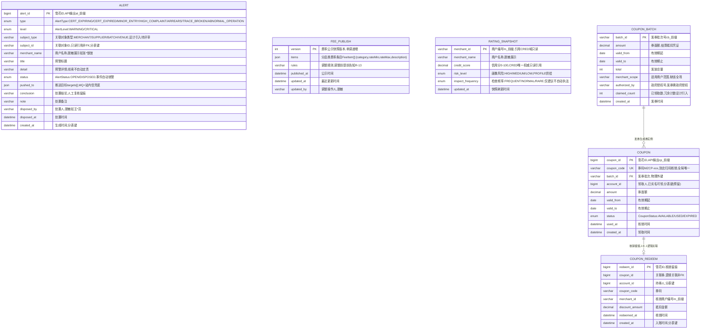

# 监管看板服务（DASH）数据库设计说明书

> 内容：**ER 图 + 分库分表方案 + 数据字典 + 表设计说明书**（§1 图 / §2 实体清单 / §3 设计约定 / §4 关系说明 / §5 分库分表 / §6 数据字典 / §7 表设计说明书）。
> 依据文档：`docs/design/产品设计文档.md` v1.12（§5.10 / §6.4.9 / §8.3.1）、`docs/design/微服务边界与职责基准.md` v1.2（§2.10 / §3 / §4.5）、
> `docs/design/高并发架构演进设计.md` v0.3（§2.1~§2.6）、`services/dash/docs/openapi.yaml` v1.0.0（**唯一可手改源**）。
> 数据域归属：⑦ 预警/看板域（`alert`，边界基准 §4.5）；另含费率公示（P-01/F-05）、分级监管（A-08 完整版）、民生消费券（P-07）——§4.5 未单列，随本文档落位。
> 存储形态：共享主库 + `dash_` schema 前缀隔离（Java 域既有路线）。
> 口径：与 openapi.yaml 冲突时以 openapi.yaml 为准。
> 版本：v1.0 · 2026-09-10（首版：七章齐全；预警看板域 6 表——`alert`/`coupon_redeem` 按月分表、`coupon` 暂不分片（阈值触发再分）、费率/分级监管公示数据走版本化快照 + 定时刷新）。

## 1. ER 图（Mermaid）

## 2. 实体清单

| 实体（表名） | 存储介质 | 说明 |
|---|---|---|
| `alert`（按月分表 `alert_YYYYMM`） | 共享主库（dash_ schema） | 监管预警线索（A-08）：资质临期/过期、违规入场高频举报、高频投诉、欠薪、溯源断链、异常经营，只推送线索不自动执法 |
| `fee_publish` | 共享主库 | 费率/抽成公开公示（P-01/F-05 同口径）：分品类费率 + 调整规则，**版本化快照 + 定时刷新**（读多写少） |
| `rating_snapshot` | 共享主库 | 分级监管快照（A-08 完整版）：画像风险 + 信用双维度，低分多查/高分少查，定时刷新只读快照 |
| `coupon_batch` | 共享主库 | 民生消费券发券批次（P-07，政府授权发券） |
| `coupon` | 共享主库（暂不分片） | 消费券实例（券号 + 券码），领取产生，券码全局唯一 |
| `coupon_redeem`（按月分表 `coupon_redeem_YYYYMM`） | 共享主库 | 消费券核销留痕（只增流水），对账补差与 SETTLE 联动 |
| 预警幂等去重 / 快照缓存 / 抢券限流 | Redis | `alert:{alertId}` 上报幂等、fee/rating 快照缓存（定时刷新）、抢券 SETNX（**不入库**） |
| `dash.alert.notify` | MQ（RabbitMQ） | 预警双向推送通知（监管端看板 + 商户端提醒，站内信兜底），**不入库** |

> 附件/公示图片一律 OSS 前端直传，本服务仅存对象键（如有）；权威数据（信用分、画像风险、证照有效期）经内部接口只读引用 + 事件同步，不复制权威数据。

## 3. 关键设计约定

- **C8 预警只推送线索、不自动执法**：`alert` 为线索记录，处置必须监管人员人工复核（`conclusion` 留痕）；AICORE 风险预测/视觉审核结论仅作预警输入，不自动定责、不自动处罚；商户更新资质等事件自动销警（系统动作，`disposed_by` 记 SYSTEM）。
- **R-13 费率口径透明**：`fee_publish` 是「平台费率/抽成公开承诺」唯一对外承载（P-01，AC-M1.10），货运抽成 F-05 同口径；不做竞价广告、不隐性扣费；**调整前提前告知商户**（调整走新版本快照，历史版本留痕可回溯）。
- **R-03 公示数据脱敏**：`merchant_name`（如 张\*饭馆）、`disposed_by`（如 王\*员）、`updated_by` 一律脱敏展示；预警详情不含 L1/L2 明文。
- **R-01 消费券不沉淀资金**：消费券为优惠凭证、结算抵扣（`amount` 为面额，非资金）；核销抵扣异常 → 与 SETTLE 对账补差；`coupon_redeem` 只增不改留痕。
- **边界基准 §3 定稿**：监管预警 DASH 只聚合推送、**不产生业务数据**——信用分唯一权威在 CRED、画像风险特征在 PROFILE（商铺画像 = 特征集合，不另立第二套评分）、证照有效期在 CRED，均只读引用 + 事件上报，不直写他域表。
- **读多写少 + 版本化快照**：`fee_publish`/`rating_snapshot` 公示类数据写少读巨、允许分钟级延迟，走「**版本化快照 + 定时刷新**」只读快照模型（高并发 §2.4.3），读请求直接命中快照，消除缓存击穿/一致性问题。
- **幂等**：`alert/push` 服务端间按 `alertId` 查重幂等（内部 Token 鉴权）；发券重复批次 → 3007（`batch_id` PK）；领取重复/领完 → 3007（`uk(batch_id, account_id)` + `Idempotency-Key`）；核销重复/券过期 → 3007、券不存在 → 3006（状态检查 + `coupon_code` UK）。
- **状态机**：预警 `OPEN → DISPOSED`（人工处置 / 事件自动销警）；消费券 `AVAILABLE → USED / EXPIRED`；费率/分级快照以 `version`/`updated_at` 滚动。
- **越权（2002）**：预警列表监管角色可见全量、商户仅见本人相关（水平越权 IDOR 校验）；分级监管需监管角色；「我的消费券」仅本人；核销需商户角色。
- **加密脱敏**：公示数据脱敏输出（R-03）；本服务不沉淀 L1 证件/资金明文（券码为一次性出示码，核销后失效），如未来存 L1 敏感字段按 AES-256-GCM 加密 + 脱敏输出。
- **审计**：预警处置留痕、消费券核销留痕（`coupon_redeem` 只增）、费率调整留痕（`fee_publish` 版本化）；审计日志 ≥6 个月（WORM/哈希链），存证只增不改。
- **分布式 ID**：写库 Java 域统一雪花 ID（`infra-idgen`，DB 存 bigint、API 输出业务号前缀 `al_`/`cp_`）；**时钟回拨三档预案**（L1≤5s 退避 → L2 自动切号段兜底 → L3 拒绝发号）适用；号段兜底期间分表路由以业务字段 `created_at` 为准（见 §5.4）。
- **分表定位**：`alert`/`coupon_redeem` 只增流水类按月分表；`coupon` 暂不分片（券码全局唯一 + 领取幂等，阈值触发再分）；主数据/快照不分片（详见 §5）。

## 4. 关系说明

| 关系 | 基数 | 说明 |
|---|---|---|
| COUPON_BATCH — COUPON | 1 : N | 一批发券生成 N 张券实例（物理外键 `batch_id`，同库不分片） |
| COUPON — COUPON_REDEEM | 1 : 0..1 | 每券至多核销一次（`coupon_id` 逻辑关联；`coupon` 不分片、`coupon_redeem` 按月分表，跨表引用非物理外键） |
| ALERT → CRED / TICKET / SETTLE / TRACE / AICORE | 逻辑关联 | 各域事件经 `POST /dash/alert/push`（x-external-interfaces）上报聚合，`subject_id` 只读引用、非外键 |
| RATING_SNAPSHOT → CRED / PROFILE | 逻辑关联 | `credit_score` 只读引用 CRED（唯一权威）、`risk_level` 由 PROFILE 商铺画像供给（特征集合，不另立第二套评分） |
| ALERT 处置结论 → CRED | 逻辑关联 | 「资质异常标注」等结论同步回 CRED（只上报事件，不直写信用/档案表） |
| COUPON_REDEEM → SETTLE | 逻辑关联 | 核销抵扣与 SETTLE 对账补差（只增流水，按日期范围核对，非外键） |
| ALERT / FEE_PUBLISH / RATING_SNAPSHOT | 独立 | 无库内物理外键；预警幂等去重/快照缓存经 Redis，通知经 MQ `dash.alert.notify` |

---

## 5. 分库分表方案

> 平台级策略以《高并发架构演进设计》v0.3 §2.1~§2.6 为准，本节做「平台策略 → DASH 预警/看板域」的落地映射。

### 5.1 分库与隔离

| 阶段 | 平台形态 | DASH 落位 |
|---|---|---|
| P1 地基期（M1） | 模块化单体共享主库（MySQL 8，主从） | DASH 表与各域同库，**以 `dash_` schema 前缀隔离**（对齐高并发 §6 优化点① 硬边界：禁跨域直连读表） |
| P2 服务化期（M2） | 交易/结算独立库，其余域共享主库 | **DASH 全程留共享主库**，不独立成库（非交易/结算域，读多写少） |
| 容灾 | 两地三中心 RPO≤15min / RTO≤30min | 随共享主库容灾体系（L2 服务允许短暂降级） |

### 5.2 DASH 分片矩阵

> 高并发 §2.2「分表方案（按域）」未列 DASH 表，本节按平台级「只增流水类按月分表、主数据不分片」口径落地，分片键/归档策略不改变平台决策。

| 表 | 分片方式 | 分片键 | 表命名 | 归档策略 | 里程碑 |
|---|---|---|---|---|---|
| `alert` | **按月分表**（只增流水类） | `subject_id` + `created_at` | `alert_YYYYMM` | >12 月热转冷 OSS（Parquet/压缩），保留热表 12 个月 | M1 起 |
| `fee_publish` | 不分片（版本化快照） | — | `fee_publish` | 版本留痕不归档（公示可回溯） | M1 起 |
| `rating_snapshot` | 不分片（快照，最新覆盖） | — | `rating_snapshot` | 定时刷新覆盖，审计留痕 | M2 起 |
| `coupon_batch` | 不分片（主数据） | — | `coupon_batch` | 不归档（批次留档可回溯） | M2 起 |
| `coupon` | **暂不分片**（阈值触发再分） | `account_id` + `created_at`（预留） | `coupon` | 过期券冷备；触发再分走 expand-migrate-contract | M2 起 |
| `coupon_redeem` | **按月分表**（只增流水类） | `account_id` + `created_at` | `coupon_redeem_YYYYMM` | >12 月热转冷 OSS，保留热表 12 个月 | M2 起 |

> **分片阈值**（平台级建议初值，压测/数据增长标定）：单表 >2000 万行 或 >20GB 触发再分；`alert`/`coupon_redeem` 按月分表天然可控，冷数据到点即归档；`coupon` 因「券码全局唯一 + 领取幂等 `uk(batch_id, account_id)`」暂不分片，达阈值后再分（再分方案见 §5.7，走 expand-migrate-contract，不得破坏性 DDL 直上生产）。

### 5.3 分表路由规则

- **路由层**：M1 用 MyBatis-Plus 自定义分表插件（拦截按月路由）+ 统一 `ShardingKey` 注解；M2 分库后评估 ShardingSphere-Proxy（业务零改造）。
- **写入**：`alert` 按 `created_at` 月份路由到 `alert_YYYYMM`，`ShardingKey(subject_id, created_at)`；`coupon_redeem` 按 `created_at` 月份路由到 `coupon_redeem_YYYYMM`，`ShardingKey(account_id, created_at)`。
- **查询必须携带分片键下推**：预警「商户本人」查询携带 `subject_id` 剪枝；监管全量列表按 `type/level/status + 日期范围` 逐月热表查询；「我的消费券」携带 `account_id` 剪枝；核销留痕/对账按 `account_id + 日期范围`。
- **跨月查询**：禁止 SQL UNION 全表扫描；预警看板/核销对账的跨月聚合走异步/从库（§5.5）。
- **禁止跨分片 JOIN / 聚合 / 事务**：`coupon_redeem` 关联 `coupon`（不分片）为跨表引用（应用层按 `coupon_id` 反查，非 JOIN）；分级监管/费率公示聚合不进 OLTP 主库（快照异步刷新）。

### 5.4 分布式 ID 与主键策略

| 表 | 主键 | 生成方式 | 说明 |
|---|---|---|---|
| `alert.alert_id` | bigint 雪花 ID | 统一组件 `infra-idgen` | API 输出字符串带 `al_` 前缀（防 JS 大数精度）；分表路由以业务字段 `created_at` 为准，不依赖 ID 内嵌时间戳 |
| `fee_publish.version` | int 业务版本号 | 应用层 `max+1` | 版本化快照天然键，不参与雪花域 |
| `rating_snapshot.merchant_id` | varchar 业务号 | 引用 CRED 域 ID（`m_` 前缀） | 只读引用，不重新发号；最新一次覆盖 |
| `coupon_batch.batch_id` | varchar 业务号 | 发券方提供（`cb_` 前缀） | 重复发券批次幂等键 |
| `coupon.coupon_id` | bigint 雪花 ID | `infra-idgen` | API 输出 `cp_` 前缀；`coupon_code`（`MZCP-` 前缀）为一次性出示码、全局唯一 |
| `coupon_redeem.redeem_id` | bigint 雪花 ID | `infra-idgen` | 核销留痕，无 API 前缀输出（接口内嵌） |

- workerId：Redis `INCR` 分配 + 实例重启复用（租约），撞车 → 拒绝发号 + P0 告警。
- **时钟回拨三档预案**（《高并发架构演进设计》§2.3.1~§2.3.4）对本服务生效（写库 Java 域）：L1 轻微回拨（≤5s）退避等待 → L2 超预算**自动切号段模式兜底**（`id_allocator` 表 DB 自增，不依赖时钟）→ L3 号段不可用**拒绝发号 + 快速失败**；Prometheus 指标 + Alertmanager 分级告警 + NTP 治理。L2 号段兜底期间主键不含时间戳，分表路由仍以 `created_at` 为准，业务无感。

### 5.5 读写分离与冷热归档

- **读写分离**：主库写、从库读（读是写 3 倍以上）；读请求经 `@ReadOnly` 注解路由到从库；关键「写后立即读」（预警处置后立即查状态、核销后立即查券状态）**强制走主库**，避免主从延迟读到旧状态。
- **冷热归档**：`alert`/`coupon_redeem` >12 月热转冷 OSS（Parquet/压缩），查询走归档快照；对账/审计按需回捞。
- **公示快照**：`fee_publish`/`rating_snapshot` 走「版本化快照 + 定时刷新」（§2.4.3），不参与冷热归档、长期留痕。

### 5.6 演进步骤（expand-migrate-contract）

> 表结构/分表规则变更按「扩展 → 迁移 → 收缩」执行，禁止破坏性 DDL 直上生产（对齐高并发 §2.6）：① **双写**：新表上线，旧表 + 新表双写（幂等）→ ② **回灌**：历史数据按分片键回灌新表，校验一致性 → ③ **切读**：读流量切新表，旧表降级只读 → ④ **收缩**：观察稳定后下线旧表。`coupon` 达阈值再分时同样走该路径（含券码全局唯一索引的迁移方案，见 §5.7）。

### 5.7 待标定项

| 项 | 建议初值 | 裁决方式 |
|---|---|---|
| `alert.subject_type` 取值集（设计引入） | MERCHANT / SUPPLIER / BATCH / VENUE | 评审（随预警类型固化） |
| `coupon` 分表触发阈值与再分方案 | 2000 万行 / 20GB；再分按 `batch_id` 哈希 或 `coupon_code`→分片映射（Redis） | 数据增长标定 + 评审 |
| 分级监管风险/信用分段阈值（riskLevel / inspectFrequency 映射） | HIGH/MEDIUM/LOW + FREQUENT/NORMAL/RARE | 上线前评审（M2） |
| 公示快照刷新周期（fee/rating） | 分钟级定时（对齐 §2.4.3 允许分钟级延迟） | 评审 |
| 消费券 `claimed_count` 冗余计数 | 设计引入（领完判定） | 评审 |
| 分片阈值 / 回拨容忍窗口 W / 号段步长 | 单表 >2000 万行/20GB、W=5s、step=1000 | 评审 + 压测标定（TBD-10） |

---

## 6. 数据字典

> 通用约定：MySQL 8.0，引擎 InnoDB，字符集 utf8mb4；时间 `datetime(3)` 毫秒精度、UTC 存储、输出 Asia/Shanghai；金额 `decimal(18,2)` 存储（券面额/抵扣金额，openapi 为 number，与通用「字符串小数」约定差异见 §5.7 评审）；费率/评分用 decimal（rate 比例 0~1、credit_score 0~100）；数组/内嵌对象用 JSON 列；**枚举值与 openapi.yaml `components.schemas` 一一对应**；带 ★ 的值为建议初值、待标定（§5.7）。

### 6.1 alert（监管预警，按月分表 alert_YYYYMM）

| 字段 | 类型 | 空 | 键 | 默认 | 说明 |
|---|---|---|---|---|---|
| alert_id | bigint UNSIGNED | NO | PK | — | 预警编号，雪花 ID；API 输出 `al_` 前缀字符串 |
| type | enum('CERT_EXPIRING','CERT_EXPIRED','MINOR_ENTRY','HIGH_COMPLAINT','ARREARS','TRACE_BROKEN','ABNORMAL_OPERATION') | NO | — | — | 预警类型（PDD §5.10.2） |
| level | enum('WARNING','CRITICAL') | NO | — | WARNING | 预警等级（升级预警为 CRITICAL） |
| subject_type | varchar(32) | NO | — | — | 关联对象类型★（MERCHANT/SUPPLIER/BATCH/VENUE，设计引入） |
| subject_id | varchar(64) | NO | — | — | 关联对象 ID（只读引用、非外键），**分表键**（与 created_at 组合） |
| merchant_name | varchar(64) | YES | — | NULL | 关联商户名称（脱敏展示，如 张\*饭馆） |
| title | varchar(200) | NO | — | — | 预警标题 |
| detail | varchar(500) | YES | — | NULL | 预警详情（线索，不自动定责） |
| status | enum('OPEN','DISPOSED') | NO | — | OPEN | 预警处理状态：OPEN 待处置 → DISPOSED 已处置（人工/事件自动销警） |
| pushed_to | JSON | YES | — | NULL | 推送目标 targets[]（监管端/商户端账号，MQ + 站内信兜底） |
| conclusion | varchar(1000) | YES | — | NULL | 处置结论（人工复核留痕，如「已责令整改/误报排除」） |
| note | varchar(500) | YES | — | NULL | 处置备注（留痕） |
| disposed_by | varchar(64) | YES | — | NULL | 处置人（脱敏展示，如 王\*员；自动销警记 SYSTEM） |
| disposed_at | datetime(3) | YES | — | NULL | 处置时间 |
| created_at | datetime(3) | NO | — | CURRENT_TIMESTAMP(3) | 预警生成时间（UTC），**分表键** |

### 6.2 fee_publish（费率/抽成公示，版本化快照，不分片）

| 字段 | 类型 | 空 | 键 | 默认 | 说明 |
|---|---|---|---|---|---|
| version | int UNSIGNED | NO | PK | — | 公示快照版本（应用层 max+1，历史版本留痕可回溯） |
| items | JSON | NO | — | — | 分品类费率条目数组；元素 FeeItem = {category, rateMin(0.005~0.01), rateMax, description} |
| rules | varchar(500) | NO | — | — | 调整规则（调整前提前告知商户，R-13） |
| published_at | datetime(3) | YES | — | NULL | 公示时间 |
| updated_at | datetime(3) | NO | — | CURRENT_TIMESTAMP(3) | 最近更新时间（openapi updatedAt） |
| updated_by | varchar(64) | YES | — | NULL | 调整操作人（脱敏展示） |

### 6.3 rating_snapshot（分级监管快照，不分片）

| 字段 | 类型 | 空 | 键 | 默认 | 说明 |
|---|---|---|---|---|---|
| merchant_id | varchar(32) | NO | PK | — | 商户编号 `m_` 前缀（引用 CRED 域 ID，只读引用；最新一次覆盖） |
| merchant_name | varchar(64) | YES | — | NULL | 商户名称（脱敏展示，如 张\*饭馆） |
| credit_score | decimal(5,2) | NO | — | — | 信用分 0~100（CRED 唯一权威，只读引用） |
| risk_level | enum('HIGH','MEDIUM','LOW') | NO | — | MEDIUM | 画像风险（PROFILE 商铺画像供给） |
| inspect_frequency | enum('FREQUENT','NORMAL','RARE') | NO | — | NORMAL | 检查频率建议（低分多查/高分少查，仅建议不自动执法） |
| updated_at | datetime(3) | NO | — | CURRENT_TIMESTAMP(3) | 快照刷新时间（openapi updatedAt） |

### 6.4 coupon_batch（消费券发券批次，主数据，不分片）

| 字段 | 类型 | 空 | 键 | 默认 | 说明 |
|---|---|---|---|---|---|
| batch_id | varchar(32) | NO | PK | — | 发券批次号 `cb_` 前缀（重复发券批次 → 3007 幂等） |
| amount | decimal(18,2) | NO | — | — | 券面额（元，结算抵扣凭证，openapi CouponRule.amount） |
| valid_from | date | NO | — | — | 有效期起 |
| valid_to | date | NO | — | — | 有效期止 |
| total | int UNSIGNED | NO | — | — | 发放总量 |
| merchant_scope | varchar(200) | YES | — | NULL | 适用商户范围（可选，缺省全场） |
| authorized_by | varchar(64) | NO | — | — | 政府授权号（发券需政府授权） |
| claimed_count | int UNSIGNED | NO | — | 0 | 已领取数★（冗余计数，领完判定） |
| created_at | datetime(3) | NO | — | CURRENT_TIMESTAMP(3) | 发券时间 |

### 6.5 coupon（消费券实例，暂不分片）

| 字段 | 类型 | 空 | 键 | 默认 | 说明 |
|---|---|---|---|---|---|
| coupon_id | bigint UNSIGNED | NO | PK | — | 券号，雪花 ID；API 输出 `cp_` 前缀字符串 |
| coupon_code | varchar(32) | NO | UK | — | 券码 `MZCP-` 前缀（到店出示，商家扫码核销，**全局唯一**） |
| batch_id | varchar(32) | NO | FK | — | 发券批次（物理外键 → coupon_batch.batch_id） |
| account_id | bigint UNSIGNED | NO | — | — | 领取人（已实名可领），**分表键（预留）** |
| amount | decimal(18,2) | NO | — | — | 券面额（元） |
| valid_from | date | NO | — | — | 有效期起 |
| valid_to | date | NO | — | — | 有效期止 |
| status | enum('AVAILABLE','USED','EXPIRED') | NO | — | AVAILABLE | 券状态（G-11：可使用/已用/过期） |
| used_at | datetime(3) | YES | — | NULL | 核销时间 |
| created_at | datetime(3) | NO | — | CURRENT_TIMESTAMP(3) | 领取时间（分表键，预留） |

> 领取幂等：UNIQUE KEY `uk_batch_account`(`batch_id`, `account_id`)——每账号每批次限领一次（重复领取/领完 → 3007）；`coupon_code` 全局唯一（核销反查、券不存在 → 3006）。

### 6.6 coupon_redeem（消费券核销留痕，按月分表 coupon_redeem_YYYYMM）

| 字段 | 类型 | 空 | 键 | 默认 | 说明 |
|---|---|---|---|---|---|
| redeem_id | bigint UNSIGNED | NO | PK | — | 核销留痕 ID，雪花 ID（接口内嵌，无前缀输出） |
| coupon_id | bigint UNSIGNED | NO | — | — | 关联券号（逻辑关联 → coupon.coupon_id，非物理外键） |
| account_id | bigint UNSIGNED | NO | — | — | 持券人（冗余，便于查询），**分表键**（与 created_at 组合） |
| coupon_code | varchar(32) | NO | — | — | 券码（核销凭据） |
| merchant_id | varchar(32) | NO | — | — | 核销商户编号 `m_` 前缀 |
| discount_amount | decimal(18,2) | NO | — | — | 抵扣金额（元，openapi discountAmount） |
| redeemed_at | datetime(3) | NO | — | — | 核销时间（openapi redeemedAt） |
| created_at | datetime(3) | NO | — | CURRENT_TIMESTAMP(3) | 入账时间，**分表键** |

### 6.7 辅助结构（Redis / MQ）

| 结构 | 类型 | 说明 |
|---|---|---|
| `alert:{alertId}`（Redis） | 上报幂等去重 | 各域事件上报 `POST /dash/alert/push` 按 alertId 查重，TTL 由预警去重窗口定 |
| `fee:{version}` / `rating:{merchantId}`（Redis） | 公示快照缓存 | 版本化快照 + 定时刷新（§2.4.3），读命中不跨进程 |
| `coupon:claim:{batchId}:{accountId}`（Redis） | 抢券幂等/限流 | 领取 SETNX 幂等 + 防刷限流（429） |
| `dash.alert.notify`（MQ） | 预警双向推送 | 监管端看板 + 商户端提醒，通知失败 MQ 重试 + 站内信兜底；与资金队列物理隔离 |

---

## 7. 表设计说明书

### 7.1 alert（监管预警，按月分表）

- **用途**：监管预警线索（A-08）——资质临期/过期、违规入场高频举报、高频投诉、欠薪、溯源断链、异常经营的聚合记录与双向推送；只推送线索、不自动执法（C8）。
- **主键（策略）**：`alert_id` bigint 雪花 ID（`infra-idgen`），API 输出 `al_` 前缀；分表路由以业务字段 `created_at` 为准，不依赖 ID 内嵌时间戳。
- **索引**：PRIMARY KEY(`alert_id`)；KEY `idx_subject_created`(`subject_id`, `created_at`)——商户本人查询 + **分片键剪枝**；KEY `idx_type_level_created`(`type`, `level`, `created_at`)——监管看板筛选列表；KEY `idx_status_created`(`status`, `created_at`)——待处置队列。
- **约束**：状态机 `OPEN → DISPOSED`（人工处置 / 商户更新资质事件自动销警）；已处置重复提交 → 3007；监管全量/商户本人越权校验（2002）；**只增记录 + 状态机变更**，处置留痕（conclusion/note/disposed_by/disposed_at）；`subject_id` 只读引用非外键（DASH 只聚合推送、不产生业务数据）。
- **安全**：`merchant_name`/`disposed_by` 脱敏（R-03）；预警详情为线索、不自动定责；`pushed_to` 推送目标最小化（监管端 + 本人商户端）。
- **生命周期**：热表 12 个月 → 归档 OSS（Parquet/压缩）；审计留痕 ≥6 月；归档后按需回捞。
- **接口映射**：GET /dash/alerts（列表，监管全量/商户本人）、POST /dash/alerts/{alertId}/dispose（人工处置留痕）；服务端间 POST /dash/alert/push（x-external-interfaces，各域事件上报聚合）。

### 7.2 fee_publish（费率/抽成公示，版本化快照）

- **用途**：平台费率/抽成公开公示（P-01，AC-M1.10；F-05 货运同口径）——分品类费率（0.5%~1%）+ 调整规则，是「费率公开承诺」唯一对外承载；读多写少，版本化快照 + 定时刷新。
- **主键（策略）**：`version` int 业务版本号（应用层 max+1），历史版本留痕可回溯；不参与雪花域。
- **索引**：PRIMARY KEY(`version`)；无需附加索引（仅按版本取最新）。
- **约束**：调整前提前告知商户（R-13，新版本发布前公示）；不做竞价广告/隐性扣费；历史版本不物理删除（留痕）。
- **安全**：`updated_by` 脱敏；公示数据脱敏（R-03）。
- **生命周期**：版本留痕不归档（公示可回溯）；快照缓存 Redis + 定时刷新（§5.5）。
- **接口映射**：GET /dash/fees（公开接口，免登录，security 覆写，返回 FeeQueryResult）。

### 7.3 rating_snapshot（分级监管快照，不分片）

- **用途**：分级监管（A-08 完整版）——按「画像风险 + 信用」双维度生成检查频率建议（低分多查/高分少查），仅建议不自动执法；定时刷新只读快照。
- **主键（策略）**：`merchant_id`（引用 CRED 域 ID，只读引用不重新发号）；最新一次覆盖，历史走审计。
- **索引**：PRIMARY KEY(`merchant_id`)；KEY `idx_risk_score`(`risk_level`, `credit_score`)——分级监管列表分页 + 分数区间筛选。
- **约束**：`credit_score` 唯一权威在 CRED（只读引用）；`risk_level` 由 PROFILE 商铺画像供给（特征集合，不另立第二套评分）；阈值上线前评审（§5.7）；需监管角色（2002）。
- **安全**：`merchant_name` 脱敏；数据不出域。
- **生命周期**：定时刷新覆盖；审计留痕 ≥6 月。
- **接口映射**：GET /dash/rating（列表，scoreMin/scoreMax 筛选，需监管角色）。

### 7.4 coupon_batch（消费券发券批次，主数据）

- **用途**：政府/平台发券（P-07，惠民）——发券需政府授权，券为优惠凭证、结算抵扣，平台不沉淀资金（R-01）。
- **主键（策略）**：`batch_id` varchar 业务号（`cb_` 前缀，发券方提供）；重复发券批次 → 3007（幂等）。
- **索引**：PRIMARY KEY(`batch_id`)；KEY `idx_valid`(`valid_to`)——批次有效期/过期扫描。
- **约束**：发券需政府授权操作角色（2002）；`authorized_by` 授权号必填；`claimed_count` 领完判定（冗余计数★）。
- **安全**：不沉淀资金；授权号留痕。
- **生命周期**：批次留档可回溯，不归档。
- **接口映射**：POST /dash/coupon/issue（发券受理，返回 CouponIssueResult）。

### 7.5 coupon（消费券实例，暂不分片）

- **用途**：消费者领取的券实例（券号 + 券码），状态机 AVAILABLE → USED/EXPIRED；券码到店出示、商家扫码核销。
- **主键（策略）**：`coupon_id` bigint 雪花 ID（`infra-idgen`），API 输出 `cp_` 前缀；`coupon_code`（`MZCP-` 前缀）一次性出示码、全局唯一。
- **索引**：PRIMARY KEY(`coupon_id`)；UNIQUE KEY `uk_coupon_code`(`coupon_code`)——核销反查、券不存在 → 3006；UNIQUE KEY `uk_batch_account`(`batch_id`, `account_id`)——**领取幂等**（重复领取/领完 → 3007）；KEY `idx_account_created`(`account_id`, `created_at`)——「我的消费券」列表 + 分片键剪枝（预留）。
- **约束**：状态机 AVAILABLE → USED/EXPIRED；仅本人可见（2002）；领取携带 `Idempotency-Key` 防重复；已达阈值再分时走 expand-migrate-contract（含券码全局唯一索引迁移方案，§5.7）。
- **安全**：券码一次性出示、核销后失效；不沉淀资金（抵扣走 SETTLE 对账）。
- **生命周期**：暂不分片；过期券冷备；达 2000 万行/20GB 触发再分（§5.7）。
- **接口映射**：POST /dash/coupons/claim（领取，返回 CouponClaimResult）、GET /dash/coupons/mine（我的券列表，CouponStatus 筛选）。

### 7.6 coupon_redeem（消费券核销留痕，按月分表）

- **用途**：到店商家扫券码核销的只增留痕（P-07 流程 → 结算抵扣），核销可审计；与 SETTLE 对账补差联动。
- **主键（策略）**：`redeem_id` bigint 雪花 ID（`infra-idgen`）；分表路由以业务字段 `created_at` 为准。
- **索引**：PRIMARY KEY(`redeem_id`)；KEY `idx_account_created`(`account_id`, `created_at`)——持券人核销记录 + **分片键剪枝**；KEY `idx_coupon`(`coupon_id`)——按券反查核销；KEY `idx_merchant_created`(`merchant_id`, `created_at`)——对账/审计。
- **约束**：**只增不改**（核销留痕，应用层禁 UPDATE/DELETE）；每券至多核销一次（1:0..1 逻辑关联，重复核销/券过期 → 3007）；需商户角色（2002）；结算抵扣异常 → 对账补差（与 SETTLE 联动，逻辑关联非外键）。
- **安全**：核销留痕可审计；不沉淀资金。
- **生命周期**：热表 12 个月 → 归档 OSS（Parquet/压缩）；审计留痕 ≥6 月。
- **接口映射**：POST /dash/coupon/redeem（核销，返回 CouponRedeemResult）。

### 7.7 出方向依赖（跨服务，逻辑关联）

- **数据源（预警聚合，只读引用 + 事件上报）**：CRED（证照有效期/信用分）、TICKET（违规入场举报聚合）、SETTLE（欠薪）、TRACE（溯源断链）、AICORE（风险预测）、PROFILE（商铺画像→分级监管）；经内部接口 `POST /dash/alert/push`（x-external-interfaces，前端勿调）聚合，服务端间 Token 鉴权 + 幂等。
- **权威数据（只读引用，不复制）**：信用分唯一权威在 CRED（`credit_score`）；画像风险特征在 PROFILE（不另立第二套评分）；DASH 只聚合推送、不产生业务数据（边界基准 §3）。
- **结论回写（事件上报）**：预警处置「资质异常标注」等结论同步回 CRED（只上报事件，不直写信用/档案表）。
- **通知（MQ）**：`dash.alert.notify` 双向推送（监管端看板 + 商户端提醒），失败重试 + 站内信兜底。
- **结算联动（对账补差）**：消费券核销抵扣异常与 SETTLE 对账补差（`coupon_redeem` 只增流水按日期核对）。

---

*文档结束 · 与 `services/dash/docs/openapi.yaml`（唯一可手改源）、《高并发架构演进设计》v0.3 §2、《产品设计文档》v1.11 §5.10/§6.4.9、《微服务边界与职责基准》v1.2 §2.10/§3 同步维护。*
