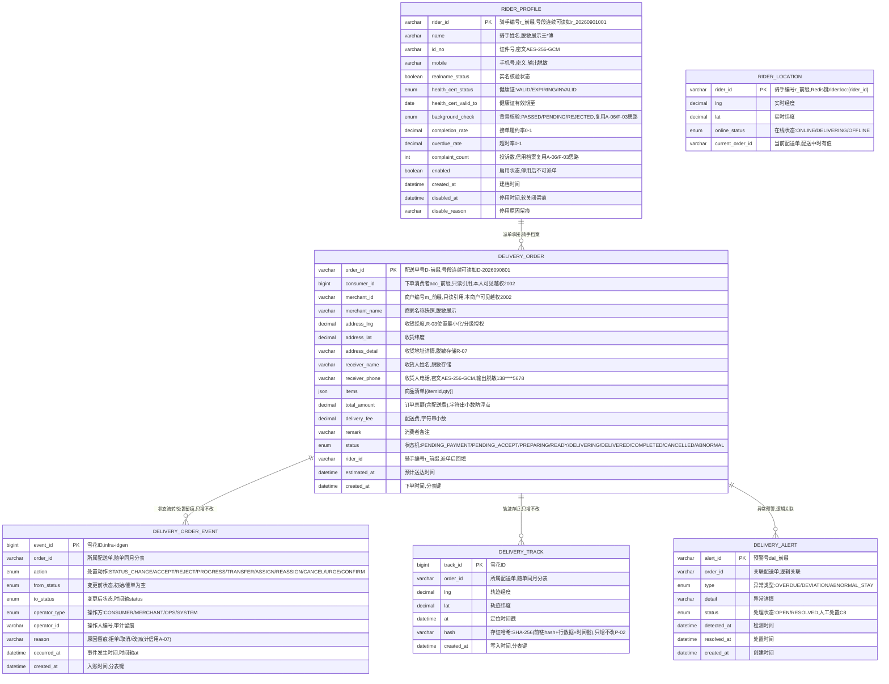

# 配送服务（DELIVERY）数据库设计说明书

> 内容：**ER 图 + 分库分表方案 + 数据字典 + 表设计说明书**（§1 图 / §2 实体清单 / §3 设计约定 / §4 关系说明 / §5 分库分表 / §6 数据字典 / §7 表设计说明书）。
> 依据文档：`docs/design/产品设计文档.md` v1.12（§5.15 / §8.3.1；§6.4 无 DELIVERY 接口草案，见《微服务边界与职责基准》§4-C01/SSOT C-01，接口以 openapi.yaml 为准）、
> `docs/design/微服务边界与职责基准.md` v1.2（§2.14 / §3 / §4.5）、`docs/design/高并发架构演进设计.md` v0.3（§2.1~§2.6）、`services/delivery/docs/openapi.yaml` v1.0.0（**唯一可手改源**）。
> 数据域归属：**配送域**（§4.5 未单列，本文档随 M2 补充定义）——5 张表落共享主库 + `delivery_` schema 前缀隔离（Java 域既有路线），另 1 个 Redis 结构（骑手实时位置，不入库）。
> 口径：与 openapi.yaml 冲突时以 openapi.yaml 为准。
> 版本：v1.0 · 2026-09-10（首版：七章齐全；M2 设计先行——配送域 5 表，轨迹/订单/事件流水类按月分表，主数据不分片）。

## 1. ER 图（Mermaid）

## 2. 实体清单

| 实体（表名） | 存储介质 | 说明 |
|---|---|---|
| `delivery_order` | 共享主库（delivery_ schema），**按月分表** | 配送单主表：下单/地址/金额/商家/骑手 + 状态机当前态（L-01/L-02） |
| `delivery_order_event` | 共享主库，**随单同月分表** | 订单状态流转 + 处置留痕（接单/拒单/备货/出餐/派单/改派/取消/催单/确认），承载状态时间轴 + L-04 治理审计 |
| `delivery_track` | 共享主库，**按月分表** | 配送全程位置轨迹存证：只增不改 + SHA-256 哈希链（L-06，复用 P-02） |
| `rider_profile` | 共享主库 | 骑手/配送员档案：实名/健康证/背景核验/信用（履约率/超时率/投诉）/启用状态（L-05） |
| `delivery_alert` | 共享主库 | 配送异常预警（超时/偏航/异常停留），推送线索人工处置（L-06 → A-08） |
| `rider_location` | Redis（内存态，不入库） | 在线骑手实时位置 + 在线状态（调度看板地图 O-03，心跳刷新） |

> 结算/退款复用 SETTLE、骑手信用复用 CRED、预警聚合上报 DASH、轨迹出证复用 TICKET、账号/商品只读引用 ACC/TRADE/PROD——本服务不重复建结算/存证体系。

## 3. 关键设计约定

- **R-03 位置/轨迹分级授权**：位置/轨迹按「本人可见 → 授权可见 → 脱敏公示」三级——消费者本人可见全程轨迹（`GET /delivery/orders/{orderId}/track`）；仲裁/监管经授权可见；调度看板地图热力仅脱敏聚合、最小化展示（`GET /delivery/ops/riders/locations`）。
- **R-07 敏感个人信息加密存储**：收货人电话、骑手证件号/手机号等 L1 敏感字段 AES-256-GCM 加密存储、脱敏输出（如 138\*\*\*\*5678、王\*傅、李\*）；收货地址详情脱敏存储。
- **P-02 存证只增不改（复用不重建）**：`delivery_track` 时间戳 + SHA-256 哈希链（前链 hash + 行数据 + 时间戳），只增不改（应用层禁 UPDATE/DELETE，库层回收写权限）；轨迹出证复用 TICKET（D-02/T-15），**不建第二套存证/出证体系**。
- **复用 SETTLE 结算（不重复建）**：配送费/退款复用 SETTLE（I-04 分账反向）；订单状态机 `PENDING_PAYMENT → PENDING_ACCEPT` 由 SETTLE 支付确认回调驱动，本服务无金额沉淀/余额字段（配送费为快照字段，非账务）。
- **R-05 AI 辅助只标记不决策**：智能派单建议（AI 辅助）仅建议、人工确认后执行；异常预警只推送线索、人工处置（C8），不自动定责。
- **越权（IDOR）**：订单仅当事人可见——消费者本人（`consumer_id`）/本商户（`merchant_id`）/平台运营角色（`/ops`），越权报 2002；骑手档案仅运营角色可见（2002）。
- **状态机**：配送订单 9 态（§5.15.5/PRD §6.10）`PENDING_PAYMENT → PENDING_ACCEPT → PREPARING → READY → DELIVERING → DELIVERED → COMPLETED`，分支 `CANCELLED`、`ABNORMAL`；非允许状态操作报 3007。
- **幂等与并发**：下单/派单/改派走 `Idempotency-Key`；同一骑手并发派单幂等/乐观锁拦截（3007「已改派，请刷新」）；接单/拒单/备货/出餐二次确认。
- **处置留痕审计**：接单/拒单/备货/出餐/派单/改派/取消/催单全部落 `delivery_order_event` 留痕可审计（L-04 治理口径）；拒单原因留痕计入信用（A-07，事件上报 CRED）；审计日志 ≥6 个月（WORM/哈希链）。
- **分布式 ID**：写库 Java 域雪花 ID（`infra-idgen`）+ 可读业务号（号段 `id_allocator`：`order_id` D- 前缀、`rider_id` r- 前缀）；workerId Redis INCR + 租约；**时钟回拨三档预案**（L1 ≤5s 退避 → L2 自动切号段兜底 → L3 拒绝发号，Prometheus 指标 + Alertmanager 分级告警，见高并发 §2.3.1~§2.3.4）适用。
- **分表**：`delivery_order`/`delivery_order_event`/`delivery_track` 按月分表（§5.2）；`rider_profile` 主数据不分片；路由以业务字段 `created_at` 为准，不依赖 ID 内嵌时间戳。
- **实时推送**：订单状态/位置实时推送走 SSE（短轮询兜底）；轨迹抽稀（Douglas-Peucker）+ 分段加载（README §4.2），降低带宽；骑手实时位置/在线状态走 Redis 心跳，不入 MySQL。

## 4. 关系说明

| 关系 | 基数 | 说明 |
|---|---|---|
| DELIVERY_ORDER — DELIVERY_ORDER_EVENT | 1 : N | 状态流转/处置留痕，只增不改（承载时间轴 + 治理审计） |
| DELIVERY_ORDER — DELIVERY_TRACK | 1 : N | 轨迹存证，只增不改 + 哈希链（L-06） |
| RIDER_PROFILE — DELIVERY_ORDER | 1 : N | 派单承接（骑手档案，骑手端后置由运营端人工调度） |
| DELIVERY_ORDER — DELIVERY_ALERT | 1 : N | 异常预警（逻辑关联，非外键） |
| RIDER_LOCATION | 独立 | Redis 实体，经 `rider_id` 与 `rider_profile` 逻辑关联 |
| → ACC / TRADE / CRED / SETTLE / DASH / TICKET / PROD / GPS | 逻辑关联 | 账号实名、商品/订单、骑手信用、结算退款、预警聚合、轨迹出证、商品清单、位置数据源（只读引用/事件上报，非外键） |

---

## 5. 分库分表方案

> 平台级策略以《高并发架构演进设计》v0.3 §2.1~§2.6 为准，本节做「平台策略 → DELIVERY 配送域」的落地映射。§2.2 分表方案表未单列 DELIVERY，本域按平台口径（只增流水类按月分表、主数据不分片）补充定义。

### 5.1 分库与隔离

| 阶段 | 平台形态 | DELIVERY 落位 |
|---|---|---|
| P1 地基期（M1） | 模块化单体共享主库（MySQL 8，主从读写分离） | 占位期不建表；M2 交付时表落共享主库，**`delivery_` schema 前缀隔离**（对齐高并发 §6 优化点① 硬边界：禁跨域直连读表） |
| P2 服务化期（M2） | 交易/结算独立库，其余域共享主库 | **DELIVERY 全程留共享主库**，不独立成库（非交易/结算域）；订单流水量级触发阈值后再评估独立成库（§5.7） |
| 容灾 | 两地三中心：同城双活 + 异地灾备 | RPO≤15min / RTO≤30min（L1）；DELIVERY 可用性 L2（≥99.9%），随共享主库容灾体系 |

### 5.2 DELIVERY 分片矩阵

| 表 | 分片方式 | 分片键 | 表命名 | 归档策略 | 里程碑 |
|---|---|---|---|---|---|
| `delivery_order` | **按月分表**（工作单，随单闭案） | `consumer_id` + `created_at` | `delivery_order_YYYYMM` | >12 月热转冷 OSS（Parquet/压缩），保留热表 12 个月 | M2 起 |
| `delivery_order_event` | **随单同月分表**（只增留痕） | `order_id` + `created_at` | `delivery_order_event_YYYYMM` | 同 delivery_order（随单归档） | M2 起 |
| `delivery_track` | **按月分表**（只增流水 + 存证） | `order_id` + `created_at` | `delivery_track_YYYYMM` | >12 月热转冷 OSS，**哈希链跨归档连续** | M2 起 |
| `rider_profile` | **不分片**（主数据，行数有限 + 强一致更新） | — | `rider_profile` | 不归档、不物理删除（停用=软关闭） | M2 起 |
| `delivery_alert` | 不分片（工作单，行数可控） | — | `delivery_alert` | 审计留痕 ≥6 个月（WORM/哈希链），处置后归档 | M2 起 |

> **分片阈值**（平台级建议初值，压测/数据增长标定）：单表 >2000 万行 或 >20GB 触发再分；按月分表天然可控，冷数据到点即归档，避免单表膨胀到亿级。
> 说明：`delivery_order_event`/`delivery_track` 随单同月分表（订单生命周期短、以小时计），保证「订单详情 + 状态时间轴 + 轨迹」同分片、免跨分片 JOIN；`delivery_order` 单内另建 `merchant_id + created_at` 二级索引，支撑商户列表下推（非跨片）。

### 5.3 分表路由规则

- **路由层**：M1 用 MyBatis-Plus 自定义分表插件（拦截按月路由）+ 统一 `ShardingKey` 注解；M2 分库后评估 ShardingSphere-Proxy（业务零改造）。
- **写入**：按 `created_at` 月份路由到 `{表}_YYYYMM`；`ShardingKey` 显式声明（delivery_order: `consumer_id`；delivery_order_event/delivery_track: `order_id`）。
- **本人/商户查询**（GET /delivery/orders、GET /delivery/orders/merchant）：带 `from/to` → 命中 1..N 张月表，按表分页后合并排序；**必须携带 `consumer_id`/`merchant_id` 下推**（水平越权校验 + 分片键剪枝）。
- **运营全量查询**（GET /delivery/ops/orders）：按 `status` 跨月筛选，聚合走异步/从库（§5.5），不进 OLTP 主库。
- **跨月查询**：禁止 SQL UNION 全表扫描；优先「业务键 + 日期范围」索引下推，跨月聚合走异步/从库。
- **禁止跨分片 JOIN / 聚合 / 事务**：运营看板总览（订单量/履约率/异常数/在线运力）走异步聚合 + 快照，不进 OLTP 主库。

### 5.4 分布式 ID 与主键策略

| 表 | 主键 | 生成方式 | 说明 |
|---|---|---|---|
| `delivery_order.order_id` | varchar 业务号 | 号段 `id_allocator`（连续可读） | API 输出 `D-` 前缀（如 D-2026090801），下单/跟踪凭据 |
| `delivery_order_event.event_id` | bigint 雪花 ID | 统一组件 `infra-idgen` | 接口内嵌（时间轴 timeline），无独立前缀输出 |
| `delivery_track.track_id` | bigint 雪花 ID | `infra-idgen` | 接口内嵌（轨迹点 points + hash），无独立前缀输出 |
| `rider_profile.rider_id` | varchar 业务号 | 号段 `id_allocator` | API 输出 `r-` 前缀（如 r_20260901001），派单/档案凭据 |
| `delivery_alert.alert_id` | varchar 业务号 | 号段/雪花 | API 输出 `dal_` 前缀，预警处置凭据 |

- workerId：Redis `INCR` 分配 + 实例重启复用（租约），撞车 → 拒绝发号 + P0 告警。
- **时钟回拨三档预案**（《高并发架构演进设计》§2.3.1~§2.3.4）：L1 轻微回拨（≤5s）退避等待 → L2 超预算**自动切号段模式兜底**（`id_allocator` 表 DB 自增，不依赖时钟）→ L3 号段不可用**拒绝发号 + 快速失败**；Prometheus 指标 + Alertmanager 分级告警 + NTP 治理。L2 号段兜底期间主键不含时间戳，**分表路由仍以业务字段 `created_at` 为准**，业务无感。
- 号段业务号（`D-`/`r-` 前缀）本身即走 `id_allocator` 号段轨，与雪花轨按 `biz_tag` 隔离，双轨并存不冲突。

### 5.5 读写分离与冷热归档

- **读写分离**：主库写、从库读（`@ReadOnly` 注解路由）；配送核心「写后立即读」（接单/派单/确认收货后立即查状态）**强制走主库**，避免主从延迟读到旧状态。
- **冷热归档**：`delivery_order`/`delivery_order_event`/`delivery_track` >12 月热转冷 OSS（Parquet/压缩），查询走归档快照；运营看板/审计按需回捞。
- **存证**：轨迹只增不改 + `hash` 哈希链（P-02），归档前后哈希链不断（跨归档连续）。
- **实时数据**：骑手在线状态/实时位置走 Redis 心跳（短 TTL），不落 MySQL；从库 + Redis 双层兜底（§2.4 多级缓存）。

### 5.6 演进步骤（expand-migrate-contract）

> 任何表结构/分表规则变更按「扩展 → 迁移 → 收缩」执行，禁止破坏性 DDL 直上生产（对齐高并发 §2.6）：
> ① **双写**：新表上线，旧表 + 新表双写（幂等）→ ② **回灌**：历史数据按分片键回灌新表，校验一致性 → ③ **切读**：读流量切新表，旧表降级只读 → ④ **收缩**：观察稳定后下线旧表。

### 5.7 待标定项

| 项 | 建议初值 | 裁决方式 |
|---|---|---|
| 分片阈值 | 单表 >2000 万行 / >20GB | 评审 + 数据增长标定 |
| 回拨容忍窗口 W / 号段步长 | W=5s、step=1000 | 评审 + 压测标定（TBD-10） |
| 热表保留月数 | 12 个月 | 评审 |
| 配送范围/配送费规则（L-01 报价） | 配送半径/基础配送费/加价规则 | 评审（运营定价口径） |
| 接单/备货超时 SLA（deadlineAt 倒计时） | 接单 X 分钟 / 备货 Y 分钟 | 评审 + 运行标定 |
| 轨迹抽稀阈值（Douglas-Peucker）+ 分段加载大小 | 距离阈值 + 每段点数 | 评审 + 压测标定 |
| 骑手位置心跳频率（Redis TTL） | 30s~60s | 评审 + 压测标定 |
| 智能派单算法权重（AI 辅助 R-05） | 距离/负载/履约率权重 | 评审（AICORE 协作） |
| DELIVERY 独立成库触发阈值 | 订单流水单表逼近 2000 万行 | 数据增长标定 |

---

## 6. 数据字典

> 通用约定：MySQL 8.0，引擎 InnoDB，字符集 utf8mb4；时间 `datetime(3)` 毫秒精度、UTC 存储、输出 Asia/Shanghai；金额 `decimal(18,2)` 存储、API 输出字符串小数（防浮点误差）；经纬度 `decimal(10,6)`；数组/内嵌对象用 JSON 列；「密文」= AES-256-GCM 加密存储（L1 敏感）。
> **枚举值与 openapi.yaml `components.schemas` 一一对应**（`DeliveryOrderStatus`/`DeliveryAlertType`/`RiderOnlineStatus`/健康证/背景核验/预警状态等）；带 ★ 的值为建议初值、待标定（§5.7）；`action`/`operator_type` 为内部枚举（非 openapi 直接定义，映射自 openapi 路径，待评审）。

### 6.1 delivery_order（配送单，按月分表 delivery_order_YYYYMM）

| 字段 | 类型 | 空 | 键 | 默认 | 说明 |
|---|---|---|---|---|---|
| order_id | varchar(32) | NO | PK | — | 配送单号 `D-` 前缀（号段 id_allocator，连续可读，如 D-2026090801） |
| consumer_id | bigint UNSIGNED | NO | — | — | 下单消费者账号（ACC `acc_` 前缀，只读引用）；本人订单列表 + 越权 2002 校验 |
| merchant_id | varchar(32) | NO | — | — | 商户编号（`m_` 前缀，TRADE/CRED 域，只读引用）；商户列表 + 越权 2002 校验 |
| merchant_name | varchar(64) | YES | — | NULL | 商家名称快照（脱敏展示） |
| address_lng | decimal(10,6) | NO | — | — | 收货经度（R-03 位置最小化/分级授权，脱敏输出） |
| address_lat | decimal(10,6) | NO | — | — | 收货纬度 |
| address_detail | varchar(200) | NO | — | — | 收货地址详情（脱敏存储 R-07） |
| receiver_name | varchar(50) | YES | — | NULL | 收货人姓名（脱敏存储） |
| receiver_phone | varchar(20) | YES | — | NULL | 收货人电话，**密文**；输出脱敏如 138\*\*\*\*5678 |
| items | JSON | NO | — | — | 商品清单 `[{itemId, qty}]`（下单）；详情回显 `[{name, qty}]` 关联 PROD 只读取数 |
| total_amount | decimal(18,2) | NO | — | — | 订单总额（含配送费），API 输出 string |
| delivery_fee | decimal(18,2) | NO | — | — | 配送费（快照，非账务；结算复用 SETTLE），API 输出 string |
| remark | varchar(200) | YES | — | NULL | 消费者备注 |
| status | enum('PENDING_PAYMENT','PENDING_ACCEPT','PREPARING','READY','DELIVERING','DELIVERED','COMPLETED','CANCELLED','ABNORMAL') | NO | — | PENDING_PAYMENT | 配送订单状态机（当前态，同 openapi DeliveryOrderStatus） |
| rider_id | varchar(32) | YES | — | NULL | 骑手编号（`r_` 前缀），派单后回填；配送中后可查 |
| estimated_at | datetime(3) | YES | — | NULL | 预计送达时间（报价/下单时计算） |
| created_at | datetime(3) | NO | — | CURRENT_TIMESTAMP(3) | 下单时间，**分表键** |

### 6.2 delivery_order_event（订单状态流转 + 处置留痕，随单同月分表 delivery_order_event_YYYYMM）

| 字段 | 类型 | 空 | 键 | 默认 | 说明 |
|---|---|---|---|---|---|
| event_id | bigint UNSIGNED | NO | PK | — | 雪花 ID（`infra-idgen`），内部留痕 |
| order_id | varchar(32) | NO | — | — | 所属配送单，**随单同月分表** |
| action | enum('STATUS_CHANGE','ACCEPT','REJECT','PROGRESS','TRANSFER','ASSIGN','REASSIGN','CANCEL','URGE','CONFIRM') | NO | — | — | 处置动作（映射 openapi 路径；STATUS_CHANGE 为系统状态流转，★待评审） |
| from_status | enum('PENDING_PAYMENT','PENDING_ACCEPT','PREPARING','READY','DELIVERING','DELIVERED','COMPLETED','CANCELLED','ABNORMAL') | YES | — | NULL | 变更前状态（初始/催单无状态变更时为空） |
| to_status | enum('PENDING_PAYMENT','PENDING_ACCEPT','PREPARING','READY','DELIVERING','DELIVERED','COMPLETED','CANCELLED','ABNORMAL') | YES | — | NULL | 变更后状态（时间轴 `status`） |
| operator_type | enum('CONSUMER','MERCHANT','OPS','SYSTEM') | NO | — | SYSTEM | 操作方（消费者/商户/运营/系统自动，★待评审） |
| operator_id | varchar(64) | YES | — | NULL | 操作人编号（account/merchant/ops，审计留痕，脱敏） |
| reason | varchar(500) | YES | — | NULL | 原因留痕：拒单/取消/改派（拒单计入信用 A-07） |
| occurred_at | datetime(3) | NO | — | — | 事件发生时间（时间轴 `at`） |
| created_at | datetime(3) | NO | — | CURRENT_TIMESTAMP(3) | 入账时间，**分表键** |

### 6.3 delivery_track（位置轨迹存证，按月分表 delivery_track_YYYYMM）

| 字段 | 类型 | 空 | 键 | 默认 | 说明 |
|---|---|---|---|---|---|
| track_id | bigint UNSIGNED | NO | PK | — | 雪花 ID（`infra-idgen`），内部流水 |
| order_id | varchar(32) | NO | — | — | 所属配送单，**随单同月分表** |
| lng | decimal(10,6) | NO | — | — | 轨迹经度 |
| lat | decimal(10,6) | NO | — | — | 轨迹纬度 |
| at | datetime(3) | NO | — | — | 定位时间戳（GPS 直连上报，x-external POST /delivery/track） |
| hash | varchar(128) | NO | — | — | 存证哈希：SHA-256(前链 hash + 行数据 + 时间戳)，哈希链只增不改（P-02） |
| created_at | datetime(3) | NO | — | CURRENT_TIMESTAMP(3) | 写入时间，**分表键** |

### 6.4 rider_profile（骑手档案，不分片）

| 字段 | 类型 | 空 | 键 | 默认 | 说明 |
|---|---|---|---|---|---|
| rider_id | varchar(32) | NO | PK | — | 骑手编号 `r_` 前缀（号段，如 r_20260901001） |
| name | varchar(50) | NO | — | — | 骑手姓名，**密文**；输出脱敏如 王\*傅 |
| id_no | varchar(255) | NO | — | — | 证件号，**密文**（复用 A-06/F-03 思路） |
| mobile | varchar(20) | NO | — | — | 手机号，**密文**；输出脱敏 |
| realname_status | tinyint(1) | NO | — | 0 | 实名核验状态（boolean） |
| health_cert_status | enum('VALID','EXPIRING','INVALID') | NO | — | — | 健康证状态（同 openapi） |
| health_cert_valid_to | date | YES | — | NULL | 健康证有效期至 |
| background_check | enum('PASSED','PENDING','REJECTED') | NO | — | PENDING | 背景核验状态（同 openapi，复用 A-06/F-03 思路） |
| completion_rate | decimal(5,4) | NO | — | 0 | 接单履约率 0~1（信用档案，权威在 CRED，只读引用/事件同步） |
| overdue_rate | decimal(5,4) | NO | — | 0 | 超时率 0~1 |
| complaint_count | int UNSIGNED | NO | — | 0 | 投诉数（信用档案） |
| enabled | tinyint(1) | NO | — | 1 | 启用状态（停用后不可派单） |
| created_at | datetime(3) | NO | — | CURRENT_TIMESTAMP(3) | 建档时间 |
| disabled_at | datetime(3) | YES | — | NULL | 停用时间（软关闭留痕） |
| disable_reason | varchar(500) | YES | — | NULL | 停用原因留痕 |

> 在线状态（`ONLINE`/`DELIVERING`/`OFFLINE`）为运行时态，存 Redis（§6.6），不入 `rider_profile`；停用/启用（`enabled`）为持久管理动作。

### 6.5 delivery_alert（配送异常预警，不分片）

| 字段 | 类型 | 空 | 键 | 默认 | 说明 |
|---|---|---|---|---|---|
| alert_id | varchar(32) | NO | PK | — | 预警号 `dal_` 前缀 |
| order_id | varchar(32) | NO | — | — | 关联配送单（逻辑关联） |
| type | enum('OVERDUE','DEVIATION','ABNORMAL_STAY') | NO | — | — | 异常类型（超时/偏航/异常停留，同 openapi DeliveryAlertType） |
| detail | varchar(500) | YES | — | NULL | 异常详情（如「超出预计送达时间 15 分钟」） |
| status | enum('OPEN','RESOLVED') | NO | — | OPEN | 处理状态（人工处置 C8，同 openapi） |
| detected_at | datetime(3) | NO | — | — | 检测时间 |
| resolved_at | datetime(3) | YES | — | NULL | 处置时间 |
| created_at | datetime(3) | NO | — | CURRENT_TIMESTAMP(3) | 创建时间 |

### 6.6 rider_location（骑手实时位置 + 在线状态，Redis 不入库）

| 字段 | 类型 | 说明 |
|---|---|---|
| key | `rider:loc:{rider_id}` | 骑手编号 `r_` 前缀 |
| lng / lat | string(double) | 实时经纬度（前端 GPS 直连心跳上报） |
| online_status | string | ONLINE 在线 / DELIVERING 配送中 / OFFLINE 离线 |
| current_order_id | string | 当前配送单（配送中时有值） |
| TTL / 消费 | — | 短 TTL（30s~60s★，§5.7），心跳续期；离线自动过期 |

---

## 7. 表设计说明书

### 7.1 delivery_order（配送单，按月分表）

- **用途**：本地配送下单主表——地址定位选点/配送范围校验/配送费快照/商家/骑手/状态机当前态（L-01/L-02/L-03），订单列表/详情/商家接单/运营调度的统一载体。
- **主键**：`order_id` varchar 业务号（号段 `id_allocator`，`D-` 前缀，连续可读，如 D-2026090801）。
- **索引**：PRIMARY KEY(`order_id`)；KEY `idx_consumer_created`(`consumer_id`, `created_at`)——本人订单分页 + **分片键剪枝**；KEY `idx_merchant_created`(`merchant_id`, `created_at`)——商户订单列表下推（时间分片内，非跨片）；KEY `idx_status_created`(`status`, `created_at`)——运营/商户状态筛选。
- **约束**：配送订单 9 态状态机（§5.15.5）；非允许状态操作报 3007；派单冲突幂等/乐观锁（3007「已改派，请刷新」）；`consumer_id`/`merchant_id` 越权校验（2002）；结算/退款复用 SETTLE，本服务无金额沉淀。
- **安全**：`receiver_phone` 密文、`receiver_name`/`address_detail`/`merchant_name` 脱敏存储；位置按 R-03 分级授权、最小化（R-07）。
- **生命周期**：>12 月热转冷 OSS，保留热表 12 个月（随单闭案归档，不物理删除）。
- **接口映射**：POST /delivery/quote（报价，校验范围）、POST /delivery/orders（下单）、GET /delivery/orders（本人列表）、GET /delivery/orders/{orderId}（详情 + 时间轴）、GET /delivery/orders/merchant（商户列表）、GET /delivery/ops/orders（运营全量）。

### 7.2 delivery_order_event（订单状态流转 + 处置留痕，随单同月分表）

- **用途**：订单全生命周期状态流转与处置留痕（接单/拒单/备货/出餐/转调度/派单/改派/取消/催单/确认收货），承载状态时间轴（TimelineEvent）与 L-04 治理审计（处置留痕可审计）。
- **主键**：`event_id` bigint 雪花 ID（`infra-idgen`）；接口内嵌（时间轴 timeline），无独立前缀输出。
- **索引**：PRIMARY KEY(`event_id`)；KEY `idx_order_created`(`order_id`, `created_at`)——订单时间轴 + **分片键剪枝**（随单同月，详情同分片免跨片 JOIN）；KEY `idx_operator_created`(`operator_id`, `created_at`)——治理审计检索。
- **约束**：**只增不改**（应用层禁 UPDATE/DELETE，库层回收写权限）；`to_status` 为时间轴 `status`；`reason` 承载拒单/取消/改派原因留痕；拒单事件上报 CRED 计信用（A-07）。
- **安全**：`operator_id` 审计留痕脱敏；处置留痕审计 ≥6 个月（WORM/哈希链）。
- **生命周期**：随 `delivery_order` 归档（>12 月热转冷 OSS），审计留痕 ≥6 个月。
- **接口映射**：POST /delivery/orders/{orderId}/accept、reject、progress、transfer、urge、confirm；POST /delivery/ops/orders/{orderId}/assign、reassign、cancel；GET /delivery/orders/{orderId}（时间轴 timeline）。

### 7.3 delivery_track（位置轨迹存证，按月分表）

- **用途**：配送全程 GPS 轨迹点存证（时间戳 + 哈希，L-06），只增不改、可出证（复用 P-02），供订单详情地图回放 + 纠纷仲裁出证。
- **主键**：`track_id` bigint 雪花 ID（`infra-idgen`）；接口内嵌（points + hash），无独立前缀输出。
- **索引**：PRIMARY KEY(`track_id`)；KEY `idx_order_at`(`order_id`, `at`)——轨迹分段加载 + **分片键剪枝**。
- **约束**：**只增不改 + 哈希链**（`hash` = SHA-256(前链 hash + 行数据 + 时间戳)）；轨迹抽稀（Douglas-Peucker）+ 分段加载；R-03 分级授权（本人可见→授权可见→脱敏）。
- **安全**：轨迹仅本人/授权方可见（2002/403 拦截）；哈希链可出证（复用 TICKET D-02/T-15，不建第二套）。
- **生命周期**：>12 月热转冷 OSS（Parquet/压缩），**哈希链跨归档连续**；审计/出证按需回捞。
- **接口映射**：POST /delivery/track（x-external，骑手轨迹上报，前端勿调）、GET /delivery/orders/{orderId}/track（轨迹查询 + 存证哈希）。

### 7.4 rider_profile（骑手档案，不分片）

- **用途**：骑手/配送员运力档案——实名、健康证、背景核验、信用档案（履约率/超时率/投诉）、启用状态（L-05），供运营派单与运力管理；骑手端 App 后置，本表由运营端承载。
- **主键**：`rider_id` varchar 业务号（号段 `id_allocator`，`r_` 前缀，如 r_20260901001）。
- **索引**：PRIMARY KEY(`rider_id`)；KEY `idx_enabled`(`enabled`)——可派单骑手筛选；KEY `idx_health_status`(`health_cert_status`, `created_at`)——健康证临期扫描。
- **约束**：停用/启用二次确认 + 留痕（`disabled_at`/`disable_reason` 软关闭）；停用后不可派单（`enabled=false`）；在线状态为运行时态、存 Redis，不入本表。
- **安全**：`name`/`id_no`/`mobile` 密文（L1 敏感）；输出脱敏（王\*傅）；背景核验/健康证复用 A-06/F-03 思路。
- **生命周期**：不归档、不物理删除（停用=软关闭）；审计留痕 ≥6 个月。
- **接口映射**：GET /delivery/ops/riders（列表）、GET /delivery/ops/riders/{riderId}（档案详情）、POST /delivery/ops/riders/{riderId}/status（停用/启用）。

### 7.5 delivery_alert（配送异常预警，不分片）

- **用途**：配送异常预警（超时/偏航/异常停留，L-06）自动生成并推送运营端；预警只推送线索、人工处置（C8），处置留痕可审计。
- **主键**：`alert_id` varchar 业务号（`dal_` 前缀）。
- **索引**：PRIMARY KEY(`alert_id`)；KEY `idx_type_status`(`type`, `status`, `detected_at`)——预警列表筛选；KEY `idx_order`(`order_id`)——按单反查预警。
- **约束**：状态机 `OPEN → RESOLVED`（人工处置）；预警与 `delivery_order` 逻辑关联（非外键）；异常检测由 JOB 扫描（§6.3 定时任务）触发。
- **安全**：预警仅运营角色可见（2002）；处置留痕审计 ≥6 个月（WORM/哈希链）。
- **生命周期**：处置后归档；审计留痕 ≥6 个月。
- **接口映射**：GET /delivery/ops/alerts（预警列表，按 type 筛选）。

### 7.6 rider_location（骑手实时位置，Redis）

- **用途**：调度看板地图（O-03）在线骑手实时位置 + 在线状态，订单热力 + 骑手位置一屏可见（L-04）。
- **结构**：Redis String/Hash `rider:loc:{rider_id}`（§6.6）；前端 GPS 直连心跳上报（F-02，不做北斗硬件对接）。
- **约束**：位置按 R-03 分级授权、最小化展示；仅运营角色可见（2002）；离线自动过期。
- **生命周期**：TTL 30s~60s★（§5.7）心跳续期；不入 MySQL。
- **接口映射**：GET /delivery/ops/riders/locations（调度看板地图实时位置）。

### 7.7 出方向依赖（跨服务，逻辑关联）

- **取数（只读引用）**：ACC（账号实名 `consumer_id`，`acc_` 前缀）、TRADE（订单/结算关联，`merchant_id`）、PROD（商品清单 items 名称回显）。
- **事件上报**：CRED（拒单/履约/超时/投诉事件，骑手信用档案 A-06/F-03，`completion_rate`/`overdue_rate`/`complaint_count` 权威在 CRED）；DASH（超时/偏航/异常停留预警，A-08 聚合）。
- **结算复用**：SETTLE（配送费/退款，I-04 分账反向；支付确认回调驱动 `PENDING_PAYMENT → PENDING_ACCEPT`）。
- **出证复用**：TICKET（轨迹出证 + 纠纷仲裁，D-02/T-15，不建第二套存证/出证）。
- **位置数据源**：GPS（手机定位，前端直连，同 F-02；不做北斗硬件对接）。

---

*文档结束 · 与 `services/delivery/docs/openapi.yaml`（唯一可手改源）、《高并发架构演进设计》v0.3 §2、《产品设计文档》v1.11 §5.15/§8.3.1、《微服务边界与职责基准》v1.2 §2.14 同步维护。*
