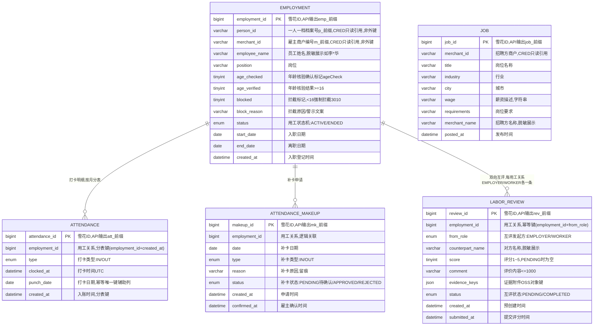

# 用工服务（EMP）数据库设计说明书

> 内容：**ER 图 + 分库分表方案 + 数据字典 + 表设计说明书**（§1 图 / §2 实体清单 / §3 设计约定 / §4 关系说明 / §5 分库分表 / §6 数据字典 / §7 表设计说明书）。
> 依据文档：`docs/design/产品设计文档.md` v1.12（§5.4 / §5.14.4 / §6.4.4 / §8.3.1）、`docs/design/微服务边界与职责基准.md` v1.2（§2.4 / §4.5）、
> `docs/design/高并发架构演进设计.md` v0.3（§2.1~§2.6）、`services/emp/docs/openapi.yaml` v1.0.0（**唯一可手改源**）。
> 数据域归属：③ 用工域（`employment` / `attendance` / `payroll` / `labor_review`）。⚠️ `payroll` 表归本域但代付执行在 SETTLE（§4-C07 归属错位，如实注明）——已按 §4-C07 决策迁入 ⑨ 结算域 SETTLE，本文档**不设计 `payroll` 表**；`job`（E-03 招工求职）为 M2 补充表（§4.5 未单列，随 M2 补充）。
> 口径：与 openapi.yaml 冲突时以 openapi.yaml 为准。
> 版本：v1.0 · 2026-09-10（首版：七章齐全；共享主库 + `emp_` schema 前缀隔离，`attendance` 打卡流水按月分表，`employment`/`attendance_makeup`/`labor_review`/`job` 不分片，`labor_credit` 为 Redis 计算快照不入库；`payroll` 已迁 ⑨ 结算域 SETTLE）。

## 1. ER 图（Mermaid）

## 2. 实体清单

| 实体（表名） | 存储介质 | 说明 |
|---|---|---|
| `employment` | 共享主库（`emp_` schema，主数据，不分片） | 用工关系：入职登记（防童工年龄核验 C-01）留痕，含拦截留痕 |
| `attendance` | 共享主库，**按月分表** `attendance_YYYYMM` | 打卡明细（C-02）：上班/下班每次打卡一行，只增不改；日/月工时由明细聚合 |
| `attendance_makeup` | 共享主库（不分片） | 补卡申请（C-02 异常处理）：漏打卡补卡留痕，雇主确认后生效 |
| `labor_review` | 共享主库（不分片） | 劳务信用双向互评（I-02）：每用工关系 EMPLOYER/WORKER 各一条，评分并入 CRED |
| `job` | 共享主库（不分片，M2 占位） | 招工求职岗位（E-03，M2）：招工信息发布，口径以评审为准 |
| `labor_credit` | Redis（计算快照，**不入 MySQL**） | 劳务信用构成（老板侧/工作者侧维度分），权威信用分在 CRED `credit_score` |
| 证据附件（evidenceKeys 所指） | OSS（仅存对象键） | 互评证据前端直传，本服务仅存对象键 |

> **口径说明**：`payroll`（工资代付）已按《微服务边界与职责基准》§4-C07 决策迁入 ⑨ 结算域 SETTLE，本服务**不设计该表**；代付执行/发薪流水在 SETTLE，本服务仅提供考勤/用工校验依据（出方向 `GET /emp/attendance/summary`）并消费 SETTLE 发薪事件（供给劳务信用「发薪履约」维度）。

## 3. 关键设计约定

- **C-01 防童工红线（强制不降级）**：入职登记复用 ACC 实名信息核验年龄（**不另建核验体系**，R-02）；年龄 <16 岁**强制拦截并警示留痕**（3010，`employment.blocked=1`），**不接受人工年龄核验降级**；实名未完成 3001 拦截、核验信息不符 3002 提示重新核验；实名（ACC）不可用时按 R-02 **暂停入职流程并明示**（可用性 L2 ≥99.9%，不静默降级）。
- **R-03 数据分级授权**：从业履历/信用数据授权可见、脱敏输出——员工姓名（李\*华）、互评对方名称、招聘方名称（张\*饭馆）全接口脱敏展示；证据仅 OSS 对象键。
- **R-15 防作弊**：互评仅当事双方可评（2002 越权拦截）；重复互评 3007；**恶意差评申诉复用 TICKET D-03**（本服务不建第二套申诉）；失信老板限制发布岗位、失信工作者限制接单（E-03，M2）。
- **信用分权威单一来源**：劳务信用分「并入全域信用」（老板侧 → A-07 商户信用、工作者侧 → A-06 一人一档），但**权威存储在 CRED `credit_score` 表**——EMP 只上报评分事件（`/cred/score/events`），**不直接写信用分表**（边界基准 §3 定稿）；`labor_credit` 为 EMP 侧维度构成的计算快照（Redis），非权威存储。
- **幂等**：打卡「同类型当日已打」3007（`uk_daily_punch(employment_id, type, punch_date)`）；补卡「无缺卡记录不可补」3007（`uk_makeup(employment_id, date, type)`）；互评「重复互评」3007（`uk_role(employment_id, from_role)`）；入职登记接口级 `Idempotency-Key`。
- **状态机**：用工 `ACTIVE → ENDED`（软结束留痕）；互评 `PENDING → COMPLETED`（用工结束/发薪完成预建 → 提交评分）；补卡 `PENDING → APPROVED/REJECTED`（雇主确认后生效）。
- **越权（IDOR）**：仅职工本人可打卡/补卡（2002）、商户仅见本人用工关系（2002）、互评仅当事双方可见（2002）；查询一律携带 `employment_id` 下推（越权校验 + 分片键剪枝）。
- **加密与脱敏**：EMP 表不落证件号/手机号明文（实名取数自 ACC/CRED）；`employee_name`/`counterpart_name`/`merchant_name` 脱敏展示；健康证等 L1 字段（本服务如需缓存）应用层 AES-256-GCM 加密存储；证据仅 OSS 键。
- **分表**：`attendance` 按月分表 `attendance_YYYYMM`，分片键 `employment_id + created_at`；>12 月热转冷 OSS，保留热表 12 个月；主数据（`employment` 等）不分片（§5）。
- **分库定位**：P1 模块化单体期全平台共享主库 + `emp_` schema 前缀隔离；P2 交易/结算独立库后 EMP 仍留共享主库（Java 域既有路线，§5.1）。
- **审计**：入职拦截/打卡/补卡/互评操作审计日志 ≥6 个月（WORM/哈希链）；流水只增不改。
- **分布式 ID**：写库 Java 域统一雪花 ID（`infra-idgen`，DB 存 bigint、API 输出业务号前缀字符串 `emp_`/`att_`/`mk_`/`rev_`/`job_`）；workerId Redis INCR + 租约；**时钟回拨三档预案**（L1≤5s 退避 → L2 自动切号段兜底 → L3 拒绝发号，见高并发 §2.3.1~§2.3.4）适用；号段兜底期间分表路由以业务字段 `created_at` 为准。

## 4. 关系说明

| 关系 | 基数 | 说明 |
|---|---|---|
| EMPLOYMENT — ATTENDANCE | 1 : N | 打卡明细（逻辑关联；`attendance` 按月分表，跨分片禁 JOIN） |
| EMPLOYMENT — ATTENDANCE_MAKEUP | 1 : N | 补卡申请（逻辑关联） |
| EMPLOYMENT — LABOR_REVIEW | 1 : 2 | 双向互评：每用工关系 EMPLOYER/WORKER 各一条（逻辑关联，幂等键 `employment_id+from_role`） |
| EMPLOYMENT → CRED.person / CRED.merchant | N : 1 | `person_id`/`merchant_id` 只读引用（非外键，不重新发号） |
| EMPLOYMENT → ACC | 逻辑关联 | 实名复用（R-02，入职年龄核验依据；不可用暂停入职并明示） |
| LABOR_REVIEW → CRED | 逻辑关联 | 评分事件上报 `/cred/score/events` 并入 A-07/A-06（不直接写信用分表） |
| ATTENDANCE → SETTLE | 逻辑关联 | 被依赖：代付考勤校验 `GET /emp/attendance/summary`（x-external-interfaces，服务端间） |
| LABOR_REVIEW → TICKET | 逻辑关联 | 恶意差评申诉复用 D-03 |
| LABOR_CREDIT | 独立 | Redis 计算快照（版本化快照），权威信用分在 CRED `credit_score` |
| JOB | 独立 | M2 占位，N : 1 merchant（CRED 只读引用）；失信老板限制发布 |

---

## 5. 分库分表方案

> 平台级策略以《高并发架构演进设计》v0.3 §2.1~§2.6 为准，本节只做「平台策略 → EMP 用工域」的落地映射。

### 5.1 分库与隔离

| 阶段 | 库形态 | EMP 落位 |
|---|---|---|
| P1 地基期（M1） | 模块化单体共享主库（MySQL 8，主从读写分离） | EMP 表与各域同库，**以 `emp_` schema 前缀隔离**（Java 域既有路线，对齐高并发 §6 优化点① 禁跨域直连读表） |
| P2 服务化期（M2） | 交易/结算独立库，其余域共享主库 | **EMP 留共享主库**（非交易/结算域），不独立成库 |
| 容灾 | 两地三中心：同城双活 + 异地灾备 | RPO≤15min / RTO≤30min（平台 L1 基线；本服务可用性 L2 ≥99.9%） |

### 5.2 EMP 分片矩阵

| 表 | 分片方式 | 分片键 | 表命名 | 归档策略 | 里程碑 |
|---|---|---|---|---|---|
| `employment` | **不分片**（主数据，行数有限 + 强一致更新） | — | `employment` | 不归档、不物理删除（ENDED=软结束留痕） | M1 |
| `attendance` | **按月分表（已定）** | `employment_id` + `created_at` | `attendance_YYYYMM` | >12 月热转冷 OSS（Parquet/压缩），保留热表 12 个月 | M1 起 |
| `attendance_makeup` | 不分片（工作单类，行数可控） | — | `attendance_makeup` | 不归档（补卡审计留痕 ≥6 月） | M1 |
| `labor_review` | 不分片（评价单类，每用工关系至多 2 条，行数可控） | — | `labor_review` | 不归档（互评审计留痕） | M1 |
| `job` | 不分片（M2 占位主数据） | — | `job` | 岗位下线=软关闭 | M2 |
| `labor_credit` | **不入库**（Redis 计算快照） | — | — | TTL 版本化快照 | M1 |

> **分片阈值**（平台级建议初值，压测/数据增长标定）：单表 >2000 万行 或 >20GB 触发再分；`attendance` 按月分表天然可控，冷数据到点即归档，避免单表膨胀到亿级。`labor_review` 若随用工规模逼近阈值，再评估按月分表（`employment_id + created_at` 预留键）。

### 5.3 分表路由规则（attendance）

- **路由层**：M1 用 MyBatis-Plus 自定义分表插件（拦截按月路由）+ 统一 `ShardingKey` 注解；M2 分库后评估 ShardingSphere-Proxy（业务零改造），或先自研轻量路由。
- **写入**：按 `created_at` 月份路由到 `attendance_YYYYMM`，`ShardingKey(employment_id, created_at)` 显式声明。
- **查询**（GET /emp/attendance、GET /emp/attendance/summary）：带 `employmentId` + `month` → 命中单张月表；**必须携带 `employment_id` 下推**（越权校验 + 分片键剪枝）；按 `idx_employment_created` 分页。
- **跨月查询**：禁止 SQL UNION 全表扫描；`monthHours` 优先单月 `SUM`，跨月聚合走异步/从库（§5.5）；**禁止跨分片 JOIN / 聚合 / 事务**。
- **日粒度视图**：`AttendanceRecordItem`（date/clockInAt/clockOutAt/hours）与 `monthHours` 由打卡明细按 `punch_date` 聚合得出，**不落库**（对账口径以 punch 明细为准）。

### 5.4 分布式 ID 与主键策略

| 表 | 主键 | 生成方式 | 说明 |
|---|---|---|---|
| `employment.employment_id` | bigint 雪花 ID | 统一组件 `infra-idgen` | API 输出字符串带 `emp_` 前缀（防 JS 大数精度 + 可读） |
| `attendance.attendance_id` | bigint 雪花 ID | `infra-idgen` | API 输出 `att_` 前缀；含时间戳但**分表路由以业务字段 `created_at` 为准**，不依赖 ID 内嵌时间戳 |
| `attendance_makeup.makeup_id` | bigint 雪花 ID | `infra-idgen` | API 输出 `mk_` 前缀 |
| `labor_review.review_id` | bigint 雪花 ID | `infra-idgen` | API 输出 `rev_` 前缀；预建时生成、提交评分复用 |
| `job.job_id` | bigint 雪花 ID | `infra-idgen` | API 输出 `job_` 前缀 |
| 引用外部 ID（`person_id`/`merchant_id`） | varchar(32) | 源服务生成（`p_`/`m_` 前缀） | 只读引用，不重新发号 |

- workerId：Redis `INCR` 分配 + 实例重启复用（租约），撞车 → 拒绝发号 + P0 告警。
- **时钟回拨三档预案**（高并发 §2.3.1~§2.3.4，Java 写库域适用）：L1 轻微回拨（≤5s）退避等待 → L2 超预算**自动切号段模式兜底**（`id_allocator` 表 DB 自增，不依赖时钟）→ L3 号段不可用**拒绝发号 + 快速失败**；Prometheus 指标 + Alertmanager 分级告警 + NTP 治理。L2 号段兜底期间主键不含时间戳，`attendance` 分表路由仍以 `created_at` 为准，业务无感。

### 5.5 读写分离与冷热归档

- **读写分离**：主库写、从库读（读是写 3 倍以上）；读请求经 `@ReadOnly` 注解路由到从库；关键「写后立即读」（打卡后立即查工时、入职登记后立即查结果）**强制走主库**，避免主从延迟读到旧状态。
- **冷热归档**：`attendance` >12 月热转冷 OSS（Parquet/压缩），查询走归档快照；对账/审计按需回捞。
- **快照化（labor_credit）**：劳务信用构成（读多写少、允许秒级延迟）走「**版本化快照 + 定时刷新**」（高并发 §2.4.3），写操作（互评/发薪事件）异步重算快照，读直接命中。

### 5.6 演进步骤（expand-migrate-contract）

> 任何表结构/分表规则变更按「扩展 → 迁移 → 收缩」执行，禁止破坏性 DDL 直上生产（对齐高并发 §2.6）：
> ① **双写**：新表上线，旧表 + 新表双写（幂等）→ ② **回灌**：历史数据按分片键回灌新表，校验一致性 → ③ **切读**：读流量切新表，旧表降级只读 → ④ **收缩**：观察稳定后下线旧表。

### 5.7 待标定项

| 项 | 建议初值 | 裁决方式 |
|---|---|---|
| 分片阈值 | 单表 >2000 万行 / >20GB | 评审 + 数据增长标定 |
| 回拨容忍窗口 W / 号段步长 | W=5s、step=1000 | 评审 + 压测标定 |
| 热表保留月数 | 12 个月 | 评审 |
| 打卡明细存储粒度 | 以 openapi 为准：punch 明细 + 日/月聚合视图（PDD §4.5 的 `attendance(date/check_in/check_out)` 为日粒度模型，二者口径差异待评审确认） | 评审确认 |
| 补卡状态机枚举 | openapi `MakeupResult.status` 仅暴露 `PENDING`；`APPROVED/REJECTED` 为雇主确认内部状态，待 openapi 补全 | 评审回改 openapi |
| 招工求职 `job` 表字段口径 | M2 占位初稿（`merchant_id` 未在 openapi 暴露） | M2 交付前评审 |
| 劳务信用分维度权重 | 老板侧/工作者侧均 40/20/20/20（I-02 已确认） | 已确认，运行标定 |

---

## 6. 数据字典

> 通用约定：MySQL 8.0，引擎 InnoDB，字符集 utf8mb4；时间 `datetime(3)` 毫秒精度、UTC 存储、输出 Asia/Shanghai；本服务无金额字段（工时用 `decimal(6,1)` 小时、评分 `tinyint` 1~5、权重 `decimal(3,2)`、API 输出 number）；数组/内嵌对象用 JSON 列；「密文」= AES-256-GCM 加密存储（L1 敏感）；**枚举值与 openapi.yaml `components.schemas` 一一对应**；附件一律仅存 OSS 对象键；带 ★ 的值为建议初值、待标定（§5.7）。

### 6.1 employment（用工关系，主数据，不分片）

| 字段 | 类型 | 空 | 键 | 默认 | 说明 |
|---|---|---|---|---|---|
| employment_id | bigint UNSIGNED | NO | PK | — | 用工关系编号，雪花 ID；API 输出 `emp_` 前缀字符串 |
| person_id | varchar(32) | NO | — | — | 拟入职人员档案号 `p_` 前缀（一人一档 A-06，CRED `person` 表**只读引用**，非外键） |
| merchant_id | varchar(32) | NO | — | — | 雇主商户编号 `m_` 前缀（CRED `merchant` 表**只读引用**，非外键） |
| employee_name | varchar(64) | NO | — | — | 员工姓名（脱敏展示如 李\*华，冗余自 person 档案） |
| position | varchar(50) | YES | — | NULL | 岗位 |
| age_checked | tinyint(1) | NO | — | 0 | 前端年龄核验结果确认标记（`ageCheck`，核验结果展示后雇主确认） |
| age_verified | tinyint(1) | NO | — | 0 | 年龄核验结果（`ageVerified`：≥16 → 1） |
| blocked | tinyint(1) | NO | — | 0 | 是否拦截（年龄 <16 → 1，3010 强制拦截留痕） |
| block_reason | varchar(255) | YES | — | NULL | 拦截原因/通过说明文案（`message`） |
| status | enum('ACTIVE','ENDED') | NO | — | ACTIVE | 用工状态机：在职 → 已结束 |
| start_date | date | NO | — | — | 入职日期（`startDate`） |
| end_date | date | YES | — | NULL | 离职/用工结束日期（ENDED 时有值） |
| created_at | datetime(3) | NO | — | CURRENT_TIMESTAMP(3) | 入职登记时间 |
| updated_at | datetime(3) | NO | — | CURRENT_TIMESTAMP(3) | 最近更新时间 |

> `monthHours`（本月工时）与 `todayClock`（今日打卡状态 NONE/CLOCKED_IN/CLOCKED_OUT）为列表视图派生字段（由 `attendance` 聚合），**不落列**。

### 6.2 attendance（打卡明细，按月分表 attendance_YYYYMM）

| 字段 | 类型 | 空 | 键 | 默认 | 说明 |
|---|---|---|---|---|---|
| attendance_id | bigint UNSIGNED | NO | PK | — | 打卡记录号，雪花 ID；API 输出 `att_` 前缀字符串 |
| employment_id | bigint UNSIGNED | NO | — | — | 用工关系编号，**分表键**（与 created_at 组合；逻辑关联 → employment） |
| type | enum('IN','OUT') | NO | — | — | 打卡类型：IN 上班 / OUT 下班 |
| clocked_at | datetime(3) | NO | — | — | 打卡时间（`clockedAt`，UTC） |
| punch_date | date | NO | — | — | 打卡日期（= DATE(clocked_at)，幂等唯一键辅助列） |
| created_at | datetime(3) | NO | — | CURRENT_TIMESTAMP(3) | 入账时间，**分表键** |

> 按日记录（`date`/`clockInAt`/`clockOutAt`/`hours`）与 `monthHours`（月度累计工时）由明细按 `punch_date` 聚合得出，**不落列**；`hours = clockOutAt − clockInAt`（休息时段口径待标定）。

### 6.3 attendance_makeup（补卡申请，不分片）

| 字段 | 类型 | 空 | 键 | 默认 | 说明 |
|---|---|---|---|---|---|
| makeup_id | bigint UNSIGNED | NO | PK | — | 补卡申请号，雪花 ID；API 输出 `mk_` 前缀字符串 |
| employment_id | bigint UNSIGNED | NO | — | — | 用工关系编号（逻辑关联 → employment） |
| date | date | NO | — | — | 补卡日期 |
| type | enum('IN','OUT') | NO | — | — | 补卡类型（复用 AttendanceType） |
| reason | varchar(200) | NO | — | — | 补卡原因（留痕） |
| status | enum('PENDING','APPROVED','REJECTED') | NO | — | PENDING | 补卡状态机：PENDING 待雇主确认（openapi 暴露）→ APPROVED/REJECTED（雇主确认后生效，内部状态，openapi 未暴露、待补全，§5.7） |
| created_at | datetime(3) | NO | — | CURRENT_TIMESTAMP(3) | 申请时间 |
| confirmed_at | datetime(3) | YES | — | NULL | 雇主确认时间（APPROVED/REJECTED 时） |

### 6.4 labor_review（劳务双向互评，不分片）

| 字段 | 类型 | 空 | 键 | 默认 | 说明 |
|---|---|---|---|---|---|
| review_id | bigint UNSIGNED | NO | PK | — | 互评号，雪花 ID；API 输出 `rev_` 前缀字符串 |
| employment_id | bigint UNSIGNED | NO | UK(联合) | — | 用工关系编号（逻辑关联 → employment）；`uk_role(employment_id, from_role)` |
| from_role | enum('EMPLOYER','WORKER') | NO | UK(联合) | — | 互评发起方角色（ReviewRole） |
| counterpart_name | varchar(64) | YES | — | NULL | 对方名称（脱敏展示如 李\*华，冗余自 employment） |
| score | tinyint UNSIGNED | YES | — | NULL | 评分 1~5（PENDING 时 NULL，COMPLETED 时必填） |
| comment | varchar(1000) | YES | — | NULL | 评价内容（履约/态度/质量） |
| evidence_keys | JSON | YES | — | NULL | 证据附件 OSS 对象键（可选） |
| status | enum('PENDING','COMPLETED') | NO | — | PENDING | 互评状态机：待互评 → 已互评（重复互评 3007） |
| created_at | datetime(3) | NO | — | CURRENT_TIMESTAMP(3) | 预创建时间（用工结束/发薪完成时） |
| submitted_at | datetime(3) | YES | — | NULL | 提交评分时间（COMPLETED 时） |

### 6.5 job（招工岗位，M2 占位，不分片）

| 字段 | 类型 | 空 | 键 | 默认 | 说明 |
|---|---|---|---|---|---|
| job_id | bigint UNSIGNED | NO | PK | — | 岗位号，雪花 ID；API 输出 `job_` 前缀字符串 |
| merchant_id | varchar(32) | NO | — | — | 招聘方商户编号（CRED `merchant` 只读引用；openapi M2 占位未暴露，待定稿，§5.7） |
| title | varchar(100) | NO | — | — | 岗位名称 |
| industry | varchar(50) | YES | — | NULL | 行业 |
| city | varchar(50) | YES | — | NULL | 城市 |
| wage | varchar(100) | YES | — | NULL | 薪资描述（字符串，如「月结 6000 起」） |
| requirements | varchar(500) | YES | — | NULL | 岗位要求 |
| merchant_name | varchar(64) | YES | — | NULL | 招聘方名称（脱敏展示如 张\*饭馆） |
| posted_at | datetime(3) | NO | — | CURRENT_TIMESTAMP(3) | 发布时间（`postedAt`） |
| created_at | datetime(3) | NO | — | CURRENT_TIMESTAMP(3) | 创建时间 |

### 6.6 labor_credit（劳务信用构成，Redis 计算快照，不入库）

| 结构 | 类型 | 说明 |
|---|---|---|
| key | `emp:labor_credit:{subjectId}` | 主体劳务信用快照（老板侧/工作者侧） |
| subject_type | string | `EMPLOYER` 老板侧 / `WORKER` 工作者侧（LaborCreditSubjectType） |
| score | number | 劳务信用分 0~100 |
| dims | JSON array | 维度构成 `[{name, weight, score}]`：老板侧=发薪履约 40% + 纠纷 20% + 用工评价 20% + 资质合规 20%；工作者侧=出勤履约 40% + 纠纷 20% + 雇主评价 20% + 实名可信 20%（I-02 已确认） |
| updated_at | string(ISO8601) | 快照更新时间 |
| TTL / 消费 | — | **版本化快照 + 定时刷新**（高并发 §2.4.3）；互评/发薪事件异步重算；权威信用分在 CRED `credit_score` |

> 维度数据来源（经内部接口/事件，非外键）：发薪履约 ← SETTLE 发薪事件（MQ）；纠纷 ← TICKET；用工评价/雇主评价 ← 本服务 `labor_review`；资质合规/实名可信 ← CRED/ACC；出勤履约 ← 本服务 `attendance`。

---

## 7. 表设计说明书

### 7.1 employment（用工关系）

- **用途**：入职登记（C-01 防童工年龄核验）留痕——年龄 ≥16 正常建档，<16 强制拦截并警示留痕；承载「用工/考勤管理」列表（M-09）与一人一档（A-06）联动。
- **主键（策略）**：`employment_id` bigint 雪花 ID（`infra-idgen`），API 输出 `emp_` 前缀字符串。
- **索引**：PRIMARY KEY(`employment_id`)；KEY `idx_person`(`person_id`)；KEY `idx_merchant_status`(`merchant_id`, `status`)——经营端「仅本人用工关系」列表（越权校验）；KEY `idx_status`(`status`)。
- **约束**：状态机 `ACTIVE → ENDED`（软结束留痕，不物理删除）；`blocked=1` 为 3010 违规对象拦截留痕（红线强制，不降级）；`age_checked/age_verified/blocked` 由入职核验流程写入；接口级 `Idempotency-Key` 防重复入职。
- **加密/脱敏**：`employee_name` 脱敏展示（李\*华）；不落证件号/手机号明文（实名取数自 ACC/CRED）。
- **生命周期**：不归档、不删除；随用工关系全生命周期存续（离职=ENDED 软关闭）。
- **接口映射**：POST /emp/employment（入职登记）、GET /emp/employments（用工列表，`monthHours`/`todayClock` 派生）。

### 7.2 attendance（打卡明细，按月分表）

- **用途**：职工上班/下班打卡（C-02），工时自动累计，作为工资代付（I-03，SETTLE）考勤校验依据；只增不改、长期留痕。
- **分表**：`attendance_YYYYMM` 按月分表；分片键 `employment_id + created_at`；>12 月热转冷 OSS，保留热表 12 个月（§5.2~§5.5）。
- **主键（策略）**：`attendance_id` 雪花 ID；分表路由以业务字段 `created_at` 为准，不依赖 ID 内嵌时间戳（号段兜底时依然正确）。
- **索引**：PRIMARY KEY(`attendance_id`)；KEY `idx_employment_created`(`employment_id`, `created_at`)——本人分页查询 + **分片键剪枝**；UNIQUE KEY `uk_daily_punch`(`employment_id`, `type`, `punch_date`)——**幂等键**（同类型当日已打 → 3007）。
- **约束**：**只增不改**（应用层禁 UPDATE/DELETE，库层回收写权限）；仅职工本人可打卡（2002 越权拦截）；查询做水平越权校验；`hours`/`monthHours` 由明细聚合。
- **加密/脱敏**：不存证件/身份明文；明细仅时间/类型，无敏感字段。
- **生命周期**：热表 12 个月 → 归档 OSS（Parquet/压缩），对账/审计按需回捞。
- **接口映射**：POST /emp/attendance（打卡）、GET /emp/attendance（记录与工时查询）、GET /emp/attendance/summary（代付考勤校验，x-external-interfaces，SETTLE 服务端间）。

### 7.3 attendance_makeup（补卡申请）

- **用途**：漏打卡 → 补卡申请（C-02 异常处理，留痕）；申请经雇主确认后生效（确认动作复用用工管理）。
- **主键（策略）**：`makeup_id` 雪花 ID，API 输出 `mk_` 前缀字符串。
- **索引**：PRIMARY KEY(`makeup_id`)；UNIQUE KEY `uk_makeup`(`employment_id`, `date`, `type`)——**幂等键**（无缺卡记录不可补 → 3007）；KEY `idx_employment_created`(`employment_id`, `created_at`)。
- **约束**：状态机 `PENDING → APPROVED/REJECTED`（雇主确认后生效）；仅职工本人申请（2002）；`reason` 必填留痕。
- **加密/脱敏**：无敏感字段（原因留痕，脱敏输出）。
- **生命周期**：不归档（补卡审计留痕 ≥6 月）。
- **接口映射**：POST /emp/attendance/makeup（补卡申请）。

### 7.4 labor_review（劳务双向互评）

- **用途**：用工结束/发薪完成后双方互评（I-02），评分 + 内容 + 证据，累积劳务信用分并联动全域信用（并入 A-07/A-06）。
- **主键（策略）**：`review_id` 雪花 ID，API 输出 `rev_` 前缀字符串；用工结束/发薪完成时**预建** EMPLOYER/WORKER 两条 PENDING 记录，提交评分时复用。
- **索引**：PRIMARY KEY(`review_id`)；UNIQUE KEY `uk_role`(`employment_id`, `from_role`)——**一行一角色**，重复互评 3007；KEY `idx_status_created`(`status`, `created_at`)——待互评/已互评列表。
- **约束**：状态机 `PENDING → COMPLETED`；仅用工关系双方可评（2002）；`score` 1~5、`comment` ≤1000；恶意差评申诉复用 TICKET D-03（本服务不建申诉）。
- **加密/脱敏**：`counterpart_name` 脱敏展示；`evidence_keys` 仅 OSS 对象键。
- **生命周期**：不归档（互评审计留痕）；评分异步上报 CRED（`/cred/score/events`）。
- **接口映射**：POST /emp/review（提交互评）、GET /emp/reviews（互评记录列表）。

### 7.5 job（招工岗位，M2 占位）

- **用途**：招工求职（E-03，M2）：实名 + 履历 + 用工评价互评的招工求职对接（含零工多方案，与 I-05 零工结算联动）；失信老板限制发布岗位、失信工作者限制接单（I-02）。
- **主键（策略）**：`job_id` 雪花 ID，API 输出 `job_` 前缀字符串。
- **索引**：PRIMARY KEY(`job_id`)；KEY `idx_merchant_posted`(`merchant_id`, `posted_at`)；KEY `idx_industry_city`(`industry`, `city`)——列表筛选。
- **约束**：M2 占位，字段为初稿、交付前以评审为准（§5.7）；失信老板限制发布（I-02，读取 CRED 信用分）；黑中介/虚假信息治理与 TICKET D-02 打通。
- **加密/脱敏**：`merchant_name` 脱敏展示（张\*饭馆）。
- **生命周期**：岗位下线=软关闭；不物理删除。
- **接口映射**：GET /emp/jobs（招工求职列表，M2）。

### 7.6 labor_credit（劳务信用构成，Redis 计算快照）

- **用途**：劳务信用构成查询（老板侧/工作者侧维度分），供前端展示与全域信用并入（I-02）。
- **结构**：Redis 快照 `emp:labor_credit:{subjectId}`（§6.6）；**权威信用分在 CRED `credit_score`**，本快照为 EMP 侧维度构成的计算缓存。
- **约束**：版本化快照 + 定时刷新（高并发 §2.4.3）；互评/发薪事件异步重算；对象不存在 → 3006。
- **生命周期**：TTL 版本化快照；不入 MySQL。
- **接口映射**：GET /emp/labor-credit/{subjectId}（主体构成查询）、GET /emp/labor-credit/mine（我的劳务信用，按登录主体自动定位）。

### 7.7 出方向依赖（跨服务，逻辑关联）

- **取数（只读引用）**：ACC（实名复用，R-02 入职年龄核验依据，不可用暂停入职并明示）；CRED（`person` 一人一档 A-06 / `merchant` 商户档案）。
- **事件上报**：劳务互评/用工数据 → 评分事件上报 CRED `/cred/score/events`（并入 A-07 商户信用 / A-06 一人一档，**不直接写信用分表**）。
- **事件消费**：发薪履约数据 ← SETTLE 发薪事件（MQ），供给劳务信用「发薪履约」维度（本服务不直连 SETTLE 库）。
- **被依赖（服务端间接口）**：SETTLE 代付考勤校验 `GET /emp/attendance/summary`（x-external-interfaces，内部 Token 鉴权）。
- **申诉复用**：恶意差评申诉走 TICKET D-03 既有机制（本服务不建第二套申诉）。
- **附件**：互评证据 OSS 前端直传后回传对象键，本服务不存储媒体原文。

---

*文档结束 · 与 `services/emp/docs/openapi.yaml`（唯一可手改源）、《高并发架构演进设计》v0.3 §2、《产品设计文档》v1.11 §5.x/§6.4.x、《微服务边界与职责基准》v1.2 §2.x 同步维护。*
