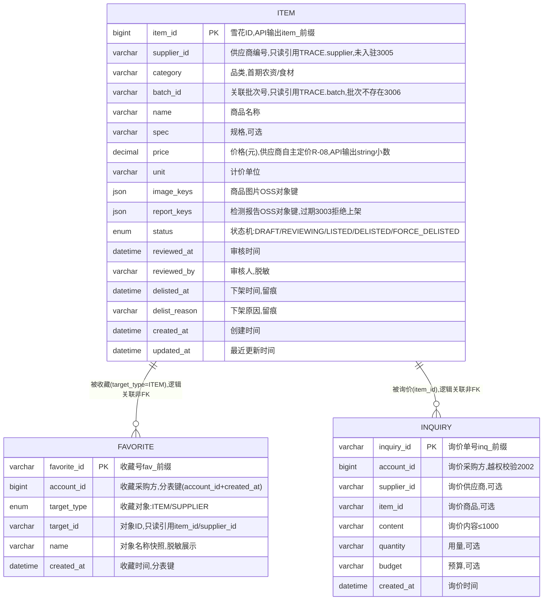

# 商品服务（PROD）数据库设计说明书

> 内容：**ER 图 + 分库分表方案 + 数据字典 + 表设计说明书**（§1 图 / §2 实体清单 / §3 设计约定 / §4 关系说明 / §5 分库分表 / §6 数据字典 / §7 表设计说明书）。
> 依据文档：`docs/design/产品设计文档.md` v1.12（§5.8 / §6.4.7 / §8.3.1）、`docs/design/微服务边界与职责基准.md` v1.2（§2.8 / §4.5）、
> `docs/design/高并发架构演进设计.md` v0.3（§2.1~§2.6）、`services/prod/docs/openapi.yaml` v1.0.0（**唯一可手改源**）。
> 数据域归属：**商品域**（§4.5 未单列，随 M2 补充定义）——3 张表（`item` / `favorite` / `inquiry`）落共享主库 + `prod_` schema 前缀隔离（Java 域既有路线；主数据不分片）。
> 口径：与 openapi.yaml 冲突时以 openapi.yaml 为准。
> 版本：v1.0 · 2026-09-10（首版：七章齐全；商品域 3 表——商品目录主数据不分片、收藏按月分表、询价工作单不分片；M2 设计先行）。

## 1. ER 图（Mermaid）

## 2. 实体清单

| 实体（表名） | 存储介质 | 说明 |
|---|---|---|
| `item` | 共享主库（prod_ schema，**主数据不分片**） | 商品目录主数据：上架审核 + 选品广场 + 透明详情，承载商品状态机与审核/下架留痕 |
| `favorite` | 共享主库，**按月分表** | 采购方收藏（商品/供应商），衔接询价/担保下单 |
| `inquiry` | 共享主库 | 询价工作单（只撮合、不代定价） |
| ES 商品索引 `prod_item` | Elasticsearch（M2） | `item` 检索加速（选品广场），非业务表；ES 不可用回退 MySQL 近似检索 |
| Redis 缓存 | Redis | 选品广场热点商品 / 供应商信用只读缓存（短 TTL），非业务表 |

> 供应商（`supplier`）、批次（`batch`）、信用分（`credit_score`）、红黑榜（`redblack`）均为 TRACE/CRED 权威数据，本服务**只读引用、不建副本表**；商品/检测报告图片一律 OSS 前端直传、本服务仅存对象键（不存媒体原文）。

## 3. 关键设计约定

- **R-08 轻资产原则**：只做撮合——不代下单、不代定价、无包赚承诺；`item.price` 由供应商自主定价，平台不改写；排序非竞价、价格透明。
- **R-09 强监管品类仅信息撮合**：`item.category` 首期仅农资/食材（其余随扩展），强监管品类仅信息展示、不替代行政许可。
- **R-13 无竞价广告/隐性扣费**：选品广场/决策辅助排序非竞价（信用/溯源/价格/履约客观排序），无广告位、无隐性扣费。
- **状态机**：商品 `DRAFT → REVIEWING → LISTED ⇄ DELISTED`；异常（资质临期/投诉激增）平台事件触发 `FORCE_DELISTED`——全程留痕。
- **幂等**：上架走接口级 `Idempotency-Key`（重复提交返回原商品号）；重复收藏 → 3007（`uk_account_target` 幂等键）；重复下架 → 3007。
- **越权（2002）**：我的商品列表/下架仅本人供应商商品；收藏/询价仅本人可查——所有查询强制携带 `account_id` 下推（越权校验 + 分片键剪枝）。
- **只读引用（权威单一来源）**：供应商/信用分/红黑榜/放心标识/履约率均经内部接口取 CRED/TRACE 权威数据，**不复制、不落库**；溯源码 `traceCode` 由 `batch_id` 经 TRACE 派生。
- **加密与脱敏**：本服务无 L1 高敏感字段落库（不含实名/手机号/证件）；供应商名脱敏展示（如 XX农资）；审核人 `reviewed_by` 脱敏；附件仅存 OSS 对象键。
- **审计**：上架审核/下架留痕（`reviewed_at`/`reviewed_by`/`delisted_at`/`delist_reason`）；审计日志 ≥6 个月（WORM/哈希链）；强制下架事件留痕。
- **分布式 ID**：`item_id` 雪花 ID（`infra-idgen`），`favorite_id`/`inquiry_id` 业务号（`fav_`/`inq_` 前缀）；workerId Redis INCR + 租约；**时钟回拨三档预案**适用（见 §5.4）。
- **分表**：`favorite` 按月分表（`account_id` + `created_at`）；`item`（主数据）/`inquiry`（工作单）不分片（详见 §5）。

## 4. 关系说明

| 关系 | 基数 | 说明 |
|---|---|---|
| ITEM — FAVORITE | 1 : N | 商品被收藏（`target_type=ITEM` 时，`target_id` 逻辑关联，非外键） |
| ITEM — INQUIRY | 1 : N | 商品被询价（`item_id` 逻辑关联，非外键） |
| FAVORITE — TRACE.supplier | N : 1 | `target_type=SUPPLIER` 时 `target_id` 逻辑关联供应商（非外键） |
| INQUIRY — TRACE.supplier | N : 1 | 询价供应商 `supplier_id` 逻辑关联（非外键） |
| ITEM — TRACE.batch | N : 1 | 关联批次 `batch_id` 逻辑关联（批次不存在 → 3006，非外键） |
| ITEM — CRED（信用分/红黑榜）· TRACE（放心标识） | 逻辑关联 | 查询期聚合 `creditScore`/`redblackStatus`/`trusted`/`reviewRate`，只读引用不落库 |
| FAVORITE — ITEM/SUPPLIER | M : N | `target_type + target_id` 多态引用（非外键） |

---

## 5. 分库分表方案

> 平台级策略以《高并发架构演进设计》v0.3 §2.1~§2.6 为准，本节做「平台策略 → PROD 商品域」的落地映射。高并发 §2.2 未单列 PROD 表的分表方案，本域按平台规则自定：**主数据不分片、只增流水类按月分表、工作单不分片**。

### 5.1 分库与隔离

| 阶段 | 平台形态 | PROD 落位 |
|---|---|---|
| P1 地基期（M1） | 模块化单体共享主库（MySQL 8，主从读写分离） | PROD 为 M2 交付（设计先行），占位期不建表；M2 交付时表落共享主库，**以 `prod_` schema 前缀隔离**（对齐高并发 §6 优化点① 硬边界：禁跨域直连读表） |
| P2 服务化期（M2） | 交易/结算独立库，其余域共享主库 | **PROD 全程留在共享主库**（非交易/结算域），不独立成库；商品量级触发阈值后再评估（§5.7） |
| 容灾 | 两地三中心：同城双活 + 异地灾备 | RPO≤15min / RTO≤30min（主库容灾标准；PROD 可用性 L2 ≥99.9%，选品检索属 L2） |

### 5.2 PROD 分片矩阵

| 表 | 分片方式 | 分片键 | 表命名 | 归档策略 | 里程碑 |
|---|---|---|---|---|---|
| `item` | **不分片**（主数据/商品目录，行数有限 + 状态强一致更新） | — | `item` | 不归档、不物理删除（下架=置状态留痕） | M2 起 |
| `favorite` | **按月分表**（只增流水类） | `account_id` + `created_at` | `favorite_YYYYMM` | >12 月热转冷 OSS（Parquet/压缩），保留热表 12 个月 | M2 起 |
| `inquiry` | 不分片（工作单类，行数可控） | — | `inquiry` | 按审计要求保留（≥6 个月，WORM/哈希链留痕） | M2 起 |

> **分片阈值**（平台级建议初值，压测/数据增长标定）：单表 >2000 万行 或 >20GB 触发再分；`favorite` 按月分表天然可控，冷数据到点即归档，避免单表膨胀到亿级。

### 5.3 分表路由规则（favorite）

- **路由层**：M1 用 MyBatis-Plus 自定义分表插件（拦截按月路由）+ 统一 `ShardingKey` 注解；M2 分库后评估 ShardingSphere-Proxy（业务零改造）。
- **写入**：按 `created_at` 月份路由到 `favorite_YYYYMM`，`ShardingKey(account_id, created_at)` 显式声明。
- **查询**：我的收藏列表（GET /prod/favorites）**必须携带 `account_id` 下推**（水平越权校验 + 分片键剪枝）；跨月查询禁 SQL UNION 全表扫描，聚合走异步/从库。
- **禁止跨分片 JOIN / 聚合 / 事务**：收藏列表与商品/供应商信息的拼接在应用层完成（经内部接口取权威数据），不进 OLTP 主库跨分片聚合。

### 5.4 分布式 ID 与主键策略

| 表 | 主键 | 生成方式 | 说明 |
|---|---|---|---|
| `item.item_id` | bigint 雪花 ID | 统一组件 `infra-idgen` | API 输出字符串带 `item_` 前缀（防 JS 大数精度 + 可读；TRADE 下单商品来源引用） |
| `favorite.favorite_id` | varchar(32) 业务号 | 业务号 `fav_` 前缀 | 收藏号凭据（重复收藏/查询凭据） |
| `inquiry.inquiry_id` | varchar(32) 业务号 | 业务号 `inq_` 前缀 | 询价单号凭据 |
| 引用外部 ID（supplier_id/batch_id 等） | 由源服务生成 | `s_`/`b_` 前缀 | 只读引用，不重新发号 |

- workerId：Redis `INCR` 分配 + 实例重启复用（租约），撞车 → 拒绝发号 + P0 告警。
- **时钟回拨三档预案**（《高并发架构演进设计》§2.3.1~§2.3.4）对本服务生效（写库 Java 域）：L1 轻微回拨（≤5s）退避等待 → L2 超预算**自动切号段模式兜底**（`id_allocator` 表 DB 自增，不依赖时钟）→ L3 号段不可用**拒绝发号 + 快速失败**（幂等键/状态机兜底）；Prometheus 指标 + Alertmanager 分级告警 + NTP 治理。L2 号段兜底期间主键不含时间戳，分表路由仍以业务字段 `created_at` 为准，业务无感。

### 5.5 读写分离与冷热归档

- **读写分离**：主库写、从库读（读是写 3 倍以上）；读请求经 `@ReadOnly` 注解路由到从库；「写后立即读」（上架/下架后立即查状态、收藏后立即查列表）**强制走主库**，避免主从延迟读到旧状态。
- **检索**：选品广场检索（M2）走 **ES 商品索引**（分类/信用/溯源完整/价格/关键词筛选排序）；ES 不可用回退 MySQL 近似检索（README §4.2 依赖降级清单）；公示类供应商信用/红黑榜数据走 CRED/TRACE「版本化快照」读，PROD 侧只读缓存短 TTL。
- **冷热归档**：`favorite` >12 月热转冷 OSS（Parquet/压缩），查询走归档快照；`item` 主数据不归档（下架留痕不删行）。
- **审计**：上架审核/下架/强制下架操作审计日志 ≥6 月（WORM/哈希链）。

### 5.6 演进步骤（expand-migrate-contract）

> 任何表结构/分表规则变更按「扩展 → 迁移 → 收缩」执行，禁止破坏性 DDL 直上生产（对齐高并发 §2.6）：
> ① **双写**：新表上线，旧表 + 新表双写（幂等）→ ② **回灌**：历史数据按分片键回灌新表，校验一致性 → ③ **切读**：读流量切新表，旧表降级只读 → ④ **收缩**：观察稳定后下线旧表。

### 5.7 待标定项

| 项 | 建议初值 | 裁决方式 |
|---|---|---|
| 分片阈值 | 单表 >2000 万行 / >20GB | 评审 + 数据增长标定 |
| 回拨容忍窗口 W / 号段步长 | W=5s、step=1000 | 评审 + 压测标定（TBD-10） |
| 热表保留月数 | 12 个月 | 评审 |
| 收藏跨月重复检测 | 同月唯一索引 + 近 12 月热表查询 / Redis Set | 评审 + 运行标定 |
| 选品广场「信用分 ≥ 阈值」收敛值（采购决策辅助） | 上线前评审 | 评审 |
| `item.price` API 输出口径 | openapi 现为 number，建议 string 小数（防浮点误差，对齐平台口径） | openapi 同步 + 评审 |
| ES 检索索引策略（M2） | ES 商品索引 + MySQL 近似检索回退 | 评审 + 压测 |

---

## 6. 数据字典

> 通用约定：MySQL 8.0，引擎 InnoDB，字符集 utf8mb4；时间 `datetime(3)` 毫秒精度、UTC 存储、输出 Asia/Shanghai；金额 `decimal(18,2)` 存储、API 输出字符串小数（防浮点误差；openapi 现为 number，见 §5.7）；数组/内嵌对象用 JSON 列；**枚举值与 openapi.yaml `components.schemas` 一一对应**；附件一律仅存 OSS 对象键；带 ★ 的值为建议初值、待标定（§5.7）。

### 6.1 item（商品目录主数据，不分片）

| 字段 | 类型 | 空 | 键 | 默认 | 说明 |
|---|---|---|---|---|---|
| item_id | bigint UNSIGNED | NO | PK | — | 雪花 ID（`infra-idgen`）；API 输出 `item_` 前缀字符串 |
| supplier_id | varchar(32) | NO | — | — | 供应商编号（只读引用 TRACE.supplier）；未入驻 → 3005 |
| category | varchar(50) | NO | — | — | 品类（首期农资/食材；强监管品类仅信息撮合 R-09） |
| batch_id | varchar(32) | NO | — | — | 关联批次号（只读引用 TRACE.batch）；批次不存在 → 3006 |
| name | varchar(100) | NO | — | — | 商品名称 |
| spec | varchar(100) | YES | — | NULL | 规格（可选） |
| price | decimal(18,2) | NO | — | — | 价格（元）；供应商自主定价（R-08 不代定价）；API 输出 string 小数（openapi 现为 number） |
| unit | varchar(20) | NO | — | — | 计价单位 |
| image_keys | JSON | YES | — | NULL | 商品图片 OSS 对象键（仅存键，不存媒体原文） |
| report_keys | JSON | YES | — | NULL | 检测报告 OSS 对象键；报告过期 → 3003 拒绝上架 |
| status | enum('DRAFT','REVIEWING','LISTED','DELISTED','FORCE_DELISTED') | NO | — | DRAFT | 商品状态机：草稿 → 待审核 → 已上架 ⇄ 下架；异常强制下架 |
| reviewed_at | datetime(3) | YES | — | NULL | 审核时间（REVIEWING → LISTED 时回填） |
| reviewed_by | varchar(64) | YES | — | NULL | 审核人（脱敏展示） |
| delisted_at | datetime(3) | YES | — | NULL | 下架时间（主动/强制下架留痕） |
| delist_reason | varchar(255) | YES | — | NULL | 下架原因（资质临期/投诉激增/主动下架，留痕） |
| created_at | datetime(3) | NO | — | CURRENT_TIMESTAMP(3) | 创建时间（上架受理） |
| updated_at | datetime(3) | NO | — | CURRENT_TIMESTAMP(3) | 最近更新时间（状态机迁移） |

### 6.2 favorite（收藏，按月分表 favorite_YYYYMM）

| 字段 | 类型 | 空 | 键 | 默认 | 说明 |
|---|---|---|---|---|---|
| favorite_id | varchar(32) | NO | PK | — | 收藏号 `fav_` 前缀 |
| account_id | bigint UNSIGNED | NO | — | — | 收藏采购方（鉴权），**分表键**（与 created_at 组合） |
| target_type | enum('ITEM','SUPPLIER') | NO | — | — | 收藏对象类型 |
| target_id | varchar(64) | NO | — | — | 收藏对象编号（item_id / supplier_id，只读引用） |
| name | varchar(100) | YES | — | NULL | 收藏对象名称快照（脱敏展示；权威在 item/CRED） |
| created_at | datetime(3) | NO | — | CURRENT_TIMESTAMP(3) | 收藏时间，**分表键** |

> 幂等：UNIQUE KEY `uk_account_target`(`account_id`, `target_type`, `target_id`)——同月表内重复收藏 → 3007；跨月重复检测见 §5.7★。

### 6.3 inquiry（询价工作单，不分片）

| 字段 | 类型 | 空 | 键 | 默认 | 说明 |
|---|---|---|---|---|---|
| inquiry_id | varchar(32) | NO | PK | — | 询价单号 `inq_` 前缀 |
| account_id | bigint UNSIGNED | NO | — | — | 询价采购方（鉴权），越权校验 2002 |
| supplier_id | varchar(32) | YES | — | NULL | 询价供应商（与 item_id 二选一或同时） |
| item_id | varchar(32) | YES | — | NULL | 询价商品（可选） |
| content | varchar(1000) | NO | — | — | 询价内容（只撮合不代定价 R-08） |
| quantity | varchar(100) | YES | — | NULL | 用量（可选） |
| budget | varchar(100) | YES | — | NULL | 预算（可选） |
| created_at | datetime(3) | NO | — | CURRENT_TIMESTAMP(3) | 询价时间 |

### 6.4 辅助结构（ES / Redis / MQ）

| 结构 | 类型 | 说明 |
|---|---|---|
| ES 商品索引 `prod_item` | Elasticsearch | `item` 检索加速（选品广场检索：分类/信用/溯源完整/价格/关键词）；ES 不可用回退 MySQL 近似检索（README §4.2） |
| Redis 缓存 | Redis | 选品广场热点商品 / 供应商信用只读缓存（短 TTL 30s~30min，版本化）；非业务表 |
| MQ `prod.force_delist` | RabbitMQ | 强制下架事件（资质临期/投诉激增，平台事件触发）→ PROD 消费 → `item` 置 FORCE_DELISTED + 留痕 + 通知，无前端接口 |

---

## 7. 表设计说明书

### 7.1 item（商品目录主数据，不分片）

- **用途**：商品上架审核（T-02）/ 选品广场检索（T-03）/ 商品透明详情（T-04）核心主数据——承载商品状态机与审核/下架留痕。
- **主键（策略）**：`item_id` bigint 雪花 ID（`infra-idgen`），API 输出 `item_` 前缀字符串；TRADE 下单商品来源引用。
- **索引**：PRIMARY KEY(`item_id`)；KEY `idx_supplier_status`(`supplier_id`, `status`, `created_at`)——我的商品列表（本人供应商 + 状态筛选）；KEY `idx_category_status`(`category`, `status`)——选品广场 MySQL 回退检索；KEY `idx_status_updated`(`status`, `updated_at`)——审核队列/监管列表。
- **约束**：状态机 `DRAFT → REVIEWING → LISTED ⇄ DELISTED`，异常 `FORCE_DELISTED`（平台事件触发）；资质/报告过期 → 3003 拒绝上架；批次不存在 → 3006；供应商未入驻 → 3005；上架接口级 `Idempotency-Key`；下架仅本人商品（2002）；下架=置状态留痕、不物理删除。
- **安全**：附件仅存 OSS 对象键；审核人 `reviewed_by` 脱敏；无 L1 高敏感字段（不含实名/手机号/证件）；供应商名/信用分等只读引用不落库。
- **生命周期**：主数据不分片、不归档、不物理删除（下架置状态留痕）；审计日志 ≥6 月（WORM/哈希链）。
- **接口映射**：POST /prod/items（上架）、GET /prod/items（广场检索）、GET /prod/items/mine（我的商品）、GET /prod/items/{itemId}（详情）、POST /prod/items/{itemId}/delist（下架）。

### 7.2 favorite（收藏，按月分表）

- **用途**：采购方收藏商品/供应商（T-21 收藏/询价），收藏后可衔接询价/担保下单。
- **主键（策略）**：`favorite_id` varchar(32) 业务号（`fav_` 前缀），收藏号凭据；分表路由以业务字段 `created_at` 为准。
- **索引**：PRIMARY KEY(`favorite_id`)；KEY `idx_account_created`(`account_id`, `created_at`)——我的收藏列表 + **分片键剪枝**；UNIQUE KEY `uk_account_target`(`account_id`, `target_type`, `target_id`)——重复收藏 3007 幂等键（同月表内）。
- **约束**：对象不存在 → 3006；重复收藏 → 3007；仅本人收藏可查（2002）；`target_type` 枚举 ITEM/SUPPLIER；按月分表禁跨分片 JOIN/聚合。
- **安全**：`name` 为脱敏快照（权威在 item/CRED）；无高敏感字段。
- **生命周期**：按月分表 `favorite_YYYYMM`；>12 月热转冷 OSS（Parquet/压缩），保留热表 12 个月。
- **接口映射**：POST /prod/favorites（收藏）、GET /prod/favorites（我的收藏列表）。

### 7.3 inquiry（询价工作单，不分片）

- **用途**：采购方向供应商询价（T-21），内容 + 用量/预算（可选），供应商经营端回应（M2 页面）；只撮合不代定价（R-08）。
- **主键（策略）**：`inquiry_id` varchar(32) 业务号（`inq_` 前缀），询价单号凭据。
- **索引**：PRIMARY KEY(`inquiry_id`)；KEY `idx_account_created`(`account_id`, `created_at`)——本人询价列表（后续列表接口预留）；KEY `idx_supplier_created`(`supplier_id`, `created_at`)——供应商询价收件箱（经营端回应预留）。
- **约束**：对象不存在 → 3006；仅本人可查（2002）；只撮合不代定价（R-08）；工作单类不分片。
- **安全**：`content` 为采购需求描述（≤1000），无高敏感字段。
- **生命周期**：不分片；审计要求保留 ≥6 月（WORM/哈希链）。
- **接口映射**：POST /prod/inquiries（询价）。

### 7.4 出方向依赖（跨服务，逻辑关联）

- **数据源（只读引用）**：TRACE（批次/资质关联 `batch_id`、溯源码 `traceCode` 派生、供应商入驻、放心标识 `trusted`）；CRED（供应商信用分 `creditScore` 权威、红黑榜 `redblackStatus`（NONE/RED/BLACK）、信用构成 `creditDims`、履约率 `fulfillmentRate`）。
- **图片审核/OCR**：AICORE（商品图片审核，经内部接口，不落 PROD）。
- **强制下架事件**：MQ `prod.force_delist`（资质临期/投诉激增 → `item` 置 FORCE_DELISTED + 留痕 + 通知，无前端接口）；投诉入口走 TICKET（D-02 关联溯源码）。
- **被依赖**：TRADE（下单商品来源 `item`）。
- **附件**：OSS 前端直传后回传对象键（`image_keys`/`report_keys`），本服务不存媒体原文。

---

*文档结束 · 与 `services/prod/docs/openapi.yaml`（唯一可手改源）、《高并发架构演进设计》v0.3 §2、《产品设计文档》v1.11 §5.8/§6.4.7、《微服务边界与职责基准》v1.2 §2.8 同步维护。*
